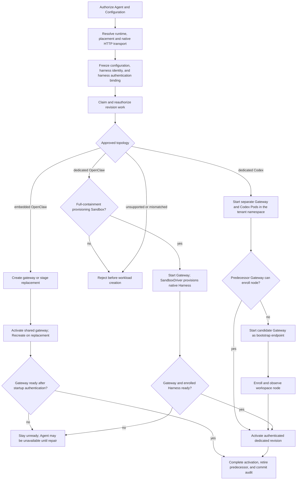

# Harness Execution Topology Flow

## Overview

Deployment freezes native Harness policy, placement and authentication in an
AgentRevision. Compute prepares its workloads, publishes guarded routes and
retires predecessors before exactly-once activation audit.

## Entry Points

- Trigger: exact-Agent `POST /namespaces/:namespaceId/agents/:agentId/deploy` and durable revision
  reconciliation.
- Source: `packages/occ/src/index.ts:OpenClawController.deployAgent` and
  `apps/controller/src/worker.ts:ControllerWorker`.
- Assumptions: authorized actor; ready Namespace; same-Namespace native agent Configuration;
  explicit Agent execution mode; and a supported `harnessAuth` binding. Managed methods reference an authorized OCC
  Secret API key or a Driver-issued account-owned access-token credential.

## Flow

## Execution Trace

### 1. Resolve and freeze the native harness

`packages/occ/src/index.ts:OpenClawController.deployAgent`

OCC locks the authorized Agent and Configuration, resolves `agentRuntime.id`,
and validates primary/fallback routes and Harness modes. Fallbacks preserve native order,
primary provider and Harness. Only unambiguous built-in configuration defaults
to embedded OpenClaw. Missing/ambiguous policies, unsupported IDs and incompatible
modes fail closed.
Compute's `apps/controller/src/drivers/compute/native-gateway-transport.ts:validatePlaintextNativeGateway`
rejects `gateway.tls.enabled: true` before revision creation and preparation:
Docker, SSH and Kubernetes require native HTTP.
The admitted revision immutably
captures its native configuration, approved harness identity/version, explicit mode, Compute
selection, and Agent ServicePrincipal. Production admits approved
`openclaw`/`embedded` and `codex`/`dedicated`, and `openclaw`/`dedicated` only when
the selected SandboxDriver provisions Harnesses with networking, filesystem, and
process containment. An associated
`access_token` additionally requires dedicated Codex; the frozen account
contains only its OCC identity, credential kind, and opaque Secret reference.

### 2. Claim work and realize the approved topology

`apps/controller/src/worker.ts:ControllerWorker`

The worker claims revision work, rechecks actor/ownership and the frozen Harness,
then calls `ComputeDriver.prepareRevision`.

`apps/controller/src/drivers/compute/docker/index.ts:DockerComputeDriver.prepareRevision`

Docker's underlying path starts embedded gateways or dedicated Codex containers,
but rejects harness-auth bindings before deployment; no Agent path is deployable.
`dockerGatewayConfigurationDocument` admits supported authentication fields/modes;
`reconcileGateway` generates `OPENCLAW_GATEWAY_PASSWORD` only for new containers. The
[Docker gateway authentication reference](../reference/drivers/docker-compute.md#gateway-authentication)
owns the mode and password rules.

Kubernetes supports managed bindings.
SSH supports `{ "method": "runtime" }` only for embedded OpenClaw: operator
credentials remain on the host and OCC checks gateway readiness without model
validation. See the [SSH flow](pr-24-ssh-compute.md).

`apps/controller/src/drivers/compute/kubernetes/index.ts:KubernetesComputeDriver.prepareRevision`

Kubernetes calls `prepareHarnessAuth` once per resolved source. From canonical
tenant storage, it delivers selected fields, including ChatGPT account tokens,
into exact revision-owned Harness Secrets. Only embedded OpenClaw or dedicated
Harnesses receive model keys, never dedicated Gateways. Fixture images use the
same namespace-local delivery; only native dedicated transport tokens depend on
runtime configuration.
See the [harness authentication flow](native-service-account-credential-delivery.md)
for admission, immutable source snapshots, and worker reauthorization.

API composition, including development, and worker startup call
`KubernetesComputeDriver.preflight` before reconciliation. `KubernetesComputeDriver.validateConfiguration`
first rejects native Gateway or derived sandbox listener ports overlapping private
runtime status TCP/18791. Single-cluster
preflight checks every storage-namespace page and refuses split targets without
the tenant label. Resolution accepts an adopted `oce-gateways-<hash>` tenant
only beside its storage label.
The [upgrade requirements](../reference/drivers/kubernetes-compute.md#existing-split-layout-installations)
own the operator boundary.

`ensureNamespace` prepares one single-cluster tenant namespace, including adopted
targets; its storage-role label enables discovery. Two-cluster Gateways retain
their control-cluster target. Dedicated Gateway and Harness Pods, identities,
and PVCs remain separate. `deliverGatewaySecrets` validates canonical sources;
`deliverHarnessAuth` creates selected model/transport projections.
Transport and Gateway passwords use separate sources across modes. Compute
retains legacy combined sources for older Pods and copies their password before
new templates reference the separate source. Concurrent creation adopts only an
exact-owned, identical password; foreign or conflicting sources fail.
[Namespaces and isolation](../reference/drivers/kubernetes-compute/networking-and-isolation.md#namespaces-and-isolation)
owns qualified DNS and exact NetworkPolicy/Service selectors. Harness selectors
include revision and network profile; Gateway selectors omit revision for stability.
`runtime.gatewayNodeSelector`
independently places the Gateway Pod and private-state initializer on trusted nodes.
After Harness readiness, preparation starts a candidate Gateway if its predecessor is stopped or unready. Activation waits for workspace node enrollment. Dedicated Codex keeps `agent-<agent digest>-workspace` across revisions.
`KubernetesComputeDriver.gatewayNativeHookRelayConfiguration` binds its callbacks to the Agent route; `AGENT_WITH_NODE_ENTRYPOINT` prepares private capability storage and TLS trust, and OpenClaw authorizes callbacks. See [native hook routing](../reference/gateway-routing.md#native-node-endpoint).

Dedicated Harnesses have separate ServiceAccounts. Compute owns the Gateway;
SandboxDriver owns the native Harness. Its node owns identity, workspace and
model key, enrolling with a private one-use target and restarting with its device
token. Compute pins it in `dedicated-native` with `inference: "worker"`:
missing/disconnected Harnesses fail without Gateway inference. Callbacks and session-bound
admission scope transport to the Agent.
`apps/controller/src/drivers/compute/kubernetes/index.ts:nativeRuntimeConfiguration`
projects admitted OpenAI models and an environment SecretRef into canonical
`models.providers.openai`.
`apps/controller/src/drivers/compute/kubernetes/runtime-entrypoints.ts:NATIVE_WORKER_ENTRYPOINT`
writes private capacity/isolation settings and Driver-provided `OPENCLAW_WORKSPACE_DIR`.
`apps/controller/src/drivers/sandbox/openshell.ts:configureAgent` admits its data
mount as default workspace, also used by native Gateway file transfer unless
overridden. OpenClaw snapshots node-local models/credentials and derives workspaces
from authorized launch descriptors, without an inference file, grant catalog or
retired `nativeInferenceConfig`.

Embedded OpenClaw combines workload, exact Agent identity and model key. Scoped
worker Secret/workload permissions deliver credentials and enroll nodes; Gateway
Pods receive no controller or Harness Kubernetes credentials.

Sandbox consumes these projections and explicit login mode through
`HarnessWorkloadRequirements`; unsupported projection fails without a test-only
credential bridge.

Every Compute Pod template, ordinary allow policy and Gateway/Harness peer requires
the [network profile](../reference/drivers/kubernetes-compute/networking-and-isolation.md#explicit-network-profiles); readiness rejects its absence.

For provider-owned Harnesses, `providerHarnessReady` lists Pods by the active
Service's Agent/revision/role labels. It requires exactly one nonterminating
`Ready=True` Pod with the supplied labels; malformed/incomplete observations
enter preparation cleanup. Activation repeats this check before routing changes.
The [readiness contract](../reference/drivers/kubernetes-compute.md#requirements)
owns candidate rules and observation limits.

### 3. Publish safely and complete activation once

`apps/controller/src/worker.ts:ControllerWorker`

`requiresStoppedPredecessors` stops all predecessors, including Gateways, and
waits for Pod termination before replacement. Redeployment interrupts service but preserves both PVCs; retry or a
new revision recovers failures. Recorded stops suppress repeats. A returning
predecessor makes its successor unready; stops retry after one, two, four, then
more claim leases. Failed preparation or preparing/activating that predecessor
clears its record. New exclusive revisions supersede old reconciliation/maintenance
without rollback; see
[production revision stages](../reference/drivers/compute.md#production-revision-stages).
For dedicated Codex API-key auth, `pluginRuntimeSnapshot` in
`apps/controller/src/drivers/compute/kubernetes/index.ts` selects the bound source
endpoint before `runtime.codexModelBaseUrl`.
`apps/controller/src/drivers/openai-endpoint.ts:normalizeOpenAiBaseUrl` normalizes both sources.
`pluginRuntimeConfigMapData` in `apps/controller/src/drivers/compute/plugin-runtime.ts`
writes the HTTPS Responses endpoint/provider pair to the manifest and `config.toml`.
`apps/controller/src/drivers/compute/kubernetes/runtime-entrypoints.ts:probeCodexAuthentication`
passes it through CLI overrides because the probe ignores user configuration.
Account login modes and other Harnesses keep their endpoints; only the Harness holds model credentials.

For custom endpoints, `gatewayConfigurationDocument` calls
`apps/controller/src/drivers/compute/codex-model-configuration.ts:codexGatewayModelConfiguration`
to clone the admitted document. It qualifies parent and `subagents.model` selectors
under defaults and Agent entries, including primary/fallback objects, plus policy
keys and catalog IDs. Subagent-only selections enter the projected catalog; aliases
and omitted selectors retain their meaning. Full declared refs preserve native ID
namespaces, including `codex/`. OpenClaw separates the explicit provider for thread
start, resume, and turns; the Harness probe keeps the native ID. The admitted
Configuration remains unchanged.

Kubelet probes private `/readyz` on runtime-backed workloads. Gates remain:
Gateway plugin/native status, Codex plugin state and authenticated app-server
WebSocket, or dedicated OpenClaw identity. Responses are bodyless `200` or `503`.
While first-deploy [workspace setup](workspace-files.md) is pending, embedded
preparation starts the replacement Gateway itself before activation. If the Gateway
of a revision that never served (its Service still selects no Pod) is unready,
for example after rejected model authentication, the next revision's preparation
repairs it with its own template instead of waiting on the failed predecessor.
The repair deletes an embedded predecessor's revision Secret and ConfigMap copies.

The worker commits the database `activeRevisionId` with an exact compare-and-set
before Kubernetes default after-commit activation.
`KubernetesComputeDriver.activateRevision` updates the shared gateway's `Recreate`
Deployment and Service. Embedded preparation does not validate the replacement's
credentials, so cutover can stop the serving gateway before the replacement
validates them in its own
[startup](native-service-account-credential-delivery.md#5-authenticate-during-runtime-startup).
Initial and replacement Gateways use the same bounded check. Failures, including
timeouts/rate limits, hold readiness until repair/restart or redeployment.
Readiness polls do not repeat model requests; worker retries do not restart
unchanged Pods. There is no automatic rollback.
Embedded activation also deletes embedded predecessor copies when it re-renders
the Gateway, even if the replacement never becomes ready.
For a dedicated predecessor, activation preserves copies while its Harness
Deployment or terminating Pod survives. Normal retirement stops the Harness
and removes the artifacts.

If activation, readiness, predecessor retirement, or audit completion fails,
the worker requeues the revision with `REVISION_FINALIZATION_INCOMPLETE`, or a
known wait's own [pending code](../reference/agents/deployment.md#pending-deployment-progress); recovery
retries activation and retirement for the already-active revision. Lost claims
and foreign/stale workloads fail closed. Dedicated activation waits for the
Gateway to report the workspace node it was handed; that wait is a 20-second
budget per revision and node across activation retries, then one status read per
retry, so a Gateway that never applies its node cannot hold the serial worker
on every retry. It and the pairing wait end early when other Work is claimable.

When stopping a revision, the Driver stops its Gateway within the pinned
runtime's 330-second stop budget and waits for Pod disappearance before stopping
the Harness, which stays available for active work. Idle shutdown, or one before
OpenClaw starts (wrappers run under `tini`), completes promptly. Forced
termination can delay the successor until the persistent owner lease expires.

Both Gateway modes persist SQLite/media; embedded Gateways also persist their
attested default workspace. Dedicated Harnesses receive only their workspace
claim, preserving node identity across replacements. Compute creates both claims
before Pods and uses workload readiness, avoiding a `Bound` wait that deadlocks
`WaitForFirstConsumer`. [Gateway storage](../reference/drivers/kubernetes-compute/storage-and-credentials.md#gateway-storage)
owns the nested ephemeral Codex home and private-directory/`/tmp` initialization.

Workspace-file access uses the enrolled Harness node; Gateway and Harness share
no workspace, session, skill, or image mounts. The [storage contract](../reference/drivers/kubernetes-compute/storage-and-credentials.md#harness-storage)
covers per-image assets and generated-image return.
The OpenClaw node host keeps Gateway-issued worker bundles in its own state and
workspaces below `/home/node/workspace`, away from gateway state, `CODEX_HOME`,
and credentials. A restart republishes image-owned
runtime assets and reconnects with the paired identity; readiness waits for the
bounded identity check. The compile cache and model-probe state stay in node
state and `TMPDIR`, which a Sandbox Driver can grant.

For a selected Sandbox Driver, stopping or retiring a revision always runs its
required cleanup after stopping a Compute-owned ordinary Harness, or delegates
provider-owned Harness removal to that cleanup. An absent ordinary Deployment
does not skip cleanup, so a cleanup failure remains retryable.
Revision retirement retains both owned claims even after stop removed the
gateway. When another revision's Gateway or route survives, retirement checks its exact
revision ownership before deleting resources. A successor in the shared namespace
keeps its Gateway Deployment, identity, Service and policies. `apps/controller/src/worker.ts:ControllerWorker.processAgentDeletion`
retires every revision before calling
`apps/controller/src/drivers/compute/kubernetes/index.ts:KubernetesComputeDriver.deleteAgentRuntimeCredentials`
to delete exact-owned private and shared claims by UID. Final deletion checks
all selected targets, independently of the Agent draft's current execution mode. Cleanup failures retry
before the worker removes the Agent's database identity. The [storage contract](../reference/drivers/kubernetes-compute/storage-and-credentials.md#gateway-storage)
owns claim sizes, mount paths, StorageClass requirements, and final teardown.

## Debugging and Verification

- Check placement, immutable policy, and conflicts:
  `node --test tests/conformance/configuration-occ.test.mjs`.
- Check guarded activation and recovery:
  `node --test tests/integration/postgres-worker-agent-revision.test.mjs` with its explicitly
  provisioned application-role PostgreSQL database.
- Check dedicated Gateway repair after an unready predecessor:
  `pnpm test:files --test-name-pattern='dedicated replacement starts a candidate Gateway' -- tests/conformance/kubernetes-compute.test.mjs`.
- Check embedded Gateway repair after a never-served unready predecessor:
  `pnpm test:files --test-name-pattern='never-served unready Gateway' -- tests/conformance/kubernetes-compute.test.mjs`.
- Run `node --test tests/integration/docker-compute-real.test.mjs` for real Docker Compose
  embedded and dedicated model turns, or
  `node --test tests/integration/harness-topology-k3d-real.test.mjs` for real Kubernetes
  model turns. Select each suite's runtime images, infrastructure, and credentials through the
  [test environment settings](../testing/docker.md#docker-compose-development-test-environment).
- Verify provider-backed dedicated Codex separately with
  `node --test tests/integration/service-account-driver-real.test.mjs`,
  `OCC_TEST_CHATGPT_SERVICE_ACCOUNT_REAL=1`, and an authorized mounted
  `OCC_TEST_CHATGPT_ADMIN_KEY_PATH`; this scenario does not use `OPENAI_API_KEY`.
- Missing credentials, images, access or either model response fail
  verification; readiness probes, handshakes, fixtures and skipped tests are not substitutes.
- An HTTP 401 before worker admission means the callback missed the node-only
  worker ingress and fell through to the administrative route.

## Related docs

- [Harness execution topology implementation specification](../../specs/.archive/07-harness-execution-topology.md)
- [Platform design](../design/workloads.md#openclaw-gateways)
- [Agent placement and deployment](../reference/agents/deployment.md#execution-mode)
- [Controller worker](../reference/controller/reconciliation.md#agentrevision-lifecycle)
- [Docker Compute Driver](../reference/drivers/docker-compute.md)
- [Kubernetes Compute Driver](../reference/drivers/kubernetes-compute.md)
- [Compute Driver lifecycle hooks flow](compute-driver-lifecycle-hooks.md)
- [Service Account Driver credential delivery flow](service-account-driver-credential-delivery.md)
- [Shared-drive specification](../../specs/.archive/12-dedicated-harness-shared-workspace-drive.md)

## Manual Notes

[keep this for the user to add notes. do not change between edits]

## Changelog

- 2026-10-10 04:41: Reconcile endpoint validation and routing with credential refresh, native approval and readiness contracts. (agent:roboclaw:dashboard:9d0532e1-befb-4fc3-935e-7cd2a0c72110 - 90268463bbd255c3c13a0e0bdeb437728189eb1a)

- 2026-10-10 02:49: Refuse native listener TLS before deployment work. (authoring-run/8446b4d7-87ac-43ab-9323-5fc7f6953628 - 5d303757fb488fe34c8cbb9e7b6b975921fc1061)

- 2026-10-09 20:27: Integrate main lifecycle, native workspace and readiness contracts without dropping endpoint safeguards. (agent:roboclaw:dashboard:9d0532e1-befb-4fc3-935e-7cd2a0c72110 - 90268463bbd255c3c13a0e0bdeb437728189eb1a)

- 2026-10-09 17:35: Qualify explicit subagent selectors; rename the Codex endpoint option. (agent:roboclaw:dashboard:9d0532e1-befb-4fc3-935e-7cd2a0c72110 - f9126efaada11f8cc18931aa8327f7e16cae59b6)

- 2026-10-10 00:29: Reserve private status TCP/18791 before native listeners start. (authoring-run/edaa639f-bb63-47bd-9fa4-83e9ff735733 - 3e34cc0f4b469d29fc79d2c10a33f87a0921ee47)

- 2026-10-09 18:44: Resolve an adopted split-layout storage namespace as the tenant namespace only while it keeps its storage label. (fix-533-adopt)

- 2026-10-08 14:19: Move Kubernetes runtime readiness to private HTTP with unchanged gates. (authoring-run/5a25b09c-b1c6-4dd2-b281-8b10a847e8b9 - aac339d52e472dd96489599dc1818da414abf556)

- 2026-10-08 02:42: Align the admitted native Agent workspace and Gateway file-transfer binding with OpenShell's approved data mount. (authoring-run/4fbff731-5f62-4865-9fee-a2a117c3d0a6 - a8d2969355bd3c0478337e16a01e267ad3607595)

- 2026-10-08 02:38: Consume the Driver-owned native workspace path so OpenShell file operations reach the admitted mount. (authoring-run/4fbff731-5f62-4865-9fee-a2a117c3d0a6 - e23d7dc5bf63ca103d6c7dec76d36ced9e1fbf5f)

- 2026-10-08 02:28: Project dedicated native models through canonical node configuration in the accompanying change; retain required placement and separate image qualification. (authoring-run/4fbff731-5f62-4865-9fee-a2a117c3d0a6 - 1f97586276fde1dbddec9f14dca3d6d783aade63)

- 2026-10-07 12:07: Unify imported and managed PAT authentication while preserving source ownership and existing OAuth behavior. (01a0e5ec-d802-7800-9eb6-8022c1ac0d06 - be5006e62)

- 2026-10-08 04:40: Reconciled dedicated endpoint flow with current native callback routing. (authoring-run/02228d02-e16c-4a55-9a43-16b9efb35ebe - 31b1b6a9ab59f219d0fbe3d44b1550f8c8f2fe4a)

- 2026-10-06 11:17: Reconciled endpoint flow with current namespace and provider provisioning; condensed repeated prose. (agent:roboclaw:dashboard:9d0532e1-befb-4fc3-935e-7cd2a0c72110 - b6dc6b87a461ad33374e133d15cc739d8e074fea)
- 2026-10-05 14:24: Route dedicated Codex native hook callbacks with per-relay capabilities. (authoring-run/05067642-df93-4716-8f90-5b7430e50c41 - dfa091b6)
- 2026-10-05 11:36: Normalize runtime endpoints with the shared Driver validator; trim repeated topology narration. (agent:roboclaw:dashboard:9d0532e1-befb-4fc3-935e-7cd2a0c72110 - 9958ef0412565864efba7b13995536d7c2a51d22)
- 2026-10-05 00:06: Add custom Codex Responses endpoint selection and explicit native-provider rendering while preserving admitted model IDs and Harness-only credentials. (authoring-run/4e4824a1-f107-44c2-90bf-00fe13ff650c - d269c6d03)

- 2026-10-03 16:02: Run configured development API and worker Compute preflight before admitting work. (01a0fe72-58b2-7cc3-b770-7310f5401deb - c04093189f2ba6240f8dc431847c2f487afd11de)

- 2026-10-03 15:38: Refuse unsafe split-layout upgrades and converge concurrent legacy password creation. (01a0fe72-58b2-7cc3-b770-7310f5401deb - 94364ae9)

- 2026-10-02: Stabilize canonical credential layout across execution modes with legacy source compatibility. (01a0fe72-58b2-7cc3-b770-7310f5401deb)

- 2026-10-02: Retain dedicated predecessor projections during shared-namespace embedded cutover until Harness retirement. (01a0fe72-58b2-7cc3-b770-7310f5401deb)

- 2026-10-02: Share the single-cluster tenant namespace while preserving role-specific runtime delivery and revision cleanup. (01a0fe72-58b2-7cc3-b770-7310f5401deb)

- 2026-10-02 14:00: End node pairing and ack waits early for claimable Work. (r7-d221)

- 2026-10-02 12:00: Delete a replaced embedded predecessor's Secret and ConfigMap copies at activation re-render. (fix-d280-embedded-retire)

- 2026-10-02 06:00: Budget the workspace node binding ack wait per binding across activation retries. (fix-deploy-node-pairing)

- 2026-09-30 09:30: Include the Harness network profile in Service selectors for EKS policy resolution. (authoring-run/1373b7f3-e273-466a-b9da-bb197bdb469e - 0d00e8970b69)

- 2026-09-30 21:00: Delete a repaired embedded predecessor's Secret and ConfigMap copies at repair time. (fix/dogfood3b-1)

- 2026-09-30 10:30: Repair a never-served unready embedded Gateway during redeploy with pending workspace setup. (fix-dogfood-1)

- 2026-09-30 09:54: Correct dedicated replacement: the worker stops the predecessor Gateway before preparation, so redeploys interrupt service. (authoring-run/a37a9c9b-9e94-4bd2-88c5-dfa5c5f94d12 - 90899dc55ab7)

[Harness execution topology documentation history](harness-execution-topology/history.md) preserves the older dated entries.
