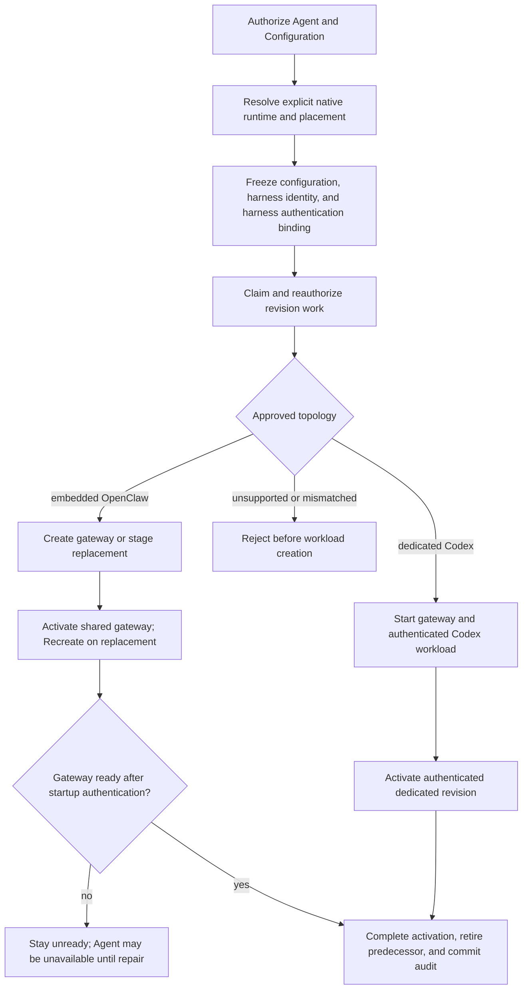

# Harness Execution Topology Flow

## Overview

An authorized deployment resolves its harness from native selected-model/provider policy, freezes
the Agent's explicit `embedded` or `dedicated` placement and harness authentication binding
in its AgentRevision, and asks Compute to start that topology. The flow ends after guarded route
publication, predecessor retirement, and exactly-once activation audit.

## Entry Points

- Trigger: exact-Agent `POST /namespaces/:namespaceId/agents/:agentId/deploy` and durable revision
  reconciliation.
- Source: `packages/occ/src/index.ts:OpenClawController.deployAgent` and
  `apps/controller/src/worker.ts:ControllerWorker`.
- Assumptions: authorized actor; ready Namespace; same-Namespace native agent Configuration;
  explicit Agent execution mode; and a supported `harnessAuth` binding. Managed methods reference an authorized OCC
  Secret API key or a Driver-issued account-owned access-token credential.

## Flow

## Execution Trace

### 1. Resolve and freeze the native harness

`packages/occ/src/index.ts:OpenClawController.deployAgent`

OCC authorizes and locks the exact Agent and Configuration. Selected-model/provider
`agentRuntime.id` explicitly selects `codex` or `openclaw`; only an unambiguous built-in
configuration defaults to embedded OpenClaw. Missing ambiguous/plugin runtime policy, conflicting
routes, unsupported IDs, and harness/mode mismatches fail closed. OCC validates each primary
and fallback model through the same resolver; fallbacks must keep the
primary provider and Harness. It preserves their order in the native configuration.
The admitted revision immutably
captures its native configuration, approved harness identity/version, explicit mode, Compute
selection, and Agent ServicePrincipal. Production admits both approved
`openclaw`/`embedded` and `codex`/`dedicated` combinations. An associated
`access_token` additionally requires dedicated Codex; the frozen account
contains only its OCC identity, credential kind, and opaque Secret reference.

### 2. Claim work and realize the approved topology

`apps/controller/src/worker.ts:ControllerWorker`

The worker claims exact revision work, reauthorizes its actor and ownership, revalidates its frozen
approved harness, and calls `ComputeDriver.prepareRevision`.

`apps/controller/src/drivers/compute/docker/index.ts:DockerComputeDriver.prepareRevision`

Docker's existing topology implementation starts an embedded gateway or dedicated
Codex container, but it does not support the new harness-auth binding contract;
unsupported bindings fail before deployment. In the underlying container path,
`dockerGatewayConfigurationDocument` admits only supported authentication
fields and modes. Omitted
mode renders password mode. An omitted password or explicit managed reference
selects `OPENCLAW_GATEWAY_PASSWORD`; other password settings are preserved.
Explicit trusted proxy retains its native configuration and can also request the
managed password. `reconcileGateway` generates the managed credential only for a
new container, leaving a reused container's credential intact. Dedicated
Codex app-server authentication remains independent. These implementation checks
do not establish a currently deployable Docker Agent path.

Kubernetes supports managed bindings.
SSH supports `{ "method": "runtime" }` only for embedded OpenClaw: operator
credentials remain on the host and OCC checks gateway readiness without model
validation. See the [SSH flow](pr-24-ssh-compute.md).

`apps/controller/src/drivers/compute/kubernetes/index.ts:KubernetesComputeDriver.prepareRevision`

Kubernetes workload rendering calls `prepareHarnessAuth` once for the resolved
source. It projects the OCC Secret key only into embedded OpenClaw or dedicated
Codex. For ChatGPT it projects the account's token and workspace directly into
Codex with no credential copy. Dedicated gateways receive neither source.
See the [harness authentication flow](native-service-account-credential-delivery.md)
for admission, immutable source snapshots, and worker reauthorization.

Production dedicated workloads keep separate Agent-owned gateway/Codex
ServiceAccounts, authenticated same-Agent transport, and default-deny network
policies with auth-method-specific provider login egress. Embedded OpenClaw uses
one combined workload with its exact Agent identity and model key. The worker
has no direct Secret API permissions, although its trusted workload-writing
authority can indirectly project tenant Secrets.

The selected Sandbox consumes the same rendered projections and explicit login
mode in `HarnessWorkloadRequirements`. Unsupported upstream projection fails
without a test-only credential bridge.

When a selected SandboxDriver provisions the dedicated Harness,
`providerHarnessReady` lists Pods using the same Agent/revision/role labels as
the active Service. It validates the complete observation and requires exactly
one nonterminating candidate with the supplied Harness labels and `Ready=True`.
An unready second live candidate blocks readiness even when the first is Ready.
Malformed or incomplete observations throw through the existing preparation
cleanup path. `activateRevision` repeats this check before changing routing.
See the [Kubernetes readiness contract](../reference/drivers/kubernetes-compute.md)
for candidate rules and the limits of this observation.

### 3. Publish safely and complete activation once

`apps/controller/src/worker.ts:ControllerWorker`

The predecessor's Kubernetes Service selector remains intact while
`prepareRevision` stages the replacement. Dedicated Codex must complete its
bounded native authentication/model probe before its app-server becomes ready.
Embedded preparation does not validate the replacement's credentials. See the
[authentication flow](native-service-account-credential-delivery.md#5-authenticate-during-runtime-startup).

The worker commits the database `activeRevisionId` with an exact compare-and-set
before Kubernetes default after-commit activation.
`KubernetesComputeDriver.activateRevision` updates the shared gateway's `Recreate`
Deployment and Service. Embedded cutover can stop the serving gateway before the
replacement validates credentials in its own startup. The same bounded check
runs for initial and replacement gateways. A failed check, including a provider
timeout or rate limit, holds the gateway unready until repair and restart or a
new deployment. Readiness polling does not repeat model requests; worker retries
do not restart an unchanged Pod. No automatic rollback restores the predecessor.

If activation, readiness, predecessor retirement, or audit completion fails,
the worker requeues the revision with `REVISION_FINALIZATION_INCOMPLETE`; recovery
retries activation and retirement for the already-active revision. Lost claims
and foreign/stale workloads fail closed.

Kubernetes gateways in both modes mount their own persistent SQLite and media
directories. Embedded gateways also retain their attested default workspace on
the same private claim so continued turns survive Pod replacement. Dedicated
Codex receives only the shared workspace claim; the gateway's nested Codex home
remains ephemeral. The driver creates dedicated shared and private claims before
their consuming Pods and relies on workload readiness instead of waiting for
`Bound`, which would deadlock `WaitForFirstConsumer` storage classes. A nonroot
gateway-image init container prepares private SQLite and media directories
without credentials or elevated privileges.

For dedicated execution, the gateway entrypoint publishes bundled and plugin
skills into the shared runtime-assets tree before spawning OpenClaw, so Codex
sees the directional shared workspace, session, skill, and generated-image
mounts after the gateway has prepared them. Private gateway state, claim roots,
`CODEX_HOME`, tokens, and credentials remain outside the dedicated Harness.
For a selected Sandbox Driver, stopping or retiring a revision always runs its
required cleanup after stopping a Compute-owned ordinary Harness, or delegates
provider-owned Harness removal to that cleanup. An absent ordinary Deployment
does not skip cleanup, so a cleanup failure remains retryable.
Revision retirement retains both owned claims even after stop removed the
gateway. `apps/controller/src/worker.ts:ControllerWorker.processAgentDeletion`
retires every revision before calling
`apps/controller/src/drivers/compute/kubernetes/index.ts:KubernetesComputeDriver.deleteAgentRuntimeCredentials`
to delete exact-owned private and shared claims by UID. Cleanup failures retry
before the worker removes the Agent's database identity. The [storage contract](../reference/drivers/kubernetes-compute/storage-and-credentials.md#gateway-storage)
owns claim sizes, mount paths, StorageClass requirements, and final teardown.

## Debugging and Verification

- Check placement, immutable policy, and conflicts:
  `node --test tests/conformance/configuration-occ.test.mjs`.
- Check guarded activation and recovery:
  `node --test tests/integration/postgres-worker-agent-revision.test.mjs` with its explicitly
  provisioned application-role PostgreSQL database.
- Run real disposable-k3d Kubernetes coverage for both production topologies, exact identity and
  model-key placement, authenticated dedicated transport, isolated networking, and active routing;
  an HTTP fixture or skipped cluster scenario is not model-turn proof.
- Run `node --test tests/integration/docker-compute-real.test.mjs` for real Docker Compose
  embedded and dedicated model turns, or
  `node --test tests/integration/harness-topology-k3d-real.test.mjs` for real Kubernetes
  model turns. Select each suite's runtime images, infrastructure, and credentials through the
  [test environment settings](../testing/docker.md#docker-compose-development-test-environment).
- Verify provider-backed dedicated Codex separately with
  `node --test tests/integration/service-account-driver-real.test.mjs`,
  `OCC_TEST_CHATGPT_SERVICE_ACCOUNT_REAL=1`, and an authorized mounted
  `OCC_TEST_CHATGPT_ADMIN_KEY_PATH`; this scenario does not use `OPENAI_API_KEY`.
- Treat unavailable credentials, runtime images, provider access, or either real model response as
  a verification failure. Never substitute a readiness probe, handshake, fixture, or skipped test.

## Related docs

- [Harness execution topology implementation specification](../../specs/.archive/07-harness-execution-topology.md)
- [Platform design](../design/workloads.md#openclaw-gateways)
- [Agent placement and deployment](../reference/agents/deployment.md#execution-mode)
- [Controller worker](../reference/controller/reconciliation.md#agentrevision-lifecycle)
- [Docker Compute Driver](../reference/drivers/docker-compute.md)
- [Kubernetes Compute Driver](../reference/drivers/kubernetes-compute.md)
- [Compute Driver lifecycle hooks flow](compute-driver-lifecycle-hooks.md)
- [Service Account Driver credential delivery flow](service-account-driver-credential-delivery.md)
- [Shared-drive specification](../../specs/.archive/12-dedicated-harness-shared-workspace-drive.md)

## Manual Notes

[keep this for the user to add notes. do not change between edits]

## Changelog

- 2026-09-23 03:24: Move durable claim cleanup from revision retirement to Agent deletion. (01a0cc43-d13b-7cb2-ae15-1fd56e61bbf4 - 43776d25c5007e017f7d0ffdca6b06f063afcd37)

- 2026-09-22 22:31: Describe supported auth admission without legacy gateway credential compatibility handling. (authoring-run/d7126920-6a2a-4126-ad7d-fafd57593855 - c387eef76420f05a060689d2fa04b57a3e416956)
- Removed legacy gateway credential compatibility handling. (NOT_IN_SPEC)

- 2026-09-22 22:02: Trace Docker managed gateway passwords while preserving harness admission limits and Codex transport authentication. (authoring-run/b91ebd83-2105-4b1e-aad8-6747fe22c2f1 - 01b42feaf8321e231fbe23a80e00ba641bb9fbcb)
- Bundled Compute Drivers use managed passwords or trusted proxy for native gateway authentication. (NOT_IN_SPEC)

- 2026-09-17 19:14: Distinguish SSH operator credentials from Kubernetes managed authentication. (01a0acbf-4d5a-7413-9411-dce911f3ad23 - b8cabaf9a49e069a7668ccf88b9e71a7484227b7)

- 2026-09-17 02:58: Remove embedded preflight and trace shared-gateway cutover before actual startup credential validation. (01a0acbf-4d5a-7413-9411-dce911f3ad23 - cfb384f22ebcbadcfb421b3020b4bb72fd657160)

- 2026-09-17 01:10: Document native authentication gates before dedicated readiness and embedded replacement cutover. (01a0acbf-4d5a-7413-9411-dce911f3ad23 - 177a24e4)

- 2026-09-17 00:31: Align credential selection and delivery with Agent harnessAuth and the shared Kubernetes rendering path. (01a0acc2-a404-77e3-b1a0-9fa4ffbbdb04 - d2bcbd1c53acb2582a774b5158f254d726abd33f)

- 2026-09-01 19:09: Corrected Kubernetes after-commit activation semantics and merged the dedicated shared-workspace runtime ordering into this topology trace. (01a05f95-dd80-7011-990f-d1c46b5bb3cc - aa366c49c44834d59f74994c5fd37fb8096f169f)
- 2026-08-28 21:20: Removed host-process local-test topology coverage; document Docker and Kubernetes runtime execution and verification. (01a036f4-cf1d-7cc1-bbc1-000879038ac8 - 3ec166eb5fae39ed0f51ffb5ebd93338c4a2db94)
- 2026-08-28 17:58: Updated moved feature-reference links for the documentation organization. (01a036f4-cf1d-7cc1-bbc1-000879038ac8 - 4270aa29b7015562049f46c6027962fd85b584a9)
- 2026-08-27 00:05: Replaced the removed schema-contract suite with the authoritative harness-placement conformance test. (01a036f4-cf1d-7cc1-bbc1-000879038ac8 - ab560806dbd945436835ab092ebd10bf3e50d942)
- 2026-08-24 23:46: Distinguished operator-materialized API keys from API Compute-owned account Secrets, provider-neutral revision snapshots, direct dedicated-Codex token projection, and worker Secret authority. (01a03542-30ff-77a1-9967-587d55548ace - 51033bee121374332df2791e90e2290a5c892e5d)
- 2026-08-21 14:01: Consolidated explicit runtime selection, canonical approval, isolated dedicated credentials, predecessor-safe activation, and real dual model-turn proof. (01a021b2-292b-7ee1-ab55-4f8dc4f0ba7c - 8796ccc)
- 2026-08-21 12:43: Documented dedicated and embedded model execution, the supported shared model, isolated in-memory Codex authentication, managed execution policy, and bounded proxy propagation. (01a0119a-9843-7423-a4c6-955ff4187bd9 - be58d1b)
- 2026-08-21 19:17: Documented explicit placement, immutable native Harness resolution, embedded versus dedicated Compute ownership, existing production credential/transport boundaries, recoverable activation, and two real provider-turn integration scenarios. (01a021b2-292b-7ee1-ab55-4f8dc4f0ba7c - 149882c)
