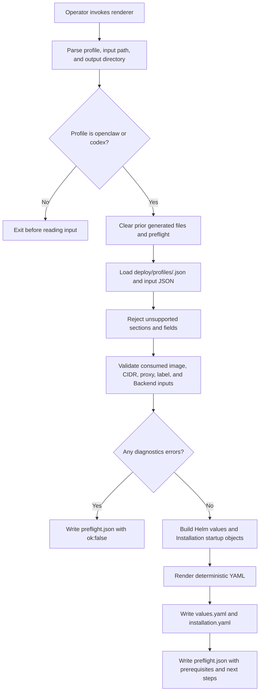

# Installation Profile Rendering Flow

## Overview

An operator runs `scripts/render-installation-profile.mjs` with a profile, a
JSON input file, and an output directory. The renderer checks that every
supplied input belongs to the profile contract, then writes the Helm values
overlay, Installation startup YAML, and a preflight report. This flow stops at
the rendered files. The operator still creates Kubernetes Secrets, applies Helm,
provisions the cluster, sets up hosted plugin and `codex_pat` tokens and the
optional ChatGPT service account, creates the repository registry, and
configures Slack consumers.

## Entry Points

- Trigger: `node scripts/render-installation-profile.mjs --profile openclaw|codex --input <json> --out-dir <dir>`.
- Source: `scripts/render-installation-profile.mjs:parseArgs`,
  `scripts/render-installation-profile.mjs:buildInput`, and
  `scripts/render-installation-profile.mjs:buildRendered`.
- Assumptions: The caller runs from the repository root with installed
  dependencies, a trusted profile under `deploy/profiles/`, and site inputs that
  contain no plaintext credentials.

## Flow

## Execution Trace

### 1. Parse arguments and select the profile

`scripts/render-installation-profile.mjs:parseArgs`

The command accepts exactly three operator inputs: `--profile`, `--input`, and
`--out-dir`. Any other flag fails before a file is rendered. `--profile` must be
`openclaw` or `codex`; there is no `default` profile. The release name and
namespace come only from the JSON input, which feeds both the Helm instructions
and the Installation settings.

Once the arguments are valid, the renderer deletes any prior `values.yaml`,
`installation.yaml`, and `preflight.json` from the output directory and leaves
other files in place. It does this before loading input, so an unreadable or
malformed input cannot leave deployable files or an old success report behind.

### 2. Load profile and site input

`scripts/render-installation-profile.mjs:readProfile`

The renderer reads the profile definition from `deploy/profiles/`. The profile
owns only its identity and PluginDriver selection. The input JSON supplies
environment-specific image names, domains, CIDRs, Secrets, and repository
registry names, so the same profile and input always render the same output.

### 3. Validate every supplied input

`scripts/render-installation-profile.mjs:buildInput`

Every input section is closed: an unknown field is a preflight error, not
ignored, so the renderer never accepts an unused readiness flag. The OpenClaw
profile rejects Codex-only inputs.

The input schema has no field for the hosted discovery and `codex_pat` runtime
token because Installation startup configuration does not consume it.
`preflight.json` tells the operator to add that credential later as a
same-Namespace Secret or through the Console. Managed ServiceAccount
provisioning for `codex_pat` is optional and renders only when `codex.managedServiceAccounts` is
supplied.

Preflight checks `controlPlane.releaseName` against Helm's lowercase release-name
syntax and 53-character maximum. It also requires `controlPlane.namespace` and,
when set, `controlPlane.envoyNamespace` to be Kubernetes namespace names: DNS
labels of at most 63 characters, with no dots. The Compute driver applies the
same rule to `gatewayNamespace` and `envoyNamespace`, and the chart to
`gatewayRouting.envoyNamespace`. `controlPlane.apiClients[].namespace` and
`controlPlane.dns.namespace` follow the same rule, as the chart does for
`api.clients` and `dns`: NetworkPolicies select those peers by
`kubernetes.io/metadata.name`, which only holds Namespace names. A dot, a
slash, an uppercase letter, or a longer name fails before any deployable file
is written. The shared `digestImage` check in `buildRendered`
requires the literal `sha256` algorithm and 64 lowercase hexadecimal characters for
`controlPlane.controllerImage`, `runtime.image`, and enabled `repository.image`.
`controllerDigestImage` additionally applies the chart and bootstrap-volume
helper's reference rule to `controlPlane.controllerImage`: a letter or digit
first, then letters, digits, `.`, `_`, `:`, `/`, or `-` before the digest.
This controller-specific rule does not change runtime or repository image inputs.

Noncanonical digest casing adds a field-specific diagnostic; the final error
branch writes only `preflight.json`, leaving no deployable artifacts.

`controlPlane.clusterName` follows the Name rule the chart and the bootstrap Job
already apply to `installation.name`: 1 to 200 characters, with no leading or
trailing whitespace and no control characters or line or paragraph separators.

Preflight applies the downstream contracts for IPv4 CIDRs, native-admin DNS
hostnames and their shared cookie parent domain (not a public suffix, checked
with the API's `tldts` list), Google hosted domains (at most 253 characters,
last label starting with a letter), repository Service names, and paired metrics
scraper selectors. Invalid values therefore fail before `values.yaml` or
`installation.yaml` is written.

`scripts/render-installation-profile.mjs:signInProvider` refuses equal client-ID
and client-secret Secret keys for GitHub, Google and OIDC. It considers the chart's
`client-id` and `client-secret` defaults when only one key is overridden, so those
collisions also fail before deployment files are written.
`signInSecretsDedicated` applies the chart's dedicated-Secret rule: each enabled
provider's Secret, default or explicit, must differ from the installation,
database and auth Secrets, the gateway API key Secret, the ChatGPT Secret and
repository broker Secrets when enabled, and every provider checked before it.

`scripts/render-installation-profile.mjs:nodeSelector` checks
`controlPlane.nodeSelector`, `runtime.nodeSelector` and
`runtime.gatewayNodeSelector` against the chart and bootstrap-volume helper's
Kubernetes label-key and label-value rules (values may be empty). Compute copies
the runtime selectors into Pod specs, where Kubernetes applies the same rule.
Invalid placement labels fail preflight without deployment files; legal YAML
lookalike values remain strings. `peerSelector` applies Compute's `validatePeer`
rule to DNS, API client and metrics scraper selectors. Both selector kinds use
Kubernetes label keys and values, including empty values. Their qualified
prefixes and bootstrap password claim names are DNS subdomains of at most 253
characters total, without a per-segment cap. Namespace names and unqualified
label names/values retain their 63 limit. The chart and
`scripts/prepare-bootstrap-volume:is_dns_subdomain` share this prefix/claim
rule; the chart checks peers only for nonempty maps. Repository Backend IDs
follow their rule within 200 UTF-16 code units, as in the chart.

### 4. Build Helm values

`scripts/render-installation-profile.mjs:buildRendered`

An optional `controlPlane.databaseCa.key` must be a simple basename. The chart
refuses `.`, `..`, and any other key that is not letters, digits, `.`, `_`, or
`-`. Omit the key to use `ca.pem`.

`validateDatabaseCaMount` checks the generated values against the chart's active
database-client mounts. With a database CA Secret, `mountPath` cannot equal the
Installation, worker runtime, bootstrap, gateway key, or private gateway CA mount.
Repository mounts are reserved only when repository credentials are enabled;
the ChatGPT mount is reserved only when managed service accounts are configured.
Profiles do not enable execution-cluster mounts. No CA configuration adds no
restriction; an omitted path keeps `/etc/openclaw/database-ca`. A collision adds
a field-specific preflight error and prevents both deployable files.

The Helm values select the control-plane image, Better Auth base URL,
bootstrap administrator, database and cluster egress CIDRs, API client
selectors, DNS peer, metrics, native admin, private gateway routing, optional
ChatGPT Backend mounting, optional logging collector, and optional repository
credential sidecar. Gateway routing is always enabled. Native admin is enabled
unless `controlPlane.github`, `controlPlane.google` or `controlPlane.oidc` renders external sign-in
with `auth.recoveryUserId`, which Helm requires with native admin off. An
optional `controlPlane.trustedProxy` renders `api.trustedProxy`. Its CIDRs were
already checked in step 3 with the API's `parseCidr` rules
(`apps/controller/src/auth/client-address.ts`): a prefix of 1 through 32 for an
IPv4-mapped address, and no range that covers every IPv4 peer. Like the chart,
preflight also refuses a zone ID, which the API accepts.

When `channels.managedSlackProxy` is true, the values also enable the
chart-managed Slack proxy Service. The chart allows that proxy public IPv4 HTTPS
egress, excluding private and reserved ranges, and the proxy authorizes Slack
hostnames. Repository values render only when the input explicitly sets
`repository.enabled: true`. Repository provider CIDRs pass through unchanged,
so operators can keep their existing GitHub ranges without DNS snapshots. The
renderer copies `repository.serviceName` only when the input sets it, and only
when that name is a DNS-1035 Service label of at most 63 characters. The
chart's upgrade guard still requires an explicit current broker Service name,
and the same DNS-1035 check cannot fail after a successful preflight.

### 5. Build Installation startup YAML

`scripts/render-installation-profile.mjs:buildRendered`

The Installation output selects Kubernetes Configuration, native IAM,
Kubernetes Compute, Kubernetes Secrets, default Preset seeding, and the profile
PluginDriver. Compute settings consume the runtime image, DNS peer, trusted
proxy CIDRs, plugin-status proxy CIDRs, gateway routing identity, runtime
storage class, node selectors, and transport Secret prefix. The Codex profile
also consumes the reviewed `runtime.codexSeccompProfile` path. Preflight applies
the Compute driver's localhost-profile rule and refuses an absolute path, a
backslash, an empty, `.`, or `..` segment, or a segment named `unconfined`,
before writing `installation.yaml`. When optional
managed ServiceAccount inputs are supplied, it emits the ChatGPT Backend and a
matching ServiceAccount Driver; otherwise Codex Agents use the existing
`codex_pat` token path configured at Agent creation. If the chart-managed Slack
proxy is enabled, Compute receives the generated Service DNS URL and selector
for gateway-to-proxy egress; the chart grants API-to-proxy egress. Repository
opt-in adds the GitHub Backend, Repo Driver,
and worker peer expected by the broker sidecar.

The renderer derives the Compute Gateway name the same way Helm does: it
truncates `<releaseName>-agent-gateways` to 63 characters and removes a trailing
hyphen. HTTPRoute parent references therefore match the Gateway the chart
renders.

Optional `presets.files` adds operator-selected Preset JSON paths and keeps both
standard Presets. The renderer rejects a non-list value and empty or non-string
entries, but it does not read the files; controller startup resolves the paths
and validates their contents. Preset input changes alter the Installation
checksum like any other startup configuration.

`runtime.transportSecretPrefix` must produce the same DNS-safe name that
Kubernetes Compute startup requires: `<prefix>-<12 hex characters>`, at most
253 characters in total. Preflight checks that composed name before writing
Installation YAML. A trailing hyphen in the prefix remains valid; a trailing
dot does not, because the suffix would start a new label with a hyphen.

### 6. Write outputs and preflight

`scripts/render-installation-profile.mjs:writeYaml`

On success, the renderer serializes a deterministic `installation.yaml`, hashes
those exact bytes with SHA-256, and sets `controlPlane.installationChecksum` in
`values.yaml` to that digest. It then writes `values.yaml`, `installation.yaml`,
and `preflight.json`. Helm reads values with YAML 1.1 rules, so the writer
quotes any string key or value that could resolve to a boolean, null, number, or
timestamp (for example a `no`, `on`, `1e3`, or `0x1f` label value) or that starts
with a YAML indicator such as `@`. Quoted strings escape DEL, C1 controls (Helm folds
U+0085 into a space and refuses the others), U+2028, U+2029, U+FEFF, U+FFFE and
U+FFFF; preflight refuses lone UTF-16 surrogates, which YAML cannot spell.
On validation failure, it writes only `preflight.json`
with `ok:false`, lists only that report in `outputs`, and exits nonzero.
Input-loading failures exit without a preflight report.

The preflight report lists warnings, external prerequisites, and the next
operator steps. It tells the operator to update the Installation startup Secret
before the Helm upgrade, so API and worker pod-template annotations roll when
startup-only configuration changes. The report does not claim live readiness:
Helm rendering, Secret creation, runtime proof, hosted discovery, Slack consumer
activation, and repository registry creation need separate evidence.

## Debugging and Verification

- Run `node --test tests/integration/profile-renderer.test.mjs` to exercise the
  CLI and inspect generated profile output.
- `tests/integration/profile-preflight-chart-parity.test.mjs` runs trusted proxy
  CIDRs, namespaces, node selectors, sign-in Secret names and keys, controller
  images, claim names, Backend IDs and free-text values through the renderer and
  `helm template`, plus the API parser or Compute where they apply.
- Inspect `<out-dir>/preflight.json` first. `ok:false` means required input is
  missing or unsupported input was supplied; `values.yaml` and
  `installation.yaml` are intentionally absent.
- Run `helm template oce deploy/helm/openclaw-enterprise --namespace <namespace> --values <out-dir>/values.yaml`
  to check chart-level validation before applying the chart.
- Startup-only input changes should change `controlPlane.installationChecksum`
  in `values.yaml` and the API/worker deployment pod-template annotations in
  Helm output.
- For runtime proof, continue through the production installation and Agent
  deployment guides. Rendered files alone do not prove native admin access,
  Codex sandboxing, hosted discovery, Slack connectivity, or repository
  credential recovery.

## Related docs

- [Render installation profiles](../guides/deploy/installation-profiles.md)
- [Production startup flow](production-startup.md)
- [Kubernetes Compute Driver](../reference/drivers/kubernetes-compute.md)
- [Bundled PluginDriver implementations](../reference/drivers/plugin-bundled.md)

## Manual Notes

[keep this for the user to add notes. do not change between edits]

## Changelog

- 2026-10-10 02:33: Merge current main while retaining selector owners and Kubernetes DNS-subdomain parity. (authoring-run/c4350829-13f6-40e0-902f-9d96e622a27c - db4ccbdea96a752cd99a66cf4cf02c195f5fe3ba)

- 2026-10-10 01:15: Retain the CA mount and incoming peer-selector changelog entries when merging the latest main at maintainer request. (authoring-run/2a354440-5009-424f-8f64-47a48128bd1c - 0ebf6ef99f547dab45923cf459bf96242723e845)

- 2026-10-10 00:58: Merge current profile preflight rules while retaining database CA mount validation and its independent parity coverage. (authoring-run/3bc71672-b18b-4cc7-9189-6d0d77957cc4 - ba439186dbd131073c038eba4645d255cc8c128b)

- 2026-10-10 00:30: Match Kubernetes DNS-subdomain limits in the accompanying setup validation change. (authoring-run/4a617af9-0745-4870-a679-848dba61de53 - 3e34cc0f4b469d29fc79d2c10a33f87a0921ee47)

- 2026-10-09 23:58: Reject database CA mount collisions with the active mounts selected by installation profiles. (authoring-run/19832129-1f67-41f2-8961-d10c648012fd - e6d0571907da6bc6d40eed3e1f8125f7dd332e99)

- 2026-10-09: Check DNS, API client and metrics scraper selectors with Compute's peer label rule, allowing empty values.

- 2026-10-09: Apply the chart's sign-in Secret, runtime node selector, claim name and Backend ID rules, and escape characters Helm's YAML parser changes.

- 2026-10-09 21:03: Validate controller image references before emitting profile files. (authoring-run/9a3fd823-79af-431c-b422-44c0ba255013 - b62cf404ed354079e1c51b64a1e664b3c66c0262)

- 2026-10-09 20:06: Validate transport Secret prefixes before rendering Installation configuration. (authoring-run/8b675a82-44c5-4fc1-a404-dad5edd03858 - cd468c23101b201b3969fa1a4077a18042d3396b)

- 2026-10-09 19:54: Reject external sign-in credential-key collisions during profile preflight. (authoring-run/d628d0ae-29d8-405c-b812-0534f00d5821 - 60a837dfd798e8fac90b53c47436c4bc7a36e8e4)

- 2026-10-09 19:42: Validate control-plane placement labels before writing profile output. (authoring-run/2e2ce65b-ab3e-4466-8f24-602241488e52 - 3a1e29fb461d2ad61a9276ae4af432bcf2d04c88)

- 2026-10-09: Check API client and DNS peer namespaces as DNS labels of at most 63 characters.

- 2026-10-09: Check gateway and Envoy namespaces as DNS labels of at most 63 characters.

- 2026-10-09: Accept empty control-plane placement label values, as Kubernetes does.

- 2026-10-09: Refuse Google hosted domains the chart and API refuse.

- 2026-10-09: Refuse a repository broker Service name the chart's DNS-1035 check refuses.

- 2026-10-09: Refuse gateway and Envoy namespaces the Compute driver refuses.

- 2026-10-09: Refuse Codex seccomp paths the Compute driver refuses.

- 2026-10-08: Refuse database CA keys the chart refuses.

- 2026-10-08: Refuse installation names the chart and the bootstrap Job refuse.

- 2026-10-07 12:07: Unify imported and managed PAT authentication while preserving source ownership and existing OAuth behavior. (01a0e5ec-d802-7800-9eb6-8022c1ac0d06 - be5006e62)

- 2026-10-07: Refuse a public-suffix shared cookie domain in preflight.

- 2026-10-06 15:26: Reject invalid Helm release names before emitting deployment files. (authoring-run/2ae5d308-21b1-4e0c-b693-55c25dd9f879 - 4a314f5b5ac48937acf976fc3e69c385d1883c35)

- 2026-10-06 13:20: Reject noncanonical SHA-256 image digests before emitting deployment files. (authoring-run/feaed473-dcbe-4c10-93fc-39e937f1e798 - f2fb8cbe952d7c27b2690f86134c89e6912cb883)

- 2026-09-29 20:30: Stop defaulting the repository broker Service name so the chart upgrade guard applies.

- 2026-09-29 18:00: Carry external sign-in, the recovery user ID, and trusted proxies through profile rerenders.

- 2026-09-28 22:45: Preserve original Slack public HTTPS egress and repository provider ranges in both profiles. (authoring-run/9c2c8f31-7cb0-4359-a7d7-a6f5c3be882a - 1365d9b33eec2de2452bd3142f57a1729cccd559)

- 2026-09-28 21:04: Added optional Preset file inputs to the renderer and paired startup output. (authoring-run/9c2c8f31-7cb0-4359-a7d7-a6f5c3be882a - 1365d9b33eec2de2452bd3142f57a1729cccd559)

- 2026-09-28 19:57: Match Helm Gateway names and invalidate prior generated files before rerendering. (authoring-run/c35ba3ae-a801-46fc-af68-f8f7a27d56ed - 15bab9571fa12a2192a4d5dbff70f3e263468ee7)

- 2026-09-28 15:36: Documented installation profile rendering flow. (authoring-run/6f2a325a-cf1c-4277-9ce3-7623626f68c6 - 6c56149f1f2b7290d8526d87c3624c9b7db09fbf)

- 2026-09-28 16:43: Updated the output step after removing the runtime YAML-loader dependency. (authoring-run/6f2a325a-cf1c-4277-9ce3-7623626f68c6 - 6c56149f1f2b7290d8526d87c3624c9b7db09fbf)

- 2026-09-28 17:04: Clarified that Codex defaults to existing `codex_pat` token credentials and renders managed ServiceAccount wiring only when explicitly supplied. (authoring-run/6f2a325a-cf1c-4277-9ce3-7623626f68c6 - 6c56149f1f2b7290d8526d87c3624c9b7db09fbf)

- 2026-09-28 17:31: Documented stricter profile preflight checks for IPv4 CIDRs, native-admin DNS domains, and paired metrics selectors. (authoring-run/6f2a325a-cf1c-4277-9ce3-7623626f68c6 - 6c56149f1f2b7290d8526d87c3624c9b7db09fbf)

- 2026-09-28 18:02: Documented rendered Installation checksum injection into Helm values and the Secret-before-Helm apply order. (authoring-run/6f2a325a-cf1c-4277-9ce3-7623626f68c6 - 6c56149f1f2b7290d8526d87c3624c9b7db09fbf)
