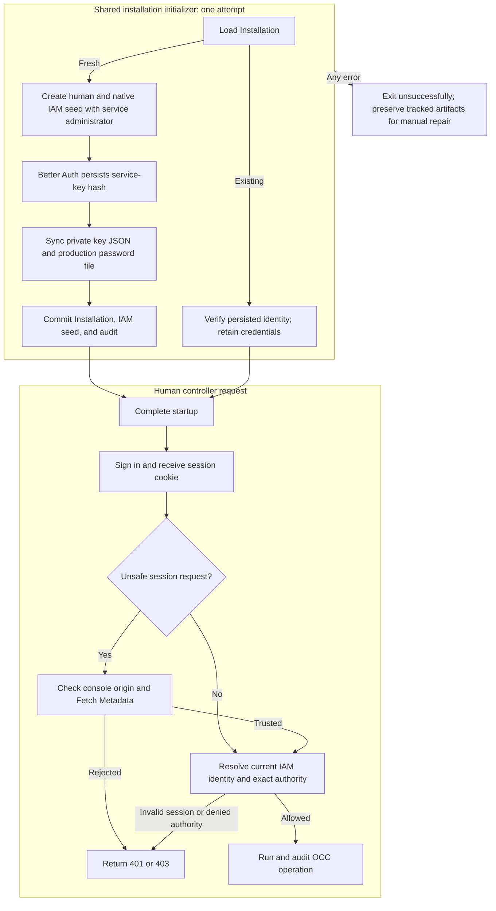

# Bootstrap and Local Password Authentication Flow

## Overview

Fresh native-IAM bootstrap creates human and service administrators, delivers
the initial service key through protected storage, and commits their shared Role
and separate bindings with the Installation. Production also delivers a generated
human password; development uses its configured password. This flow follows both
environment modes of the shared initializer into human sign-in and exact IAM
authorization. Ongoing
service-key verification, rotation, and revocation continue in the
[service API key flow](service-api-keys.md).

## Entry Points

- Trigger: `node scripts/bootstrap-installation.mjs` with `NODE_ENV=development`
  or `production`, `POST /api/auth/sign-in/email`, or a protected controller request.
- Source: [`scripts/bootstrap-installation.mjs`](../../scripts/bootstrap-installation.mjs),
  [`apps/controller/src/auth/index.ts:createControllerAuth`](../../apps/controller/src/auth/index.ts),
  and [`apps/controller/src/index.ts:createFastifyApp`](../../apps/controller/src/index.ts).
- Assumptions: Migrated PostgreSQL, configured Better Auth, native IAM bootstrap,
  protected output storage, disabled public signup, and exact IAM authorization.
  Production receives a private password path and sibling service-key path;
  development receives only the service-key output path.

## Flow

## Execution Trace

### 1. Load state and create the fresh administrator identities

[`scripts/bootstrap-installation.mjs`](../../scripts/bootstrap-installation.mjs)
first loads the singleton Installation. Existing Installations verify the
configured administrator's immutable account/IAM identity and return without
issuing keys, touching output, or repairing identity/grant changes. This includes
Installations created before service-administrator bootstrap existed.

For fresh setup, production creates a Better Auth account with a random password;
development creates the configured `OPENCLAW_DEV_EMAIL`/`OPENCLAW_DEV_PASSWORD`
account. `packages/iam/src/index.ts:createBootstrapAdministratorSeed` adds a non-Agent
`spn_<uuid>` with no Namespace and binds it to the same administrator Role as
the human, using a separate unrestricted binding. The
[authorization reference](../reference/authorization.md#supported-policy-surface)
owns the exact action matrix. Additional-account provisioning does not create
another service administrator.

### 2. Issue private output, then commit the Installation

[`apps/controller/src/auth/index.ts:createServiceKey`](../../apps/controller/src/auth/index.ts) persists a Better
Auth key named `bootstrap-admin` with the default 30-day expiry, scoped to this
Installation and service principal. This auth write is independent of the OCC
transaction. An uncommitted IAM seed cannot authorize normal OCC operations;
startup does not expose the application until bootstrap succeeds.

[`bootstrap-output.ts:writeProtectedBootstrapFile`](../../apps/controller/src/composition/bootstrap-output.ts)
creates owner-only output exclusively and syncs it before OCC commit. The JSON
contains the key response and attempt Installation ID; production also writes its
password file on the same protected PVC. Development writes to its bootstrap-only
volume or explicit direct-initialization path. No plaintext reaches logs, audit, HTTP
bootstrap responses, or the worker.

Both modes commit Installation/IAM/audit through the same controller
transaction. The initializer owns one attempt scope for account creation, key
issuance, output, and commit. The API subsequently loads committed state without
signing into itself or calling `POST /installation/bootstrap`; that public
endpoint remains human-session-only and does not issue bootstrap credentials.
Singleton database constraints select at most one committed seed. A losing
initializer fails and preserves completed tracked artifacts for operator
inspection.

Any error ends the single initialization attempt with
`installation.bootstrap-failed`, available non-secret IDs and paths, and a
nonzero exit. Completed tracked accounts, keys, and files remain available for
manual inspection; even a partially written output file is preserved. One
pre-return Better Auth failure is narrower: if password `linkAccount` fails
inside `createAccount`, the helper attempts to delete the just-created user
before rethrowing. The initializer does not treat that cleanup attempt as a
general artifact-recovery path, and it does not automatically revoke, retry,
repair, or reset committed or uncertain state.
The Helm initialization Job uses `backoffLimit: 0`.

The operator confirms the original transaction has finished and compares exact
attempt IDs before manual repair; file existence or another Installation is
insufficient. An uncertain commit can already have persisted the seed, so an
error never authorizes an automatic wipe. A deliberate reset must identify the
disposable Installation and its dedicated storage. The
[recovery procedure](../guides/deploy/service-keys.md#recover-an-incomplete-bootstrap) owns
those operator actions.

After confirmed success, the operator retrieves/imports the existing file and
retains its non-secret IDs. Lost output does not trigger regeneration; normal
[service-key management](service-api-keys.md) owns replacement and revocation.

### 3. Construct session authentication

`apps/controller/src/auth/index.ts:createControllerAuth` configures Better Auth
email/password authentication, protected session cookies, and durable PostgreSQL
storage. Sign-in returns only `{ authenticated: true }`; the session token stays
in its HttpOnly cookie and is omitted from session-inspection responses.
`safeSessionResponse` projects the noncredential session record ID as `sessionKey`
alongside public user identity. Console compares it to invalidate retained views
and drafts after a new session, including for the same user. Sign-out
revokes the session, and public signup is disabled.

### 4. Admit and authorize protected API calls

`ControllerAdmissionVerifier.verifyControllerRequest` requires the configured console Origin for
unsafe session requests before admission. A supplied `Sec-Fetch-Site` must be
`same-origin`. Sign-out applies the same check before revoking the session.
Explicit service API keys do not use the cookie origin check, and an invalid key
cannot fall back to a cookie.

`apps/controller/src/index.ts:createFastifyApp` validates the session, resolves
its installation-owned issuer and user ID through the selected IAM Driver, and
authorizes the exact resource through that same Driver. The Driver loads current
policy separately for identity lookup and authorization, so account and
permission changes are visible across controller instances. Missing or invalid
sessions return `401`; denied permissions return `403`; dependency failures fail
closed. Bearer credentials and caller-supplied identity headers are rejected.

### 5. Provision additional accounts

`apps/controller/src/index.ts:createFastifyApp` permits only an authorized
Installation administrator to create another account. The operation creates its
Better Auth user and IAM Principal, binds an explicitly selected existing role,
and records the mutation without creating a session or replacing the IAM Driver.
IAM or audit failure rolls back the provisioning; accounts never receive
implicit permissions.

## Debugging and Verification

- `node --test tests/integration/native-admin-access.test.mjs` covers trusted and
  untrusted origins on session mutations and sign-out, plus service-key admission.
- `node --test tests/integration/postgres-production-wireup.test.mjs` with
  `OCC_PRODUCTION_WIREUP_DATABASE_URL` proves actual bootstrap, protected random
  password/key delivery, human sign-in, service-key access, and no reissue on rerun.
- `node --test tests/integration/postgres-auth-accounts.test.mjs` with
  `OCC_TEST_DATABASE_URL` covers account provisioning and transactional rollback.
  Its fresh development bootstrap case additionally verifies the service identity,
  protected output, and key access; it skips when an Installation already exists.
- `node --test tests/integration/bootstrap-output.test.mjs` covers exclusive
  output and rejected unsafe paths. Failed writes retain any created file.
  Database cases require the [disposable PostgreSQL setup](../testing/postgresql.md#postgresql-test-environment);
  an unconfigured/skipped suite is not runtime proof.
- `node --test tests/integration/postgres-bootstrap-failures.test.mjs` with
  `OCC_BOOTSTRAP_FAILURE_DATABASE_URL` exercises concurrent production attempts
  and preserves both environment modes' credentials when a test fault discards the
  acknowledgement after a real COMMIT. The suite resets a dedicated loopback
  database; see [its settings](../testing/postgresql.md#postgresql-test-environment).
- Verify copied output is `0600` without printing it; use a key-authenticated
  `GET /installation` and Namespace create/read to check current authority.
  A `401` indicates credential rejection; `403` indicates identity/scope/policy
  denial. Preserve failed bootstrap artifacts and compare safe IDs through
  [operator recovery](../guides/deploy/service-keys.md#recover-an-incomplete-bootstrap).
- `pnpm typecheck`, `pnpm format:check`, and `pnpm check:workspace` validate source
  and workspace structure. Compose/PVC permission checks require real runtime
  execution; chart rendering alone does not prove storage access.

## Related docs

- [Authentication](../reference/authentication.md)
- [Configuration reference](../reference/settings.md)
- [IAM](../reference/authorization.md)
- [Platform startup flow](platform-startup.md)
- [Docker Compose development](docker-compose-development.md) and [production startup](production-startup.md)
- [Service API keys](service-api-keys.md)
- [Bootstrap specification](../../specs/16-bootstrap-admin-service-account.md)
- [Feature spec](../../specs/.archive/10-local-password-authentication.md)

## Manual Notes

[keep this for the user to add notes. do not change between edits]

## Changelog

- 2026-09-26 21:09: Trace origin checks for cookie-authenticated mutations and sign-out. (authoring-run/6d7cf57f-03f3-4ea7-8694-38edd9f3c9c2 - 849b2b24111fe237b12da5be1d4b411d3146cefb)

- 2026-09-25 17:27: Trace noncredential session identity for Console lifetime invalidation in accompanying changes. (01a0d992-db83-7843-b40c-355c0f2c2b9a - 64ab72aed5c4926e4a2080ade91d785e531801a2)

- 2026-09-01 19:09: Update links to consolidated runtime flows. (01a05f95-dd80-7011-990f-d1c46b5bb3cc - aa366c49c44834d59f74994c5fd37fb8096f169f)
- 2026-08-31 22:29: Remove automatic bootstrap recovery; preserve artifacts after any error and require manual repair. (01a05a3d-526f-7553-8cd8-070bd1847acb - 94a5440898bf331987148d7733f0075506af64a6)

- 2026-08-31 20:33: Trace the shared installation initializer, startup ordering, and initializer-owned credential delivery. (01a05a3d-526f-7553-8cd8-070bd1847acb - b6f213cbcee11ba3dd69886c936c7e5abe233eb3)

- 2026-08-31 17:43: Document fresh human/service administrator bootstrap, private key delivery, and operator recovery. (codex/01a05a69-3fbe-7441-9e6d-20394758cf94 - 0797098646028ac00cb26cd4afcbc9b2cf8bcb24)

- 2026-08-28 21:20: Preserved PostgreSQL account provisioning and rollback verification in the renamed auth-account suite after removing local-test Compute coverage. (01a036f4-cf1d-7cc1-bbc1-000879038ac8 - 3ec166eb5fae39ed0f51ffb5ebd93338c4a2db94)
- 2026-08-28 17:58: Updated moved feature-reference links for the documentation organization. (01a036f4-cf1d-7cc1-bbc1-000879038ac8 - 4270aa29b7015562049f46c6027962fd85b584a9)
- 2026-08-24 17:12: Documented current-policy identity lookup, authorization, and cross-controller account visibility. (01a0352c-debe-73b1-baa6-379855af874f - 4502d7e)
- 2026-08-24 17:12: Removed IAM policy snapshots and Driver replacement; load current policy for every identity lookup and authorization decision. (01a0352c-debe-73b1-baa6-379855af874f - 4502d7e) (NOT_IN_SPEC)
- 2026-08-24 15:14: Documented redacted session inspection and account provisioning without implicit sessions. (01a0352c-debe-73b1-baa6-379855af874f - 08862be)
- 2026-08-24 14:10: Simplified the runtime trace and retained real PostgreSQL bootstrap and account-provisioning verification. (01a0352c-debe-73b1-baa6-379855af874f - 99111a5)
- 2026-08-24 13:17: Documented the cookie-only sign-in response and shared auth-account seed validation boundary. (01a0352c-debe-73b1-baa6-379855af874f - 4725aed)
- 2026-08-24 13:01: Documented Better Auth bootstrap, session admission, IAM authorization, account provisioning, and verification flow. (01a03552-00ba-7c42-b5ca-414c8972f20b - 2e9769c)
