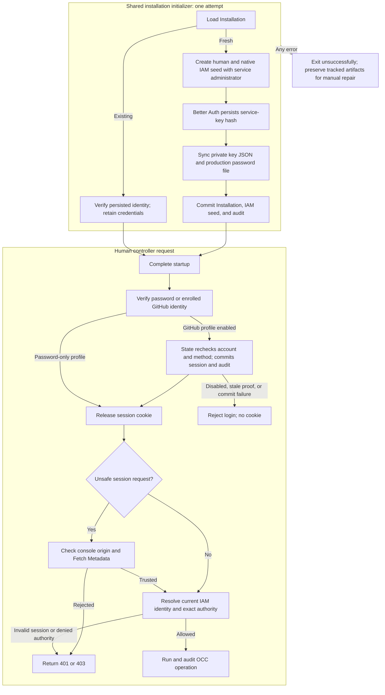

# Bootstrap and human authentication flow

## Overview

Fresh native-IAM bootstrap creates human and service administrators, delivers
the initial service key through protected storage, and commits their shared Role
and separate bindings with the Installation. Production also delivers a generated
human password; development uses its configured password. This flow follows both
environment modes of the shared initializer into human sign-in and exact IAM
authorization. Ongoing
service-key verification, rotation, and revocation continue in the
[service API key flow](service-api-keys.md).

## Entry Points

- Trigger: `node scripts/bootstrap-installation.mjs` with `NODE_ENV=development`
  or `production`, `POST /api/auth/sign-in/email`, `POST /api/auth/providers/github/start`,
  `GET /api/auth/providers/github/callback`, the matching `google` routes, or a protected
  controller request.
- Source: [`scripts/bootstrap-installation.mjs`](../../scripts/bootstrap-installation.mjs),
  [`apps/controller/src/auth/index.ts:createControllerAuth`](../../apps/controller/src/auth/index.ts),
  and [`apps/controller/src/index.ts:createFastifyApp`](../../apps/controller/src/index.ts).
- Assumptions: Migrated PostgreSQL, configured Better Auth, native IAM bootstrap,
  protected output storage, disabled public signup, and exact IAM authorization.
  Production receives a private password path and sibling service-key path;
  development receives only the service-key output path.

## Flow

## Execution Trace

### 1. Load state and create the fresh administrator identities

[`scripts/bootstrap-installation.mjs`](../../scripts/bootstrap-installation.mjs)
first loads the singleton Installation. Existing Installations verify the
configured administrator's immutable account/IAM identity and return without
issuing keys, touching output, or repairing identity/grant changes. This includes
Installations created before service-administrator bootstrap existed.

For fresh setup, production creates a Better Auth account with a random password;
development creates the configured `OPENCLAW_DEV_EMAIL`/`OPENCLAW_DEV_PASSWORD`
account. `packages/iam/src/index.ts:createBootstrapAdministratorSeed` adds a non-Agent
`spn_<uuid>` with no Namespace and binds it to the same administrator Role as
the human, using a separate unrestricted binding. The
[authorization reference](../reference/authorization.md#supported-policy-surface)
owns the exact action matrix. Additional-account provisioning does not create
another service administrator.

### 2. Issue private output, then commit the Installation

[`apps/controller/src/auth/index.ts:createServiceKey`](../../apps/controller/src/auth/index.ts) persists a Better
Auth key named `bootstrap-admin` with the default 30-day expiry, scoped to this
Installation and service principal. This auth write is independent of the OCC
transaction. An uncommitted IAM seed cannot authorize normal OCC operations;
startup does not expose the application until bootstrap succeeds.

[`bootstrap-output.ts:writeProtectedBootstrapFile`](../../apps/controller/src/composition/bootstrap-output.ts)
creates owner-only output exclusively and syncs it before OCC commit. The JSON
contains the key response and attempt Installation ID; production also writes its
password file on the same protected PVC. Development writes to its bootstrap-only
volume or explicit direct-initialization path. No plaintext reaches logs, audit, HTTP
bootstrap responses, or the worker.

Both modes commit Installation/IAM/audit through the same controller
transaction. The initializer owns one attempt scope for account creation, key
issuance, output, and commit. The API subsequently loads committed state without
signing into itself or calling `POST /installation/bootstrap`; that public
endpoint remains human-session-only and does not issue bootstrap credentials.
Singleton database constraints select at most one committed seed. A losing
initializer fails and preserves completed tracked artifacts for operator
inspection.

Any error ends the single initialization attempt with
`installation.bootstrap-failed`, available non-secret IDs and paths, and a
nonzero exit. Completed tracked accounts, keys, and files remain available for
manual inspection; even a partially written output file is preserved. One
pre-return Better Auth failure is narrower: if password `linkAccount` fails
inside `createAccount`, the helper attempts to delete the just-created user
before rethrowing. The initializer does not treat that cleanup attempt as a
general artifact-recovery path, and it does not automatically revoke, retry,
repair, or reset committed or uncertain state.
The Helm initialization Job uses `backoffLimit: 0`.

The operator confirms the original transaction has finished and compares exact
attempt IDs before manual repair; file existence or another Installation is
insufficient. An uncertain commit can already have persisted the seed, so an
error never authorizes an automatic wipe. A deliberate reset must identify the
disposable Installation and its dedicated storage. The
[recovery procedure](../guides/deploy/service-keys.md#recover-an-incomplete-bootstrap) owns
those operator actions.

After confirmed success, the operator retrieves/imports the existing file and
retains its non-secret IDs. Lost output does not trigger regeneration; normal
[service-key management](service-api-keys.md) owns replacement and revocation.

### 3. Construct session authentication

`apps/controller/src/auth/index.ts:createControllerAuth` configures Better Auth
email/password authentication, protected session cookies, and durable PostgreSQL
storage. Sign-in returns `{ authenticated: true }`; the session token stays
in its HttpOnly cookie and is omitted from session-inspection responses.
`safeSessionResponse` projects `sessionKey`, an HMAC of the session record ID
under the auth secret (`apps/controller/src/auth/session-binding.ts`), alongside
public user identity. Console compares it to invalidate retained views and drafts
after a new session, including for the same user. Sign-out revokes the session,
and public signup is disabled. Without an external provider,
`auth/admission.ts:passwordFailureAdmission` limits failed password sign-ins.

`requireSessionKey` applies the optional `x-occ-session-key` header after the
cookie session resolves, in `ControllerAdmissionVerifier.verify` (protected API
and native admin proxy), `session`, `resolveSession`, and `signOut`. An absent
header changes nothing; a malformed, duplicated, or foreign key returns `401`, so
the header narrows but never selects a session. Sign-out with a foreign key
revokes and clears nothing. The native admin proxy strips the header upstream.

When GitHub is configured, `apps/controller/src/auth/github.ts:createHumanLogin`
wraps the Better Auth adapter and provides curated password, GitHub, and logout
endpoints. `packages/occ/src/state/human-authentication.ts:PostgresHumanAuthentication`
owns persisted account/method checks and the original State transaction.
Password verification captures the credential and account version before the
session transaction rechecks them. Both methods pass a controller-private proof
to the same guarded session creation path; the session and required audit commit
before Better Auth releases its cookie. Session reads check the current account,
method, version, and Principal, with an eight-hour absolute lifetime and no refresh.
HTTPS uses a `__Host-` session cookie so a sibling host cannot plant the active
cookie through a parent-domain `Domain` attribute. Session readers and logout
reject ambiguous duplicate active-session cookies.

For GitHub, the Console reads `GET /api/auth/providers` and sends a same-origin
`POST /api/auth/providers/github/start`. The server stores a five-minute attempt with state and browser
secret digests, provider instance, callback, and PKCE verifier. A host-only
HttpOnly cookie binds the browser; this profile rejects shared-domain sessions.
Authorization requests omit OAuth scopes. Callback consumption commits before
exchange; a losing, expired, or invalid attempt does not exchange a code.
`apps/controller/src/auth/github.ts:exchangeGithubSubject` exchanges the code
with the GitHub App client ID and secret, uses the returned user access token
only for `/user`, and returns the numeric subject. Access and refresh tokens,
expiry, and scope data are discarded; the App private key remains with the
repository credential consumer. The subject selects an exact existing enrollment;
email, login name, and tokens do not become identity or policy. Success redirects
to exactly `/console/`; failure redirects to the fixed
Console URL with a sanitized error marker.

Start also returns `attemptId`, an HMAC of the attempt's state digest. Success sets
a signed two-minute `SameSite=Strict` receipt naming the new session and that
`attemptId`. The Console's same-origin `POST /api/auth/providers/github/result`
reaches `oceGithubResult`, which checks the receipt signature and expiry, the
posted `attemptId`, and that the session cookie still resolves to the named
session. It then records the receipt in a process-local ledger until expiry,
clears the cookie, and returns the session key, without issuing or extending a
session. Password sign-in in this profile returns the same key. Callback denials are audited as
`INVALID_ATTEMPT` (malformed, unbound, replayed, or expired), `PROVIDER_UNAVAILABLE`
(transport failure, deadline, 429/5xx, malformed body), or `EXTERNAL_IDENTITY_REJECTED`;
State dependency failure or uncertain session completion is not a denial. Neither path retries.

Google uses the same start, callback, and result code through
`apps/controller/src/auth/github.ts:externalProviderEndpoints`, with provider instance
`google:<sha256(client ID)>`. Its authorization request adds scope `openid email` and a
nonce, an HMAC of the attempt state under the auth secret, so it needs no extra storage.
`apps/controller/src/auth/google.ts:exchangeGoogleSubject` exchanges the code, fetches
Google's signing keys through the same bounded transport, verifies the RS256 ID token's
signature, issuer, audience, expiry, and nonce (plus `hd` and `email_verified` when
allowed domains are set), and returns only `sub`. Tokens and email are discarded.

Password and external-provider work have separate bounded process-local admission; GitHub and Google share one budget. Provider HTTP shares a deadline and
limits streamed response bytes; State bounds pending attempts and expired cleanup.
State sets the five-minute attempt and eight-hour session deadlines. Cookie
Max-Age subtracts monotonic elapsed work from that persisted lifetime; expired
completion cannot release a cookie.

Before activation the deployment stops admission, drains or terminates admitted
requests, and stops every old controller. Both PostgreSQL compositions reject
GitHub with enabled native administration, even when its cookie domain is missing.
`apps/controller/src/auth/index.ts:createPostgresControllerAuth` constructs and
initializes authentication before activation, checking the secret, canonical HTTP
origin, and supported profile. Invalid static configuration leaves legacy sessions,
account enrollment, and the recovery designation unchanged.
`PostgresHumanAuthentication.activateRecovery` then validates and enrolls the complete existing password-user/Principal population,
fixes the usable recovery administrator, and removes unbound historical sessions
in one State transaction before serving resumes. Unsupported or incomplete
populations fail activation. This is a stopped-maintenance contract; startup does
not fence an old live reader. See the
[deployment procedure](../guides/deploy/production-installation.md#enable-github-browser-sign-in).

The controller's account routes authorize native IAM Installation `administer`
and require a current human session and the configured Origin. State locks both
actor and target, rechecks the actor session, and applies the caller's
`expectedVersion`. Attachment, disablement, and account-wide revocation advance
that version and invalidate target sessions and proofs without changing IAM.
A guarded read returns current account and method state, not a prior operation
receipt. Unknown completion returns an explicit dependency failure without
replay or compensation; operators must resolve uncertainty before a new action.
Logout commits deletion and audit before clearing the cookie. The [authentication reference](../reference/authentication/external-sign-in.md#github-sign-in-for-existing-accounts)
owns configuration, recovery limits, and operator-visible behavior.

### 4. Admit and authorize protected API calls

`ControllerAdmissionVerifier.verifyControllerRequest` requires the configured console Origin for
unsafe session requests before admission. A supplied `Sec-Fetch-Site` must be
`same-origin`. Sign-out applies the same check before revoking the session, and the
GitHub result exchange before reading it; that exchange shares the GitHub admission lane.
Explicit service API keys do not use the cookie origin check, and an invalid key
cannot fall back to a cookie.

`apps/controller/src/index.ts:createFastifyApp` validates the session, resolves
its installation-owned issuer and user ID through the selected IAM Driver, and
authorizes the exact resource through that same Driver. The Driver loads current
policy separately for identity lookup and authorization, so account and
permission changes are visible across controller instances. Missing or invalid
sessions return `401`; denied permissions return `403`; dependency failures fail
closed. Bearer credentials and caller-supplied identity headers are rejected.

### 5. Provision additional accounts

`apps/controller/src/index.ts:createFastifyApp` permits an authorized human
Installation administrator to create another account, with or without GitHub
sign-in. `prepareAccount` validates and hashes the password without writing; the
PostgreSQL composition then calls `provisionPasswordAccount`, which writes the
user, password method, Principal, explicit existing-role binding, enrollment,
and audit in one State transaction, so a failure leaves no partial account.
Nothing is compensated after the transaction. A lost COMMIT reply returns `503`
stating that the outcome is unknown; the account is either complete or absent,
so a deliberate retry with the same email creates it only if the first attempt
did not commit, and otherwise returns `409`.
Account creation issues no session and infers no grants.

## Debugging and Verification

- `node --test tests/integration/native-admin-access.test.mjs` covers trusted and
  untrusted origins on session mutations and sign-out, plus service-key admission.
- `node --test tests/integration/postgres-production-wireup.test.mjs` with
  `OCC_PRODUCTION_WIREUP_DATABASE_URL` proves actual bootstrap, protected random
  password/key delivery, human sign-in, service-key access, and no reissue on rerun.
- `node --test tests/integration/postgres-auth-accounts.test.mjs` with
  `OCC_TEST_DATABASE_URL` covers account provisioning, transactional rollback, and
  a lost provisioning COMMIT reply.
  Its fresh development bootstrap case additionally verifies the service identity,
  protected output, and key access; it skips when an Installation already exists.
- `node --test tests/integration/bootstrap-output.test.mjs` covers exclusive
  output and rejected unsafe paths. Failed writes retain any created file.
  Database cases require the [disposable PostgreSQL setup](../testing/postgresql.md#postgresql-test-environment);
  an unconfigured/skipped suite is not runtime proof.
- `node --test tests/integration/postgres-bootstrap-failures.test.mjs` with
  `OCC_BOOTSTRAP_FAILURE_DATABASE_URL` exercises concurrent production attempts
  and preserves both environment modes' credentials when a test fault discards the
  acknowledgement after a real COMMIT. The suite resets a dedicated loopback
  database; see [its settings](../testing/postgresql.md#postgresql-test-environment).
- Verify copied output is `0600` without printing it; use a key-authenticated
  `GET /installation` and Namespace create/read to check current authority.
  A `401` indicates credential rejection; `403` indicates identity/scope/policy
  denial. Preserve failed bootstrap artifacts and compare safe IDs through
  [operator recovery](../guides/deploy/service-keys.md#recover-an-incomplete-bootstrap).
- `pnpm typecheck`, `pnpm format:check`, and `pnpm check:workspace` validate source
  and workspace structure. Compose/PVC permission checks require real runtime
  execution; chart rendering alone does not prove storage access.

## Related docs

- [Authentication](../reference/authentication.md)
- [Configuration reference](../reference/settings.md)
- [IAM](../reference/authorization.md)
- [Platform startup flow](platform-startup.md)
- [Docker Compose development](docker-compose-development.md) and [production startup](production-startup.md)
- [Service API keys](service-api-keys.md)
- [Bootstrap specification](../../specs/16-bootstrap-admin-service-account.md)
- [Feature spec](../../specs/.archive/10-local-password-authentication.md)

## Manual Notes

[keep this for the user to add notes. do not change between edits]

## Changelog

- 2026-09-28 04:00: Trace the GitHub attempt receipt, result exchange, and `x-occ-session-key` narrowing in the accompanying source change. (feat/github-session-binding-20260928)

- 2026-09-26 21:09: Trace origin checks for cookie-authenticated mutations and sign-out. (authoring-run/6d7cf57f-03f3-4ea7-8694-38edd9f3c9c2 - 849b2b24111fe237b12da5be1d4b411d3146cefb)

- 2026-09-25 17:27: Trace noncredential session identity for Console lifetime invalidation in accompanying changes. (01a0d992-db83-7843-b40c-355c0f2c2b9a - 64ab72aed5c4926e4a2080ade91d785e531801a2)

- 2026-09-23 18:50: Trace shared GitHub App login without OAuth scopes and discarded App credential data in the accompanying source change. (public-pr/305 - e9a16a23f1c3a5bc9a26e1ca13022b769bae5e7a)

- 2026-09-23 04:25: Trace the nested GitHub provider start and callback routes in the accompanying route change. (public-pr/305 - 16756fbf1197601f0cc7eef2143389952fd1959e)

- 2026-09-23 04:05: Trace host-bound HTTPS sessions, ambiguous-cookie rejection, and preserved callback completion uncertainty in the accompanying security repair. (public-pr/305 - 140f82a08e82c852e0c7ca5071f45a64f6dce596)

- 2026-09-23 01:46: Trace static authentication validation before activation and unchanged state on invalid configuration in the accompanying source repair. (public-pr/305 - ed1a4a2f719ad6bd28239f61f1213cce4c2d94fb)

- 2026-09-23 00:36: Trace stopped activation, guarded actor/version administration, finite work, and the temporary provisioning freeze in the accompanying source change. (public-pr/305 - bc3a8652bd60423a5c5749429628f55ab8329513)

- 2026-09-22 23:02: Trace existing-account GitHub login and shared guarded session admission in the accompanying source change. (public-pr/305 - 311bc23012d0fd269483168b865adf79df630542)

- 2026-09-01 19:09: Update links to consolidated runtime flows. (01a05f95-dd80-7011-990f-d1c46b5bb3cc - aa366c49c44834d59f74994c5fd37fb8096f169f)
- 2026-08-31 22:29: Remove automatic bootstrap recovery; preserve artifacts after any error and require manual repair. (01a05a3d-526f-7553-8cd8-070bd1847acb - 94a5440898bf331987148d7733f0075506af64a6)

- 2026-08-31 20:33: Trace the shared installation initializer, startup ordering, and initializer-owned credential delivery. (01a05a3d-526f-7553-8cd8-070bd1847acb - b6f213cbcee11ba3dd69886c936c7e5abe233eb3)

- 2026-08-31 17:43: Document fresh human/service administrator bootstrap, private key delivery, and operator recovery. (codex/01a05a69-3fbe-7441-9e6d-20394758cf94 - 0797098646028ac00cb26cd4afcbc9b2cf8bcb24)

- 2026-08-28 21:20: Preserved PostgreSQL account provisioning and rollback verification in the renamed auth-account suite after removing local-test Compute coverage. (01a036f4-cf1d-7cc1-bbc1-000879038ac8 - 3ec166eb5fae39ed0f51ffb5ebd93338c4a2db94)
- 2026-08-28 17:58: Updated moved feature-reference links for the documentation organization. (01a036f4-cf1d-7cc1-bbc1-000879038ac8 - 4270aa29b7015562049f46c6027962fd85b584a9)
- 2026-08-24 17:12: Documented current-policy identity lookup, authorization, and cross-controller account visibility. (01a0352c-debe-73b1-baa6-379855af874f - 4502d7e)
- 2026-08-24 17:12: Removed IAM policy snapshots and Driver replacement; load current policy for every identity lookup and authorization decision. (01a0352c-debe-73b1-baa6-379855af874f - 4502d7e) (NOT_IN_SPEC)
- 2026-08-24 15:14: Documented redacted session inspection and account provisioning without implicit sessions. (01a0352c-debe-73b1-baa6-379855af874f - 08862be)
- 2026-08-24 14:10: Simplified the runtime trace and retained real PostgreSQL bootstrap and account-provisioning verification. (01a0352c-debe-73b1-baa6-379855af874f - 99111a5)
- 2026-08-24 13:17: Documented the cookie-only sign-in response and shared auth-account seed validation boundary. (01a0352c-debe-73b1-baa6-379855af874f - 4725aed)
- 2026-08-24 13:01: Documented Better Auth bootstrap, session admission, IAM authorization, account provisioning, and verification flow. (01a03552-00ba-7c42-b5ca-414c8972f20b - 2e9769c)
