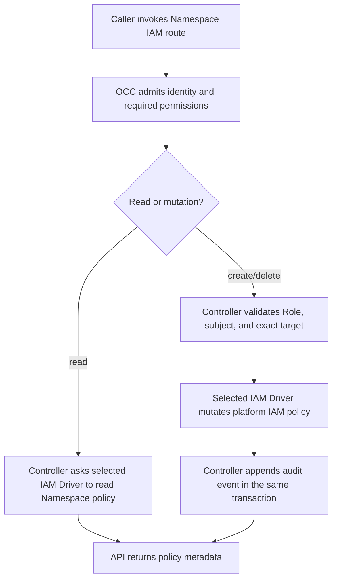

# Namespace IAM Policy Flow

## Overview

Namespace IAM policy management begins when an authenticated caller uses the OCC
API or CLI to list, create, read, or delete a Namespace Role or exact
AccessBinding. OCC authorizes the administrator, validates that the policy entry
belongs to the requested Namespace, and delegates the policy mutation to the
selected IAM Driver. The flow stops after the policy and audit event commit
together in the platform state transaction.

## Entry Points

- Trigger: `GET`, `POST`, or `DELETE` under `/namespaces/:namespaceId/iam/*`
- Source: `packages/contracts/src/api/routes.ts:occApiRoutes`
- Source: `apps/controller/src/index.ts:requiredPermissions`
- Source: `apps/controller/src/http/iam.ts:iamHandlers`
- Assumptions: the caller is admitted to the Installation, the selected IAM
  Driver implements Namespace policy management, and the requested Namespace
  already exists.

## Flow

## Execution Trace

### 1. Route admission and permission selection

`apps/controller/src/index.ts:requiredPermissions`

The API route declares IAM operations as Installation administration plus exact
Namespace read. Admission and identity resolution remain in
`apps/controller/src/index.ts`; they resolve the caller before dispatching to
the IAM handler. The OCC controller uses the selected IAM Driver for both
permission checks. Ordinary access to the target resource does not authorize
policy delegation.

### 2. Role and AccessBinding commands reach the controller

`apps/controller/src/http/iam.ts:iamHandlers`

List and read operations call the corresponding `OpenClawController` IAM method
and return policy metadata. Create and delete operations run inside
`controller.transact`, append an attributable mutation audit event, and return
only after the transaction commits.

### 3. OCC validates policy ownership

`packages/occ/src/index.ts:createIAMAccessBinding`

Role creation accepts only nonempty, duplicate-free permissions for Namespace
resource kinds. AccessBinding creation accepts identity subjects and exact
targets in the same Namespace. OCC verifies the target resource exists and that
the caller can read it before asking the IAM Driver to create the binding.

### 4. The IAM Driver persists or reads policy

`packages/iam/src/index.ts:NativeIAMDriver`

The native IAM Driver implements Namespace policy methods against the
platform-provided policy repository. It rejects missing Roles, cross-Namespace
targets, unsupported subjects, duplicate IDs, referenced Role deletion, and
unknown exact bindings without weakening authorization.

### 5. Platform state commits policy and audit together

`packages/occ/src/state/postgres-state.ts:PostgresPlatformState`

The PostgreSQL state implementation writes Roles and AccessBindings through the
same unit of work used by the API audit append. If commit outcome is unknown,
OCC reports dependency failure rather than assuming policy state. Later
authorization requests read the current policy through the IAM Driver.

## Debugging and Verification

- `node --test tests/integration/occ-api.test.mjs` checks the HTTP contract and
  API admission behavior for Namespace IAM policy.
- `node --test tests/conformance/occ-api-security.test.mjs` checks that Agent
  responses expose `servicePrincipalId` without accepting caller-supplied values.
- `node --test tests/integration/postgres-namespace-iam-policy.test.mjs` checks
  PostgreSQL persistence, audit atomicity, and deletion behavior with real state.
- A `403` means the caller lacks Installation administration, exact Namespace
  read, or target read for binding creation. A `409` on Role deletion means a
  binding still references the Role.

## Related docs

- [Identity and access management](../reference/authorization.md)
- [Agents](../reference/agents.md)
- [API reference](../reference/api.md)

## Manual Notes

[keep this for the user to add notes. do not change between edits]

## Changelog

- 2026-09-23 22:56: Update source ownership for extracted IAM HTTP handlers; preserve admission and transaction boundaries. (codex/01a0d075-a358-7620-8c16-fd4290acddf1 - 4df9f9800836dc1c2b57afd5f8af4d91f55088d5)
- 2026-09-20 09:32: Document Namespace IAM policy management flow. (codex/01a0bce5-9f29-7110-85fd-6b140674d362 - 5f7728e8c5d128bc7067b7035e07f06c3c4da92c)
