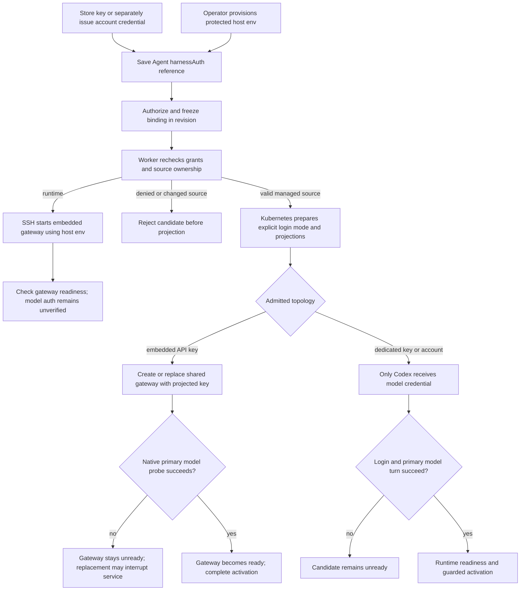

# Harness Authentication Binding Flow

## Overview

An operator stores an OpenAI or Anthropic API key, or a service account token, as an OCC Secret or separately issues a
ChatGPT account credential, then selects that source through Agent `harnessAuth`.
Deployment freezes the authorized binding; the worker rechecks it and Kubernetes
renders the credential only into the model-executing workload. This flow ends
at runtime authentication and the existing guarded activation handoff. Issuance
and source storage retain their existing owners. With `{ "method": "runtime" }`,
the operator supplies credentials directly on an SSH host instead; OCC freezes
only the method and performs gateway readiness without model authentication.

## Entry Points

- Trigger: Agent create/PATCH with `harnessAuth`, followed by the bodyless
  exact-Agent deployment action.
- Sources: `packages/occ/src/index.ts:OpenClawController.createAgent`,
  `OpenClawController.updateAgent`, and `OpenClawController.deployAgent`.
- Assumptions: ready Namespace at deployment, same-Namespace source, existing
  Secret value or issued account credential, exact actor permissions, a compatible
  configured Harness/model, and selected Compute support. Secret-backed credentials also require
  the Agent service principal's exact Secret `operate` at admission and dispatch.

## Flow

## Execution Trace

### 1. Save one source without issuing credentials

Before saving, Console can call the selected Compute Driver's
`apps/controller/src/drivers/compute/model-discovery.ts:discoverHarnessModels`
to discover models without storing the credential. OpenAI API-key discovery
omits models whose valid `shutdown_date` is today or earlier in UTC, using the
provider's [model-list contract](https://developers.openai.com/api/reference/resources/models/methods/list).
Missing, null, malformed, or future dates remain in the list; model age and IDs
do not imply expiry. This filter does not apply to Anthropic or the service account token
catalog. Discovery does not prove that a model call will succeed.

`packages/occ/src/index.ts:OpenClawController.createAgent`, `updateAgent`,
`authorizeHarnessAuthSource`

Creation omission stores `null`; PATCH omission preserves the binding and explicit
`null` clears it. API-key and `codex_pat` sources use stable OCC Secret references; the method remains distinct even for the same Secret. The actor
needs exact Secret `operate`; a ChatGPT binding needs exact account `read`.
Namespace locks serialize source reference changes against deletion. Missing or
foreign sources fail closed. Binding never selects a different model, Provider,
Harness, or execution mode and cannot issue an account credential.

The [Secret storage flow](secret-storage-and-delivery.md) owns value storage;
[account issuance](service-account-driver-credential-delivery.md) owns upstream
credentials and their private Provider binding. Initial runtime provisioning
creates only transport/channel groups and cannot supply model authentication.

### 2. Freeze the admitted source and compatibility

`packages/occ/src/index.ts:OpenClawController.deployAgent`, `admitHarnessAuth`

Deployment requires a nonnull binding, exact Agent `deploy`, and Configuration
`read`. For a key or service account token, OCC checks the actor and Agent principal's Secret `operate`,
resolves the backend through the selected Secret Driver, and freezes the stable
reference and Driver identity. For a ChatGPT account, it verifies the issued
access-token reference and private Provider, member Driver, and workspace
ownership. `runtime` needs no source grant, lookup, or delivery metadata. The
selected Compute validates the combination: SSH accepts only embedded OpenClaw
with `runtime`; Kubernetes continues to require managed authentication.

A runtime revision records only `{ "method": "runtime" }`. Host credential
changes can affect that revision after restart without redeployment; see the
[SSH lifecycle](pr-24-ssh-compute.md).

The revision contains references and safe internal metadata, never credential
bytes. Public revision serialization exposes the binding while omitting backend
locators and private account ownership. A later account credential cannot replace
the admitted reference; changing the draft affects the next explicit deployment.

### 3. Reauthorize the immutable revision before effects

`apps/controller/src/worker.ts:ControllerWorker.resolveRevisionProvider`,
`resolveRevisionSecretContext`

The worker authorizes the original deploying actor and required Agent Secret
grants against the admitted revision. It verifies current source ownership and
matches managed-account credential and Provider metadata against the frozen
snapshot. Revocation or a changed source rejects work before provisioning.
For `runtime`, worker Agent/Configuration authorization still runs but credential
source authorization and lookup do not. The dispatch context carries only the
method; SSH does not read the operator credential file or issue a model probe.

For an API key or directly supplied service account token, the worker resolves
backend ownership from OCC state and passes an ephemeral `ComputeRevisionContext`.
It does not read credential bytes or rewrite the revision. Compute subsequently
reads the canonical CP source, verifies the admitted Secret UID or managed-account
ownership, and delivers only selected fields into the DP revision Secret. Missing
or replaced sources fail preparation. ChatGPT retains the exact account
token/workspace source.
Inactive revision history keeps references without indefinitely retaining their
sources; drafts, active revisions, and pending deployments block source deletion.

### 4. Prepare and place the one credential projection

`apps/controller/src/drivers/compute/kubernetes/index.ts:prepareHarnessAuth`,
`KubernetesComputeDriver.prepareRevision`

One internal workload-rendering step converts validated references to supported
Secret projections and a closed login mode. Embedded OpenClaw receives the key
in its combined workload as `OPENAI_API_KEY` or `ANTHROPIC_API_KEY`, derived
from the immutable native model Configuration. Admission requires all selected
models and fallbacks to use the same supported provider. Dedicated Codex receives
the key or account token/workspace through a revision-owned DP projection. A
directly supplied service account token delivers only `CODEX_ACCESS_TOKEN` as the
model credential; its separate Gateway receives no model credential. Canonical
sources remain in CP.
Configuration secret bindings remain gateway-only and cannot choose model auth.

The selected Sandbox consumes these already-rendered
`HarnessWorkloadRequirements`, including the explicit login mode and projections.
It does not select or look up another credential. An upstream runtime unable to
honor genuine Secret projection fails explicitly. Network policies retain the
provider-login egress required by the admitted auth method. Gateway transport
and Kubernetes workload identity remain separate credentials.

### 5. Authenticate during runtime startup

`apps/controller/src/drivers/compute/kubernetes/runtime-entrypoints.ts:AGENT_RUNTIME_ENTRYPOINT`,
`GATEWAY_RUNTIME_ENTRYPOINT`

Codex consumes explicit `CODEX_LOGIN_MODE`: API-key login receives the key through
stdin; managed account login forces the admitted workspace. Direct service account token login uses `--with-access-token` without a caller-supplied workspace; native whoami validates and hydrates identity. Credential environment variables are deleted before the probe and app-server start. Missing or conflicting
inputs and failed login prevent app-server startup. A bounded native turn against
the primary model must then complete successfully. The probe ignores user rules
and configuration, disables execution and external tools, and applies read-only
filesystem policy without approval grants. Tool events fail the probe. Login
state remains in the bounded ephemeral home.

Embedded OpenClaw consumes the selected provider's native API key and runs one bounded native
primary-model probe in the actual gateway startup, with tools and fallback
disabled. Its 16-token output limit meets the provider's minimum request size.
Initial and replacement deployments use this same startup path. For replacement,
activation first updates the shared gateway's `Recreate` Deployment, which can
stop the serving gateway before the new process validates credentials. Invalid
credentials or provider failure hold the replacement unready, leaving the Agent
unavailable until repair and restart or a new deployment. No automatic rollback
restores the predecessor.

Both runtimes capture native output and hold failed probes unready with a fixed
message. Readiness polling does not repeat provider calls; restart or deployment
starts another attempt. These requests may incur usage charges and check only the
primary model. See [probe limitations](../reference/harness-execution.md#harness-authentication).

The [existing activation and recovery flow](harness-execution-topology.md#3-publish-safely-and-complete-activation-once)
completes activation after readiness. Auth selection and successful storage do
not establish provider acceptance.
Updating a Secret leaves existing process environments and DP runtime copies
unchanged until preparation: deploy each
consumer, verify a real turn, then revoke the previous key upstream. Revision
history cannot restore historical Secret values.

## Debugging and Verification

- `node --test tests/integration/harness-topology-k3d-real.test.mjs` with
  `OCC_TEST_HARNESS_K3D_REAL=1` exercises the regular API binding/deploy path with
  disposable Kubernetes/PostgreSQL, genuine images, and an authorized API key.
  Dedicated Codex and embedded OpenClaw each require a provider-backed turn.
- [Managed-account testing](../testing/service-accounts.md) separately requires
  provider authorization, an issued ChatGPT credential, and a real Codex turn.
  API fixtures prove admission or persistence, not provider login.
- Verify Secret projections only on intended consumers, source-deletion guards,
  immutable revision metadata, dispatch denial after revoked grants, and failed
  auth preventing readiness. Use synthetic sentinels for serialized resources,
  logs, and audit disclosure checks; never print live credentials.
- [OpenShell testing](../testing/openshell.md) distinguishes explicit unsupported
  projection failure from genuine Secret delivery and model execution. A test-only
  bridge cannot establish production Sandbox support.

## Related docs

- [Agent harness authentication](../reference/agents.md#harness-authentication)
- [Credential renewal and revocation](../guides/deploy/credential-lifecycle.md)
- [Service Account Driver credential delivery flow](service-account-driver-credential-delivery.md)
- [Secret storage and gateway delivery flow](secret-storage-and-delivery.md)
- [Harness execution topology flow](harness-execution-topology.md)

## Manual Notes

[keep this for the user to add notes. do not change between edits]

## Changelog

- 2026-09-23 12:22: Move canonical credential sources to CP and describe revision-scoped Harness delivery in the accompanying change. (codex/01a0cf72-6985-7712-ba92-d8cc32470f24 - 623d56dec26a8ef0f72b562254687cabecdbbf82)

- 2026-09-23 20:27: Filter OpenAI API-key discovery by provider-reported shutdown dates in UTC. (01a0cf27-71c6-7042-8357-74d1811a2ef8 - 9e0095c7)

- 2026-09-23 09:00: Extend exact Secret admission, retention and dedicated native login to directly supplied Codex PATs. (01a0cce9-23e3-7072-aa3f-a2e26d2dbf11 - c5524b59)

- 2026-09-23 06:27: Derive API-key credential delivery and startup probing from the selected model provider. (01a0cce9-23e3-7072-aa3f-a2e26d2dbf11 - a8272f4e2760e5ff06dc09c5658f48bea382c790)

- 2026-09-17 19:14: Add runtime binding admission and worker behavior without managed source delivery. (01a0acbf-4d5a-7413-9411-dce911f3ad23 - b8cabaf9a49e069a7668ccf88b9e71a7484227b7)

- 2026-09-17 02:58: Remove embedded preflight and document one actual-gateway startup check with accepted replacement downtime. (01a0acbf-4d5a-7413-9411-dce911f3ad23 - cfb384f22ebcbadcfb421b3020b4bb72fd657160)

- 2026-09-17 01:10: Trace bounded native model probes and predecessor-preserving embedded authentication checks. (01a0acbf-4d5a-7413-9411-dce911f3ad23 - 177a24e4)

- 2026-09-17 00:48: Correct current harness admission and metadata-only dispatch boundaries after implementation review. (01a0acbf-4d5a-7413-9411-dce911f3ad23 - 107900e9551b90c3e9ac24d30f8ea866f17e5dbb)

- 2026-09-17 00:30: Unify Secret-backed keys and issued account credentials through immutable Agent harness authentication and workload rendering. (01a0acc2-a404-77e3-b1a0-9fa4ffbbdb04 - d2bcbd1c53acb2582a774b5158f254d726abd33f)

- 2026-09-01 19:09: Clarified native API-key source Secret references and linked the separate OCC Secret delivery path. (01a05f95-dd80-7011-990f-d1c46b5bb3cc - aa366c49c44834d59f74994c5fd37fb8096f169f)
- 2026-09-01 08:47: Preserve providerless API-key execution and document Provider metadata checks before workload effects. (01a05d97-f2b0-71d0-bfc3-01ee7d6d58f9 - b079c4b755ef336a9c65bb4eb737e3aedbfdaa7d)

- 2026-08-28 17:58: Updated moved feature-reference links for the documentation organization. (01a036f4-cf1d-7cc1-bbc1-000879038ac8 - 4270aa29b7015562049f46c6027962fd85b584a9)
- 2026-08-24 20:03: Documented native account authorization, immutable deployment snapshot, independent exact-Secret materialization, harness-specific credential projection, and genuine dual-runtime verification. (01a03542-30ff-77a1-9967-587d55548ace - 6ff8b1b)
- 2026-08-24 21:11: Condensed account delivery, exact authorization, stale-secret handling, worker revocation, and dual-runtime proof. (01a0355c-d4b3-7342-bdc2-3c96af543416 - 1aa89e8)
