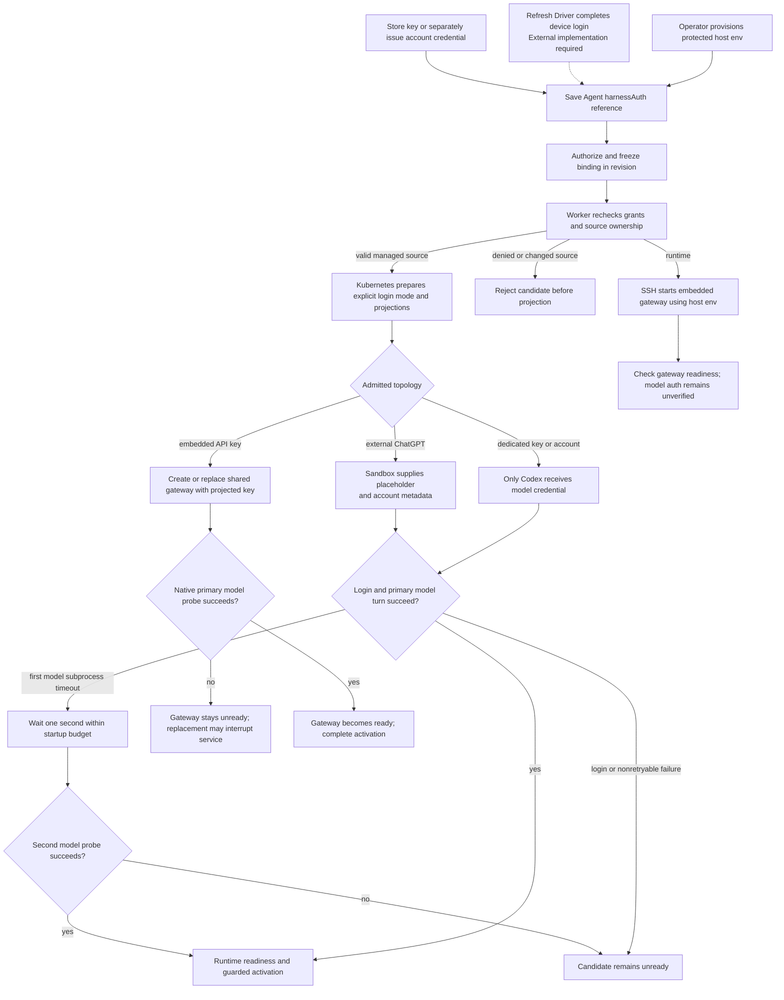

# Harness Authentication Binding Flow

## Overview

An operator stores an OpenAI or Anthropic API key, or a service account token, as an OCC Secret or separately issues a
ChatGPT account credential, then selects that source through Agent `harnessAuth`.
Deployment freezes the authorized binding; the worker rechecks it and Kubernetes
renders the credential only into the model-executing workload, which
authenticates before guarded activation. With `{ "method": "runtime" }`,
the operator supplies credentials on an SSH host instead; OCC freezes only the
method and checks gateway readiness without model authentication.

Codex OAuth device login through an external credential source is **Experimental**;
see the [launch limits](../reference/drivers/kubernetes-compute/codex-oauth-storage.md#oauth-launch-limits).

## Entry Points

- Trigger: Agent create/PATCH with `harnessAuth`, followed by the bodyless
  exact-Agent deployment action.
- Sources: `packages/occ/src/index.ts:OpenClawController.createAgent`,
  `OpenClawController.updateAgent`, and `OpenClawController.deployAgent`.
- Assumptions: ready Namespace at deployment, same-Namespace source, existing
  Secret value or issued account credential, exact actor permissions, a compatible
  configured Harness/model, and selected Compute support.

## Flow

## Execution Trace

### 1. Acquire or select one credential source

`packages/occ/src/index.ts:OpenClawController.startAgentDeviceAuthorization`,
`pollAgentDeviceAuthorization`, `cancelAgentDeviceAuthorization`

Device login creates a credential source and asks its Credential Gateway to start
and poll authorization. The Secret-backed session records actor, exact Namespace
and optional Agent scope, source identity, and an opaque Gateway handle. Tokens
remain with the external service. Ready responses return a credential-source
reference; Console saves a `credential_source` binding and grants the Agent
principal exact source `operate`.

Secret compare-and-swap permits one in-flight poll and fences cancellation. An
uncertain exchange requires reconnect. Closing or expiring a session removes its
handle without revoking the source. Plugin discovery uses the Gateway's warm
`withSourceToken` callback with current source authorization. It continues through
the saved source after the login session closes.

Before saving, Console can call the selected Compute Driver's
`apps/controller/src/drivers/compute/model-discovery.ts:discoverHarnessModels`
without storing the credential. OpenAI API-key discovery
omits models whose valid `shutdown_date` is today or earlier in UTC, per the
provider's [model-list contract](https://developers.openai.com/api/reference/resources/models/methods/list);
missing, null, malformed, or future dates remain, and model age and IDs do not
imply expiry. Anthropic and service account token catalogs are unfiltered. Discovery
does not prove a model call will succeed.

`packages/occ/src/index.ts:OpenClawController.createAgent`, `updateAgent`,
`authorizeHarnessAuthSource`

Create and PATCH follow the [`harnessAuth` field semantics](../reference/agents.md#harness-authentication).
API keys and imported `codex_pat` tokens use stable OCC Secret references and
require exact Secret `operate`. Managed PATs use ServiceAccount references and
require exact account `read`. OAuth uses a CredentialSource reference owned by
the selected Credential Gateway and requires exact source `operate`.
Namespace locks serialize source reference changes against deletion. Missing or
foreign sources fail closed. Binding never selects a different model, Backend,
Harness, or execution mode and cannot issue an account credential.

The [Secret storage flow](secret-storage-and-delivery.md) owns value storage;
[account issuance](service-account-driver-credential-delivery.md) owns upstream
credentials and their private Backend binding.

### 2. Freeze the admitted source and compatibility

`packages/occ/src/index.ts:OpenClawController.deployAgent`, `admitHarnessAuth`

Deployment requires a nonnull binding, exact Agent `deploy`, and Configuration
`read`. For a key or service account token, OCC checks the actor's and Agent principal's exact Secret `operate`,
resolves the backend through the selected Secret Driver, and freezes the stable
reference and Driver identity. For a ChatGPT account, it verifies the issued
access-token reference and private Backend, member Driver, and workspace
ownership. `runtime` needs no source grant, lookup, or delivery metadata. The
selected Compute validates the combination: SSH accepts only embedded OpenClaw
with `runtime`. Kubernetes `validateHarnessAuth` requires dedicated Codex for
both imported and managed `codex_pat` sources. External ChatGPT sources require
dedicated Codex and the paired Sandbox and Credential Gateway. Deployment and
guided provisioning reject unsupported combinations before admitting work or
stopping predecessors.

Host credential changes can affect a runtime revision after restart without
redeployment; see the
[SSH lifecycle](pr-24-ssh-compute.md).

The revision contains references and safe internal metadata, never credential
bytes. Public serialization exposes the binding but omits backend locators and
private account ownership. A later account credential cannot replace
the admitted reference; draft changes affect only the next explicit deployment.

### 3. Reauthorize the immutable revision before effects

`apps/controller/src/worker.ts:ControllerWorker.resolveRevisionBackend`,
`resolveRevisionSecretContext`

The worker authorizes the original deploying actor and required Agent Secret
grants against the admitted revision, verifies current source ownership, and
matches managed-account credential and Backend metadata against the frozen
snapshot. Revocation or a changed source rejects work before provisioning.
For `runtime`, only Agent/Configuration authorization runs; the dispatch context
carries only the method, and SSH neither reads the operator credential file nor
issues a model probe.

For an API key or directly supplied service account token, the worker resolves
backend ownership from OCC state and passes an ephemeral `ComputeRevisionContext`
without reading credential bytes or rewriting the revision. Compute then reads
the canonical CP source, verifies the admitted Secret UID or managed-account
ownership, and delivers only selected fields into the DP revision Secret.
Missing or replaced sources fail preparation. Managed ChatGPT accounts retain the exact
token source; their private Backend binding owns workspace metadata.
Inactive revision history keeps references without retaining their sources
indefinitely; drafts, active revisions, and pending deployments block source deletion.

### 4. Prepare and place the one credential projection

`apps/controller/src/drivers/compute/kubernetes/index.ts:prepareHarnessAuth`,
`KubernetesComputeDriver.prepareRevision`

One workload-rendering step converts validated references to supported
Secret projections and a closed login mode. Embedded OpenClaw receives the key
in its combined workload as `OPENAI_API_KEY` or `ANTHROPIC_API_KEY`, derived
from the immutable native model Configuration; admission requires all selected
models and fallbacks to use the same supported provider. Dedicated Codex receives
the key or account token through a revision-owned DP projection. Both managed
and directly supplied service account tokens deliver only `CODEX_ACCESS_TOKEN`
as the model credential; the separate Gateway receives none.
Neither gateway-only Configuration secret bindings nor initial runtime
provisioning, which creates only transport/channel groups, can supply model auth.

The selected Sandbox consumes these already-rendered
`HarnessWorkloadRequirements` and selects or looks up no other credential. An
upstream runtime unable to honor genuine Secret projection fails explicitly. Network policies keep the
provider-login egress the admitted auth method requires. Gateway transport
and Kubernetes workload identity credentials stay separate.

### 5. Authenticate during runtime startup

`apps/controller/src/drivers/compute/kubernetes/runtime-entrypoints.ts:AGENT_RUNTIME_ENTRYPOINT`,
`GATEWAY_RUNTIME_ENTRYPOINT`

Codex consumes explicit `CODEX_LOGIN_MODE`: API-key login receives the key through
stdin; managed and directly supplied service account tokens both use `codex_pat`
and `--with-access-token`. Native whoami validates and hydrates identity from the
token, without a runtime workspace override. Credential environment variables
are deleted before the probe and app-server start. Missing or conflicting
inputs, failed login, or a failed bounded native turn against the primary model
(under the restricted [probe policy](../reference/harness-execution.md#harness-authentication))
prevent app-server startup and readiness. API-key and service-account login
state remains in the bounded ephemeral home. External-token startup writes
placeholder-only auth state instead of running native login (step 6).

The dedicated wrapper retains `APP_SERVER_TOKEN` for local plugin
authentication (with plugin status enabled, deriving it from the Agent revision
and startup identity) but omits it from the `codex login` and `codex app-server`
environments; the listener receives the current token's SHA-256
digest. The token remains in the Pod; filtering child environments does not
isolate same-UID processes.

`startAuthenticatedCodex` gives `probeCodexAuthentication` at most two
attempts within one monotonic 61-second budget. Only a subprocess `ETIMEDOUT`
schedules the second, after a one-second timer, timed out at the smaller of
30 seconds and the remaining budget; an unexplained `SIGKILL` is nonretryable.
With no termination handler during the delay, stopping the launcher prevents
the second call.

Embedded OpenClaw consumes the selected provider's native API key and runs one bounded native
primary-model probe during actual gateway startup, with tools and fallback
disabled; its 256-token output cap lets reasoning models answer within the
15-second timeout. Initial and replacement deployments use the same path; their `Recreate`
activation can stop the serving gateway before the new
process validates credentials, so a failure leaves the Agent unavailable until
repair and restart or a new deployment, with no automatic rollback.

Both runtimes capture native output and hold final failures unready with a fixed
message. Codex publishes the existing runtime failure only after retry exhaustion or a
nonretryable result. Readiness polling does not repeat
provider calls; restart or deployment starts a new bounded check. Probes may
incur usage charges and check only the primary model; see
[probe limitations](../reference/harness-execution.md#harness-authentication).

After readiness, the [activation and recovery flow](harness-execution-topology.md#3-publish-safely-and-complete-activation-once)
completes activation.
Updating a Secret leaves existing process environments and DP runtime copies
unchanged until preparation: deploy each consumer, verify a real turn, then
revoke the previous key upstream. Revision history cannot restore historical
Secret values.

### 6. Deliver externally managed OAuth authentication

`apps/controller/src/drivers/compute/kubernetes/index.ts:credentialSourceEnvironment`,
`apps/controller/src/drivers/compute/kubernetes/runtime-entrypoints.ts:AGENT_RUNTIME_ENTRYPOINT`

Compute checks that the returned attachments match the authorized sources exactly,
with no missing, duplicate, or unexpected source IDs, before provisioning the
Sandbox. It selects the attachment named by `harnessAuth.sourceId` for the Codex
placeholder and trusted account metadata, and passes every attachment to the
Sandbox. Attachment order does not select Harness authentication.

Compute sends the placeholder and account metadata only to the Harness. Its
launcher writes ephemeral `chatgptAuthTokens` auth state without a refresh token and runs the normal native
probe before app-server startup. The external service retains refresh ownership;
the paired Sandbox injects a warm access token into authorized outgoing requests.
There is no native-refresh or persistent-bundle fallback. Restarts reconstruct the
same receiving state from a current attachment; sessions and workspace keep their
independent persistence.

The [credential source lifecycle](credential-source-lifecycle.md) owns source
registration, authorization, withdrawal and deletion. This integration requires
an external OAuth Driver and service; the bundled catalog offers API keys only.

## Debugging and Verification

- `node --test tests/conformance/plugin-compute.test.mjs` checks the filtered
  Codex child environments, startup-derived listener hash, and retained wrapper
  token. The runtime-image startup test checks the native Codex shell without a
  provider turn.
- [Container launcher tests](../testing/docker.md#verify-codex-startup-probe-recovery)
  run the generated launcher against a fixture CLI, proving recovery control
  flow, not provider acceptance. Inspect allowlisted `codex.model_probe` logs
  (no raw output) for attempt and final-code evidence.

- `node --test tests/integration/harness-topology-k3d-real.test.mjs` with
  `OCC_TEST_HARNESS_K3D_REAL=1` exercises the API binding/deploy path with
  disposable Kubernetes/PostgreSQL, genuine images, and an authorized API key,
  requiring a provider-backed turn from both dedicated Codex and embedded OpenClaw.
- [Managed-account testing](../testing/service-accounts.md) separately requires
  provider authorization, an issued ChatGPT credential, and a real Codex turn;
  API fixtures prove only admission or persistence.
- Verify Secret projections only on intended consumers, source-deletion guards,
  immutable revision metadata, dispatch denial after revoked grants, and failed
  auth preventing readiness. Use synthetic sentinels for serialized resources,
  logs, and audit disclosure checks; never print live credentials.
- [OpenShell testing](../testing/openshell.md) distinguishes explicit unsupported
  projection failure from genuine Secret delivery and model execution. A test-only
  bridge cannot establish production Sandbox support.

## Related docs

- [Agent harness authentication](../reference/agents.md#harness-authentication)
- [Credential renewal and revocation](../guides/deploy/credential-lifecycle.md)
- [Service Account Driver credential delivery flow](service-account-driver-credential-delivery.md)
- [Secret storage and gateway delivery flow](secret-storage-and-delivery.md)
- [Harness execution topology flow](harness-execution-topology.md)

## Manual Notes

[keep this for the user to add notes. do not change between edits]

## Changelog

- 2026-10-09 17:37: Trace Refresh-owned device authorization in the accompanying merge. (01a11d95-ebef-76e1-b9b9-9d3d2e88e99e - 1c2fbd2bc2953430e3ddaf68882176c6943ea7b2)

- 2026-10-07 16:05: Select Harness authentication by source ID and validate the complete credential attachment set. (01a0e5ec-d802-7800-9eb6-8022c1ac0d06 - 046c3d75e)

- 2026-10-07 13:44: Reject imported and managed PAT bindings outside dedicated Codex during admission. (01a0e5ec-d802-7800-9eb6-8022c1ac0d06 - 09be9c241)
- 2026-10-07 12:07: Unify imported and managed PAT authentication while preserving source ownership and existing OAuth behavior. (01a0e5ec-d802-7800-9eb6-8022c1ac0d06 - be5006e62)

- 2026-10-07 17:36: Replace runtime-owned OAuth custody with source-owned device login and warm discovery; unify PAT sources. (01a0e5ec-d802-7800-9eb6-8022c1ac0d06 - da984340ae4aafb03bb0c66bfd94ba40252625a5)

- 2026-10-07 16:53: Normalize managed and supplied service-account credentials to token-only Codex login while preserving control-plane workspace ownership. (01a0e5ec-d802-7800-9eb6-8022c1ac0d06 - daeb19dfb3aef5f083a73f25674bced40986f8d1)
- 2026-10-03 15:38: Merge current credential flow while preserving shared-namespace source placement. (01a0fe72-58b2-7cc3-b770-7310f5401deb - 94364ae9)

- 2026-10-02: Clarify shared namespace source custody. (01a0fe72-58b2-7cc3-b770-7310f5401deb)

- 2026-09-30 17:30: Preserve persistent OAuth startup alongside filtered Codex child environments in the merge integration. (codex/01a0e5ec-d802-7800-9eb6-8022c1ac0d06 - c724fb7fee3790d9c122eb7dc2563869bad4a56e)

- 2026-09-30 23:49: Document the dedicated Codex transport-token child boundary in the accompanying change. (authoring-run/134e3f48-c97b-43d0-93ea-84497c29c940 - 704da0b47ea1973e4a9e7d18ef13d44414691eda)

- 2026-09-30 17:23: Remove the Installation opt-in for Codex device login while retaining Experimental status and topology checks in the accompanying change. (codex/01a0e5ec-d802-7800-9eb6-8022c1ac0d06 - 9ae40ce59eadfd03d52c78086de92f0034dd9974)

- 2026-09-30 04:00: Record OAuth opt-in, admission topology check, clean reseed, and codex-home removal on method change. (aligner-524 - 591f553f6)

- 2026-09-29 03:12: Preserve persistent OAuth startup alongside bounded model-probe timeout recovery in the merge integration. (codex/01a0e5ec-d802-7800-9eb6-8022c1ac0d06 - 64610f19dfec8996acab483c7bb4916be36a31a1)

- 2026-09-29 03:01: Keep OAuth source custody on control and bootstrap storage on execution when integrating explicit Kubernetes namespace addresses. (codex/01a0e5ec-d802-7800-9eb6-8022c1ac0d06 - 7f02154e282919a033f7600daaf9f86972d21ac2)

- 2026-09-28 18:45: Document bounded Codex model-probe recovery and sanitized attempt evidence in the accompanying change. (authoring-run/3b7cc615-9e7b-416a-aec7-fe13c38cace1 - a14435c81e0d4020dd24568babddf95aba533da7)

- 2026-09-28 04:28: Add device acquisition, catalog use, and one-time persistent OAuth handoff in the accompanying change. (codex/01a0e5ec-d802-7800-9eb6-8022c1ac0d06 - ae31581574744bea2745066f189eea6e826fe823)

- 2026-09-23 12:22: Move canonical credential sources to CP and describe revision-scoped Harness delivery in the accompanying change. (codex/01a0cf72-6985-7712-ba92-d8cc32470f24 - 623d56dec26a8ef0f72b562254687cabecdbbf82)

- 2026-09-23 20:27: Filter OpenAI API-key discovery by provider-reported shutdown dates in UTC. (01a0cf27-71c6-7042-8357-74d1811a2ef8 - 9e0095c7)

- 2026-09-23 09:00: Extend exact Secret admission, retention and dedicated native login to directly supplied Codex PATs. (01a0cce9-23e3-7072-aa3f-a2e26d2dbf11 - c5524b59)

- 2026-09-23 06:27: Derive API-key credential delivery and startup probing from the selected model provider. (01a0cce9-23e3-7072-aa3f-a2e26d2dbf11 - a8272f4e2760e5ff06dc09c5658f48bea382c790)

- 2026-09-17 19:14: Add runtime binding admission and worker behavior without managed source delivery. (01a0acbf-4d5a-7413-9411-dce911f3ad23 - b8cabaf9a49e069a7668ccf88b9e71a7484227b7)

- 2026-09-17 02:58: Remove embedded preflight and document one actual-gateway startup check with accepted replacement downtime. (01a0acbf-4d5a-7413-9411-dce911f3ad23 - cfb384f22ebcbadcfb421b3020b4bb72fd657160)

- 2026-09-17 01:10: Trace bounded native model probes and predecessor-preserving embedded authentication checks. (01a0acbf-4d5a-7413-9411-dce911f3ad23 - 177a24e4)

- 2026-09-17 00:48: Correct current harness admission and metadata-only dispatch boundaries after implementation review. (01a0acbf-4d5a-7413-9411-dce911f3ad23 - 107900e9551b90c3e9ac24d30f8ea866f17e5dbb)

- 2026-09-17 00:30: Unify Secret-backed keys and issued account credentials through immutable Agent harness authentication and workload rendering. (01a0acc2-a404-77e3-b1a0-9fa4ffbbdb04 - d2bcbd1c53acb2582a774b5158f254d726abd33f)

- 2026-09-01 19:09: Clarified native API-key source Secret references and linked the separate OCC Secret delivery path. (01a05f95-dd80-7011-990f-d1c46b5bb3cc - aa366c49c44834d59f74994c5fd37fb8096f169f)
- 2026-09-01 08:47: Preserve providerless API-key execution and document Provider metadata checks before workload effects. (01a05d97-f2b0-71d0-bfc3-01ee7d6d58f9 - b079c4b755ef336a9c65bb4eb737e3aedbfdaa7d)

- 2026-08-28 17:58: Updated moved feature-reference links for the documentation organization. (01a036f4-cf1d-7cc1-bbc1-000879038ac8 - 4270aa29b7015562049f46c6027962fd85b584a9)
- 2026-08-24 20:03: Documented native account authorization, immutable deployment snapshot, independent exact-Secret materialization, harness-specific credential projection, and genuine dual-runtime verification. (01a03542-30ff-77a1-9967-587d55548ace - 6ff8b1b)
- 2026-08-24 21:11: Condensed account delivery, exact authorization, stale-secret handling, worker revocation, and dual-runtime proof. (01a0355c-d4b3-7342-bdc2-3c96af543416 - 1aa89e8)
