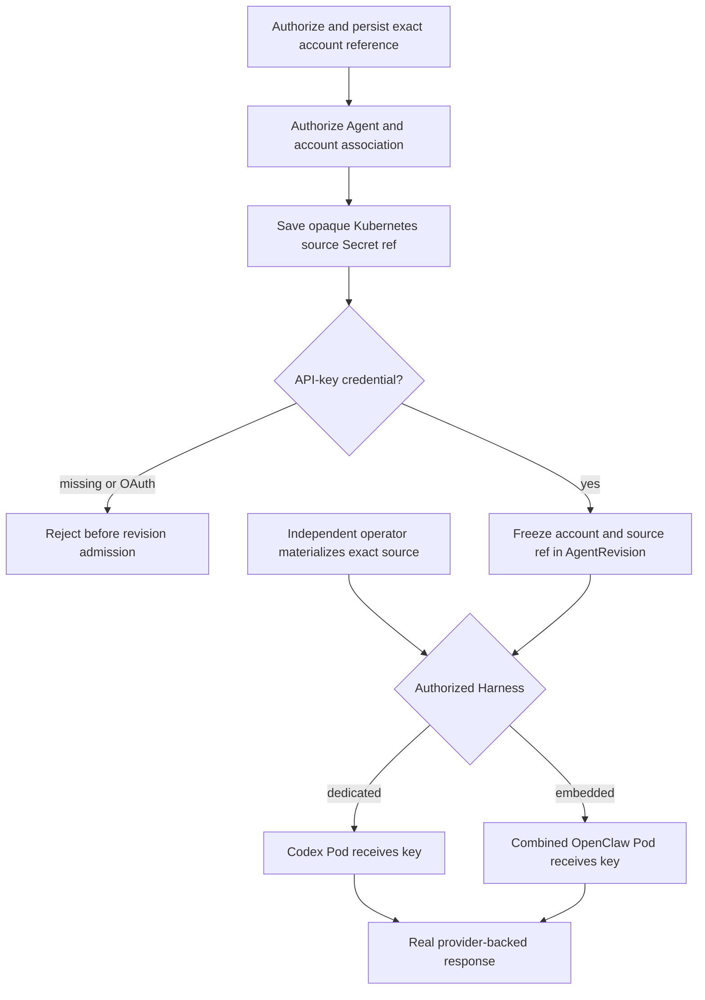

# Native Service Account Credential Delivery Flow

## Overview

For the existing native API-key path, OCC binds an Agent to an exact account and
opaque Kubernetes source Secret reference `{ name, key }` inside the account's
backing Namespace; an independent operator supplies that credential to the
selected Harness. OCC Secrets use a separate stable
`{ kind: "secret", namespaceId, id }` reference and follow the
[Secret storage and gateway delivery flow](secret-storage-and-delivery.md).
Provider-managed access tokens follow the separate
[Service Account Driver credential delivery flow](service-account-driver-credential-delivery.md).

## Entry Points

- Trigger: create account, associate credential and Agent, then deploy.
- Source: `apps/controller/src/index.ts:perform` and
  `packages/occ/src/index.ts:OpenClawController`.
- Assumptions: authenticated actor, exact IAM grants, ready Namespace, existing
  Kubernetes source Secret in the account's backing Namespace, independently
  authorized credential operator.

## Flow

## Execution Trace

### 1. Authorize account and associate Agent

`packages/occ/src/index.ts:OpenClawController.createAgent`

OCC persists only same-Namespace account identity and credential reference.
Agent association requires exact account `read`; updating or detaching also
requires current-account `read`, and replacement requires old/new `read`.
The native `secretRef` is the opaque Kubernetes source selector `{ name, key }`
within the account's backing Namespace. It is not an OCC Secret reference, whose
public shape is `{ kind: "secret", namespaceId, id }`.

### 2. Freeze deployment and reject unsupported credentials

`packages/occ/src/index.ts:OpenClawController.deployAgent`

For this native flow, missing or OAuth credentials fail before admission.
`providerId: null` remains valid with an independently supplied API-key credential;
no Provider is inferred from model configuration or the account.
An API-key deployment freezes exact account identity, kind, and source reference;
later account mutations cannot change the admitted immutable revision.
The [account deletion guard](../reference/service-accounts.md#account-and-credential-lifecycle)
keeps the referenced account available while the revision is active or pending,
even if its Agent draft detaches the account.

### 3. Materialize the exact source through its independent owner

`tests/helpers/harness-topology-k3d-real.mjs:arrangeProductionTopology`

An independent operator verifies ownership, reads only the exact persisted
source key, replaces the exact-Agent `OPENAI_API_KEY` Secret, and checks safe
source/destination fingerprints. Account/reference changes require replacing
or clearing stale destinations; this native API-key path does not give Compute
direct access to its operator-owned source or Agent Secret. Production
materializer ownership for this Kubernetes source-ref path remains unresolved.
OCC Secret storage and delivery uses the separate stable Secret resource flow,
not this native source reference. Provider-managed access-token
issuance separately grants API-side Compute scoped access to create one
account-owned Secret; it does not change the native operator-owned path.

### 4. Reauthorize the snapshot and execute the selected Harness

`apps/controller/src/worker.ts:ControllerWorker`;
`apps/controller/src/drivers/compute/kubernetes/index.ts:KubernetesComputeDriver.prepareRevision`

The worker reauthorizes exact Agent deployment and snapshotted account `read`;
revocation permanently rejects the work before Compute. Dedicated Codex receives
the key only in its separate Agent Pod; embedded OpenClaw receives it only in
its combined gateway/Harness Pod. Each flow ends at a genuine provider response.

## Debugging and Verification

- Run `node --test tests/integration/harness-topology-k3d-real.test.mjs` with
  `OCC_TEST_HARNESS_K3D_REAL=1`, isolated Kubernetes/PostgreSQL, genuine images,
  and an existing authorized API key.
- Require separate dedicated Codex and embedded OpenClaw provider nonces,
  account-derived source/destination fingerprints, and correct Pod placement.
- Missing permission, cross-Namespace references, unsupported OAuth, or a
  missing Agent destination must fail closed without exposing credentials.

## Related docs

- [Native service accounts](../reference/service-accounts.md)
- [Service Account Driver credential delivery flow](service-account-driver-credential-delivery.md)
- [Secret storage and gateway delivery flow](secret-storage-and-delivery.md)
- [Harness execution topology flow](harness-execution-topology.md)

## Manual Notes

[keep this for the user to add notes. do not change between edits]

## Changelog

- 2026-09-01 19:09: Clarified native API-key source Secret references and linked the separate OCC Secret delivery path. (01a05f95-dd80-7011-990f-d1c46b5bb3cc - aa366c49c44834d59f74994c5fd37fb8096f169f)
- 2026-09-01 08:47: Preserve providerless API-key execution and document Provider metadata checks before workload effects. (01a05d97-f2b0-71d0-bfc3-01ee7d6d58f9 - b079c4b755ef336a9c65bb4eb737e3aedbfdaa7d)

- 2026-08-28 17:58: Updated moved feature-reference links for the documentation organization. (01a036f4-cf1d-7cc1-bbc1-000879038ac8 - 4270aa29b7015562049f46c6027962fd85b584a9)
- 2026-08-24 20:03: Documented native account authorization, immutable deployment snapshot, independent exact-Secret materialization, harness-specific credential projection, and genuine dual-runtime verification. (01a03542-30ff-77a1-9967-587d55548ace - 6ff8b1b)
- 2026-08-24 21:11: Condensed account delivery, exact authorization, stale-secret handling, worker revocation, and dual-runtime proof. (01a0355c-d4b3-7342-bdc2-3c96af543416 - 1aa89e8)
