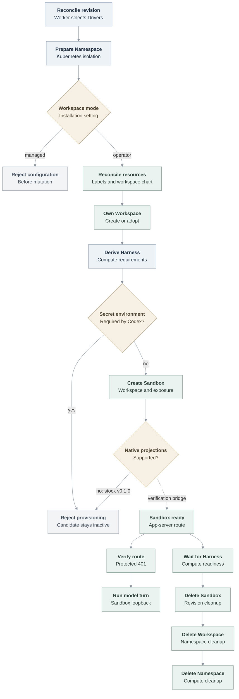

# OpenShell Sandbox provisioning flow

## Overview

The Kubernetes Compute Driver delegates a dedicated Codex Harness to the
selected OpenShell Sandbox Driver. One deployment-paired OpenShell Gateway uses
an explicitly configured workspace mode. Operator mode is implemented: for each
OCC Namespace, the Driver labels the Kubernetes namespace, reconciles rendered
workspace-chart resources, and creates or adopts an OpenShell Workspace with
the same physical name. Managed mode is recognized but fails before mutation.
Sandbox requests are homed in the operator-mode Workspace.

The regular Agent workflow with stock OpenShell currently stops before Sandbox
creation because `v0.1.0` cannot accept the required Secret-backed
environment or projected workload identity. The verification-only compatibility
path stages those inputs without changing the production fail-closed contract
and completes a real model turn inside the Sandbox.

The local Kubernetes development profile installs the pinned Gateway and
renders the workspace chart into the Installation configuration. By default,
PostgreSQL, the OCE Helm release, and the Gateway share `oce-system`. The
optional Compose control-plane mode keeps PostgreSQL, the API, and the worker in
Compose and installs the Gateway in `openshell-system`. Both modes let the
Driver reconcile workspace resources in every Compute-created namespace and
prove the real Workspace through the Gateway API. Neither uses the
verification-only compatibility projection.

## Entry Points

- Trigger: a worker reconciles an Agent revision that selects the OpenShell
  Sandbox Driver and Kubernetes Compute Driver.
- Source: `apps/controller/src/drivers/sandbox/openshell.ts:ensureNamespace`
- Source: `apps/controller/src/drivers/sandbox/openshell.ts:provisionHarness`
- Source: `internal/occdev/up.go:Up`
- Assumptions: the Installation selected both Drivers, the tenant Namespace and
  baseline isolation exist, and the deployment OpenShell Gateway is ready in
  operator workspace mode.

## Flow

## Execution Trace

### 0. Create the development control plane

`scripts/dev-up`, `internal/occdev/openshell_k3d.go:upOpenShellK3d`,
`internal/occdev/openshell.go:prepareOpenShell`,
`internal/occdev/kubernetes.go:writeInstallation`

The environment selects Kubernetes Compute and OpenShell. `scripts/dev-up`
validates that combination and delegates lifecycle ownership to `occ dev up`.
OpenShell defaults to the Kubernetes-only control plane;
`OCC_DEVELOPMENT_CONTROL_PLANE=compose` selects the hybrid profile. Both verify
the `v0.1.0` source archive before packaging
its Gateway and Workspace charts, and imports the matching digest-pinned
Gateway, Sandbox, and supervisor images. The launcher supplies v0.1.0's separate
image registry, repository, and digest values for each component and omits the
NetworkPolicy acknowledgement removed from that chart.
The CLI records the exact engine endpoint, cluster,
platform Namespace, API port, and key destination before creating resources.
The Kubernetes-only mode creates k3d without a Compose network, imports the OCE controller, Agent
runtime, PostgreSQL, and three OpenShell images, and resolves their in-cluster
digests. Unless the developer selects existing images explicitly, startup
rebuilds the controller and Agent runtime from the current checkout before
importing them.

`installKubernetesControlPlane` creates protected PostgreSQL and bootstrap PVCs,
runs migration and bootstrap through the production OCE Helm chart, and deploys
the API and worker in `oce-system`. The Installation selects in-cluster
Kubernetes authentication and the central Gateway's ClusterIP DNS name. A
labeled development proxy is the API NetworkPolicy's only local client; k3d
publishes its NodePort on host loopback. A separate development NetworkPolicy
admits the OCE worker to the Gateway. The Gateway ingress policy also admits
OpenShell supervisor Pods, but only from OCE-owned tenant namespaces. In each
tenant namespace, the callback egress policy selects only Pods carrying the
OpenShell managed-by and supervisor boundary labels. Other tenant Pods cannot
reach the Gateway even though this disposable profile enables OpenShell's
unauthenticated development mode. Because the cluster is disposable, the helper
also binds the Helm chart's tenant roles to the OCE service accounts for all
Namespaces. A development ClusterRole lets the worker manage the workspace Role
and RoleBinding, with `bind` and `escalate` limited to the pinned OpenShell
workspace Role. Production retains operator-owned tenant-local RoleBindings.
Startup copies the generated service key
through a temporary PVC reader Pod, verifies it against the live Installation,
and removes the reader.

Cleanup validates the private state and recorded engine endpoint before deleting
the named cluster. The Kubernetes-only state contains no Compose snapshot, and
the cleanup path never calls a Compose provider.

In Compose mode, `internal/occdev/up.go:Up` starts PostgreSQL, migration, and
bootstrap before creating k3d on the private Compose network. It installs the
Gateway in `openshell-system` with a fixed NodePort, writes kubeconfig-based
Driver configuration, and starts the API and Kubernetes worker in Compose. The
worker reaches the Gateway through the owned container network. Cleanup stops
the reconcilers, deletes the cluster, removes the recorded Compose project and
volumes, and retains recovery state if any step fails.

### 1. Prepare the Namespace and OpenShell Workspace

`apps/controller/src/drivers/compute/kubernetes/index.ts:ensureNamespace`

Kubernetes Compute reconciles quota, limits, and baseline NetworkPolicies before
calling `SandboxDriver.ensureNamespace`. The Driver first checks
`gateway.workspaceMode`. Managed mode returns an unsupported-mode error before
using the Kubernetes client or Gateway. Operator mode applies the configured
namespace label, workspace-chart resources, and provider NetworkPolicies, in
that order, then calls the Gateway health RPC. If configured, namespace-local
readiness observations happen before that health check; the development
operator instead supplies the central Gateway endpoint directly.

The Driver derives the Workspace name from Compute's physical Kubernetes
namespace name. It reads the Workspace, creates it when missing, or rereads it
after a concurrent `ALREADY_EXISTS`. Adoption requires the expected name, OCC
Namespace ID label, managed-by label, and active phase. Any conflict fails the
Namespace operation. Kubernetes Compute uses `oce-` plus a 15-character digest
so the same name satisfies OpenShell v0.1.0's 19-character limit.

### 2. Derive the provider-owned Harness request

`apps/controller/src/drivers/compute/kubernetes/index.ts:prepareRevision`

For a dedicated revision with `provisionHarness`, Compute derives Harness image,
command, labels, environment, workspace mounts, ServiceAccount identity, and
resources from the same Deployment shape used by the regular Kubernetes path.
It passes those requirements and the immutable revision to OpenShell instead of
creating the Deployment itself.

### 3. Validate and serialize the Sandbox

`apps/controller/src/drivers/sandbox/openshell.ts:provisionHarness`

OpenShell accepts only dedicated Codex revisions pinned to the selected Driver.
It builds filesystem, process, and network policy plus Kubernetes driver config.
Network TLS, enforcement, and access spellings must be own keys in the Driver's
allowlists before they are converted to the exact `v0.1.0` protobuf enums.
The Driver rejects inherited object names instead of allowing them to omit an
explicit enforcement value on the wire. It also rejects the old `passthrough`
TLS spelling because v0.1.0 defines that enum as an automatic inspection alias;
operators use `skip` for uninspected relay. Each network policy also requires at
least one executable path and sends those binary identities with its endpoints.

The regular Codex requirements contain Secret-backed environment entries.
`environment` rejects the first such entry before any gateway mutation, so the
candidate revision remains inactive. Requests without those entries continue to
the gateway client. The development profile and real-runtime fixture bind model
egress to the exact native Codex executable in the source-pinned runtime image's
pnpm tree. A runtime dependency-layout change must update that identity; a stale
path fails closed before Codex can complete its startup model probe.

The verification-only v0.1.0 Gateway permits caller driver configuration and
disables OpenShell resource admission so the compatibility request can attach
OCE-owned PVCs without OpenShell approval labels. The Enterprise Driver still
limits the request to the Harness mounts approved by Kubernetes Compute. The
stock fail-closed path never reaches this Gateway setting, and production does
not use this compatibility configuration.

### 4. Call the versioned gateway contract

`apps/controller/src/drivers/sandbox/openshell-gateway-client.ts:createSandbox`

The client sends the stable Sandbox name, labels, annotations, spec, and a
`workspace_scope` containing the Namespace Workspace. It also sends the
revision's UUID as `request_id` and an unnamed `service_exposures` entry for the
literal `APP_SERVER_PORT`. OpenShell registers the endpoint during Create and
returns its URL in `service_urls`; replaying the same Create request returns the
same result. The Driver requires a valid route for the unnamed exposure before
it returns the stable Sandbox reference. A Sandbox that predates the replayable
request fails explicitly rather than receiving a separate post-create mutation.
Stock `v0.1.0` still lacks the exact projected identity and volume support
required by the request, including the immutable plugin-runtime ConfigMap
mounted by Kubernetes Compute. Any request that reaches
the gateway without those shapes still fails closed. Any other gateway failure
also prevents readiness.

For private node routing, OpenShell's policy proxy opens the connection from its
supervisor Pod rather than the Harness Pod. The Helm-owned Envoy NetworkPolicy
therefore admits supervisor Pods only from tenant namespaces bearing the exact
Gateway attachment label. OpenShell still restricts the destination and calling
binary through the Sandbox network policy.

### 5. Observe readiness or clean up

`apps/controller/src/drivers/compute/kubernetes/index.ts:prepareRevision`

After a successful create, Compute verifies that the returned reference belongs
to the revision and waits for the provider-owned Harness Pod. On revision
shutdown, `shutdownRevisionRuntime` calls `cleanup` with the revision. The
Gateway client sends `DeleteSandbox` with the same `workspace_scope`; a missing
Sandbox is an idempotent success.

The current unified `cleanup` contract receives the immutable revision during
revision shutdown and no revision during Namespace deletion. Namespace deletion
runs it after revision resources are gone. OpenShell verifies exact Workspace
ownership, sends idempotent
`DeleteWorkspace`, and then removes configured workspace-chart resources and
NetworkPolicies in reverse order. A terminating Workspace remains eligible for
retry after a lost response. Only after Sandbox cleanup succeeds does
Kubernetes Compute delete the Kubernetes namespace.

## Debugging and Verification

- `OCC_DEVELOPMENT_COMPUTE_DRIVER=kubernetes OCC_DEVELOPMENT_SANDBOX_DRIVER=openshell ./scripts/dev-up`
  creates the reusable Kubernetes-only development environment: PostgreSQL, the
  Helm-installed OCE control plane, and the central Gateway share `oce-system`;
  tenant resources remain in OCC-owned Namespaces. `scripts/dev-down` removes
  only the recorded cluster and private state.
- Add `OCC_DEVELOPMENT_CONTROL_PLANE=compose` to keep PostgreSQL and OCC in
  Compose while retaining the same k3d Compute, operator Workspace, and
  fail-closed Agent boundaries.
- `node --test tests/integration/ci-openshell.test.mjs` checks bootstrap safety
  and immutable Helm image value rendering without selecting a real cluster.
- `node --test tests/integration/sandbox-driver-startup.test.mjs` checks Driver
  selection, Workspace ownership, idempotence, and fail-closed configuration.
- `OCC_TEST_DEV_UP_OPENSHELL_REAL=1 node --test tests/integration/dev-up-openshell-k3d-real.test.mjs`
  installs the deployment Gateway, renders the workspace chart, lets the Driver
  apply its resources to bootstrap and post-start Namespaces in a disposable k3d
  cluster, and reads both real OCC-owned Workspaces through the Gateway API.
- `OCC_TEST_DEV_UP_OPENSHELL_COMPOSE_REAL=1 node --test tests/integration/dev-up-openshell-k3d-real.test.mjs`
  runs the Compose control-plane profile against a disposable real k3d cluster,
  reads its operator-mode Workspace through the Gateway API, and exercises
  recorded Compose and cluster cleanup.
- `OCC_TEST_OPENSHELL_K3D_REAL=1 node --env-file="$TEST_ENV_FILE" --test tests/integration/sandbox-driver-openshell-k3d-real.test.mjs`
  exercises the selected real gateway and cluster prerequisites. Set
  `OCC_TEST_OPENSHELL_SECRET_PROJECTION=0` for stock `v0.1.0`; the expected
  result is Secret-projection rejection before activation, which does not prove
  a model turn. Mode `1` selects a verification-only compatibility path: an
  operator Job stages the exact Secret values, plugin-runtime files, and
  projected workload token in revision-specific PVC subpaths. The provider-owned
  Sandbox exposes its app-server port at create time. The test observes the
  protected app server's authentication rejection because v0.1.0 strips its bearer header,
  then runs the real model and tool checks from inside the Pod. This mode proves
  v0.1.0 containment, the Compute-created node route, Helm NetworkPolicy
  enforcement, exposed-route reachability, and lifecycle behavior. It does not
  prove native workload projection or an authenticated model turn through the
  exposed route. The tested runtime uses the OpenClaw source commit pinned by
  `deploy/runtime/Dockerfile`; that source provides the workspace-node
  `--pair-if-needed` and `--commands` options required by the test.
- `OpenShell v0.1.0 cannot receive secretKeyRef environment ...` identifies
  the current fail-closed boundary.

## Related docs

- [OpenShell Sandbox Driver](../reference/drivers/openshell-sandbox.md)
- [OpenShell tests](../testing/openshell.md)
- [Kubernetes Compute Driver](../reference/drivers/kubernetes-compute.md)
- [Harness execution topology](harness-execution-topology.md)

## Manual Notes

[keep this for the user to add notes. do not change between edits]

## Changelog

- 2026-09-25 12:23: Documented the selectable Compose control plane while preserving the operator Workspace lifecycle and Kubernetes-only default. (authoring-run/a81f3e71-1c8e-4692-8e2e-d462ddacc10b - 64ab72aed5c4926e4a2080ade91d785e531801a2)
- 2026-09-25 09:50: Updated the verified source, images, wire fixture, and Helm value mapping for OpenShell v0.1.0, preserved stock Secret-projection rejection, and kept Envoy on the disposable cluster's one-node fixture selector. (authoring-run/acf300be-0710-4283-ae22-5f088cac0b54 - 64ab72aed5c4926e4a2080ade91d785e531801a2)
- 2026-09-24 16:34: Restricted the unauthenticated development Gateway to the OCE worker and OpenShell supervisor callback path, with tenant egress limited to supervisor Pods. (authoring-run/285e1867-ba73-4a0f-ae7a-e6f6bf79d5d4 - 7019738b86395a211e5b999a433f0ffaef101cdd)
- 2026-09-24 15:58: Aligned the development profile's verified charts and runtime images with OpenShell v0.1.0-pre.7 and documented its release pin. (authoring-run/12db753e-0ea9-497a-b9bf-e2fdbe9b7fad - 1364f08511f0771f9221f92bfc5a3cd28c57175f)
- 2026-09-24 11:08: Updated the source-pinned Codex binary identity after the runtime dependency layout changed, preserving fail-closed model egress and the real startup probe. (authoring-run/6c779a54-4d36-4317-827c-84931cf01ace - d89c609e6712dbc6501fcaed5cfefec8d311c9be)
- 2026-09-24 09:43: Rebased the development profile onto current Kubernetes lifecycle behavior, documented current source-pinned runtime packaging, and made default controller and runtime images rebuild from the checkout. (authoring-run/7e5d6b66-1359-4dfd-94be-9a156cc2bccc - d74e1dcf79d4763c9137a8f9d8087f4ca4da6c47)
- 2026-09-24 07:02: Consolidated reusable OpenShell startup and cleanup under the common development scripts. (authoring-run/3903cc3f-3260-4dfa-9706-5d622cb9e151 - d972d1ac64847c428ba334a7c12b6ddf4fefb317)
- 2026-09-24 06:37: Documented the verified pre.7 model-turn path, the OpenShell supervisor-to-Envoy policy boundary, and the required workspace-node CLI flags. (authoring-run/c524c9aa-b229-42cf-9bc8-b47f7a92075e - d972d1ac64847c428ba334a7c12b6ddf4fefb317)
- 2026-09-23 10:48: Combined the operator Workspace lifecycle with pre.7 create-time service exposure and clarified the stock fail-closed versus CI compatibility paths. (authoring-run/9b10135a-a94c-4761-9e07-6c49b19f7c90 - 10d8805b0b3a52d87febc4ba9b923eb569d046ff)
- 2026-09-22 17:19: Corrected the pre.7 service-routing boundary: the route reaches the protected app server, but OpenShell strips its bearer authorization, so the real model turn stays on the authenticated Sandbox loopback endpoint. (authoring-run/df798764-b1d9-4722-bccb-4ffe2bbb2980 - a9965e452145e2a5b9677338e75ef008fdf10e06)
- 2026-09-22 16:45: Documented pre.7 create-time app-server exposure, stable Create replay, and the gateway-routed real model turn. (authoring-run/aa808c3e-483e-408b-8915-7017b839c09a - f2b14314188ab7aecdbcbfb465c92868cb4f73a1)
- 2026-09-23 01:52: Documented explicit managed/operator selection and Driver-owned workspace-chart reconciliation before operator Workspace creation. (authoring-run/dc7a0b75-945c-4091-8600-eb919ad138dd - fbaf3e2dfeccbcf2815327d7d5a9aa6643a26cf2)
- 2026-09-23 01:11: Documented operator workspace mode, deployment-paired Gateway ownership, and split Sandbox versus Namespace cleanup. (authoring-run/955359e5-5631-48e4-acc1-a5e32b9ade00 - fbaf3e2dfeccbcf2815327d7d5a9aa6643a26cf2)
- 2026-09-22 18:36: Documented namespace readiness polling and the project-chart development profile that proves the supported fail-closed path. (authoring-run/e7b89de2-9e58-4849-b078-791560cc5d58 - fbaf3e2dfeccbcf2815327d7d5a9aa6643a26cf2)
- 2026-09-21 15:56: Added the reusable local OpenShell verification launcher and clarified that the compatibility bridge is verification-only rather than CI-only. (authoring-run/b80fed05-5371-4bb4-90ec-601221ec9daf - 18c5be736414ec2a040b7fa17534299092e19166)
- 2026-09-21 15:05: Documented binary-scoped pre.5 network policy and the CI-only bootstrap for Secret, plugin-runtime, and workload-identity files. (authoring-run/09cfddeb-9530-40a4-9247-b093d2270929 - 946f5b52587be2720e2a8d3aaf74712f89088d5f)
- 2026-09-21 12:41: Documented own-key network enum validation, the rejected pre.5 `passthrough` alias, and explicit CI projection-mode selection. (authoring-run/180c9046-1da2-444d-ab1d-7d5cf04532e2 - b3a4c00462163edb81cb0588b59a6be8722ffe40)
- 2026-09-21 08:56: Documented the `v0.1.0-pre.5` workspace-scoped provisioning, fail-closed projection boundary, and cleanup flow. (authoring-run/a16c607b-1ddd-4146-a4c7-05b900b65be7 - aa6dd7415d65ffba5fa40098b2142eb2a7d73df4)
