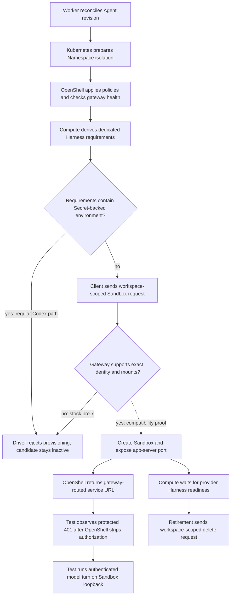

# OpenShell Sandbox provisioning flow

## Overview

The Kubernetes Compute Driver delegates a dedicated Codex Harness to the
selected OpenShell Sandbox Driver. OpenShell prepares namespace-local policy,
receives a workspace-scoped Sandbox request, and owns the resulting Harness
Pod. The regular Agent workflow currently stops before Sandbox creation because
OpenShell `v0.1.0-pre.7` cannot accept the required Secret-backed environment or
projected workload identity.

## Entry Points

- Trigger: a worker reconciles an Agent revision that selects the OpenShell
  Sandbox Driver and Kubernetes Compute Driver.
- Source: `apps/controller/src/drivers/compute/kubernetes/index.ts:ensureNamespace`
- Source: `apps/controller/src/drivers/sandbox/openshell.ts:provisionHarness`
- Source: `apps/controller/src/drivers/sandbox/openshell-gateway-client.ts:createSandbox`
- Assumptions: the Installation selected both Drivers, the tenant Namespace and
  baseline isolation exist, and the namespace-local OpenShell gateway is ready.

## Flow

## Execution Trace

### 1. Prepare the Namespace and OpenShell gateway boundary

`apps/controller/src/drivers/compute/kubernetes/index.ts:ensureNamespace`

Kubernetes Compute reconciles quota, limits, and baseline NetworkPolicies before
calling `SandboxDriver.ensureNamespace`. OpenShell then applies its configured
namespace-scoped NetworkPolicies, waits for the configured gateway Service and
Pod, and calls the gateway health RPC. A failure returns a failed namespace
result; Compute does not mark the Namespace ready.

### 2. Derive the provider-owned Harness request

`apps/controller/src/drivers/compute/kubernetes/index.ts:prepareRevision`

For a dedicated revision with `provisionHarness`, Compute derives Harness image,
command, labels, environment, workspace mounts, ServiceAccount identity, and
resources from the same Deployment shape used by the regular Kubernetes path.
It passes those requirements and the immutable revision to OpenShell instead of
creating the Deployment itself.

### 3. Validate and serialize the Sandbox

`apps/controller/src/drivers/sandbox/openshell.ts:provisionHarness`

OpenShell accepts only dedicated Codex revisions pinned to the selected Driver.
It builds filesystem, process, and network policy plus Kubernetes driver config.
Network TLS, enforcement, and access spellings must be own keys in the Driver's
allowlists before they are converted to the exact `v0.1.0-pre.7` protobuf enums.
The Driver rejects inherited object names instead of allowing them to omit an
explicit enforcement value on the wire. It also rejects the old `passthrough`
TLS spelling because pre.7 defines that enum as an automatic inspection alias;
operators use `skip` for uninspected relay. Each network policy also requires at
least one executable path and sends those binary identities with its endpoints.

The regular Codex requirements contain Secret-backed environment entries.
`environment` rejects the first such entry before any gateway mutation, so the
candidate revision remains inactive. Requests without those entries continue to
the gateway client.

### 4. Call the versioned gateway contract

`apps/controller/src/drivers/sandbox/openshell-gateway-client.ts:createSandbox`

The client sends the stable Sandbox name, labels, annotations, spec, and a
`workspace_scope` containing the configured workspace. It also sends the
revision's UUID as `request_id` and an unnamed `service_exposures` entry for the
literal `APP_SERVER_PORT`. OpenShell registers the endpoint during Create and
returns its URL in `service_urls`; replaying the same Create request returns the
same result. The Driver requires a valid route for the unnamed exposure before
it returns the stable Sandbox reference. A Sandbox that predates the replayable
request fails explicitly rather than receiving a separate post-create mutation.
Stock `v0.1.0-pre.7` still lacks the exact projected identity and volume support
required by the request, including the immutable plugin-runtime ConfigMap
mounted by Kubernetes Compute. Any request that reaches
the gateway without those shapes still fails closed. Any other gateway failure
also prevents readiness.

### 5. Observe readiness or clean up

`apps/controller/src/drivers/compute/kubernetes/index.ts:prepareRevision`

After a successful create, Compute verifies that the returned reference belongs
to the revision and waits for the provider-owned Harness Pod. On revision
shutdown, `shutdownRevisionRuntime` calls OpenShell cleanup. The gateway client
sends `DeleteSandbox` with the same `workspace_scope`; a missing Sandbox is an
idempotent success. Namespace deletion instead removes OpenShell's configured
NetworkPolicies after revision resources are gone.

## Debugging and Verification

- `node --test tests/integration/ci-openshell.test.mjs` checks bootstrap safety
  and immutable Helm image value rendering without selecting a real cluster.
- `node --test tests/integration/sandbox-driver-startup.test.mjs` checks Driver
  selection and fail-closed configuration behavior.
- `OCC_TEST_OPENSHELL_K3D_REAL=1 node --env-file="$TEST_ENV_FILE" --test tests/integration/sandbox-driver-openshell-k3d-real.test.mjs`
  exercises the selected real gateway and cluster prerequisites. Set
  `OCC_TEST_OPENSHELL_SECRET_PROJECTION=0` for stock `v0.1.0-pre.7`; the expected
  result is Secret-projection rejection before activation, which does not prove
  a model turn. Mode `1` selects a verification-only compatibility path: an
  operator Job stages the exact Secret values, plugin-runtime files, and
  projected workload token in revision-specific PVC subpaths. The provider-owned
  Sandbox exposes its app-server port at create time. The test observes the
  protected app server's `401` response because pre.7 strips its bearer header,
  then runs the real model and tool checks from inside the Pod. This mode proves
  pre.7 containment, exposed-route reachability, and lifecycle behavior. It does
  not prove native workload projection, an authenticated model turn through the
  exposed route, or production Compute gateway-to-agent routing.
- `OpenShell v0.1.0-pre.7 cannot receive secretKeyRef environment ...` identifies
  the current fail-closed boundary.

## Related docs

- [OpenShell Sandbox Driver](../reference/drivers/openshell-sandbox.md)
- [OpenShell tests](../testing/openshell.md)
- [Kubernetes Compute Driver](../reference/drivers/kubernetes-compute.md)
- [Harness execution topology](harness-execution-topology.md)

## Manual Notes

[keep this for the user to add notes. do not change between edits]

## Changelog

- 2026-09-22 17:19: Corrected the pre.7 service-routing boundary: the route reaches the protected app server, but OpenShell strips its bearer authorization, so the real model turn stays on the authenticated Sandbox loopback endpoint. (authoring-run/df798764-b1d9-4722-bccb-4ffe2bbb2980 - a9965e452145e2a5b9677338e75ef008fdf10e06)
- 2026-09-22 16:45: Documented pre.7 create-time app-server exposure, stable Create replay, and the gateway-routed real model turn. (authoring-run/aa808c3e-483e-408b-8915-7017b839c09a - f2b14314188ab7aecdbcbfb465c92868cb4f73a1)
- 2026-09-21 15:05: Documented binary-scoped pre.5 network policy and the CI-only bootstrap for Secret, plugin-runtime, and workload-identity files. (authoring-run/09cfddeb-9530-40a4-9247-b093d2270929 - 946f5b52587be2720e2a8d3aaf74712f89088d5f)
- 2026-09-21 12:41: Documented own-key network enum validation, the rejected pre.5 `passthrough` alias, and explicit CI projection-mode selection. (authoring-run/180c9046-1da2-444d-ab1d-7d5cf04532e2 - b3a4c00462163edb81cb0588b59a6be8722ffe40)
- 2026-09-21 08:56: Documented the `v0.1.0-pre.5` workspace-scoped provisioning, fail-closed projection boundary, and cleanup flow. (authoring-run/a16c607b-1ddd-4146-a4c7-05b900b65be7 - aa6dd7415d65ffba5fa40098b2142eb2a7d73df4)
