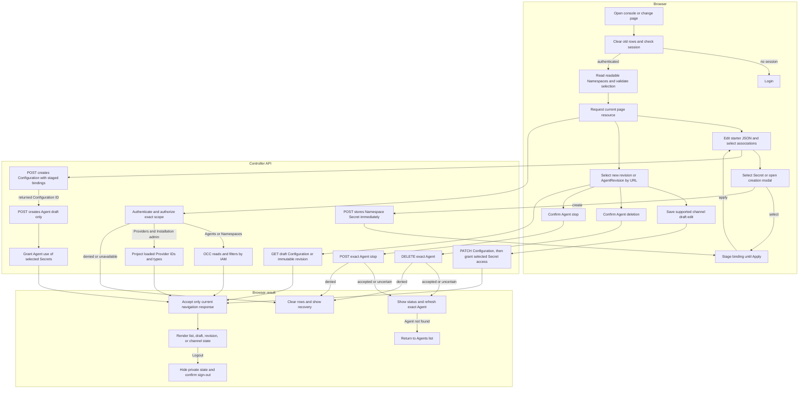

# Platform console request flow

## Overview

Opening `/console/` loads the controller's static browser client, resolves a
cookie session, and reads authorized resources. This trace follows the Agents
page through Namespace selection, Agent creation, detail revision selection,
saved channel draft edits, Agent stopping, and Agent deletion, then covers the Provider branch
and logout. It stops at rendered state or a submitted API mutation; deletion
includes reading the Agent until the API confirms it is gone. Rollback and live
gateway health remain outside the console flow. The
[console reference](../reference/console.md) owns user-visible behavior; the API
and IAM retain resource authority.

## Entry Points

- Browser entry: `apps/controller/src/console/console.mjs` composes the session,
  request client, view lifetime, navigation, and shell.
- Browser modules: `apps/controller/src/console/api-client.mjs` owns request
  cancellation and current-session expiry handling; `view-lifetime.mjs` owns
  generation and abort state; `navigation.mjs` owns safe return paths and history;
  `shell.mjs` owns shared navigation and collection rendering.
- Capability pages: `apps/controller/src/console/agents/{list,create,detail}.mjs`
  own Agent views, while `channels/{slack,shared-ui}.mjs` own the Slack form
  and its shared editor. Existing `agents.mjs` and `channels.mjs` compose these
  modules through their current entrypoints.
- HTTP: `apps/controller/src/index.ts:createFastifyApp`.
- Startup: `apps/controller/src/composition/production.ts:composeProduction`
  and `development-postgres.ts:composePostgresDevelopment`.
- Assumptions: a bootstrapped Installation, provisioned account, selected IAM
  Driver, and the configured same-origin controller URL. Reads and mutations
  require the exact permissions in the [API reference](../reference/api.md).

## Flow

## Execution Trace

### 1. Compose discovery metadata and serve public assets

`apps/controller/src/composition/production.ts:composeProduction`

`apps/controller/src/composition/development-postgres.ts:composePostgresDevelopment`

Startup projects validated Provider definitions into safe `{id,type}` summaries
and passes them to `createFastifyApp`. This is a startup snapshot, not a live
configuration scan. The request path never reads credentials or contacts a
Provider. The existing [Provider-managed credential delivery](service-account-driver-credential-delivery.md) owns
client construction and Driver activation.

`apps/controller/src/console-assets.ts:readConsoleAsset` maps public console
assets to individually allowlisted files, including each capability module, and
recognized page URLs to the HTML shell. No module directory is served wholesale. Agent create
and detail paths share the shell. Unknown console paths receive the same shell
with HTTP `404`. The controller sets the HTML, CSS, or JavaScript MIME type and
a same-origin content security policy. Other routes retain canonical API JSON
errors. The Dockerfile copies these files into the existing controller image.

### 2. Resolve the session before private reads

`apps/controller/src/console/console.mjs:loadPage`

The browser clears the prior view, advances its navigation generation, and
requests `GET /api/auth/session`. No session opens login; unavailable session
inspection blocks private reads and offers Retry. Login submits exactly email
and password to the existing sign-in route.
`apps/controller/src/auth/index.ts:requireTrustedBrowserOrigin` compares browser
Origin to the configured controller origin before either sign-in or sign-out.
The server SDK calls do not run Better Auth's request-origin middleware, so this
HTTP boundary performs that check while retaining headerless CLI requests.
Better Auth then owns the session cookie and password verification; the browser
stores no credentials or tokens.

After authentication, the client reads `GET /namespaces`. It validates the URL's
explicit selection against that readable list, or chooses the first ready
Namespace followed by the first readable one. An unavailable explicit ID stays
unavailable until the user selects another. The selection is carried in the URL
through global pages and history, without becoming an API query selector.

### 3. Authorize the selected page resource

`apps/controller/src/index.ts:perform`, `requireInstallationAdmin`

`packages/occ/src/index.ts:OpenClawController.listNamespaces`, `listAgents`

Agents use the selected Namespace's route. OCC requires Namespace read authority
and filters Agents by exact read permission; Namespace listing similarly filters
its Installation-wide collection. With no readable selection, the browser makes
no Agent request. Providers use `GET /providers` independently of selection:
Installation `administer` precedes the safe startup-summary response. Explicit
empty configuration is a successful empty list; absent wiring and dependency
failure return errors.

`apps/controller/src/console/agents/create.mjs:renderCreateAgent` loads Provider discovery
and `GET /namespaces/:namespaceId/service-accounts` into optional select lists.
The latter requires Namespace read and filters each account by exact read access.
Provider selection does not filter service accounts. A failed list read
shows a field-level error and retains the unset association option.

The form starts with editable native JSON for the selected execution mode and
optional Agent-owned plugin selections. `apps/controller/src/console/agents/starter-model.mjs`
selects the shared first-party default: `codex/gpt-6-astra` for dedicated or
`openai/gpt-6-astra` for embedded. A mode change preserves edited JSON; reset
restores the selected mode’s starter. `configurationTemplate` enables native
Control UI for both modes with explicit loopback origins on port 18789. Compute
Drivers render gateway authentication from Installation trust settings; starters
do not supply a gateway token. Rendered Preset values replace the starter
unchanged. These defaults do not configure the isolated HTTPS origin required by [OCE native admin access](agent-native-admin.md).
The Slack menus use the metadata list and creation paths traced in
[Agent editing](platform-console/agent-editing.md#4-render-draft-revision-or-channels).
**Apply channel settings** copies the drawer's values and bindings into the
creation form. Cancel discards the drawer selections, but a Secret created by
the modal already belongs to the Namespace and remains stored.

Submission parses the JSON object and
posts `{kind: "agent", values, secretBindings}` to
`POST /namespaces/:namespaceId/configurations`. After that returns its ID,
`POST /namespaces/:namespaceId/agents` creates the Agent draft with the selected
plugin map, `initialWorkspaceFiles`, and `workspaceDefaultsId`, then returns to
the detail URL with `revision=draft`. The form preloads the four rendered native
defaults and submits every textarea, including unchanged and empty values. OCC
stages those inputs outside the Agent and Configuration; the
[workspace setup flow](workspace-files.md) traces application before execution.
`apps/controller/src/console/agents/create.mjs:grantConfigurationSecretAccess`
then uses the returned Agent identity to grant exact Secret `operate` through
Namespace IAM. These grants are separate writes from Configuration and Agent
creation; they do not deploy the Agent. A grant failure blocks another creation
attempt and links to the created Agent's Credentials tab for recovery.
If that second
write fails, the browser retains the Configuration ID and locks its JSON and
execution mode; an explicit Agent retry reuses the saved Configuration. No write
retries automatically, and creation alone does not admit a revision, validate the
plugin catalog, or start runtime work.

`apps/controller/src/console/agents/harness-auth.mjs:createHarnessAuthFields`
masks the Secret ID input on creation and in the Credentials editor, including
Preset-prefilled values. `harnessAuthDescription` reports a configured Secret
without displaying its ID in either draft or revision summaries. Native
Configuration displays unresolved references; the console does not fetch
Secret values for these views.

### 4–6. Edit the Agent and access runtime files

[Console Agent editing and runtime requests](platform-console/agent-editing.md)
traces draft/revision rendering, channel changes, credential provisioning,
workspace reads/writes, Agent stopping, and Agent deletion. Each request returns through the
response-ordering checks below.

`apps/controller/src/console/channels/slack.mjs:supportSlack` checks whether the
channel editor can preserve the stored settings. Existing `dmPolicy` and
`groupPolicy` values do not block editing. `updatedSlack` copies those values
unchanged, including their absence, when saving channel IDs, allowed users, or
mention settings. Only a new Slack configuration receives allowlist defaults.

`apps/controller/src/console/agents/detail.mjs:renderAgentDetail` registers a
handler for tab-only navigation with `console.mjs:loadPage`. For the same Agent,
Namespace, and revision, tab clicks and browser history update the URL and replace
only the content below the tabs. The shell, native-admin panel, and loaded
revision controls remain mounted. Configuration and revision reads are shared
within that detail view; a direct Workspace files URL does not wait for or start
those reads. Refresh, revision changes, and successful channel or authentication
edits use the full page read path.

Each tab render captures its own generation. Late panel reads and form callbacks
cannot overwrite a newer tab; leaving a tab clears its password inputs. Channel
Secret saves update the shared draft snapshot used by other tabs and deployment
preflight. Session expiry still clears the whole private view.

### 7. Commit only the current response, or clear the view

`apps/controller/src/console/console.mjs:loadPage`, `logout`

Page or revision navigation, Namespace changes, refocus, and logout invalidate prior reads. The
client cancels their requests and checks generation before accepting either
success or failure. A late response cannot restore rows, change selection, or
redirect a newer session. Current authorization and dependency errors clear
rows and expose recovery; a current protected `401` clears private state and
opens login immediately, without waiting for sibling reads. A late error from an
older view cannot redirect a newer session. Only locally defined reason messages
and bounded server request IDs enter failure views; backend error text is omitted.
Global Providers and Namespaces pages remain visibly Installation-wide.

`apps/controller/src/console/agents/deletion.mjs:createAgentDeletion` renders the
Agent's deletion state. A confirmed deletion sends the existing exact Agent
`DELETE`; the API owns the `delete` permission and asynchronous cleanup. An
accepted or uncertain request stays on the detail page so the user can refresh
the exact Agent. Only a confirmed not-found read returns to the Agents list. A
denial is shown inline; an uncertain outcome blocks replay until a successful
refresh. The [Agent reference](../reference/agents.md#deletion) owns cleanup.

The Agent detail view also exposes **Stop Agent** with confirmation and
**Refresh stop status**. The existing bodyless stop route requires Agent
`operate` and queues shutdown. The browser reports requested state and selected
revision metadata; it does not present acceptance as completed runtime shutdown.
Uncertain results require readback before another stop. Deployment resumes the
Agent through a new revision. The [detail action flow](platform-console/agent-editing.md#stop-agent)
traces these requests.

Logout first hides private state, then calls the existing sign-out endpoint.
Confirmed success or session inspection proving absence replaces history with
login. An unconfirmed logout stays blocked with Retry. The
[authentication flow](local-password-authentication.md) owns server revocation;
this client never infers it from a network error.

## Deploy the new revision

The **New revision** detail view exposes **Deploy new revision**. The **Operator-managed
credentials** option persists `{ "method": "runtime" }` and explains that OCC does
not validate host credentials. It bypasses only the managed runtime-credential
metadata gate; the server retains driver compatibility and authorization checks. It rereads the Agent and
Configuration, checks their loaded association and generation, then sends the existing
bodyless `POST /namespaces/:namespaceId/agents/:agentId/deploy`. The server retains
its existing authorization and admission checks. The returned admitted revision opens
the workspace view; gateway startup and file availability are checked by subsequent
workspace reads. An uncertain deployment response disables replay until the user
refreshes and inspects the Agent and revision history.

## Debugging and Verification

- Use the displayed request ID to associate API failures with controller logs.
  A Namespace-only user cannot discover Providers; check Installation authority
  before treating that denial as a configuration problem.
- The browser suites exercise real Fastify routes, Better Auth, and Native IAM
  with in-memory storage. They verify user-visible navigation, list isolation,
  Agent creation, draft/history rendering, channel draft editing, and auth
  behavior; they do not establish PostgreSQL persistence, live Provider health,
  runtime dispatch, worker lease handling, or Compute Driver effects.
- API tests cover safe discovery, permission boundaries, empty versus missing
  wiring, static MIME/allowlisting, and unchanged API JSON errors. See
  [Testing](../testing/README.md) for commands and the image smoke boundary.

## Related docs

- [Console reference](../reference/console.md)
- [Authentication](../reference/authentication.md)
- [Provider-managed credential delivery](service-account-driver-credential-delivery.md)
- [Configuration and Agent revision](configuration-driver.md)
- [Docker development](docker-compose-development.md)
- [Production startup](production-startup.md)

## Manual Notes

[keep this for the user to add notes. do not change between edits]

## Changelog

- 2026-09-23 08:30: Trace pre-Agent Slack Secret selection and creation, staged Configuration bindings, and Agent Secret grants. (01a0cd92-fd3f-7d83-a51e-f6264ef6be09 - 941edc9f6971a24ae29a74a6ca749b6375e6ec01)

- 2026-09-22 23:19: Enable native Control UI in Console starters with explicit loopback origins; preserve Preset and edited configuration. (01a0ccc0-00fa-7173-ab45-f7a5fb55b3b6 - 6d23cef977270fdf8ced6ea54ac8e1302cf8acd6)

- 2026-09-22 20:56: Rename the deployment-facing Console view to New revision. (01a0cc48-2eda-7fc2-a19e-096b68fccb7b - 081bccfcf3f5b114588dde1b42a0deb07f326017)

- 2026-09-22 20:43: Trace Console stop confirmation, admission, and state refresh. (01a0cc48-2eda-7fc2-a19e-096b68fccb7b - 6adfd148a517e84ae064a8e08438b051f80820fb)
- 2026-09-22 20:32: Remove the deleted Teams editor from current module ownership. (01a0cc48-2eda-7fc2-a19e-096b68fccb7b - 43776d25c5007e017f7d0ffdca6b06f063afcd37)

- 2026-09-22 04:31: Trace initial workspace inputs separately from Configuration creation and link setup before execution. (01a0c755-0518-7502-a533-64cd7465de15 - f3dbdd41c8f3b49573d1353a4b06ce510ee43a56)

- 2026-09-22 04:11: Preserve existing Slack policies while editing channel settings. (01a0b1f2-e696-7232-a439-5b668154bcd9 - f3dbdd41)

- 2026-09-22 04:07: Keep Agent tab navigation within the content panel and preserve page state and browser history. (01a0b1f2-e696-7232-a439-5b668154bcd9 - f3dbdd41)

- 2026-09-21 21:46: Trace confirmed Agent deletion, exact readback, and permission or uncertain-outcome recovery. (01a0c76f-2534-7991-932a-345782408759 - b61c3cae6c35e28db4153eaee9b477e8f5637894)

- 2026-09-22 00:47: Mask authentication Secret IDs in forms and omit them from configuration summaries. (01a0b1f2-e696-7232-a439-5b668154bcd9 - ebcdaac25bc3890486badcfadf56cfc7c99bb95e)

- 2026-09-21 19:52: Trace the shared default in dedicated and embedded Agent creation and preserve edited model selection. (01a0c580-9e39-7e21-bb0f-28fcc4752c59 - 4ec004dbefd25070ff1bdeb89cfb16d245296ac9)

- 2026-09-17 19:14: Expose operator-managed credentials without a managed-credential deployment gate. (01a0acbf-4d5a-7413-9411-dce911f3ad23 - b8cabaf9a49e069a7668ccf88b9e71a7484227b7)

- 2026-09-01 19:09: Trace static serving, session resolution, exact collection authorization, Namespace isolation, and logout. (01a05e1d-6dc8-7231-bf58-58c80ef580f3 - 97911d361ac02ddf561e46c8af0864ad66a6df45) (01a05f95-dd80-7011-990f-d1c46b5bb3cc - aa366c49c44834d59f74994c5fd37fb8096f169f)
- 2026-09-01 17:47: Add Agent creation, detail revision selection, and saved channel draft editing flow boundaries. (01a05f94-886b-7122-8784-c4b5aa5c5d1d - b02a07f2e575b13260b8792f87975d51c5ef7a61)
- 2026-09-01 18:07: Trace association discovery and Configuration-first creation from editable starter JSON. (01a05f89-ff1c-7643-a77f-7e1e3aed9e5f - 1dd4b6b)
