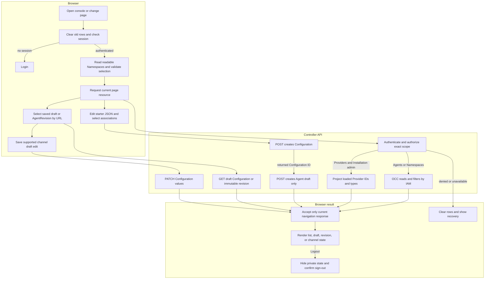

# Platform console request flow

## Overview

Opening `/console/` loads the controller's static browser client, resolves a
cookie session, and reads authorized resources. This trace follows the Agents
page through Namespace selection, Agent creation, detail revision selection, and
saved channel draft edits, then covers the Provider branch and logout. It stops
at rendered state or a submitted API mutation; rollback, deletion,
and live gateway health remain outside the console flow. The
[console reference](../reference/console.md) owns user-visible behavior; the API
and IAM retain resource authority.

## Entry Points

- Browser entry: `apps/controller/src/console/console.mjs` composes the session,
  request client, view lifetime, navigation, and shell.
- Browser modules: `apps/controller/src/console/api-client.mjs` owns request
  cancellation and current-session expiry handling; `view-lifetime.mjs` owns
  generation and abort state; `navigation.mjs` owns safe return paths and history;
  `shell.mjs` owns shared navigation and collection rendering.
- Capability pages: `apps/controller/src/console/agents/{list,create,detail}.mjs`
  own Agent views, while `channels/{slack,teams,shared-ui}.mjs` own provider forms
  and their shared editor. Existing `agents.mjs` and `channels.mjs` compose these
  modules through their current entrypoints.
- HTTP: `apps/controller/src/index.ts:createFastifyApp`.
- Startup: `apps/controller/src/composition/production.ts:composeProduction`
  and `development-postgres.ts:composePostgresDevelopment`.
- Assumptions: a bootstrapped Installation, provisioned account, selected IAM
  Driver, and the configured same-origin controller URL. Reads and mutations
  require the exact permissions in the [API reference](../reference/api.md).

## Flow

## Execution Trace

### 1. Compose discovery metadata and serve public assets

`apps/controller/src/composition/production.ts:composeProduction`

`apps/controller/src/composition/development-postgres.ts:composePostgresDevelopment`

Startup projects validated Provider definitions into safe `{id,type}` summaries
and passes them to `createFastifyApp`. This is a startup snapshot, not a live
configuration scan. The request path never reads credentials or contacts a
Provider. The existing [Provider-managed credential delivery](service-account-driver-credential-delivery.md) owns
client construction and Driver activation.

`apps/controller/src/console-assets.ts:readConsoleAsset` maps public console
assets to individually allowlisted files, including each capability module, and
recognized page URLs to the HTML shell. No module directory is served wholesale. Agent create
and detail paths share the shell. Unknown console paths receive the same shell
with HTTP `404`. The controller sets the HTML, CSS, or JavaScript MIME type and
a same-origin content security policy. Other routes retain canonical API JSON
errors. The Dockerfile copies these files into the existing controller image.

### 2. Resolve the session before private reads

`apps/controller/src/console/console.mjs:loadPage`

The browser clears the prior view, advances its navigation generation, and
requests `GET /api/auth/session`. No session opens login; unavailable session
inspection blocks private reads and offers Retry. Login submits exactly email
and password to the existing sign-in route.
`apps/controller/src/auth/index.ts:requireTrustedBrowserOrigin` compares browser
Origin to the configured controller origin before either sign-in or sign-out.
The server SDK calls do not run Better Auth's request-origin middleware, so this
HTTP boundary performs that check while retaining headerless CLI requests.
Better Auth then owns the session cookie and password verification; the browser
stores no credentials or tokens.

After authentication, the client reads `GET /namespaces`. It validates the URL's
explicit selection against that readable list, or chooses the first ready
Namespace followed by the first readable one. An unavailable explicit ID stays
unavailable until the user selects another. The selection is carried in the URL
through global pages and history, without becoming an API query selector.

### 3. Authorize the selected page resource

`apps/controller/src/index.ts:perform`, `requireInstallationAdmin`

`packages/occ/src/index.ts:OpenClawController.listNamespaces`, `listAgents`

Agents use the selected Namespace's route. OCC requires Namespace read authority
and filters Agents by exact read permission; Namespace listing similarly filters
its Installation-wide collection. With no readable selection, the browser makes
no Agent request. Providers use `GET /providers` independently of selection:
Installation `administer` precedes the safe startup-summary response. Explicit
empty configuration is a successful empty list; absent wiring and dependency
failure return errors.

`apps/controller/src/console/agents/create.mjs:renderCreateAgent` loads Provider discovery
and `GET /namespaces/:namespaceId/service-accounts` into optional select lists.
The latter requires Namespace read and filters each account by exact read access.
Provider selection does not filter service accounts. A failed list read
shows a field-level error and retains the unset association option.

The form starts with editable native JSON for the selected execution mode.
Submission parses an object and posts `{kind: "agent", values}` to
`POST /namespaces/:namespaceId/configurations`. After that returns its ID,
`POST /namespaces/:namespaceId/agents` creates the Agent draft and returns to the
detail URL with `revision=draft`. If that second write fails, the browser retains
the Configuration ID and locks its JSON and execution mode; an explicit Agent retry reuses the saved
Configuration. No write retries automatically, and creation alone does not admit
a revision or start runtime work.

### 4. Render draft, revision, or channels

`apps/controller/src/console/agents/detail.mjs:renderAgentDetail`

The detail page reads the Agent, revision list, and either the saved draft
Configuration or the selected AgentRevision. `revision=draft` reads the current
Configuration referenced by the Agent. `revision=<id>` reads that immutable
snapshot. The Selected revision badge is derived from `activeRevisionId`; the
newest revision and the viewed snapshot can both differ from that pointer.
Serving status stays explicitly unavailable because these API responses provide
no serving observation. Revision snapshots
are read-only and do not expose rollback, edit, deploy, or live-health controls.
Agent deletion is unavailable because the API has no Agent delete operation.

`apps/controller/src/console/channels.mjs:renderChannels` renders supported
Slack and Microsoft Teams channel settings for the saved draft only. Slack uses
fixed unresolved `SLACK_APP_TOKEN` and `SLACK_BOT_TOKEN` environment references;
Teams uses fixed unresolved `MSTEAMS_APP_PASSWORD`. The editor requires
dedicated execution for enabled channels and may refuse native documents that it
cannot round-trip, including non-Socket Slack settings, non-standard credential
references, mixed Slack mention settings, and unsupported plugin shapes.

Saving channels first rereads the Agent and Configuration, then checks that the
Agent still references the same Configuration generation. The subsequent PATCH
sends `{ values: updatedValues }` and omits `secretBindings`, so the backend
retains existing bindings. The preflight reads do not prevent a later concurrent write.
An interrupted or unavailable PATCH reply keeps the result unknown and blocks
another channel write until Refresh. Draft channel disablement changes only
Configuration values; it does not stop a running Agent. The
[operator workflow](operator-workflow.md) records the executable management
commands and the lifecycle procedures still unavailable in this API.

### 5. Provision initial runtime credentials

The saved draft reads metadata from the exact Agent's `runtime-credentials`
endpoint. The console sends masked model and Slack inputs only on explicit
submission and clears them afterward. The response reports stored groups, not
provider validity or runtime health; an uncertain response requires a status
refresh before retrying.

OCC authorizes the exact Agent, locks its Namespace and Agent, and rejects
provisioning after any historical revision exists. The selected Compute Driver
derives Secret names and verifies Namespace and Agent ownership before writing.
Kubernetes creates only missing whole Secrets, generates transport tokens on the
server, and preserves existing matching groups on retry. Neither Configuration
nor the audit event receives credential bytes. External Secret creation cannot
be rolled back by a failed database transaction, so errors require readback.

### 6. Read and replace live workspace files

`apps/controller/src/console/agents/workspace.mjs:renderWorkspaceFiles` opens from
`tab=workspace` after an exact Agent read. It bypasses Configuration and revision
history reads, because workspace contents belong to the live Agent. An Agent
without an active revision gets an unavailable explanation without file requests.

The editor issues one GET for each supported filename. A successful response
populates that file's editor; `404` permits an explicit create attempt, and other
failures leave it disabled. Save sends `{ content }` to the same exact-Agent PUT
route. It neither patches Configuration nor admits a revision. The existing
[workspace flow](workspace-files.md) owns authorization and native file transport.
Each result stays local to its file. Unknown write outcomes require a successful
reload before another save; the editor never retries a write automatically.

Creation uses the channel editor to update the initial Configuration JSON before
its POST. It cannot send initial workspace files because the create API has no
file fields and workspace access requires a deployed gateway.

### 7. Commit only the current response, or clear the view

`apps/controller/src/console/console.mjs:loadPage`, `logout`

Navigation, Namespace changes, refocus, and logout invalidate prior reads. The
client cancels their requests and checks generation before accepting either
success or failure. A late response cannot restore rows, change selection, or
redirect a newer session. Current authorization and dependency errors clear
rows and expose recovery; a current protected `401` clears private state and
opens login immediately, without waiting for sibling reads. A late error from an
older view cannot redirect a newer session. Only locally defined reason messages
and bounded server request IDs enter failure views; backend error text is omitted.
Global Providers and Namespaces pages remain visibly Installation-wide.

Logout first hides private state, then calls the existing sign-out endpoint.
Confirmed success or session inspection proving absence replaces history with
login. An unconfirmed logout stays blocked with Retry. The
[authentication flow](local-password-authentication.md) owns server revocation;
this client never infers it from a network error.

## Debugging and Verification

- Use the displayed request ID to associate API failures with controller logs.
  A Namespace-only user cannot discover Providers; check Installation authority
  before treating that denial as a configuration problem.
- The browser suites exercise real Fastify routes, Better Auth, and Native IAM
  with in-memory storage. They verify user-visible navigation, list isolation,
  Agent creation, draft/history rendering, channel draft editing, and auth
  behavior; they do not establish PostgreSQL persistence, live Provider health,
  runtime dispatch, worker lease handling, or Compute Driver effects.
- API tests cover safe discovery, permission boundaries, empty versus missing
  wiring, static MIME/allowlisting, and unchanged API JSON errors. See
  [Testing](../testing.md) for commands and the image smoke boundary.

## Related docs

- [Console reference](../reference/console.md)
- [Authentication](../reference/authentication.md)
- [Provider-managed credential delivery](service-account-driver-credential-delivery.md)
- [Configuration and Agent revision](configuration-driver.md)
- [Docker development](docker-compose-development.md)
- [Production startup](production-startup.md)

## Manual Notes

[keep this for the user to add notes. do not change between edits]

## Changelog

- 2026-09-01 19:09: Trace static serving, session resolution, exact collection authorization, Namespace isolation, and logout. (01a05e1d-6dc8-7231-bf58-58c80ef580f3 - 97911d361ac02ddf561e46c8af0864ad66a6df45) (01a05f95-dd80-7011-990f-d1c46b5bb3cc - aa366c49c44834d59f74994c5fd37fb8096f169f)
- 2026-09-01 17:47: Add Agent creation, detail revision selection, and saved channel draft editing flow boundaries. (01a05f94-886b-7122-8784-c4b5aa5c5d1d - b02a07f2e575b13260b8792f87975d51c5ef7a61)
- 2026-09-01 18:07: Trace association discovery and Configuration-first creation from editable starter JSON. (01a05f89-ff1c-7643-a77f-7e1e3aed9e5f - 1dd4b6b)

## Deploy the saved draft

The saved-draft detail view exposes **Deploy saved draft**. It rereads the Agent and
Configuration, checks their loaded association and generation, then sends the existing
bodyless `POST /namespaces/:namespaceId/agents/:agentId/deploy`. The server retains
its existing authorization and admission checks. The returned admitted revision opens
the workspace view; gateway startup and file availability are checked by subsequent
workspace reads. An uncertain deployment response disables replay until the user
refreshes and inspects the Agent and revision history.
