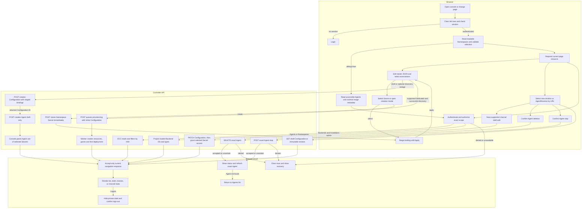

# Platform console request flow

## Overview

Opening `/console/` resolves a cookie session and renders authorized resources.
This trace follows Namespace selection, Agent creation and editing, runtime
actions, Backends, and logout. It stops at rendered state or a submitted API
mutation; deletion additionally confirms absence. The [console reference](../reference/console.md)
owns user-visible behavior, while API and IAM retain resource authority.

## Entry Points

- Browser entry: `apps/controller/src/console/console.mjs` composes the session,
  request client, view lifetime, navigation, and shell.
- Browser modules: `apps/controller/src/console/api-client.mjs` owns request
  cancellation and current-session expiry handling; `view-lifetime.mjs` owns
  generation and abort state; `navigation.mjs` owns safe return paths and history;
  `shell.mjs` owns shared navigation and collection rendering.
- Capability pages: `apps/controller/src/console/agents/{list,create,detail}.mjs`
  own Agent views, while `channels/{slack,shared-ui}.mjs` own the Slack form
  and its shared editor. Existing `agents.mjs` and `channels.mjs` compose these
  modules through their current entrypoints.
- HTTP: `apps/controller/src/index.ts:createFastifyApp`.
- Startup: `apps/controller/src/composition/production.ts:composeProduction`
  and `development-postgres.ts:composePostgresDevelopment`.
- Assumptions: a bootstrapped Installation, provisioned account, selected IAM
  Driver, and the configured same-origin controller URL. Reads and mutations
  require the exact permissions in the [API reference](../reference/api.md).

## Flow

## Execution Trace

### 1. Compose discovery metadata and serve public assets

`apps/controller/src/composition/production.ts:composeProduction`

`apps/controller/src/composition/development-postgres.ts:composePostgresDevelopment`

Startup passes safe Backend `{id,type}` summaries to `createFastifyApp`.
[Backend-managed delivery](service-account-driver-credential-delivery.md) owns
Driver activation. Requests do not reread configuration or credentials.

`apps/controller/src/console-assets.ts:readConsoleAsset` serves allowlisted assets
and the shared HTML shell with MIME types and same-origin CSP. Unknown console
paths return the shell with `404`; API routes retain JSON errors.

`scripts/build-console-metadata.mjs` bakes the publisher's checked
`OCC_BUILD_REVISION` into HTML. With `debug=true`, `shell.mjs:renderShell` displays
the full commit; invalid or absent metadata remains unknown.

`runtime-images.mjs:renderRuntimeImages` issues at most three concurrent reads for
readable Agents in the selected Namespace.
`packages/occ/src/index.ts:OpenClawController.getAgentRuntimeImages` authorizes
exact Agent read, resolves its active revision, then calls its Compute Driver.
Docker follows attached immutable images. Kubernetes reads revision-owned Pods
and binds provenance to Pod/container identity, with a two-second metadata deadline.
The Dockerfile bakes Enterprise metadata into `build.json`;
`scripts/build-runtime-assets.mjs` records upstream OpenClaw in `provenance.json`.
Both live under `/opt/oce/runtime/`; Drivers expose separate commits.

Navigation preserves the flag and rejects stale responses; removing it stops
these reads. Missing provenance and failures remain explicit. The
[Compute contract](../reference/drivers/compute.md) defines inspection scope.

### 2. Resolve the session before private reads

`apps/controller/src/console/console.mjs:loadPage`

The browser clears the prior view, advances its generation, and requests
`GET /api/auth/session`. Missing sessions open login; failed reads offer Retry.
Login submits email and password.
`apps/controller/src/auth/index.ts:requireTrustedBrowserOrigin` checks browser
Origin before sign-in/out, including SDK calls that bypass Better Auth middleware.
Headerless CLI requests remain supported. Better Auth owns session cookies and
password verification; the browser stores no credentials or tokens.

After authentication, the client reads `GET /namespaces`, validates the URL's
selection against readable Namespaces, or chooses the first ready one followed by
the first readable one. An unavailable explicit ID stays unavailable until the
user selects another. Selection stays in the URL and never becomes an API query
selector.

### 3. Authorize the selected page resource

`apps/controller/src/index.ts:perform`, `requireInstallationAdmin`

`packages/occ/src/index.ts:OpenClawController.listNamespaces`, `listAgents`

Agents use the selected Namespace's route. OCC requires Namespace read authority
and filters Agents by exact read permission; Namespace listing similarly filters
its Installation-wide collection. With no readable selection, the browser makes
no Agent request. Backends use `GET /backends` independently of selection:
Installation `administer` precedes the safe startup-summary response. Explicit
empty configuration is a successful empty list; absent wiring and dependency
failure return errors.

`apps/controller/src/console/agents/create.mjs:renderCreateAgent` selects Provider,
then Harness: OpenAI defaults to Dedicated Codex and offers Embedded OpenClaw;
Anthropic offers OpenClaw. Provider/Harness changes reset incompatible credentials
and model choices. The [creation reference](../reference/console/create-and-deploy.md)
defines authentication combinations and token handling.

Presets reject cross-provider JSON: credentials fix Provider; PATs fix
Codex; operator-managed credentials fix OpenClaw. Installation Backend
discovery is hidden. The [creation reference](../reference/console/create-and-deploy.md)
owns permissions and recovery.

Advanced settings holds Configuration JSON and initial workspace files; no model
is selected initially. Preset Secret bindings stay in form state. Applying Slack
preserves unrelated bindings. Preset workspace files prefill editors before
submission.

`agents/plugin-fields.mjs:createPluginFields` edits Agent-owned `plugins` through
`#agent-plugins`, separately from Configuration. Invalid JSON and untouched fields
survive; clearing overrides restores inheritance. Submission, uncertain outcomes,
or invalid JSON lock editing. `capabilities.pluginPolicies` gates each policy scope;
Missing capabilities preserve JSON and disable edits. Unsupported saved reviewers
remain clearable. Agent submission saves the draft.

`create.mjs:loadPluginCatalog` and `loadPluginTools` implement
[transient PAT discovery](agent-plugins.md#credential-scoped-discovery): upstream
pagination, local filtering, and tools loaded on selection. Credential, provider,
and Harness changes clear results and invalidate pending reads. The Driver owns
upstream access.

`create.mjs:MODEL_CHOICES` supplies static provider lists before credentials,
without discovery requests or account verification. Manual entry remains available;
Presets retain model/authentication.
Credential edits preserve selection; Provider/authentication-method changes reset it.
Model edits preserve transport and Codex plugin settings. Provider/Harness changes
regenerate them, retaining unrelated JSON; reset restores the starter.

`configurationTemplate` enables Control UI with loopback origins on port 18789.
Compute supplies gateway authentication from Installation trust; Presets replace
the starter unchanged. [Native admin access](agent-native-admin.md) requires isolated
HTTPS origins. [Agent editing](platform-console/agent-editing.md#4-render-draft-revision-or-channels)
traces Slack Secret selection/creation. **Apply channel settings** copies values
and bindings; grants accumulate across applications. Sender access belongs to each
selected channel, leaving direct-message `allowFrom` unchanged. Cancellation discards
selections but retains created Namespace Secrets.

`GET /namespaces/:namespaceId/agents/repository-options` discovers approved choices.
Console submits opaque references and an explicit common profile. Read-only and
Contributor use approved profiles; customization can disable issue management. Only
`503 REPOSITORY_OPTIONS_UNAVAILABLE` permits a fresh draft without bindings;
other failures block submission. Retry discovery before provisioning.

Supported Dedicated runtimes with successful repository discovery submit inline
Configuration, repository bindings, and Secret references to
[provisioning](agent-provisioning.md). Console polls the job, then opens its Agent
revision. The worker creates resources and exact Secret grants before deployment
admission; Console does not duplicate grants.

Ordinary drafts post `{kind: "agent", values, secretBindings}` to
`POST /namespaces/:namespaceId/configurations`, then submit its ID, plugins,
`initialWorkspaceFiles`, and `workspaceDefaultsId` to
`POST /namespaces/:namespaceId/agents`. Success opens `revision=draft`.
OCC stages all four workspace textareas, including unchanged/empty values, outside
Agent/Configuration for [workspace setup](workspace-files.md).

`create.mjs:grantConfigurationSecretAccess` grants exact Secret `operate` through
Namespace IAM writes for final same-Namespace `env` bindings only. Failure retains
the Agent: **Retry credential access** rereads grants without duplication; its link
supports manual recovery. Failed Agent writes retain Configuration ID and lock
JSON/Harness for explicit reuse. Writes never retry automatically. Drafts admit no
revision, validate no plugin catalog, and start no runtime.

`agents/harness-auth.mjs:createHarnessAuthFields` masks existing Secret IDs;
`harnessAuthDescription` omits them from draft/revision summaries. Configuration
shows unresolved references; these views never fetch Secret values.

### 4–6. Edit the Agent and access runtime files

[Console Agent editing and runtime requests](platform-console/agent-editing.md)
traces draft/revision rendering, channel changes, credential provisioning,
workspace reads/writes, stopping, and deletion. Each request returns through the
response-ordering checks below.

`apps/controller/src/console/channels/slack.mjs:supportSlack` checks whether the
channel editor can preserve the stored settings. Existing `dmPolicy` and
`groupPolicy` values do not block editing. `updatedSlack` copies those values
unchanged, including their absence, when saving channel IDs, channel sender
users, or mention settings. It preserves unrelated properties on selected
channel entries, then writes the selected channels' `users` lists from the
drawer. The everyone option writes `users: ["*"]` on each selected channel;
direct-message `allowFrom` is not changed by channel edits. Only a new Slack
configuration receives allowlist defaults. Existing channel maps with mixed
sender lists or a `*` channel entry are rejected by the simple editor so native
Configuration JSON remains the source of truth.

`apps/controller/src/console/agents/detail.mjs:renderAgentDetail` registers a
handler for tab-only navigation with `console.mjs:loadPage`. For the same Agent,
Namespace, and revision, tab clicks and browser history update the URL and replace
only the content below the tabs. The shell, native-admin panel, and loaded
revision controls remain mounted. Configuration and revision reads are shared
within that detail view; a direct Workspace files URL does not wait for or start
those reads. Refresh, revision changes, and successful channel or authentication
edits use the full page read path.

Each tab render captures its own generation. Late panel reads and form callbacks
cannot overwrite a newer tab; leaving a tab clears its password inputs. Channel
Secret saves update the shared draft snapshot used by other tabs and deployment
preflight. Session expiry still clears the whole private view.

### 7. Commit only the current response, or clear the view

`apps/controller/src/console/console.mjs:loadPage`, `logout`

Page or revision navigation, Namespace changes, refocus, and logout invalidate
prior reads. The client cancels requests and checks generation before accepting
success or failure. Late responses cannot restore rows, change selection, or
redirect a newer session. Current authorization and dependency errors clear rows
and expose recovery; a current protected `401` clears private state and opens
login immediately. Failure views include only local reason messages and bounded
request IDs, not backend error text.
Global Backends and Namespaces pages remain visibly Installation-wide.

The [detail action flow](platform-console/agent-editing.md#stop-agent) traces
confirmed Stop and Delete requests and their exact permission checks. Acceptance
is not completed shutdown or deletion. Uncertain outcomes block replay until
readback; only confirmed absence returns to the Agents list. Deployment resumes
a stopped Agent through a new revision. The [Agent reference](../reference/agents.md#deletion)
owns asynchronous cleanup.

Logout first hides private state, then calls the existing sign-out endpoint.
Confirmed success or session inspection proving absence replaces history with
login. An unconfirmed logout stays blocked with Retry. The
[authentication flow](local-password-authentication.md) owns server revocation;
this client never infers it from a network error.

## Deploy the new revision

The **New revision** detail view exposes **Deploy new revision**.
**Operator-managed credentials** persist `{ "method": "runtime" }` and bypass
only the managed runtime-credential metadata gate; OCC does not validate host
credentials. Deployment rereads the Agent and Configuration, checks their loaded
association and generation, then sends the existing bodyless
`POST /namespaces/:namespaceId/agents/:agentId/deploy`. The server retains
authorization and admission checks. The returned revision opens Workspace files;
subsequent workspace reads check gateway startup and file availability. An
uncertain response disables replay until refresh and inspection.

## Debugging and Verification

- Use the displayed request ID to associate API failures with controller logs.
  A Namespace-only user cannot discover Backends; check Installation authority
  before treating that denial as a configuration problem.
- The browser suites exercise real Fastify routes, Better Auth, and Native IAM
  with in-memory storage. They verify user-visible navigation, list isolation,
  Agent creation, draft/history rendering, channel draft editing, and auth
  behavior; they do not establish PostgreSQL persistence, live Backend health,
  runtime dispatch, worker lease handling, or Compute Driver effects.
- API tests cover safe discovery, permission boundaries, empty versus missing
  wiring, static MIME/allowlisting, and unchanged API JSON errors. See
  [Testing](../testing/README.md) for commands and the image smoke boundary.

## Related docs

- [Console reference](../reference/console.md)
- [Authentication](../reference/authentication.md)
- [Backend-managed credential delivery](service-account-driver-credential-delivery.md)
- [Configuration and Agent revision](configuration-driver.md)
- [Docker development](docker-compose-development.md)
- [Production startup](production-startup.md)

## Manual Notes

[keep this for the user to add notes. do not change between edits]

## Changelog

- 2026-09-24: Keep Preset bindings internal.

- 2026-09-24 17:20: Expose upstream OpenClaw provenance separately. (01a0c179-19f7-7111-8bb4-fc7680da5545 - bd1a5c46eb069bfa7feedbb99b074dc015c4e9bc)

- 2026-09-24 15:44: Trace opt-in sidebar build metadata and authorized Compute image observations. (01a0c179-19f7-7111-8bb4-fc7680da5545 - 6b5c9093)

- 2026-09-24 06:19: Replace Console model discovery with an intentional static starter list and preserve manual entry. (01a0d20c-dc1b-7d22-a965-60b9c244b29d - 24ecb94b)

- 2026-09-24 05:40: Added Create Agent plugin JSON controls and transient PAT catalog discovery; policy integration remains pending. (01a0d1dd-aa36-7622-9f43-8376f6ff935e - f62e17c)

- 2026-09-23 21:41: Preserve edited Codex plugin settings across model and key changes. (01a0cce9-23e3-7072-aa3f-a2e26d2dbf11 - b8f23be17de4a4b077dab8d6b90b4add1f9146cb)

- 2026-09-23 23:50: Describe Service Accounts hints and expired-model filtering; consolidate repeated creation and action details. (01a0cf27-71c6-7042-8357-74d1811a2ef8 - 9e0095c7)

- 2026-09-23 19:28: Condense Console flow within the documentation length budget. (01a0cf27-71c6-7042-8357-74d1811a2ef8 - da797e3afa3752a7b3321733d27b6b5e6d0a505a)

- 2026-09-23 18:51: Trace provider-dependent harness choices, derived execution mode, and Codex PAT switching boundaries. (01a0cf9b-8c16-7a73-a3d6-1496593034a0 - 6c6c3e4308946e7e66d656fb553da4dd5177f2c4)

- 2026-09-23 18:48: Keep saved API-key and PAT Presets bound to their provider before Configuration or Agent writes. (01a0cf27-71c6-7042-8357-74d1811a2ef8 - 4da114ac7b11f926d4b774b8d32a09fa136135eb)

- 2026-09-23 18:35: Reconcile provider credential creation with staged Slack Secret grants and shared retry recovery. (authoring-run/2516b0a6-7a82-4268-a586-d821679b2a78 - ae092fc7c13aad4c637b0238ae2f41ecb2b03219)

- 2026-09-23 20:21: Integrate repository selections with asynchronous provisioning and preserve draft-only discovery recovery. (public-pr/295 - 8bd367636aff766d484b4e684d42f6b4419c9e4e)

- 2026-09-23 19:39: Trace pending Slack grants across drawer applications and reconciliation with final saved bindings. (public-pr/295 - 7f6d9107dcb23ff1ad093c4914c89a0210169d20)

- 2026-09-23 19:52: Trace channel-scoped Slack sender access and leave direct-message access outside the drawer. (01a0d150-104a-71a3-9e56-6c5e3ee510ea - 77aedc620f443056f9ee859050b8dc657a9c3133)

- 2026-09-23 19:09: Trace image-baked OCC revision metadata and OCE sidebar branding. (01a0cfaa-2b68-7e61-b8ff-a7eb82f1edc5 - 150ec08f059cebc4897b839d8318f7b1e3aba0e3)

- 2026-09-23 11:20: Distinguished worker-owned first-time provisioning and Secret grants from ordinary Console draft creation. (01a0cc7f-028b-7803-acf5-803c3d799d75 - f2dd1d3f)

- 2026-09-23 08:30: Trace pre-Agent Slack Secret selection and creation, staged Configuration bindings, and Agent Secret grants. (01a0cd92-fd3f-7d83-a51e-f6264ef6be09 - 941edc9f6971a24ae29a74a6ca749b6375e6ec01)

- 2026-09-23 07:45: Preserve provider transport across model/key edits and classify model-discovery failures without exposing upstream responses. (01a0cce9-23e3-7072-aa3f-a2e26d2dbf11 - f292aa623335021e3012a3e94f83fc183f93e2e1)

- 2026-09-23 07:20: Discover API-key model choices during Agent creation without saving credentials or selecting a hardcoded model. (01a0cce9-23e3-7072-aa3f-a2e26d2dbf11 - 553423dd2419ec19d2d71a2d1f8de75839a1642b)

- 2026-09-23 06:27: Move two-provider API-key setup into Agent creation using existing Secret and IAM operations. (01a0cce9-23e3-7072-aa3f-a2e26d2dbf11 - a8272f4e2760e5ff06dc09c5658f48bea382c790)

- 2026-09-22 23:19: Enable native Control UI in Console starters with explicit loopback origins; preserve Preset and edited configuration. (01a0ccc0-00fa-7173-ab45-f7a5fb55b3b6 - 6d23cef977270fdf8ced6ea54ac8e1302cf8acd6)

- 2026-09-22 20:56: Rename the deployment-facing Console view to New revision. (01a0cc48-2eda-7fc2-a19e-096b68fccb7b - 081bccfcf3f5b114588dde1b42a0deb07f326017)

- 2026-09-22 20:43: Trace Console stop confirmation, admission, and state refresh. (01a0cc48-2eda-7fc2-a19e-096b68fccb7b - 6adfd148a517e84ae064a8e08438b051f80820fb)
- 2026-09-22 20:32: Remove the deleted Teams editor from current module ownership. (01a0cc48-2eda-7fc2-a19e-096b68fccb7b - 43776d25c5007e017f7d0ffdca6b06f063afcd37)

- 2026-09-22 04:31: Trace initial workspace inputs separately from Configuration creation and link setup before execution. (01a0c755-0518-7502-a533-64cd7465de15 - f3dbdd41c8f3b49573d1353a4b06ce510ee43a56)

- 2026-09-22 04:11: Preserve existing Slack policies while editing channel settings. (01a0b1f2-e696-7232-a439-5b668154bcd9 - f3dbdd41)

- 2026-09-22 04:07: Keep Agent tab navigation within the content panel and preserve page state and browser history. (01a0b1f2-e696-7232-a439-5b668154bcd9 - f3dbdd41)

- 2026-09-21 21:46: Trace confirmed Agent deletion, exact readback, and permission or uncertain-outcome recovery. (01a0c76f-2534-7991-932a-345782408759 - b61c3cae6c35e28db4153eaee9b477e8f5637894)

- 2026-09-22 00:47: Mask authentication Secret IDs in forms and omit them from configuration summaries. (01a0b1f2-e696-7232-a439-5b668154bcd9 - ebcdaac25bc3890486badcfadf56cfc7c99bb95e)

- 2026-09-21 19:52: Trace the shared default in dedicated and embedded Agent creation and preserve edited model selection. (01a0c580-9e39-7e21-bb0f-28fcc4752c59 - 4ec004dbefd25070ff1bdeb89cfb16d245296ac9)

- 2026-09-17 19:14: Expose operator-managed credentials without a managed-credential deployment gate. (01a0acbf-4d5a-7413-9411-dce911f3ad23 - b8cabaf9a49e069a7668ccf88b9e71a7484227b7)

- 2026-09-01 19:09: Trace static serving, session resolution, exact collection authorization, Namespace isolation, and logout. (01a05e1d-6dc8-7231-bf58-58c80ef580f3 - 97911d361ac02ddf561e46c8af0864ad66a6df45) (01a05f95-dd80-7011-990f-d1c46b5bb3cc - aa366c49c44834d59f74994c5fd37fb8096f169f)
- 2026-09-01 17:47: Add Agent creation, detail revision selection, and saved channel draft editing flow boundaries. (01a05f94-886b-7122-8784-c4b5aa5c5d1d - b02a07f2e575b13260b8792f87975d51c5ef7a61)
- 2026-09-01 18:07: Trace association discovery and Configuration-first creation from editable starter JSON. (01a05f89-ff1c-7643-a77f-7e1e3aed9e5f - 1dd4b6b)
