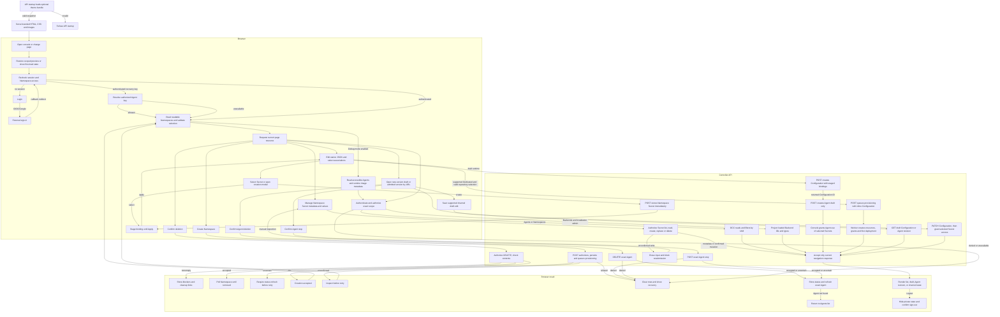

# Platform console request flow

## Overview

[Console reference](../reference/console.md).

## Entry Points

- Browser entry: `apps/controller/src/console/console.mjs` composes the session,
  request client, view lifetime, navigation, and shell.
- HTTP: `apps/controller/src/index.ts:createFastifyApp`.
- Startup: `apps/controller/src/composition/production.ts:composeProduction`
  and `development-postgres.ts:composePostgresDevelopment`.
- Requires a bootstrapped Installation, provisioned account, selected IAM Driver,
  same-origin controller, and the [API permissions](../reference/api.md)
  for each read or mutation.

## Flow

```mermaid
graph TD
  THEME["API startup loads optional theme bundle"] -->|valid snapshot| ASSET["Serve branded HTML, CSS and images"]
  THEME -->|invalid| FAIL["Refuse API startup"]
  ASSET --> A
  subgraph Browser["Browser"]
    A["Open console or change page"] --> B["Restore scoped preview or show first-load state"]
    B --> B1["Recheck session and Namespace access"]
    B1 -->|no session| C["Login"]
    C -->|OIDC/Google| C1["External sign-in"]
    B1 -->|authenticated recovery key| NR["Resolve authorized Agent key"]
    NR -->|allowed| D
    NR -->|unavailable| D
    C1 -->|callback redirect| B1
    B1 -->|authenticated| D["Read readable Namespaces and validate selection"]
    D -->|Debug mode enabled| DBG["Read accessible Agents and runtime image metadata"]
    DBG --> F
    D --> E["Request current page resource"]
    E --> NC["Create Namespace"]
    E --> ND["Confirm deletion"]
    E --> SEC["Manage Namespace Secret metadata and values"]
    E --> E1["Edit starter JSON and select associations"]
    E1 --> S1["Select Secret or open creation modal"]
    S1 -->|select| S3["Stage binding until Apply"]
    S3 -->|apply| E1
    E --> E2["Open new version draft or admitted version by URL"]
    E2 --> E3["Save supported channel draft edit"]
    E2 --> E4["Confirm Agent deletion"]
    E2 --> E5["Confirm Agent stop"]
  end
  subgraph Controller["Controller API"]
    ND --> NDELETE["Authorize DELETE; check contents"]
    E --> F["Authenticate and authorize exact scope"]
    F -->|Agents or Namespaces| G["OCC reads and filters by IAM"]
    F -->|Backends and Installation admin| H["Project loaded Backend IDs and types"]
    NC --> NPOST["POST authorizes, persists and queues provisioning"]
    S1 -->|create| S2["POST stores Namespace Secret immediately"]
    S2 --> S3
    SEC --> SAPI["Authorize Secret list, read, create, replace or delete"]
    SAPI -->|metadata or confirmed mutation| I
    SAPI -->|unconfirmed write| SU["Erase input and block resubmission"]
    SU -->|manual inspection| SEC
    E1 -->|draft runtime| M1["POST creates Configuration with staged bindings"]
    E1 -->|supported Dedicated and valid repository selection| M3["POST queues provisioning with inline Configuration"]
    M3 --> M4["Worker creates resources, grants and first deployment"]
    M1 -->|returned Configuration ID| M["POST creates Agent draft only"]
    M --> M2["Console grants Agent use of selected Secrets"]
    E2 --> N["GET draft Configuration or Agent revision"]
    E3 --> O["PATCH Configuration, then grant selected Secret access"]
    E4 --> P["DELETE exact Agent"]
    E5 --> P2["POST exact Agent stop"]
  end
  subgraph Result["Browser result"]
    NDELETE -->|nonempty| NB["Show blockers and cleanup links"]
    NDELETE -->|accepted| NP["Poll Namespace until removed"]
    NDELETE -->|uncertain| NRD["Require status refresh before retry"]
    G --> I["Accept only current navigation response"]
    H --> I
    NPOST -->|201| NSUCCESS["Creation accepted"]
    NPOST -->|unconfirmed| NUNKNOWN["Inspect before retry"]
    NPOST -->|refused| K
    NUNKNOWN --> D
    NSUCCESS --> D
    M2 --> I
    M4 --> I
    N --> I
    O --> I
    P -->|accepted or uncertain| Q["Show status and refresh exact Agent"]
    P2 -->|accepted or uncertain| Q
    P2 -->|denied| K
    P -->|denied| K
    Q -->|Agent not found| R["Return to Agents list"]
    I --> J["Render list, draft, Agent revision, or channel state"]
    F -->|denied or unavailable| K["Clear rows and show recovery"]
    J -->|Logout| L["Hide private state and confirm sign-out"]
  end
```

## Execution Trace

### 1. Compose discovery metadata and serve public assets

`apps/controller/src/api-startup.mjs:startApi` loads the [theme bundle](../reference/console/theming.md) once. Invalid bundles stop startup;
ConfigMap links stay inside the bundle. `renderConsoleThemeShell` escapes branding;
`console/shell.mts:brandContents` renders names as text. `/console/theme/` serves
images and generated CSS with `no-store`; missing assets return 404.

Startup passes Backend `{id,type}` to `createFastifyApp`.
[Backend-managed delivery](service-account-driver-credential-delivery.md) owns activation.

`apps/controller/src/console-assets.ts:readConsoleAsset` serves allowlisted HTML and assets with MIME types and same-origin CSP. Unknown paths return HTML 404s; API errors stay JSON. `encodedAsset` caches brotli/gzip output
according to `Accept-Encoding` and `Vary`; higher-weight `identity` wins.
HTML, including sign-in, stays uncompressed.

`scripts/build-console-metadata.mjs` stamps `OCC_BUILD_REVISION` into HTML.
`internal/occdev/openshell_k3d.go:importDevelopmentController` resolves Git `HEAD`
and runs the engine directly for cancellation and timing. Missing metadata
stops builds; the SHA excludes uncommitted edits.
`shell.mts:renderShell` displays it in Debug mode.

`console.mts:readDebugPreference` enables diagnostics only for local-storage
`oce.console.debug=true`. Storage failures default to off. `settingsView` saves,
clears retained views, and rebuilds the shell; failures show an error.
`navigation.mts` removes the old query flag.

`runtime-images.mts:renderRuntimeImages` limits reads to three concurrent requests
for readable Agents in the selected Namespace. `packages/occ/src/index.ts:OpenClawController.getAgentRuntimeImages`
authorizes Agent read, resolves its selected version, and calls its Compute Driver.
Disabling Debug mode stops new reads. See the
[Compute contract](../reference/drivers/compute.md) for provenance.

### 2. Resolve the session before private reads

`agents/collection.mts:renderAgentList` focuses the Agent link on plain row clicks.
Interactive targets, modified clicks, and selected text retain their behavior.

`loadPage` starts with `GET /api/auth/session`. Opening an Agent shows **Loading
agent details…** and **Back to Agents**. Back cancels once. Refocus waits. Loading
delays are 400 ms for other Agent routes and 250 ms for other visits or Refresh.
A visible loading page stays for 300 ms or longer.

Return and refocus hold the view inert. **Still checking…** appears after one
second. Up to 16 views retain drafts and disclosures by route, Namespace, and
session. Changed reads, newly readable Namespaces, and Refresh rebuild. A cancelled
return preserves the view. A cancelled Refresh discards it. Discovery, passwords,
mutations, and pending or failed reads prevent reuse. Read-only POSTs permit reuse.

`console.mts:revalidateMountedAgent` checks session, Namespace, Agent, and detail
reads. Focus and visibility share the check. Navigation cancels it. Detail errors
hide protected content. A 5xx permits one retry unless a refusal, 429, or delay
takes precedence. Narrowed access rebuilds. Both reused and replacement views
require confirmed Agent permissions for grant-dependent controls.

Persistent detail errors show a warning with the confirmed Agent name. **Retry**
starts foreground admission after the latest deadline. Expiry opens sign-in.
Refusals remove private content.

`api-client.mts:createApiClient` preserves abort and socket failures through
response bodies without replay.

**Back to Agents** waits for admission and the collection. The newest readable
versions supply the rows. `agents/collection.mts:currentRevision` reads off-page
current versions. `deniedReadsFor` retains 403s. Reused deployment cells show
**Reading deployment…** after 250 ms for at least 150 ms. Focus returns to the
cell. Pending or failed reads resume. Search cancels reads for rows it hides
(`collection.mts:retireHidden`). A row shown again reads once.

A changed user or session key clears private state. A missing session opens login.
See [sign-in and return](platform-console/sign-in-return.md) for recovery.

After authentication, `GET /namespaces` keeps the URL selection or picks the
first ready and readable Namespace. Unreadable IDs stay unavailable.
`shell.mts:namespaceSelector` hides choices during admission. Widening past 760 px
closes the drawer without focusing its toggle. An open drawer blocks scrolling.
`createShell` preserves navigation presses across renders. A Namespace switch
returns Agent detail and creation to Agents.

### 3. Authorize the selected page resource

`apps/controller/src/index.ts:perform`, `requireInstallationAdmin`

`packages/occ/src/index.ts:OpenClawController.listNamespaces`, `listAgents`

Agents and Secrets use the selected Namespace's route. OCC authorizes Namespace reads and
filters Agents by exact read permission; Namespace listing filters its
Installation-wide collection. No readable selection means no Agent request.
`GET /backends` ignores selection and requires Installation `administer` before
returning safe startup summaries. Empty configuration returns an empty list;
missing wiring or failed dependencies return errors.

`apps/controller/src/console/secrets.mts:renderSecrets` lists metadata and reads
the exact Secret's `consumers` and advisory `callerPermissions` before showing
actions, as the [Secrets guide](../guides/console/secrets.md) describes. Agent
names come from the readable Agent list. Known references disable Delete; the
server rechecks them. `console.mjs:takeLinkedSecret` keeps a `secret` link's ID
until the page shows it. Create and replacement wait for Namespace readiness.
Mutations use the tracked request client and Secret API, never a Driver.

`secrets.mjs:editValue` masks new input, preserves whitespace (CRLF becomes LF),
and clears it after the request, dismissal, or view retention
(`console.mjs:clearPasswordInputs`). Pending requests block navigation and
dismissal. A denied write disables submission; an unconfirmed write cannot be
replayed from that dialog. `secrets.mjs:confirmDelete` offers an explicit exact
status read after an uncertain delete; a denial never confirms removal.
Replacement hands delivery to explicit Agent deployment or CredentialSource
update under the [Secret delivery contract](../reference/drivers/kubernetes-secret.md#update-and-redeploy).

`apps/controller/src/console/namespaces.mts:renderNamespaces` tracks Name-rule-valid
`POST /namespaces`; `OpenClawController.createNamespace` authorizes and queues
provisioning; `perform` audits. Open Agents requires relisting. Closing refocuses
the opener; 403 disables it per account across navigation until Refresh (`fromRefresh`).
Pending writes prevent dismissal; 400s mark names; conflicts retain input.
Inspect unconfirmed responses.

`namespace-deletion.mts` blocks navigation/dismissal during writes. OCC rechecks
IAM/contents (20 blocker IDs/kind). `202`: three-second polling; `404`: remove row,
repair selection; `403`: lost access. `readStatus` requires exact ID and scalar
[NamespaceSchema status](../../packages/contracts/src/api/resources.ts). Failed/invalid
reads close confirmation. Uncertainty shows **Status unknown**;
[**Refresh status**](../guides/console/delete-namespace.md) restores confirmed status
and deletion actions.

Agents, Secrets and Create Agent read Namespace permissions. False `agents.create` or an Agent-refusing
[Namespace status](../reference/namespaces.md#lifecycle) explains why, rechecking on return; failed reads keep creation open.
Refused `GET /installation` saves only drafts. `agents/collection.mts` polls provisioning Namespaces;
omission disables Create (`NAMESPACE_MISSING`), clears rows and feedback, closes
confirmations, and ends polling. Its note replaces empty states. Late outcomes are
generic, without replay; 401 expires the session. Focus: Search. Failed reads retry.

See [Agent setup and provisioning](platform-console/agent-creation.md).

### 4–6. Edit the Agent and access runtime files

[Agent editing](platform-console/agent-editing.md) traces version rendering,
channels and credentials; [workspace files](platform-console/agent-workspace-files.md) and
[stop and deletion](platform-console/agent-stop-and-deletion.md) trace those operations;
[Agent sharing](platform-console/agent-sharing.md) traces policy writes.

`channels/slack.mjs:supportSlack` rejects shapes the editor cannot preserve. The
[editing flow](platform-console/agent-editing.md#4-render-draft-revision-or-channels)
owns DM policies and channel-only reply defaults. Admission snapshots native values;
Kubernetes `prepareRevision` carries them into `openclaw.json` without adding defaults.

`apps/controller/src/console/agents/detail.mts:renderAgentDetail` registers tabs
with `console.mjs:loadPage`. Within one Agent, Namespace and version, tabs replace
content; shell, native-admin and version controls remain mounted. Configuration
and revision reads are shared; direct Workspace URLs start neither. Refresh,
version changes and successful channel/authentication edits reload fully.
`console.mjs:deniedReadsFor` remembers audited Configuration/revision `403` paths
in owner-scoped tab `sessionStorage`. Later views show **Configuration unavailable**
without rereading; **Retry** forgets and rereads. Logout clears denials.

`agents/detail.mts:renderTab` reveals clipped tabs horizontally without changing
focus or vertical scroll. Its ResizeObserver repeats on resize, disconnects for
inactive/detached views, and re-arms on resume.
Tabs retain DOM/drafts except during pending/failed reads, passwords or mutations;
unmounted responses are ignored.
[Draft captures](platform-console/agent-editing.md#4-render-draft-revision-or-channels)
exclude passwords. Secret saves update the shared snapshot.
`agents/detail.mts:boundSecretsDenied` reuses Deploy's authorized names.
Configuration excludes Harness-only Secrets; Plugins/Credentials include them.
Epochs fence publication; rechecks clear names and refresh authorized reads.
Deploy keeps its last Secret operate answer until the refreshed one lands.
Late names preserve state/focus; metadata failures keep IDs; unknown grants stay generic.

[Save handling](platform-console/agent-editing.md#5-save-authentication-and-deploy-the-first-version)
owns receipts and draft retirement.

**Open vN Logs** opens the failed version from any version or draft. Logs reserves space;
Stop and Delete stay put. Direct navigation focuses and scrolls to the output; selecting
the tab leaves visible output in place. Recovery links scroll their version tab into view
and focus its tab control, smoothly unless the page rebuilds or motion is reduced.

[Runtime logs](agent-runtime-logs.md) explains access. A false `readLogs` in the Agent
permission answer skips the audited log read. Status `403` hides Pod details, not
separately authorized logs. Denials last until logout; newly granted `operate` permits another
status read. Refused reads or downloads clear the rows; late successes cannot restore them or
download. Refusing allowed log text rereads status at once, superseding stale reads. Back
rebuilds refused views, else shows the checked page. Refresh keeps rows and cursor until
replaced; rate-limit notices update at the retry time without rereading. New streams or
rejected cursors clear rows.

### 7. Commit only the current response, or clear the view

`apps/controller/src/console/console.mjs:loadPage`, `logout`

After full-page navigation settles, `loadPage` focuses the destination heading if
focus fell to the body, using `preventScroll` to preserve return position. An Agent
opened from the list focuses its heading when the title renders. Tabs (one Tab
stop; arrows move) and focused controls keep focus. Navigation, Namespace changes, and logout invalidate
reads; generations reject late responses. Refocus coalesces events.
`revalidateMountedAgent` rechecks session, Namespace, Agent, version, and
[permission answer](platform-console/agent-stop-and-deletion.md#stop-agent);
unchanged access preserves controls, input, and saves.
Refocus sends a fresh GET. A repeated 403 on a never-readable draft Configuration
keeps the partial Agent; a version proved unreadable is not read again.
Lost access scrubs; Agent, session, and scope failures clear their protected views.
Other pages revalidate before reuse, including a shown 403 or 404; forms defer the check.
Returning to the tab restores focus after the unchanged view is admitted, if the control
remains and the reader hasn’t moved on. Draft save baselines and Namespace scopes stay separate.

Other admission failures clear affected content;
a current protected `401` clears all private state. `pagehide` clears
private DOM, previews, and drafts even for BFCache; persisted `pageshow` performs
a fresh load. Failure views show local reasons and `req_<UUID>` request IDs. The
only backend text they show is a refusal the API explains (a 400 naming the field or
rule, a typed 409 naming the state), set as text. Backend authorization denial clears every retained preview,
including other Namespace selections, because the permission is Installation-wide.

The [detail action flow](platform-console/agent-stop-and-deletion.md#stop-agent) traces
acceptance, uncertainty, and replay guards. `agents/deletion.mts:refreshStatus` owns polling: 404 returns to Agents;
Postacceptance 403 stops polling without claiming completion.
See [asynchronous cleanup](../reference/agents.md#deletion).

Logout first hides private state, then calls the sign-out endpoint.
Confirmed success or session inspection proving absence replaces history with
login. An unconfirmed logout stays blocked with Retry. The
[authentication flow](local-password-authentication.md) owns server revocation;
this client never infers it from a network error.

## Deploy the new version

**Deploy new version** on the **Create new version** draft sends bodyless
`POST /namespaces/:namespaceId/agents/:agentId/deploy` after the checks and
uncertain-response handling that [Agent editing](platform-console/agent-editing.md#4-render-draft-revision-or-channels) traces.
**Operator-managed credentials** (`{ "method": "runtime" }`) skip managed setup; OCC
does not validate host credentials. The server saves the version; its read-only
details open while **Deployment activity** follows it. Workspace reads check
gateway startup and file availability.

## Debugging and Verification

- Match the displayed request ID to controller logs.
  A Namespace-only user cannot discover Backends; check Installation authority
  before treating that denial as a configuration problem.
- Browser suites use real Fastify, Better Auth, Native IAM, and in-memory storage.
  They verify navigation, isolation, creation, draft/history/channel editing, and
  authentication, not PostgreSQL persistence, Backend health, runtime dispatch,
  worker leases, or Compute effects.
- `node --test tests/browser/console-secrets.test.ts` exercises Secret mutation,
  Agent references, denials, and lost replies with passive test Secret storage.
  The `console-secrets` [QA scenario](../testing/ci/qa-advisory.md) selects real
  shipped storage; it requires the documented runtime and credential setup.
- API tests cover safe discovery, permission boundaries, empty versus missing
  wiring, static MIME/allowlisting, and unchanged API JSON errors. See
  [Testing](../testing/README.md) for commands and the image smoke boundary.

## Related docs

- [Namespaces](../reference/namespaces.md)
- [Authentication](../reference/authentication.md)

## Manual Notes

[keep this for the user to add notes. do not change between edits]

## Changelog

- 2026-11-10 19:58: Confirm Agent permissions on foreground replacement views. (authoring-run/57445f4b-6a65-40ef-9674-e13c069e9ba1 - 218f9a954709d3b45b33c1155ff8bd0f08c71c9b)

- 2026-11-10 19:34: Apply fresh Agent permissions on tab return and honor the latest retry deadline. (authoring-run/0b2e6bf4-e95a-40bc-bb95-bfba7d8bf0d6 - 62a330c3d6f9bb36f2772b6bcbae9c6d07063c2a)

- 2026-11-05 11:26: Move Debug mode from URL state to a saved browser preference in Settings. (authoring-run/4f118861-18d8-403b-a287-90ac81564c99 - 0351eb77180fbeea7c70114af7c8937a521b90b4)

- 2026-11-05 19:21: Record automatic Git SHA detection for local controller builds. (authoring-run/b294b13a-1a99-4f9a-8377-d76d11bfe62f - 0351eb77180fbeea7c70114af7c8937a521b90b4)
- 2026-11-05 22:43: Unconfirmed status. (authoring-run/104e0ca4-86db-492b-af14-750b4ea079f1 - 346f0db69fb93eb462822c7f5a7f600081f10847)

- 2026-11-05 20:13: Close stale confirmations. (namespace-cleanup-confirmation)

- 2026-11-03 15:16: Preserve page position during navigation. (authoring-run/4b6abf1f-bb48-4679-b2b0-4a62ba2834f6 - 44c2f77b611207eef71a69f82ab692c26dbea2bc)

- 2026-10-30 14:30: Keep Deploy's last Secret operate answer while a recheck rereads it. (bughunt-1030g - a382326dde)

- 2026-10-30 11:02: Name denied Secrets. (b03beb3e-57d1-47cf-829f-e31955a47d3c - f5d5dfda697a9e0d41c88a4e570dafcce768ec7b)

- 2026-10-30 09:32: Name authorized bound Secrets in the Configuration save permission hint. (b03beb3e-57d1-47cf-829f-e31955a47d3c - 755ff77baa3377441be0938302030386fa985c75)

- 2026-10-29 22:18: Cancel the unfinished row reads of Agents a search hides. (authoring-run/6f6ebb4a-7c4c-4bd7-a11c-8381c411c816 - 225ce0ebaf1dd14c01c5c50ccf8ac420e13c72a4)

- 2026-10-29 12:23: Retire denied Save views. (authoring-run/3ff450d4-971d-48f5-bb76-367dbfa06f25 - 5d8c060238a58)

- 2026-10-29 12:06: Clarify denials. (authoring-run/d43e9380-649f-4966-80a0-1fedecf36e05 - 4d68e053e69a1)

- 2026-10-29 11:42: Keep contextual request recovery and scope binding scrubbing to its preflight. (authoring-run/221d2fc5-7549-4054-a3ab-6b078a1755ae - aa74d9bc28d8c)
- 2026-10-29 10:44: Redact outcomes. (authoring-run/799eb0ca-6366-42a2-a2c1-3914595f0a61 - 134c539bdc6b712618bcb2a60788a4e5ba7810b0)

- 2026-10-29 10:33: Close row confirmations after Namespace loss. (authoring-run/615bd51e-99c7-4208-bfdd-9816f2ea20b8 - b3e4d127b04f2a5eb1e74ba619f9d720d40e7f33)

- 2026-10-29 10:25: Clear rows after Namespace access loss. (authoring-run/2fac9913-c631-4243-8ad0-758beda7f031 - bd67c46d5e5340e95d5e80bc850ebe41bc80f6ed)

[Platform console request documentation history](platform-console/history.md) preserves the older dated entries.
