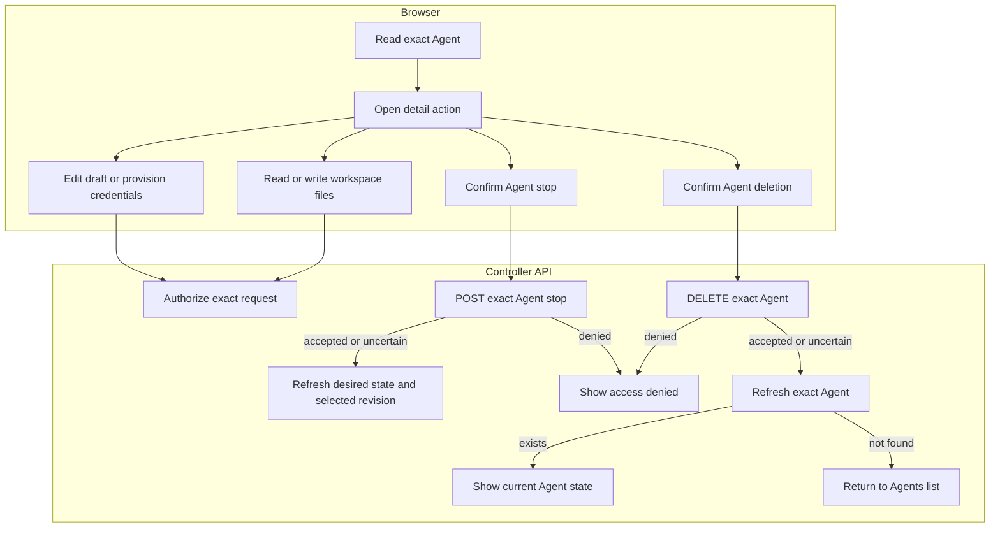

# Console Agent editing and runtime requests

## Overview

Follow authorized Agent detail requests through draft editing, initial
credentials, live workspace files, Agent stopping, and Agent deletion. This trace starts after
the console selects an exact Agent and ends with a rendered API response or the
return to the Agents list after confirmed deletion. See the
[parent flow](../platform-console.md) for the overall sequence.

## Entry Points

- `apps/controller/src/console/agents/detail.mjs:renderAgentDetail` loads the exact Agent and composes the detail actions.
- `apps/controller/src/console/agents/credentials.mjs:createRuntimeCredentialsPanel` submits explicitly entered credentials.
- `apps/controller/src/console/agents/workspace.mjs:renderWorkspaceFiles` opens live workspace files.
- A signed-in caller must hold each action's permission on the exact resource.

## Flow

## Execution Trace

### 4. Render draft, revision, or channels

`apps/controller/src/console/agents/detail.mjs:renderAgentDetail`

The detail page reads the Agent, revision list, and either the current Configuration in **New revision** or the selected AgentRevision. `revision=draft` reads the current
Configuration referenced by the Agent. `revision=<id>` reads that immutable
snapshot. The Selected revision badge is derived from `activeRevisionId`; the
newest revision and the viewed snapshot can both differ from that pointer.
The revision view reads persisted deployment status and startup failures; it
does not render a live serving-health indicator. Revision snapshots are read-only and do not expose rollback, edit, deploy, or live-health controls.
Stopping and deletion apply to the Agent itself, regardless of the viewed revision or tab.

`apps/controller/src/console/channels.mjs:renderChannels` renders supported
Slack channel settings in **New revision** only. Slack uses fixed unresolved
`SLACK_APP_TOKEN` and `SLACK_BOT_TOKEN` environment references. Existing native
Teams settings remain in Configuration JSON, with no card or editor. The
deployment guard still refuses Teams-enabled drafts because Console credential
readiness cannot be established for them. The Slack editor requires
dedicated execution for enabled channels and may refuse native documents that it
cannot round-trip, including non-Socket Slack settings, non-standard credential
references, mixed Slack mention settings, and unsupported plugin shapes.

Saving channels first rereads the Agent and Configuration, then checks that the
Agent still references the same Configuration generation. The subsequent PATCH
sends `{ values: updatedValues }` and omits `secretBindings`, so the backend
retains existing bindings. The preflight reads do not prevent a later concurrent write.
An interrupted or unavailable PATCH reply keeps the result unknown and blocks
another channel write until Refresh. Draft channel disablement changes only
Configuration values; it does not stop a running Agent. The
[console reference](../../reference/console.md#inspect-detail-revisions-and-channel-drafts)
describes the supported edits and their deployment boundaries.

### 5. Provision initial runtime credentials

`apps/controller/src/console/agents/credentials.mjs:createRuntimeCredentialsPanel`

The **Operator-managed credentials** selection saves `{ "method": "runtime" }`
without a source field. The console explains “Configured on the runtime host;
not validated by OCC.” This mode does not request managed credential metadata
or provisioning; it still requires readable revision history and unchanged draft
state before submitting deployment. API authorization and selected-driver
compatibility checks remain authoritative.

For managed authentication methods, the **New revision** view reads metadata from the exact Agent's `runtime-credentials`
endpoint. The response reports stored groups, not
provider validity or runtime health; an uncertain response requires a status
refresh before retrying.

OCC authorizes the exact Agent, locks its Namespace and Agent, and rejects
provisioning after any historical revision exists. The selected Compute Driver
derives Secret names and verifies Namespace and Agent ownership before writing.
Kubernetes creates only missing whole Secrets, generates transport tokens on the
server, and preserves existing matching groups on retry. Neither Configuration
nor the audit event receives credential bytes. External Secret creation cannot
be rolled back by a failed database transaction, so errors require readback.

Slack fields separately derive bound state from Configuration `secretBindings`.
Each bound field renders a synthetic password mask, never a saved Secret value.
Focusing the field clears the mask for replacement; an empty bound field keeps
its existing binding. The save gate requires at least one entered replacement
and either an existing binding or replacement for both token slots.

On explicit submission, the browser skips unchanged slots. For each replacement,
`storeChannelSecret` creates or updates the Namespace Secret and
`ensureSecretOperateBinding` grants the Agent access. The Configuration PATCH
preserves other bindings and incorporates the written Secret references. These
are separate writes; uncertain outcomes block another save until refresh. The
mask never enters the write set. Entered values clear after an attempt or panel
teardown; masks are recreated from bound metadata.

### 6. Read and replace live workspace files

`apps/controller/src/console/agents/workspace.mjs:renderWorkspaceFiles` opens from
`tab=workspace` after an exact Agent read. It bypasses Configuration and revision
history reads, because workspace contents belong to the live Agent. An Agent
without an active revision gets an unavailable explanation without file requests.

The editor issues one GET for each supported filename. A successful response
populates that file's editor; `404` permits an explicit create attempt, and other
failures leave it disabled. Save sends `{ content }` to the same exact-Agent PUT
route. It neither patches Configuration nor admits a revision. The existing
[workspace flow](../workspace-files.md) owns authorization and native file transport.
Each result stays local to its file. Unknown write outcomes require a successful
reload before another save; the editor never retries a write automatically.

Creation uses the channel editor to update the initial Configuration JSON before
its POST. Separately, `apps/controller/src/console/agents/create.mjs` submits the
four workspace textarea values as `initialWorkspaceFiles` plus
`workspaceDefaultsId` in the Agent POST. OCC stages these exact-Agent inputs
privately until Compute initializes the workspace before execution. This does
not require a deployed gateway. The [workspace setup flow](../workspace-files.md)
owns initialization, retry, and completion cleanup; the live editor above
becomes available after deployment.

### 7. Request a stop and read back the Agent

`apps/controller/src/console/agents/stop.mjs:createAgentStop` renders the control
composed by `apps/controller/src/console/agents/detail.mjs:renderAgentDetail`. Confirmation sends a
bodyless `POST` to the exact Agent's `/stop` route. OCC's
`packages/occ/src/index.ts:stopAgent` checks exact-Agent `operate`, persists the
requested stopped state, and queues reconciliation. The response proves
admission, not completed Compute shutdown.

**Refresh stop status** reads the exact Agent again. The control displays its
desired runtime state and selected revision without inferring live health or
completion from a missing revision. A permission denial stays inline. A
change to desired state or selected revision reloads the surrounding detail
view so native-admin and workspace controls refresh too. An uncertain write
blocks another stop until a successful read; the browser never
retries the mutation automatically. Deployment remains the resume operation,
admitting a new revision. The
[stop lifecycle](../../reference/agents/deployment.md#stop-and-resume) owns worker
shutdown and preservation of existing revisions, credentials, and state.

### 8. Confirm deletion and read back the Agent

`apps/controller/src/console/agents/deletion.mjs:createAgentDeletion`

The **Delete Agent** area requests explicit confirmation before sending a
bodyless `DELETE` to the exact Agent URL. The controller requires Agent `delete`
permission; a `403` stays visible on the detail page. An accepted request starts
asynchronous cleanup and keeps the detail page in a deleting state, with
**Refresh deletion status** for an exact Agent read. Only a not-found read after
an accepted or uncertain request, or when an already-deleting Agent is opened,
returns to the Agents list in the selected Namespace. An
uncertain deletion blocks another write until a successful read establishes the
current state; the browser never automatically retries the deletion.

`packages/occ/src/index.ts:deleteAgent` owns deletion admission. The
[Agent deletion reference](../../reference/agents.md#deletion) covers the
subsequent worker cleanup and the Namespace-owned resources it preserves.

## Debugging and Verification

- Stop requires exact-Agent `operate`. An accepted stop or an empty selected
  revision does not independently prove that Compute shutdown has finished.
- On `403`, check `delete` permission on the exact Agent; Agent `read` and
  `operate` do not authorize deletion. Use the displayed request ID when present.
- An accepted deletion remains in progress until the exact Agent read reports
  not found. A failed refresh does not establish whether cleanup finished.
- See [console failures](../../reference/console.md#failures-and-logout) for
  session, permission, and network recovery.

## Related docs

- [Return to the parent flow](../platform-console.md).
- [Console reference](../../reference/console.md)
- [Agent lifecycle reference](../../reference/agents.md#deletion)

## Manual Notes

[keep this for the user to add notes. do not change between edits]

## Changelog

- 2026-09-22 20:56: Rename the deployment-facing Console view to New revision. (01a0cc48-2eda-7fc2-a19e-096b68fccb7b - 081bccfcf3f5b114588dde1b42a0deb07f326017)

- 2026-09-22 20:43: Add confirmed Console stop requests and exact Agent state refresh. (01a0cc48-2eda-7fc2-a19e-096b68fccb7b - 6adfd148a517e84ae064a8e08438b051f80820fb)
- 2026-09-22 20:35: Trace metadata-derived Slack token masks and replacement-only Secret writes. (01a0cc48-2eda-7fc2-a19e-096b68fccb7b - 43776d25c5007e017f7d0ffdca6b06f063afcd37)
- 2026-09-22 20:23: Align Agent editing with supported Console controls. (01a0cc48-2eda-7fc2-a19e-096b68fccb7b - 43776d25c5007e017f7d0ffdca6b06f063afcd37)
- 2026-09-22 20:23: Remove the placeholder serving-status banner and unsupported Teams editor; retain deployment evidence and the Teams deployment guard. (01a0cc48-2eda-7fc2-a19e-096b68fccb7b - 43776d25c5007e017f7d0ffdca6b06f063afcd37) (NOT_IN_SPEC)
- 2026-09-21 21:46: Trace Agent deletion, readback, and recovery from denied or uncertain requests. (01a0c76f-2534-7991-932a-345782408759 - b61c3cae6c35e28db4153eaee9b477e8f5637894)
