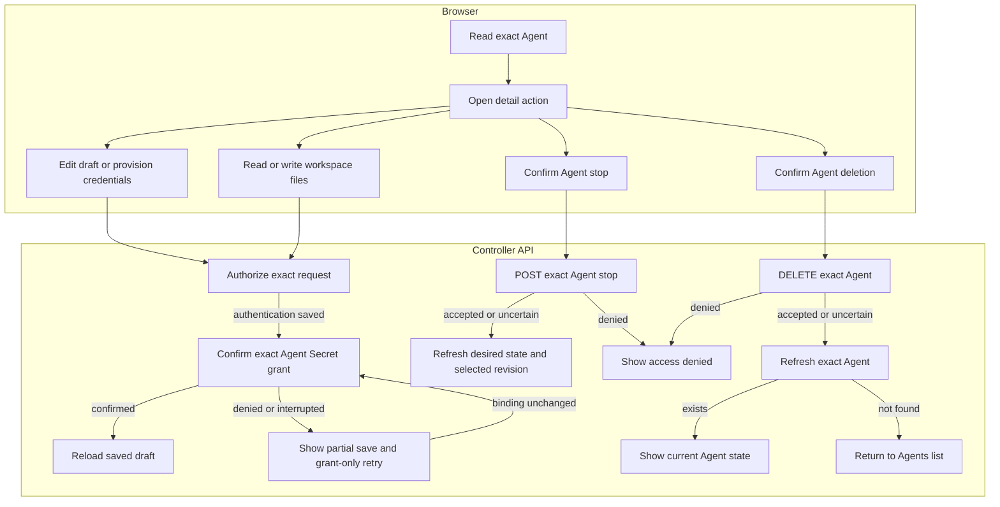

# Console Agent editing and runtime requests

## Overview

Trace authorized Agent detail requests for drafts, initial credentials, workspace
files, stopping, and deletion, from exact Agent selection to the rendered API
response or Agents list after confirmed deletion. See the
[parent flow](../platform-console.md).

## Entry Points

- `apps/controller/src/console/agents/detail.mjs:renderAgentDetail` loads the exact Agent and composes the detail actions.
- `apps/controller/src/console/agents/credentials.mjs:createRuntimeCredentialsPanel` submits explicitly entered credentials.
- `apps/controller/src/console/agents/workspace.mjs:renderWorkspaceFiles` opens live workspace files.
- A signed-in caller must hold each action's permission on the exact resource.

## Flow

## Execution Trace

### 4. Render draft, revision, or channels

`apps/controller/src/console/agents/detail.mjs:renderAgentDetail`

The detail page reads the Agent, revisions, and its current Configuration
(`revision=draft`) or immutable AgentRevision (`revision=<id>`). The Selected
revision badge uses `activeRevisionId`, which may differ from the newest or viewed
revision. Read-only snapshots show persisted deployment status and failures, not
live health, and offer no rollback. **Deploy new revision** admits the
current saved Configuration, not the viewed snapshot. **Edit current
Configuration** opens the current draft without copying historical values.
Stop and deletion target the Agent.

In the draft Configuration tab, **Edit Configuration** opens the native JSON
editor. It accepts an object and submits only `{ values }` to the existing exact
Namespace Configuration PATCH route, retaining omitted `secretBindings`. Before
writing, the browser rereads the Agent and Configuration and rejects a changed
Configuration ID or generation. This preflight is not an atomic compare-and-swap: a write can race after
the reads. The API retains Configuration authorization and generation ownership.

A successful save reloads the draft without changing admitted snapshots or
active revision selection. Invalid input, denied writes, and stale drafts retain
editor text. An uncertain mutation outcome blocks another save until successful
readback. Unsaved or unresolved edits block deployment of the old saved values.
Ordinary edits survive tab, revision, and page navigation; pending or unresolved
Configuration saves still block tab and revision changes until readback.

Deployment rereads the Agent, its current Configuration and, for managed
credentials, runtime credential metadata. It requires a current harness binding,
generated transport credentials and enabled Slack Secret bindings. Teams-enabled
drafts remain blocked. In the draft view, a changed Configuration association,
generation or harness binding requires refresh; from a snapshot the current saved
Configuration is selected. The browser sends a bodyless POST to the Agent deploy route and opens the
returned revision. Failed reads send no deployment request. An uncertain POST blocks
another deployment until reload; inspect revision history before retrying. These
reads do not make admission atomic.

`apps/controller/src/console/drafts.mjs:createDraftStore` owns document-local
snapshots. `console.mjs:resetReads` and `detail.mjs:renderTab` flush editor
captures before teardown. Each editor selects retained fields, excluding
passwords. Namespace and Agent keys isolate editors; session expiry, user changes,
logout, and page exit clear snapshots and captures. No browser storage or URL
carries draft contents. Preset variables,
Create Agent fields, and Agent search use the same store.

Configuration and authentication snapshots retain their original save baselines,
so fresh reads on reentry cannot silently authorize overwriting concurrent edits.
Channel snapshots retain their opening generation, raw controls, and staged Secret
metadata; a changed baseline disables Save until Cancel discards the drawer.
Saves clear captures; Cancel and reload discard edits. Pending saves retain
recovery guards.

`apps/controller/src/console/channels.mjs:renderChannels` renders Slack settings;
only **New revision** permits editing. Slack uses unresolved `SLACK_APP_TOKEN`
and `SLACK_BOT_TOKEN` environment references. Enabled channels require dedicated
execution. The editor rejects [unsupported native shapes](../../reference/console.md#inspect-detail-revisions-and-channel-drafts).
Teams remains visible only in native JSON; its unverified credential readiness
blocks Console deployment.

`agents/detail.mjs:renderConfigurationTab` reads draft Harness authentication
from the Agent, or admitted authentication and channel `secretBindings` from the
selected revision. `agents/secret-picker.mjs:renderSecretReference` checks the
source Namespace, then requests `/namespaces/:namespaceId/secrets/:secretId`.
Successful reads link names and IDs to metadata; absent, loading, and unavailable
states remain distinct. Failures retain IDs, stale tab responses are ignored, and
current 401s expire the session. Summaries need neither collection permission
nor Secret values.

`apps/controller/src/console/channels/slack.mjs:appendFields` separates channel
senders from DMs. Wildcard, empty, or omitted channel `users` selects **Allow
everyone**; explicit IDs fill the mutually exclusive input. Mention
requirements remain independent. `updatedSlack` replaces selected channels'
`users`, preserving unrelated settings and bindings.

The DM selector preserves omitted policies on existing configurations; new setup
starts with Allowlist. `validate` rejects empty/wildcard DM allowlists and
unsupported organization-wide policies. Selecting Open writes `allowFrom: ["*"]`;
leaving it for Allowlist or Pairing clears the wildcard input. Untouched lists
and native `dm.enabled` remain unchanged. Configuration save persists the
selection; redeployment applies it. See
[Slack policies](../../reference/configuration/secrets.md#native-channel-configuration).

`apps/controller/src/console/agents/detail.mjs:renderAgentDetail` supplies Namespace,
bindings, and Credentials URL to `channels/slack.mjs:credentialReferenceField`.
It loads `GET /namespaces/:namespaceId/secrets`; collection read is required.
`packages/occ/src/index.ts:listSecrets` filters records by exact Secret read
without calling the Secret Driver. Shared `agents/secret-picker.mjs:createSecretReferenceField`
filters names/IDs in a combobox. Arrows navigate, Enter selects, and Escape
restores the binding. Typing stages nothing; selection stages a reference,
Cancel discards it. Creation remains available.

`apps/controller/src/console/agents/secret-picker.mjs:openCreateSecretDialog` shows
an editable Agent-prefixed Name, password input, and optional fixed Slack key.
POST stores the Secret immediately and stages returned metadata; cancellation
never deletes it. Conflicts retain inputs without overwriting Secrets.
Readiness errors differ from name/backend conflicts. Success, cancellation, and uncertain outcomes clear passwords;
uncertain outcomes block retries until refresh. The
[Secret storage flow](../secret-storage-and-delivery.md) owns persistence and
recovery. Metadata and Credentials links open new tabs, preserving edits.
Values are never retrieved.

Saving channels first rereads the Agent and Configuration, then checks that the
Agent still references the same Configuration generation. The PATCH sends
`{ values: updatedValues }`, adding `secretBindings` only when selections changed.
It preserves unrelated bindings. If that PATCH is rejected, no new
Secret grant is written for the staged channel selection.

After the PATCH succeeds,
`apps/controller/src/console/agents/secret-access.mjs:ensureSecretOperateBinding` grants the Agent's service
principal access to the final selected Secrets through the Namespace IAM API.
Grants and Configuration updates are separate writes; a failed grant leaves
the Configuration saved. The detail view drops its cache so Agent Credentials
rereads saved bindings, then reports that a Namespace administrator must grant
Agent access to the saved Secret. It does not retry the rejected operation as a
fresh channel save. New Secrets remain Namespace-owned after drawer cancellation
or save failure. The preflight reads do not prevent a later concurrent write.
An interrupted or unavailable PATCH reply leaves the result unknown and blocks
channel writes until Refresh. Draft channel disablement changes only
Configuration values; it does not stop a running Agent. The
[console reference](../../reference/console.md#inspect-detail-revisions-and-channel-drafts)
describes the supported edits and their deployment boundaries.

### 5. Save authentication and provision initial runtime credentials

`apps/controller/src/console/agents/detail.mjs:renderAgentDetail` rereads the
Agent before saving authentication, rejecting a changed Configuration or binding.
After the Agent PATCH succeeds, it drops the cached detail snapshot and calls
`apps/controller/src/console/agents/secret-access.mjs:ensureSecretOperateBinding`
for a direct Secret source (`api_key` or `codex_pat`). The helper reads or creates
a role containing only Secret `operate`, then reads or creates an exact binding
for the Agent service principal and selected Secret in the current Namespace.
Grants use the signed-in actor's IAM authority. Issued accounts and runtime
authentication skip this path.

A failed grant preserves saved authentication and freezes its controls.
**Retry credential access** rereads the Agent, refuses changed bindings, and
repeats only the grant check. A lost committed grant response is recovered by
reading existing bindings. An unknown PATCH outcome blocks another save and
requires **Reload authentication source** before any grant attempt. The saved
binding and unresolved access survive navigation; deployment remains blocked
until access is confirmed or the source is explicitly reloaded. Server admission
remains authoritative. The deployment handler renders preflight and authorization
errors separately from credential metadata so its final control update cannot
erase the failure. Confirmed access does not establish provider readiness.

`apps/controller/src/console/agents/credentials.mjs:createRuntimeCredentialsPanel`

The **Operator-managed credentials** selection saves `{ "method": "runtime" }`
without a source field. This mode skips managed credential metadata and provisioning; it still requires readable revision history and unchanged draft
state before submitting deployment. API authorization and selected-driver
compatibility checks remain authoritative.

For managed authentication methods, the **New revision** view reads metadata from the exact Agent's `runtime-credentials`
endpoint. The response reports stored groups, not provider validity or runtime
health; an uncertain response requires a status refresh before retrying.

OCC authorizes the exact Agent, locks its Namespace and Agent, and rejects
provisioning after any historical revision exists. The selected Compute Driver
derives Secret names and verifies Namespace and Agent ownership before writing.
Kubernetes creates only missing whole Secrets, generates transport tokens on the
server, and preserves existing matching groups on retry. Neither Configuration
nor the audit event receives credential bytes. External Secret creation cannot
be rolled back by a failed database transaction, so errors require readback.

Slack fields separately derive bound state from Configuration `secretBindings`.
The shared Secret picker lists readable Namespace Secrets, shows the current
reference by name when metadata is readable or by ID when unavailable, and can
create a Namespace Secret without reading existing values.

On explicit submission, the browser PATCHes selected Secret references while
preserving other bindings, then calls `ensureSecretOperateBinding` for changed
and pending Secrets. A post-PATCH grant failure leaves bindings saved and blocks
deployment in the current view. Subsequent saves retry still-referenced pending
grants. Picker edits and rejected PATCHes preserve that warning; only a confirmed
grant or confirmed removal of its reference clears the pending Secret. Explicit
refresh resets local outcome tracking; the API always enforces Secret access.
Pickers switch references; shared Secret value rotation remains a separate operation.

### 6. Read and replace live workspace files

`apps/controller/src/console/agents/workspace.mjs:renderWorkspaceFiles` opens from
`tab=workspace` after an exact Agent read. It bypasses Configuration and revision
history reads: workspace contents belong to the live Agent. Without an active
revision, the Agent gets an unavailable explanation without file requests.

The editor GETs each supported filename. A successful response reauthorizes file
access before restoring retained text,
including empty edits. Drafts keep their original baseline; Reload replaces them
with the current file. `404` permits an explicit create attempt, and other
failures leave it disabled. Save sends `{ content }` to the same exact-Agent PUT
route. It neither patches Configuration nor admits a revision. The existing
[workspace flow](../workspace-files.md) owns authorization and native file transport.
Results are per file. Unknown write outcomes require a successful reload before
another save; the editor never retries a write automatically.

Creation uses the same channel editor to stage initial Configuration values and
Secret bindings before its POST; see the [creation trace](../platform-console.md#3-authorize-the-selected-page-resource).
Separately, `apps/controller/src/console/agents/create.mjs` submits the
four workspace textarea values as `initialWorkspaceFiles` plus
`workspaceDefaultsId` in the Agent POST. OCC stages these exact-Agent inputs
privately until Compute initializes the workspace before execution. No deployed
gateway is required. The [workspace setup flow](../workspace-files.md)
owns initialization, retry, and completion cleanup; the live editor above
becomes available after deployment.

### 7. Request a stop and read back the Agent

`apps/controller/src/console/agents/stop.mjs:createAgentStop` renders the control
composed by `apps/controller/src/console/agents/detail.mjs:renderAgentDetail`. Confirmation sends a
bodyless `POST` to the exact Agent's `/stop` route. OCC's
`packages/occ/src/index.ts:stopAgent` checks exact-Agent `operate`, persists the
requested stopped state, and queues reconciliation. The response proves
admission, not completed Compute shutdown.

**Refresh stop status** reads the exact Agent again. It displays desired runtime
state and selected revision without inferring live health or completion from a
missing revision. Permission denial stays inline. A
change to desired state or selected revision reloads the surrounding detail
view so native-admin and workspace controls refresh too. An uncertain write
blocks another stop until a successful read; the browser never
retries the mutation automatically. Deployment remains the resume operation,
admitting a new revision. The [stop lifecycle](../../reference/agents/deployment.md#stop-and-resume) owns
worker shutdown and preservation of revisions, credentials, and state.

### 8. Confirm deletion and read back the Agent

`apps/controller/src/console/agents/deletion.mjs:createAgentDeletion`

**Delete Agent** requests confirmation before sending a bodyless `DELETE` to the
exact Agent URL. The controller requires Agent `delete`; a `403` stays visible on
the detail page. An accepted request starts asynchronous cleanup and leaves the
detail page in a deleting state, with **Refresh deletion status** for an exact
Agent read. Only a not-found read after
an accepted or uncertain request, or when an already-deleting Agent is opened,
returns to the Agents list in the selected Namespace. An uncertain deletion
blocks another write until a successful read establishes the current state; the browser never automatically retries it.

`packages/occ/src/index.ts:deleteAgent` owns deletion admission. The
[Agent deletion reference](../../reference/agents.md#deletion) covers the
subsequent worker cleanup and the Namespace-owned resources it preserves.

## Debugging and Verification

- A denied Secret list requires collection `read`; a missing menu entry may lack
  exact Secret `read`. Saving bindings also requires caller `operate` on those
  Secrets, Configuration update, and Namespace IAM authority to grant Agent use.
- After a partial save, inspect Configuration, Secret metadata, and Agent IAM
  bindings before retrying. Storage and binding do not prove runtime delivery;
  deploy and verify the consuming Agent.
- Stop requires exact-Agent `operate`. An accepted stop or empty selected revision
  does not prove Compute shutdown finished.
- On `403`, check exact-Agent `delete`; Agent `read` and `operate` do not authorize
  deletion. Use the displayed request ID when present.
- An accepted deletion remains in progress until the exact Agent read reports not found. A
  failed refresh does not establish whether cleanup finished.
- See [console failures](../../reference/console.md#failures-and-logout) for
  session, permission, and network recovery.

## Related docs

- [Return to the parent flow](../platform-console.md).
- [Console reference](../../reference/console.md)
- [Agent lifecycle reference](../../reference/agents.md#deletion)

## Manual Notes

[keep this for the user to add notes. do not change between edits]

## Changelog

- 2026-09-26 18:38: Trace searchable Secret selection, editable names, and duplicate-name recovery. (01a0e069-9ef8-7d81-802c-82c72c1f1e5d - dc07fe34cd2b0057693777acf4db394d211da393)

- 2026-09-26 00:37: Trace exact Secret metadata reads for draft and immutable revision summaries in the accompanying change. (01a0db1e-7ab2-7bf1-936b-e71c9d6f9911 - e387b38cc259ee4a55936ecb848bbce8210bcd68)

- 2026-09-25 01:15: Trace DM policy selection, sender validation, and organization-wide restrictions. (01a0d5e6-743e-7743-8a5e-2d8c24b78b81 - 919f92c3bb3ea63acf7042b138e9a0c6e1d97719)

- 2026-09-25 00:24: Trace authentication Secret grants, partial-save recovery, and persistent deployment errors in the accompanying change. (01a0d5ee-ab06-7571-8d4a-9ae0f33d5737 - 5f2f3a7448c7f5f0f4a5ed08be2395f2c5623ed7)
- 2026-09-24 22:03: Trace shared document-local drafts, navigation capture, explicit discard, and retained save baselines. (01a0d557-f6e3-7da2-af52-993d05735554 - a91cbfdd37b64c88b7ee48647096ff6bfd993e02)

- 2026-09-23 19:52: Record unsupported mixed Slack sender lists, unrepresentable sender IDs, and channel wildcard maps in the simple drawer. (01a0d150-104a-71a3-9e56-6c5e3ee510ea - 77aedc620f443056f9ee859050b8dc657a9c3133)

- 2026-09-23 08:30: Trace Slack Secret menus, immediate creation, staged bindings, and explicit IAM grants before Configuration save. (01a0cd92-fd3f-7d83-a51e-f6264ef6be09 - 941edc9f6971a24ae29a74a6ca749b6375e6ec01)

- 2026-09-23 02:26: Trace Slack credential navigation and preservation of unsaved channel edits; remove the generic drawer sharing footnote. (01a0cd92-fd3f-7d83-a51e-f6264ef6be09 - 380f7706e2856f1ac1e3bed7f5ddd9c71d133ba8)
- 2026-09-24: Use shared Secret pickers for draft harness authentication and Slack runtime credential bindings; switching references no longer overwrites existing Secret values.

- 2026-09-22 23:30: Trace native Configuration draft editing, save checks, and immutable snapshot navigation. (01a0ccc0-00fa-7173-ab45-f7a5fb55b3b6 - 0dabaafb97326254e5ae173491be014aaa6388c6)

- 2026-09-22 20:56: Rename the deployment-facing Console view to New revision. (01a0cc48-2eda-7fc2-a19e-096b68fccb7b - 081bccfcf3f5b114588dde1b42a0deb07f326017)

- 2026-09-22 20:43: Add confirmed Console stop requests and exact Agent state refresh. (01a0cc48-2eda-7fc2-a19e-096b68fccb7b - 6adfd148a517e84ae064a8e08438b051f80820fb)
- 2026-09-22 20:35: Trace metadata-derived Slack token masks and replacement-only Secret writes. (01a0cc48-2eda-7fc2-a19e-096b68fccb7b - 43776d25c5007e017f7d0ffdca6b06f063afcd37)
- 2026-09-22 20:23: Align Agent editing with supported Console controls. (01a0cc48-2eda-7fc2-a19e-096b68fccb7b - 43776d25c5007e017f7d0ffdca6b06f063afcd37)
- 2026-09-22 20:23: Remove the placeholder serving-status banner and unsupported Teams editor; retain deployment evidence and the Teams deployment guard. (01a0cc48-2eda-7fc2-a19e-096b68fccb7b - 43776d25c5007e017f7d0ffdca6b06f063afcd37) (NOT_IN_SPEC)
- 2026-09-21 21:46: Trace Agent deletion, readback, and recovery from denied or uncertain requests. (01a0c76f-2534-7991-932a-345782408759 - b61c3cae6c35e28db4153eaee9b477e8f5637894)
