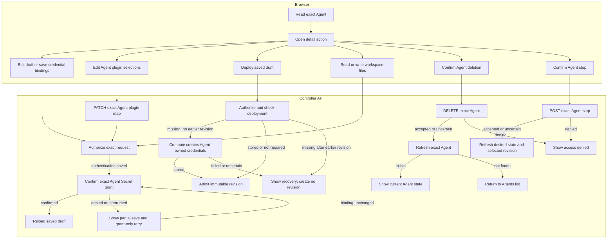

# Console Agent editing and runtime requests

## Overview

Trace authorized Agent detail requests for draft edits, credentials, workspace
files, stopping, and deletion. The trace starts with exact Agent selection and
ends with the API response or Agents list after confirmed deletion. See the
[parent flow](../platform-console.md).

## Entry Points

- `apps/controller/src/console/agents/detail.mjs:renderAgentDetail` loads the exact Agent and composes the detail actions.
- `apps/controller/src/console/agents/credentials.mjs:createChannelSecretsPanel` saves channel Secret bindings.
- `packages/occ/src/index.ts:OpenClawController.deployAgent` admits a revision after first-deployment credential setup.
- A signed-in caller must hold each action's permission on the exact resource.

## Flow

## Execution Trace

### 4. Render draft, revision, or channels

`apps/controller/src/console/agents/detail.mjs:renderAgentDetail`

The detail page reads the Agent, readable revisions, and current Configuration
(`revision=draft`) or immutable AgentRevision (`revision=<id>`).
**Current version** uses `activeRevisionId` regardless of the viewed version.
**View version vN** opens read-only details without changing selection.
**Deployment activity** reads the most recent visible version's persisted status;
milestones project `queued`, `running`, `succeeded`, or `failed`, not live
health. The viewed version shows its own result. **Refresh deployment** rereads
activity and Agent selection.
**Current observations** runs exact-version diagnostics only on demand. Its
timestamped `succeeded`, `failed`, or `unknown` checks do not change deployment
status. The bodyless POST requires Agent `read` and `operate` plus exact
AgentRevision `read`.
**Create new version** opens the saved draft; **Deploy new version** admits its
Configuration and Agent plugin selections. **Edit current Configuration** does
not copy historical values. Stop and deletion target the Agent.

In the draft, **Edit Configuration** PATCHes only `{ values }` from a JSON
object to the exact Namespace Configuration, preserving `secretBindings`.
It rereads Agent and Configuration, rejecting changed ID or generation.
Writes can race after these reads; the API owns authorization and generation.

Saving reloads the draft without changing admitted snapshots. Invalid input,
denial, and stale drafts retain editor text. Uncertain saves require readback.
Unsaved edits block deployment; pending saves block tab and version changes.

The **Plugins** tab renders Agent selections with
`apps/controller/src/console/agents/plugin-fields.mjs:createPluginFields`.
**Save plugin selections** PATCHes the Agent map without changing Configuration
or admitted revisions. The Driver validates policy; deployment freezes the map.
Admitted revisions are read-only. See the
[plugin deployment flow](../agent-plugins.md).

Before deployment, the browser rereads the Agent and current Configuration. It
requires harness authentication and Slack Secret bindings, and blocks Teams.
Changed draft associations, generations, authentication, or plugin selections
require refresh. A snapshot view still deploys current saved settings. Failed
reads send no bodyless Agent deploy POST; success opens the returned revision.
An uncertain POST requires revision-history readback before retry. OCC provisions
first-time transport credentials below. Browser reads are not atomic with admission.

`apps/controller/src/console/drafts.mjs:createDraftStore` keeps document-local
snapshots. `console.mjs:resetReads` and `detail.mjs:renderTab` capture selected
fields before teardown, excluding passwords. Namespace and Agent keys isolate
editors; session expiry, user change, logout, and page exit clear them. Drafts
never enter browser storage or URLs. Preset variables, Create Agent fields, and
Agent search share the store. Configuration and authentication retain their save
baselines, preventing reentry from authorizing an overwrite of concurrent edits.
Channel snapshots retain opening generation, controls, and staged Secret metadata;
a changed baseline disables Save until Cancel. Saves clear captures; Cancel and
reload discard edits. Pending saves retain recovery guards.

`apps/controller/src/console/channels.mjs:renderChannels` renders Slack settings;
only **Create new version** permits editing. Slack uses unresolved
`SLACK_APP_TOKEN` and `SLACK_BOT_TOKEN` references and requires dedicated
execution. The editor rejects [unsupported native shapes](../../reference/console.md#inspect-detail-revisions-and-channel-drafts).
Teams remains in native JSON and blocks Console deployment.

`agents/detail.mjs:renderConfigurationTab` reads draft Harness authentication
from the Agent, or admitted authentication and channel `secretBindings` from the
revision. `agents/secret-picker.mjs:renderSecretReference` checks the source
Namespace and reads exact Secret metadata. Successful reads link names and IDs;
absent, loading, and unavailable states remain distinct. Failures retain IDs;
stale responses are ignored and current 401s expire the session. Summaries need
neither collection permission nor Secret values.

`apps/controller/src/console/channels/slack.mjs:appendFields` separates channel
senders from DMs. Wildcard, empty, or omitted channel `users` selects **Allow
everyone**; explicit IDs fill the mutually exclusive input. Mention
requirements remain independent. `updatedSlack` replaces selected channels'
`users`, preserving unrelated settings and bindings.

The DM selector preserves omitted policies on existing configurations; new setup
starts with Allowlist. `validate` rejects empty/wildcard DM allowlists and
unsupported organization-wide policies. Selecting Open writes `allowFrom: ["*"]`;
leaving it for Allowlist or Pairing clears the wildcard input. Untouched lists
and native `dm.enabled` remain unchanged. Configuration save persists the
selection; redeployment applies it. See
[Slack policies](../../reference/configuration/secrets.md#native-channel-configuration).

`apps/controller/src/console/agents/detail.mjs:renderAgentDetail` supplies Namespace,
bindings, and Credentials URL to `channels/slack.mjs:credentialReferenceField`.
It loads `GET /namespaces/:namespaceId/secrets`; collection read is required.
`packages/occ/src/index.ts:listSecrets` filters records by exact Secret read
without calling the Secret Driver. Shared `agents/secret-picker.mjs:createSecretReferenceField`
filters names/IDs in a combobox. Arrows navigate, Enter selects, and Escape
restores the binding. Typing stages nothing; selection stages a reference,
Cancel discards it. Creation remains available.

`apps/controller/src/console/agents/secret-picker.mjs:openCreateSecretDialog` shows
an editable Agent-prefixed Name, password input, and optional fixed Slack key.
POST stores the Secret immediately and stages returned metadata; cancellation
never deletes it. Conflicts retain inputs without overwriting Secrets.
Readiness errors differ from name/backend conflicts. Success, cancellation, and uncertain outcomes clear passwords;
uncertain outcomes block retries until refresh. The
[Secret storage flow](../secret-storage-and-delivery.md) owns persistence and
recovery. Metadata and Credentials links open new tabs, preserving edits.
Values are never retrieved.

Saving channels rereads Agent and Configuration and checks their association and
generation. The PATCH sends `{ values: updatedValues }`, adding `secretBindings`
only for changed selections and preserving others. A rejected PATCH writes no
new Secret grant.

After PATCH, `apps/controller/src/console/agents/secret-access.mjs:ensureSecretOperateBinding`
grants the Agent service principal access to selected Secrets through Namespace
IAM. A failed grant leaves Configuration saved. The detail view rereads bindings
and asks a Namespace administrator to grant access; it does not repeat the
channel save. New Secrets remain Namespace-owned after cancellation or failure.
Preflight reads cannot prevent a later race. An uncertain PATCH blocks another
channel write until Refresh. Disabling a draft channel changes Configuration;
it does not stop a running Agent. The
[console reference](../../reference/console.md#inspect-detail-revisions-and-channel-drafts)
describes the supported edits and their deployment boundaries.

### 5. Save authentication and deploy the first revision

`apps/controller/src/console/agents/detail.mjs:renderAgentDetail` rereads the
Agent before saving authentication and rejects changed bindings. After PATCH,
`apps/controller/src/console/agents/secret-access.mjs:ensureSecretOperateBinding`
grants the Agent service principal exact Secret `operate` for a direct source
(`api_key` or `codex_pat`). It reuses or creates a role and binding through the
signed-in actor's IAM authority. Issued accounts and runtime authentication
skip this grant.

A failed grant leaves authentication saved and freezes its controls.
**Retry credential access** rereads the Agent, rejects changed bindings, and
rechecks only the grant; reading bindings recovers a lost grant response. An
unknown PATCH outcome requires **Reload authentication source** before another
save or grant. Saved bindings and unresolved access survive navigation;
deployment stays blocked until confirmation or explicit reload. Server admission
remains authoritative. The deployment handler preserves preflight and
authorization errors separately from credential metadata. Confirmed access
does not establish provider readiness.

`apps/controller/src/console/agents/credentials.mjs:createChannelSecretsPanel`

**Operator-managed credentials** saves `{ "method": "runtime" }` without a
source. It requires readable revision history and an unchanged draft;
API authorization and Driver compatibility checks remain authoritative.

**Create new version** shows bound channel Secrets when Slack is enabled. The browser
requests no generated transport input or status. Bound Secrets do not prove
live health.

When Compute needs generated credentials, `OpenClawController.deployAgent`
checks transport status before admission. If missing and no revision exists, it
requires Agent `read` and `operate` alongside `deploy`, then calls Compute. The
Driver derives Secret names, checks ownership and workloads, creates only
missing whole Secrets, and preserves matching groups on retry. Credential bytes
enter neither Configuration nor audit. Failure creates no revision; retry checks
status again. Lost deployment replies require revision-history readback. Missing
credentials after a historical revision require operator investigation. Model
and channel Secrets remain separate.

Slack fields separately derive bound state from Configuration `secretBindings`.
The shared Secret picker lists readable Namespace Secrets, shows the current
reference by name when metadata is readable or by ID when unavailable, and can
create a Namespace Secret without reading existing values.

On explicit submission, the browser PATCHes selected Secret references while
preserving other bindings, then calls `ensureSecretOperateBinding` for changed
and pending Secrets. A post-PATCH grant failure leaves bindings saved and blocks
deployment in the current view. Subsequent saves retry still-referenced pending
grants. Picker edits and rejected PATCHes preserve that warning; only a confirmed
grant or confirmed removal of its reference clears the pending Secret. Explicit
refresh resets local outcome tracking; the API always enforces Secret access.
Pickers switch references; shared Secret value rotation remains a separate operation.

### 6. Read and replace live workspace files

`apps/controller/src/console/agents/workspace.mjs:renderWorkspaceFiles` opens from
`tab=workspace` after an exact Agent read. It bypasses Configuration and revision
history reads: workspace contents belong to the live Agent. Without an active
revision, the Agent gets an unavailable explanation without file requests.

The editor GETs each supported filename. A successful response reauthorizes file
access before restoring retained text,
including empty edits. Drafts keep their original baseline; Reload replaces them
with the current file. `404` permits an explicit create attempt, and other
failures leave it disabled. Save sends `{ content }` to the same exact-Agent PUT
route. It neither patches Configuration nor admits a revision. The existing
[workspace flow](../workspace-files.md) owns authorization and native file transport.
Results are per file. Unknown write outcomes require a successful reload before
another save; the editor never retries a write automatically.

Creation uses the same channel editor to stage initial Configuration values and
Secret bindings before its POST; see the [creation trace](../platform-console.md#3-authorize-the-selected-page-resource).
Separately, `apps/controller/src/console/agents/create.mjs` submits the
four workspace textarea values as `initialWorkspaceFiles` plus
`workspaceDefaultsId` in the Agent POST. OCC stages these exact-Agent inputs
privately until Compute initializes the workspace before execution. No deployed
gateway is required. The [workspace setup flow](../workspace-files.md)
owns initialization, retry, and completion cleanup; the live editor above
becomes available after deployment.

### 7. Request a stop and read back the Agent

`apps/controller/src/console/agents/stop.mjs:createAgentStop` renders the control
composed by `apps/controller/src/console/agents/detail.mjs:renderAgentDetail`. Confirmation sends a
bodyless `POST` to the exact Agent's `/stop` route. OCC's
`packages/occ/src/index.ts:stopAgent` checks exact-Agent `operate`, persists the
requested stopped state, and queues reconciliation. The response proves
admission, not completed Compute shutdown.

**Refresh stop status** reads the exact Agent again. It displays desired runtime
state and selected revision without inferring live health or completion from a
missing revision. Permission denial stays inline. A
change to desired state or selected revision reloads the surrounding detail
view so native-admin and workspace controls refresh too. An uncertain write
blocks another stop until a successful read; the browser never
retries the mutation automatically. Deployment remains the resume operation,
admitting a new revision. The [stop lifecycle](../../reference/agents/deployment.md#stop-and-resume) owns
worker shutdown and preservation of revisions, credentials, and state.

### 8. Confirm deletion and read back the Agent

`apps/controller/src/console/agents/deletion.mjs:createAgentDeletion`

**Delete Agent** requests confirmation before sending a bodyless `DELETE` to the
exact Agent URL. The controller requires Agent `delete`; a `403` stays visible on
the detail page. An accepted request starts asynchronous cleanup and leaves the
detail page in a deleting state, with **Refresh deletion status** for an exact
Agent read. Only a not-found read after
an accepted or uncertain request, or when an already-deleting Agent is opened,
returns to the Agents list in the selected Namespace. An uncertain deletion
blocks another write until a successful read establishes the current state; the browser never automatically retries it.

`packages/occ/src/index.ts:deleteAgent` owns deletion admission. The
[Agent deletion reference](../../reference/agents.md#deletion) covers the
subsequent worker cleanup and the Namespace-owned resources it preserves.

## Debugging and Verification

- A denied Secret list requires collection `read`; a missing menu entry may lack
  exact Secret `read`. Saving bindings also requires caller `operate` on those
  Secrets, Configuration update, and Namespace IAM authority to grant Agent use.
- After a partial save, inspect Configuration, Secret metadata, and Agent IAM
  bindings before retrying. Storage and binding do not prove runtime delivery;
  explicitly deploy and verify the consuming Agent.
- Compare saved `Agent.plugins` with the viewed revision's plugin snapshot after
  a plugin edit. A successful Agent update does not install or activate plugins;
  deploy and inspect startup status separately.
- Stop requires exact-Agent `operate`. An accepted stop or an empty selected
  revision does not independently prove that Compute shutdown has finished.
- On `403`, check `delete` permission on the exact Agent; Agent `read` and
  `operate` do not authorize deletion. Use the displayed request ID when present.
- An accepted deletion remains in progress until the exact Agent read reports
  not found. A failed refresh does not establish whether cleanup finished.
- See [console failures](../../reference/console.md#failures-and-logout) for
  session, permission, and network recovery.

## Related docs

- [Return to the parent flow](../platform-console.md).
- [Console reference](../../reference/console.md)
- [Agent lifecycle reference](../../reference/agents.md#deletion)
- [Agent plugin flow](../agent-plugins.md)

## Manual Notes

[keep this for the user to add notes. do not change between edits]

## Changelog

- 2026-09-26 18:38: Trace searchable Secret selection, editable names, and duplicate-name recovery. (01a0e069-9ef8-7d81-802c-82c72c1f1e5d - dc07fe34cd2b0057693777acf4db394d211da393)

- 2026-09-26 17:42: Trace Console plugin draft saves and immutable revision views in the accompanying change. (authoring-run/3aa63184-7716-4d27-90ed-33974110d0f5 - cdd6e3c8413f7cca4909f98d2d4c5f6bd17dbe54)

- 2026-09-26 05:16: Document first-deployment transport credentials; the SHA is the inspected baseline. (authoring-run/62448d39-d070-4830-87c3-cc8b66dece6f - 2a0f94bec87f9358f78a4e22d69404f87e16b989)

- 2026-09-26 00:37: Trace exact Secret metadata reads for draft and immutable revision summaries in the accompanying change. (01a0db1e-7ab2-7bf1-936b-e71c9d6f9911 - e387b38cc259ee4a55936ecb848bbce8210bcd68)

- 2026-09-25 01:15: Trace DM policy selection, sender validation, and organization-wide restrictions. (01a0d5e6-743e-7743-8a5e-2d8c24b78b81 - 919f92c3bb3ea63acf7042b138e9a0c6e1d97719)

- 2026-09-25 00:24: Trace authentication Secret grants, partial-save recovery, and persistent deployment errors in the accompanying change. (01a0d5ee-ab06-7571-8d4a-9ae0f33d5737 - 5f2f3a7448c7f5f0f4a5ed08be2395f2c5623ed7)
- 2026-09-24 22:03: Trace shared document-local drafts, navigation capture, explicit discard, and retained save baselines. (01a0d557-f6e3-7da2-af52-993d05735554 - a91cbfdd37b64c88b7ee48647096ff6bfd993e02)

- 2026-09-23 19:52: Record unsupported mixed Slack sender lists, unrepresentable sender IDs, and channel wildcard maps in the simple drawer. (01a0d150-104a-71a3-9e56-6c5e3ee510ea - 77aedc620f443056f9ee859050b8dc657a9c3133)

- 2026-09-23 08:30: Trace Slack Secret menus, immediate creation, staged bindings, and explicit IAM grants before Configuration save. (01a0cd92-fd3f-7d83-a51e-f6264ef6be09 - 941edc9f6971a24ae29a74a6ca749b6375e6ec01)

- 2026-09-23 02:26: Trace Slack credential navigation and preservation of unsaved channel edits; remove the generic drawer sharing footnote. (01a0cd92-fd3f-7d83-a51e-f6264ef6be09 - 380f7706e2856f1ac1e3bed7f5ddd9c71d133ba8)
- 2026-09-24: Use shared Secret pickers for draft harness authentication and Slack runtime credential bindings; switching references no longer overwrites existing Secret values.

- 2026-09-22 23:30: Trace native Configuration draft editing, save checks, and immutable snapshot navigation. (01a0ccc0-00fa-7173-ab45-f7a5fb55b3b6 - 0dabaafb97326254e5ae173491be014aaa6388c6)

- 2026-09-22 20:56: Rename the deployment-facing Console view to New revision. (01a0cc48-2eda-7fc2-a19e-096b68fccb7b - 081bccfcf3f5b114588dde1b42a0deb07f326017)

- 2026-09-22 20:43: Add confirmed Console stop requests and exact Agent state refresh. (01a0cc48-2eda-7fc2-a19e-096b68fccb7b - 6adfd148a517e84ae064a8e08438b051f80820fb)
- 2026-09-22 20:35: Trace metadata-derived Slack token masks and replacement-only Secret writes. (01a0cc48-2eda-7fc2-a19e-096b68fccb7b - 43776d25c5007e017f7d0ffdca6b06f063afcd37)
- 2026-09-22 20:23: Align Agent editing with supported Console controls. (01a0cc48-2eda-7fc2-a19e-096b68fccb7b - 43776d25c5007e017f7d0ffdca6b06f063afcd37)
- 2026-09-22 20:23: Remove the placeholder serving-status banner and unsupported Teams editor; retain deployment evidence and the Teams deployment guard. (01a0cc48-2eda-7fc2-a19e-096b68fccb7b - 43776d25c5007e017f7d0ffdca6b06f063afcd37) (NOT_IN_SPEC)
- 2026-09-21 21:46: Trace Agent deletion, readback, and recovery from denied or uncertain requests. (01a0c76f-2534-7991-932a-345782408759 - b61c3cae6c35e28db4153eaee9b477e8f5637894)
