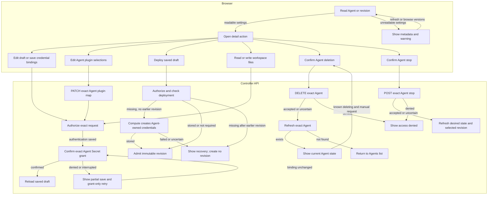

# Console Agent editing and runtime requests

## Overview

Trace authorized Agent detail edits, credentials, workspace, stopping, and deletion
from exact Agent selection through API response or confirmed deletion. See the
[parent flow](../platform-console.md).

## Entry Points

- `apps/controller/src/console/agents/detail.mjs:renderAgentDetail` loads the exact Agent and composes the detail actions.
- `apps/controller/src/console/agents/credentials.mjs:createChannelSecretsPanel` saves channel Secret bindings.
- `packages/occ/src/index.ts:OpenClawController.deployAgent` admits a revision after first-deployment credential setup.
- A signed-in caller must hold each action's permission on the exact resource.

## Flow

## Execution Trace

### 4. Render draft, revision, or channels

`apps/controller/src/console/agents/detail.mjs:renderAgentDetail`

The page reads Agent, readable revisions, and current Configuration
(`revision=draft`) or immutable AgentRevision (`revision=<id>`).
`packages/occ/src/index.ts` uses `listAgents`, `listRevisions`,
`getAgentForBrowsing`, and `getRevisionForBrowsing` for browsing.
`packages/occ/src/state/postgres-state.ts:browseSavedConfiguration` turns
payload-decode failures into metadata plus `configurationReadError`; queries
and operational reads remain strict. Drafts and revisions decode independently.
The UI retains navigation, blocks editing/deployment of unreadable drafts, and
never substitutes defaults. Exact-resource permissions still apply.
**Current version** uses `activeRevisionId`; **View version vN** opens read-only
details without activating it. **Deployment activity** shows the newest readable
version's persisted `queued`, `running`, `succeeded`, or `failed` status, not live
health. Viewed versions show their own results. Pending activity is reread every
`DEPLOYMENT_POLL_MS` (`apps/controller/src/console/agents/detail.mjs`) until a
result or read error; a new result also rereads selection. **Refresh deployment** rereads
activity and selection. **Current observations** requests timestamped
`succeeded`, `failed`, or `unknown` diagnostics without changing deployment status.
Its bodyless POST requires Agent `read`/`operate` and exact AgentRevision `read`.
**Create new version** opens the saved draft; **Deploy new version** admits its
Configuration and Agent plugin selections. **Edit current Configuration** does
not copy historical values. Stop and deletion target the Agent.

In the draft, **Edit Configuration** PATCHes only `{ values }` from a JSON
object to the exact Namespace Configuration, preserving `secretBindings`.
It rereads Agent and Configuration, rejecting changed ID or generation.
Writes can race after these reads; the API owns authorization and generation.

**Enable gateway password access** stages `gateway.auth.password` referencing
`OPENCLAW_GATEWAY_PASSWORD` through this editor. Other settings, Secret bindings, and
admitted versions remain unchanged; Cancel discards the edit. On deployment, Kubernetes `gatewayConfiguration` detects the reference;
`deployment` delivers the generated password environment variable.

Saving reloads the draft without changing admitted snapshots. Invalid input,
denial, and stale drafts retain editor text. Uncertain saves require readback.
Unsaved edits block deployment; pending saves block tab and version changes.

`agents/plugin-fields.mjs:createPluginFields` renders **Plugins**.
**Save plugin selections** PATCHes the Agent map, preserving Configuration and
admitted revisions. Driver validation precedes deployment's immutable snapshot. See the
[plugin deployment flow](../agent-plugins.md).

**Repositories** uses `createRepositoryFields` with exact-Agent discovery and
PATCHes `repositoryAccess`. Dirty, pending, or uncertain saves block tabs and
deployment; failed discovery leaves access unverified.

Deployment rereads Agent and Configuration, requires harness authentication and
Slack bindings, and blocks Teams. Changed association, generation, authentication,
plugins, execution mode, Backend, or repository access require reload; controls
stay locked while the request is pending. Snapshot views deploy current settings. Failed reads
send no bodyless deploy POST; success opens the revision. Uncertain POSTs require
history readback before retry; browser reads are not atomic with admission.

`apps/controller/src/console/drafts.mjs:createDraftStore` holds document-local drafts.
`console.mjs:resetReads` and `detail.mjs:renderTab` capture fields before teardown,
excluding passwords. Namespace and Agent keys isolate drafts; session expiry,
user change, logout, exit, and reload clear them. Nothing enters browser storage
or URLs. Configuration, authentication, and channel baselines prevent stale saves;
channel snapshots include controls and staged Secret metadata. Save and Cancel
clear captures; pending saves retain recovery guards.

`dom.mjs:dismissOnBackdrop` requires press and click outside the topmost editor.
Like Escape, cancellation discards channel drafts, clears Secret inputs, and
retains plugin selections. Pending channel saves and Secret creation prevent dismissal.

`apps/controller/src/console/channels.mjs:renderChannels` renders Slack settings;
only **Create new version** permits editing. The
[console reference](../../reference/console.md#inspect-detail-revisions-and-channel-drafts)
owns Slack requirements and rejected native shapes; Teams remains native JSON.

`agents/detail.mjs:renderConfigurationTab` reads draft Harness authentication
from the Agent, or admitted authentication and channel `secretBindings` from the
revision. `agents/secret-picker.mjs:renderSecretReference` checks the source
Namespace and reads exact Secret metadata. Successful reads link names and IDs;
absent, loading, and unavailable states remain distinct. Failures retain IDs;
stale responses are ignored and current 401s expire the session. Summaries need
neither collection permission nor Secret values.

`apps/controller/src/console/channels/slack.mjs:appendFields` separates channel
senders from DMs. Wildcard, empty, or omitted channel `users` selects **Allow
everyone**; explicit IDs fill the mutually exclusive input. Mention
requirements remain independent. `updatedSlack` replaces selected channels'
`users`, preserving DM and group policies, unrelated settings, and bindings.

The DM selector preserves omitted policies on existing configurations; new setup
starts with Allowlist. `validate` rejects empty/wildcard DM allowlists and
unsupported organization-wide policies. Selecting Open writes `allowFrom: ["*"]`;
leaving it for Allowlist or Pairing clears the wildcard input. Untouched lists
and native `dm.enabled` remain unchanged. Configuration save persists the
selection; redeployment applies it. See
[Slack policies](../../reference/configuration/secrets.md#native-channel-configuration).

`apps/controller/src/console/agents/detail.mjs:renderAgentDetail` supplies Namespace,
bindings, and Credentials URL to `channels/slack.mjs:credentialReferenceField`.
It loads `GET /namespaces/:namespaceId/secrets`; Namespace read is required.
`packages/occ/src/index.ts:listSecrets` filters records by exact Secret read
without calling the Secret Driver. Shared `agents/secret-picker.mjs:createSecretReferenceField`
filters names/IDs in a combobox. Arrows navigate, Enter selects, and Escape
restores the binding. Typing stages nothing; selection stages a reference,
Cancel discards it. Creation remains available.

`apps/controller/src/console/agents/secret-picker.mjs:openCreateSecretDialog` shows
an editable Agent-prefixed Name, password input, and optional fixed Slack key.
POST stores the Secret immediately and stages returned metadata; cancellation
never deletes it. Conflicts retain inputs without overwriting Secrets.
Readiness errors differ from name/backend conflicts. Success, cancellation, and uncertain outcomes clear passwords;
uncertain outcomes block retries until refresh. The
[Secret storage flow](../secret-storage-and-delivery.md) owns persistence and
recovery. Metadata and Credentials links open new tabs, preserving edits.
Values are never retrieved.

Saving channels rereads Agent and Configuration and checks their association and
generation. The PATCH sends `{ values: updatedValues }`, adding `secretBindings`
only for changed selections and preserving others. A rejected PATCH writes no
new Secret grant.

After PATCH, `apps/controller/src/console/agents/secret-access.mjs:ensureSecretOperateBinding`
grants the Agent service principal access to selected Secrets through Namespace
IAM. A failed grant leaves Configuration saved. The detail view rereads bindings
and asks a Namespace administrator to grant access without repeating the
channel save. New Secrets remain Namespace-owned after cancellation or failure.
Preflight reads cannot prevent a later race. An uncertain PATCH blocks another
channel write until Refresh. Disabling a draft channel changes Configuration
but does not stop a running Agent. The
[console reference](../../reference/console.md#inspect-detail-revisions-and-channel-drafts)
describes the supported edits and their deployment boundaries.

### 5. Save authentication and deploy the first revision

`apps/controller/src/console/agents/detail.mjs:renderAgentDetail` rereads the
Agent before saving authentication and rejects changed bindings. After PATCH,
`apps/controller/src/console/agents/secret-access.mjs:ensureSecretOperateBinding`
grants the Agent service principal exact Secret `operate` for a direct source
(`api_key` or `codex_pat`). It reuses or creates a role and binding through the
signed-in actor's IAM authority. Issued accounts and runtime authentication
skip this grant.

A failed grant leaves authentication saved and freezes its controls.
**Retry credential access** rereads the Agent, rejects changed bindings, and
rechecks only the grant; reading bindings recovers a lost grant response. An
unknown PATCH outcome requires **Reload authentication source** before another
save or grant. Saved bindings and unresolved access survive navigation;
deployment stays blocked until confirmation or explicit reload. Server admission
remains authoritative. The deployment handler preserves preflight and
authorization errors separately from credential metadata. Confirmed access
does not establish provider readiness.

`apps/controller/src/console/agents/credentials.mjs:createChannelSecretsPanel`

**Operator-managed credentials** saves `{ "method": "runtime" }` without a
source. It requires readable revision history and an unchanged draft;
API authorization and Driver compatibility checks remain authoritative.

With Slack enabled, **Create new version** shows bound channel Secrets; they do
not prove live health.

When Compute needs generated credentials, `OpenClawController.deployAgent`
checks transport status before admission. If missing and no revision exists, it
requires Agent `read` and `operate` alongside `deploy`, then calls Compute. The
Driver derives Secret names, checks ownership and workloads, creates only
missing whole Secrets, and preserves matching groups on retry. Credential bytes
enter neither Configuration nor audit. Failure creates no revision; retry checks
status again. Missing
credentials after a historical revision require operator investigation. Model
and channel Secrets remain separate.

On explicit submission, the browser rereads Agent and Configuration; a changed
ID or generation requires reload. It then PATCHes selected Secret references while
preserving other bindings, then calls `ensureSecretOperateBinding` for changed
and pending Secrets. A post-PATCH grant failure leaves bindings saved and blocks
deployment in the current view. Subsequent saves retry still-referenced pending
grants. Picker edits and rejected PATCHes preserve that warning; only a confirmed
grant or confirmed removal of its reference clears the pending Secret. Explicit
refresh resets local outcome tracking; the API always enforces Secret access.
Pickers switch references; rotating shared Secret values is separate.

### 6. Read and replace live workspace files

`apps/controller/src/console/agents/workspace.mjs:renderWorkspaceFiles` opens from
`tab=workspace` after an exact Agent read. It bypasses Configuration and revision
history reads: workspace contents belong to the live Agent. Without an active
revision, the Agent gets an unavailable explanation without file requests.

The editor GETs each supported filename. Textareas normalize line endings to LF,
so the baseline is the textarea value: an untouched CRLF file stays clean, and a read
never rewrites it. After a successful load, only an edit enables Save. A
successful response reauthorizes file access before restoring retained text,
including empty edits. Drafts keep their original baseline; Reload replaces them
with the current file. `404` without an unknown write permits an explicit create
attempt, including an empty file; other failures leave Save disabled. Save sends
`{ content }` to the same exact-Agent PUT route. It neither patches
Configuration nor admits a revision. The existing
[workspace flow](../workspace-files.md) owns authorization and native file transport.
Results are per file. Unknown write outcomes require a successful reload before
another save; the editor never retries a write automatically.

The [creation trace](../platform-console.md#3-authorize-the-selected-page-resource)
covers initial channel settings and Secret bindings.
`apps/controller/src/console/agents/create.mjs` submits `initialWorkspaceFiles`
and `workspaceDefaultsId`. OCC stages these privately for Compute's initialization
before execution; no gateway is needed. The [workspace setup flow](../workspace-files.md)
owns initialization, retries, and cleanup. Live editing requires deployment.

### 7. Request a stop and read back the Agent

`apps/controller/src/console/agents/stop.mjs:createAgentStop` renders the control
composed by `apps/controller/src/console/agents/detail.mjs:renderAgentDetail`. Confirmation sends a
bodyless `POST` to the exact Agent's `/stop` route. OCC's
`packages/occ/src/index.ts:stopAgent` checks exact-Agent `operate`, persists the
requested stopped state, and queues reconciliation. The response proves
admission, not completed Compute shutdown.

**Refresh stop status** reads the exact Agent again. It displays desired runtime
state and selected revision without inferring live health or completion from a
missing revision. Permission denial stays inline; state changes reload the
detail view. An uncertain write blocks another stop until a successful read. Deployment remains the resume operation,
admitting a new revision. The [stop lifecycle](../../reference/agents/deployment.md#stop-and-resume) owns
worker shutdown and preservation of revisions, credentials, and state.

### 8. Confirm deletion and read back the Agent

`apps/controller/src/console/agents/deletion.mjs:createAgentDeletion`

**Delete Agent** requests confirmation before sending a bodyless `DELETE` to the
exact Agent URL. The controller requires Agent `delete`; a `403` stays visible on
the detail page. An accepted request starts asynchronous cleanup and leaves the
detail page in a deleting state. The page rereads the exact Agent every few
seconds until it is gone; **Refresh deletion status** reads it on demand, and
a read error stops the polling. Only a not-found read after
an accepted or uncertain request, or when an already-deleting Agent is opened,
returns to the Agents list in the selected Namespace. An already deleting Agent
keeps **Request deletion again** beside Refresh. It opens a cancel-first confirmation
and sends the same bodyless DELETE only when the reader confirms. Queued or claimed
work stays unchanged; terminal work can restart under the controller's existing
current-permission and retry-ownership checks. The view does not infer a worker
outcome from the Agent's deleting state or add a separate status contract.

An uncertain initial or repeated deletion blocks writes until a successful exact
Agent read. A deleting read clears that guard even when the view was already deleting;
a failed read does not. Cancel returns focus to the repeat-request button, and
successful writes retain status refresh. The browser never retries DELETE automatically.

`packages/occ/src/index.ts:deleteAgent` owns deletion admission. The
[Agent deletion reference](../../reference/agents.md#deletion) covers
worker cleanup and the Namespace-owned resources it preserves.

## Debugging and Verification

- A denied Secret list requires collection `read`; a missing menu entry may lack
  exact Secret `read`. Saving bindings also requires caller `operate` on those
  Secrets, Configuration update, and Namespace IAM authority to grant Agent use.
- After a partial save, inspect Configuration, Secret metadata, and Agent IAM
  bindings before retrying. Storage and binding do not prove runtime delivery;
  deploy and verify the consuming Agent.
- Compare saved `Agent.plugins` with the viewed revision's plugin snapshot after
  a plugin edit. A successful Agent update does not install or activate plugins;
  deploy and inspect startup status separately.
- On repeat `403`, follow the API’s retry-ownership explanation. For ordinary
  denials, check `delete` on the exact Agent; Agent `read` and
  `operate` do not authorize deletion. Any failed repeat pauses polling until a manual action. Use the displayed request ID when present.
- An accepted deletion remains in progress until the exact Agent read reports
  not found. A failed refresh does not establish whether cleanup finished.
- See [console failures](../../reference/console.md#failures-and-logout) for
  session, permission, and network recovery.

## Related docs

- [Return to the parent flow](../platform-console.md).
- [Console reference](../../reference/console.md)
- [Agent lifecycle reference](../../reference/agents.md#deletion)
- [Agent plugin flow](../agent-plugins.md)
- [Agent sharing flow](agent-sharing.md)

## Manual Notes

[keep this for the user to add notes. do not change between edits]

## Changelog

- 2026-10-10 20:00: Keep untouched CRLF workspace files clean; only an edit enables Save. (public-pr/2000 - a3ca862c37d05ba850d3c9595e5668917d7f480d)
- 2026-10-10 01:41: Trace confirmed manual deletion recovery and uncertain repeat readback in the accompanying change. (authoring-run/da61175b-df1b-4e96-b202-94e9e82538f9 - 243b38ba6d951240065e5061e1e4abccdb44410c)

- 2026-09-29 20:00: Trace draft repository editing and save guards. (public-pr/374)

- 2026-09-29 02:55: Trace Gateway password access staging through the existing Configuration editor and save path. (01a0eb0e-dbc1-78d1-91b0-ea91ee87c00f - fdccee5cab532bc7ef2085c5ec6f8f922663f5ce)
- 2026-09-28 21:31: Trace metadata-preserving browsing and unreadable saved settings in the accompanying change. (01a0e9c2-e0cd-7ed2-a1b9-a70247c43db2 - 176a52892f72aefc45505f89ae6d33e7526fe4da)

[Console Agent editing documentation history](agent-editing/history.md) preserves the older dated entries.
