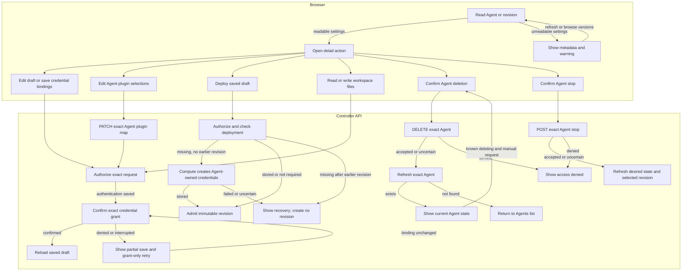

# Console Agent editing and runtime requests

## Overview

Trace Agent edits, credentials, workspace, stop, and deletion. See the
[parent flow](../platform-console.md).

## Entry Points

- `apps/controller/src/console/agents/detail.mjs:renderAgentDetail` loads the exact Agent and composes the detail actions.
- `apps/controller/src/console/agents/credentials.mjs:createChannelSecretsPanel` saves channel Secret bindings.
- `packages/occ/src/index.ts:OpenClawController.deployAgent` admits a revision after first-deployment credential setup.
- A signed-in caller must hold each action's permission on the exact resource.

## Flow

```mermaid
graph TD
  subgraph Browser["Browser"]
    A["Read Agent or revision"] -->|readable settings| B["Open detail action"]
    A -->|unreadable settings| AE["Show metadata and warning"]
    AE -->|refresh or browse versions| A
    B --> C["Edit draft or save credential bindings"]
    B --> P["Edit Agent plugin selections"]
    B --> Q["Deploy saved draft"]
    B --> D["Read or write workspace files"]
    B --> E["Confirm Agent deletion"]
    B --> S["Confirm Agent stop"]
  end
  subgraph API["Controller API"]
    C --> F["Authorize exact request"]
    P --> PA["PATCH exact Agent plugin map"]
    PA --> F
    Q --> Y["Authorize and check deployment"]
    Y -->|missing, no earlier revision| Z["Compute creates Agent-owned credentials"]
    Y -->|stored or not required| R["Admit immutable revision"]
    Z -->|stored| R
    Z -->|failed or uncertain| N["Show recovery; create no revision"]
    Y -->|missing after earlier revision| N
    F -->|authentication saved| V["Confirm exact credential grant"]
    V -->|confirmed| W["Reload saved draft"]
    V -->|denied or interrupted| X["Show partial save and grant-only retry"]
    X -->|binding unchanged| V
    D --> F
    E --> G["DELETE exact Agent"]
    S --> T["POST exact Agent stop"]
    T -->|accepted or uncertain| U["Refresh desired state and selected revision"]
    T -->|denied| I
    G -->|accepted or uncertain| H["Refresh exact Agent"]
    G -->|denied| I["Show access denied"]
    H -->|exists| J["Show current Agent state"]
    J -->|known deleting and manual request| E
    H -->|not found| K["Return to Agents list"]
  end
```

## Execution Trace

### 4. Render draft, revision, or channels

`apps/controller/src/console/agents/detail.mjs:renderAgentDetail`

The page reads Agent, readable revisions, and current Configuration
(`revision=draft`) or immutable AgentRevision (`revision=<id>`).
`packages/occ/src/index.ts` uses `listAgents`, `listRevisions`,
`getAgentForBrowsing`, and `getRevisionForBrowsing` for browsing.
`packages/occ/src/state/postgres-state.ts:browseSavedConfiguration` turns
payload-decode failures into metadata plus `configurationReadError`; queries
and operational reads remain strict. Drafts and revisions decode independently.
The UI preserves navigation and exact-resource permissions, refusing unreadable-draft
editing/deployment without defaults.
**Selected version** uses `activeRevisionId`; **View version vN** opens read-only
details without activating it. **Deployment activity** shows the newest readable
version's persisted status, not live health. Routine completion folds; pending work,
read errors, warnings, and cleanup stay visible. Failed deployments offer Logs
unless log text or revision access was denied during this sign-in. Configuration recovery
requires Agent `update` or `deploy` and an existing Configuration without known read
errors or denials; access remains separately authorized. Credentials recovery
requires Agent `update`. Hidden or unlisted current versions suppress recovery;
viewed versions show results. Activity polls every
`DEPLOYMENT_POLL_MS` (`apps/controller/src/console/agents/detail.mjs`) until a
result or read error; a new result also rereads selection. **Refresh deployment** rereads
activity and selection. **Current observations** requests timestamped
`succeeded`, `failed`, or `unknown` diagnostics without changing deployment status.
Its bodyless POST requires Agent `read`/`operate` and exact AgentRevision `read`.
**Create new version** opens the saved draft; **Deploy new version** admits its
Configuration/plugins. **Edit current Configuration** never copies historical
values. Stop/deletion target the Agent.

**Edit Configuration** rereads the Agent and Configuration, then PATCHes only
`{ values, expectedGeneration }`, preserving `secretBindings`. A changed ID or stale
generation (including a `409` from a racing save) requires **Reload draft**.

**Enable gateway password access** sets `gateway.auth.password` to reference
`OPENCLAW_GATEWAY_PASSWORD`, changing nothing else; **Cancel** discards it. Kubernetes
`gatewayConfiguration` recognizes the reference; `deployment` supplies the password.

Saves preserve scroll, focus and admitted snapshots. Rejected edits stay in the editor;
an uncertain save requires readback. Unsaved edits block deployment; pending saves block tab and version changes.
A refused write lists required grants without guessing which; a refused preflight read names read
access, a Workspace file save Agent `operate`. Lacking Agent `update` disables plugin, repository
and authentication editors; Configuration saves get no such hint.

`agents/plugin-fields.mjs:createPluginFields` renders **Plugins**.
**Save plugin selections** PATCHes the Agent map, preserving Configuration and
admitted revisions. Driver validation precedes deployment's immutable snapshot. See the
[plugin deployment flow](../agent-plugins.md).

**Repositories** uses `createRepositoryFields` with exact-Agent discovery and
PATCHes `repositoryAccess`. Unsaved edits also block tabs; failed discovery leaves
access unverified.

Deployment rereads Agent and Configuration, requires authentication and
Slack bindings, and blocks Teams. Changed association, generation, authentication,
plugins, execution mode, Backend, or repository access require reload; controls
stay locked while pending. Snapshot views deploy current settings. Failed reads
send no bodyless deploy POST; success opens the revision. Uncertain POSTs require
history readback before retry; browser reads are not atomic with admission.

`apps/controller/src/console/drafts.mjs:createDraftStore` holds document-local drafts.
`console.mjs:resetReads` and `detail.mjs:renderTab` capture fields before teardown,
excluding passwords. Namespace and Agent keys isolate drafts; session expiry,
user change, logout, exit, and reload clear them. Nothing enters browser storage
or URLs. Configuration, authentication, and channel baselines prevent stale saves;
channel snapshots include controls and staged Secret metadata. Reload draft reapplies
only the reader's edits, naming overlaps and skipped choices. Save and Cancel
clear captures; pending saves retain recovery guards.

`dom.mjs:dismissOnBackdrop` requires press and click outside the topmost editor.
Like Escape, cancellation discards channel drafts, clears Secret inputs, and
retains plugin selections. Pending channel saves and Secret creation prevent dismissal.

`apps/controller/src/console/channels.mjs:renderChannels` renders Slack settings;
only **Create new version** permits editing. The
[console reference](../../reference/console.md#inspect-detail-revisions-and-channel-drafts)
owns Slack requirements and rejected native shapes; Teams remains native JSON.

`agents/detail.mjs:renderConfigurationTab` reads draft Harness authentication
from the Agent, or admitted authentication and channel `secretBindings` from the
revision. `agents/secret-picker.mjs:renderSecretReference` checks the source
Namespace and reads exact Secret metadata. Successful reads link names and IDs;
absent, loading, and unavailable states remain distinct. Failures retain IDs;
stale responses are ignored and current 401s expire the session. Summaries need
neither collection permission nor Secret values.

`apps/controller/src/console/channels/slack.mjs:appendFields` separates channel
senders from DMs. Wildcard, empty, or omitted channel `users` selects **Allow
everyone**; explicit IDs fill the mutually exclusive input. Mention
requirements remain independent. `updatedSlack` replaces selected channels'
`users`, preserving DM and group policies, unrelated settings, and bindings.

The DM selector preserves omitted policies on existing configurations; new setup
starts with Allowlist. `validate` rejects empty/wildcard DM allowlists and
unsupported organization-wide policies. Selecting Open writes `allowFrom: ["*"]`;
leaving it for Allowlist or Pairing clears the wildcard input. Untouched lists
and native `dm.enabled` remain unchanged. Configuration save persists the
selection; redeployment applies it. See
[Slack policies](../../reference/configuration/secrets.md#native-channel-configuration).

`apps/controller/src/console/agents/detail.mjs:renderAgentDetail` supplies Namespace,
bindings, and Credentials URL to `channels/slack.mjs:credentialReferenceField`.
It loads `GET /namespaces/:namespaceId/secrets`; Namespace read is required.
`packages/occ/src/index.ts:listSecrets` filters records by exact Secret read
without calling the Secret Driver. Shared `agents/secret-picker.mjs:createSecretReferenceField`
filters names/IDs in a combobox. Arrows navigate, Enter selects, and Escape
restores the binding. Typing stages nothing; selection stages a reference,
Cancel discards it. Creation remains available.

`apps/controller/src/console/agents/secret-picker.mjs:openCreateSecretDialog` shows
an editable Agent-prefixed Name, password input, and optional fixed Slack key.
POST stores the Secret immediately and stages returned metadata; cancellation
never deletes it. Conflicts retain inputs without overwriting Secrets.
Readiness errors differ from name/backend conflicts. Success, cancellation, and uncertain outcomes clear passwords;
uncertain outcomes block retries until refresh. The
[Secret storage flow](../secret-storage-and-delivery.md) owns persistence and
recovery. Metadata and Credentials links open new tabs, preserving edits.
Values are never retrieved.

Saving channels rereads Agent and Configuration; a changed association or
generation, or a racing `409`, offers Reload draft. The PATCH sends
`{ values, expectedGeneration }`, adding
`secretBindings` only for changed selections. A rejected PATCH writes no Secret grant.

After PATCH, `apps/controller/src/console/agents/credential-access.mjs:ensureCredentialOperateBinding`
grants the Agent service principal access to selected Secrets through Namespace
IAM. A failed grant leaves Configuration saved. The detail view rereads bindings
and asks a Namespace administrator to grant access without repeating the
channel save. An uncertain PATCH blocks another
channel write until Refresh. Disabling a draft channel changes Configuration
but does not stop a running Agent. The
[console reference](../../reference/console.md#inspect-detail-revisions-and-channel-drafts)
describes the supported edits and their deployment boundaries.

### 5. Save authentication and deploy the first revision

`apps/controller/src/console/agents/detail.mjs:renderAgentDetail` rereads the
Agent and rejects changed bindings before saving authentication. PATCH replaces
the prior Harness `credentialSources` entry, preserving unrelated entries without
deleting the old source or revoking grants. After PATCH,
`apps/controller/src/console/agents/credential-access.mjs:ensureCredentialOperateBinding`
grants the Agent service principal exact Secret (`api_key` or imported `codex_pat`)
or CredentialSource `operate` through the actor's IAM authority. Managed
ServiceAccount PATs and runtime authentication skip this grant.

Grant failure preserves saved authentication and freezes controls.
**Retry credential access** rejects changed bindings and retries only the grant;
rereading bindings recovers lost responses. An uncertain PATCH requires
**Reload authentication source** before saving or granting. Pending access
survives navigation and blocks deployment until confirmed or reloaded. Admission
remains authoritative; preflight/authorization errors stay separate from credential
metadata. Confirmed access does not prove provider readiness.

`apps/controller/src/console/agents/credentials.mjs:createChannelSecretsPanel`

**Operator-managed credentials** saves `{ "method": "runtime" }` without a source,
requiring readable revision history and an unchanged draft. API authorization and
Driver compatibility remain authoritative.

**Create new version** shows bound Slack Secrets without proving live health.

`OpenClawController.deployAgent` checks transport credentials before admission.
Before the first revision, Agent `read`/`operate` plus `deploy` authorize Compute
to check ownership/workloads and create missing whole Secrets, preserving matching
groups. Bytes enter neither Configuration nor audit.
Failure admits no revision; retry rechecks status. Missing credentials after an
earlier revision require operator investigation. Model/channel Secrets stay separate.

On explicit submission, the browser rereads Agent and Configuration; a changed
ID or generation requires reload. It then PATCHes selected Secret references with
`expectedGeneration`, preserving other bindings, then calls `ensureCredentialOperateBinding` for changed
and pending Secrets. A post-PATCH grant failure leaves bindings saved and blocks
deployment in the current view. Subsequent saves retry still-referenced pending
grants. Picker edits and rejected PATCHes preserve that warning; only a confirmed
grant or confirmed removal of its reference clears the pending Secret. Explicit
refresh resets local outcome tracking; the API always enforces Secret access.
Pickers switch references; rotating shared Secret values is separate.

### 6. Read and replace live workspace files

`apps/controller/src/console/agents/workspace.mjs:renderWorkspaceFiles` opens from
`tab=workspace` after an exact Agent read. It skips Configuration and revision history. Contents belong to the live Agent.
With no active revision, files stay unavailable and no file request is sent.

The editor GETs each supported filename and normalizes textareas to LF. An
untouched CRLF file stays clean and is not rewritten. Only an edit enables Save.
The response reauthorizes access before restoring retained text, including empty
edits. Drafts keep their baseline; Reload replaces them. A 404 without an unknown
write permits an explicit create, including an empty file; other failures disable
Save. Save PUTs `{ content }` on the exact-Agent route. It neither patches
Configuration nor admits a revision. The [workspace flow](../workspace-files.md)
owns authorization and native transport. Results are per file. An unknown write
waits for explicit Reload. Current contents, or the formal missing-file 404,
settle it and open an empty editor for a deliberate create. Another 404, a
denial, or an unavailable read stays guarded. The editor never retries or creates
a file.

The [creation trace](../platform-console.md#3-authorize-the-selected-page-resource)
covers initial channel settings and Secret bindings.
`apps/controller/src/console/agents/create.mjs` submits `initialWorkspaceFiles`
and `workspaceDefaultsId`. OCC stages these privately for Compute's initialization
before execution; no gateway is needed. The [workspace setup flow](../workspace-files.md)
owns initialization, retries, and cleanup. Live editing requires deployment.

### 7. Request a stop and read back the Agent

[Permission advice](../../reference/api.md#get-namespacesnamespaceidagentsagentidpermissions) can disable
Stop before confirmation. If the dialog is open, a negative answer disables confirmation and
focuses Cancel. Missing advice leaves the normal path available; late advice cannot recall a request.

`apps/controller/src/console/agents/stop.mjs:createAgentStop` sends a bodyless `POST` to the
Agent’s `/stop` route. OCC’s `packages/occ/src/index.ts:stopAgent` checks Agent `operate`,
persists the requested stopped state, and queues reconciliation. Success means admission,
not that Compute has shut down. Cancel restores focus to the invoking button; submission focuses
**Refresh stop status**.

For a stopped Agent, **Request Stop again** confirms a new stop intent, even with no selected
revision; the Console cannot inspect history or candidate cleanup. With no selected revision
and no readable versions yet (`setNoReadableVersions`), it shows no Stop control.

Refresh reads desired state and selected revision, not live health. Denial stays inline; changed
state updates panels in place. An uncertain write blocks another Stop until readback succeeds.
[Deploy to resume](../../reference/agents/deployment.md#stop-and-resume); the lifecycle
reference covers worker shutdown and preservation of revisions, credentials, and state.

### 8. Confirm deletion and read back the Agent

`apps/controller/src/console/agents/deletion.mjs:createAgentDeletion`

**Delete Agent** requests confirmation before sending a bodyless `DELETE` to the
exact Agent URL. The controller requires Agent `delete`; a `403` stays visible on
the detail page. Acceptance starts asynchronous cleanup and marks the Agent deleting. The page
rereads the exact Agent every few seconds; **Refresh deletion status** reads it
on demand. A read error stops polling. Only a not-found read after
an accepted or uncertain request, or when an already-deleting Agent is opened,
returns to the Agents list in the selected Namespace. An already deleting Agent
keeps **Request deletion again** beside Refresh. It opens a cancel-first confirmation
and sends the same bodyless DELETE only when the reader confirms. Queued or claimed
work stays unchanged; terminal work can restart under the controller's existing
current-permission and retry-ownership checks. The view does not infer a worker
outcome from the Agent's deleting state or add a separate status contract.

An uncertain initial or repeated deletion blocks writes until a successful exact
Agent read. A deleting read clears that guard even when the view was already deleting;
a failed read does not. Cancel returns focus to the repeat-request button, and
successful writes retain status refresh. The browser never retries DELETE automatically.

`packages/occ/src/index.ts:deleteAgent` owns deletion admission. The
[Agent deletion reference](../../reference/agents.md#deletion) covers
worker cleanup and the Namespace-owned resources it preserves.

## Debugging and Verification

- A denied Secret list requires collection `read`; a missing menu entry may lack
  exact Secret `read`. Saving bindings also requires caller `operate` on those
  Secrets, Configuration update, and Namespace IAM authority to grant Agent use.
- After a partial save, inspect Configuration, Secret metadata, and Agent IAM
  bindings before retrying. Storage and binding do not prove runtime delivery;
  deploy and verify the consuming Agent.
- Compare saved `Agent.plugins` with the viewed revision's plugin snapshot after
  a plugin edit. A successful Agent update does not install or activate plugins;
  deploy and inspect startup status separately.
- On repeat `403`, follow the API’s retry-ownership explanation. For ordinary
  denials, check `delete` on the exact Agent; Agent `read` and
  `operate` do not authorize deletion. Any failed repeat pauses polling until a manual action. Use the displayed request ID when present.
- An accepted deletion remains in progress until the exact Agent read reports
  not found. A failed refresh does not establish whether cleanup finished.
- See [console failures](../../reference/console.md#failures-and-logout) for
  session, permission, and network recovery.

## Related docs

- [Return to the parent flow](../platform-console.md).
- [Console reference](../../reference/console.md)
- [Agent lifecycle reference](../../reference/agents.md#deletion)
- [Agent plugin flow](../agent-plugins.md)
- [Agent sharing flow](agent-sharing.md)

## Manual Notes

[keep this for the user to add notes. do not change between edits]

## Changelog

- 2026-10-16 00:38: Reconcile in-place OAuth save feedback after merging main. (01a11d95-ebef-76e1-b9b9-9d3d2e88e99e - 697ca86d47f67a9671f07708f362bcfb671650e6)

- 2026-10-15 22:35: Reconcile failed-version recovery and OAuth editing. (authoring-run/8c4ab973-b5a0-4bcf-8fcf-5f9d908ea26c - c997748f661b5df1198047de5a97c9cf23fb241a)

- 2026-10-15 22:26: Reconcile current main behavior with OpenShell OAuth contracts in the accompanying merge. (authoring-run/41e4bb7a-c8eb-4332-b1f9-07fb8e234f63 - b747cf5b6402ad36ce9f1ae6dbed08928ddcf3dc)

- 2026-10-15 21:30: Separate selected version, recorded deployment, and live-serving uncertainty; surface failed-version recovery. (authoring-run/6d9b833d-e4fc-4f58-98a8-f0fac29f709d - 7adac57cc03545bdd3cdc383c88219396a677fd9)
- 2026-10-15 04:40: Hide stop controls for a never-deployed Agent in the accompanying change. (authoring-run/2aecf15b-82ac-4724-94d9-45b8c1c99fc6 - c78f96b706ce94dbfe6aadfdac9c40e7e7e759ae)
- 2026-10-10 20:00: Keep untouched CRLF workspace files clean; only an edit enables Save. (public-pr/2000 - a3ca862c37d05ba850d3c9595e5668917d7f480d)
- 2026-10-10 08:46: Trace keyboard focus after Stop confirmation cancellation. (authoring-run/9c1f0e85-9f16-436e-900f-b3d0e6e8cdd9 - b8783d7942e875c6eb751222329c63fac5c028a1)

- 2026-10-13 09:37: Reconcile current admission and lifecycle behavior with external OAuth custody in the accompanying merge. (authoring-run/fd902939-ed58-4508-8d33-95a863d966af - e8d39978d801e7a5a8ac7242f32035f426da94e1)

- 2026-10-09 20:35: Replace only the old Harness source binding while preserving unrelated sources. (01a11d95-ebef-76e1-b9b9-9d3d2e88e99e - ece639c78)

- 2026-10-07 17:42: Trace exact CredentialSource grants alongside Secret grants after authentication saves. (01a0e5ec-d802-7800-9eb6-8022c1ac0d06 - da984340a)

[Console Agent editing documentation history](agent-editing/history.md) preserves the older dated entries.
