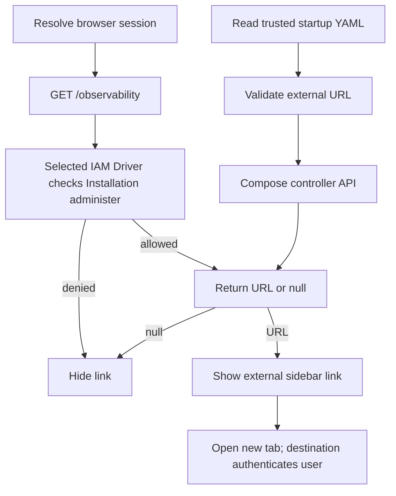

# Console external observability link

## Overview

A signed-in Installation administrator can open an operator-configured observability UI from the console sidebar. The controller reads the URL from trusted startup YAML, checks Installation authority, and returns it to the browser. The flow ends when the browser opens the external service; that service controls its own access.

## Entry Points

- `apps/controller/src/composition/installation-config.ts:loadInstallationConfiguration` validates the optional `observability.url`.
- `apps/controller/src/console/console.mjs:loadPage` requests the destination after session resolution.
- `apps/controller/src/index.ts:requireInstallationAdmin` checks the selected IAM Driver for exact Installation `administer` permission.

The caller needs a valid console session and Installation `administer` permission. The URL is optional and requires HTTP or HTTPS without embedded credentials or a fragment.

## Flow

## Execution Trace

### 1. Validate the operator destination at startup

`apps/controller/src/composition/installation-config.ts:loadInstallationConfiguration`
accepts an optional closed `observability` block in trusted Installation YAML.
It rejects malformed URLs, unsupported schemes, credentials, fragments, and
unknown fields. Production and configured PostgreSQL development pass the
validated URL to `createFastifyApp`. Compose development also accepts an
observability-only YAML with its default Drivers. Changing it requires API restart; it is
not persisted as an Installation resource or used as an OTLP export target.

### 2. Resolve the browser link

`loadPage` reads `GET /observability` (through `apps/controller/src/console/console.mjs:probeInstallationAccess`) with the Namespace collection after the session check. The read outlives the view: a navigation while it is in flight joins it instead of aborting it and asking again. `apps/controller/src/index.ts:perform` calls `requireInstallationAdmin`, which authorizes the exact Installation through the selected IAM Driver and records denial evidence. An allowed response contains the startup URL or `null`. Denial or an unavailable optional read leaves the link hidden. A session `401` clears private console state.

The console settles the read once per session owner: an allowed response or a `403` is reused across navigation and, through tab `sessionStorage` keyed by the noncredential session binding, across reloads in the same tab, so a Namespace-only user produces one audited denial per session and tab rather than one per page. Transient failures retry on the next page load. Logout and an owner change clear the result. Revoking or granting administration takes effect in the console at the next sign-in or in a new tab; the API check still applies to every request. The settled answer also tells Agent detail whether to mount the Installation-admin sharing panel.

`apps/controller/src/console/shell.mjs:renderShell` adds **Observability** with an external-link icon only for a returned URL. It opens a separate tab with `noopener noreferrer`; the browser does not send the OCC session to the destination. The external service authenticates the user independently.

## Debugging and Verification

- `node --test tests/integration/console-api.test.mjs` verifies the real API route, Installation IAM denial, and absent URL.
- The focused `tests/browser/console.test.mjs` case verifies administrator visibility, Namespace-only hiding, one probe per session across navigation and reload, and safe new-tab attributes in Chrome.
- These tests do not verify access at the external observability service.

## Related docs

- [Parent console flow](../platform-console.md)
- [Console reference](../../reference/console.md)
- [Installation startup configuration](../../reference/configuration.md#installation-startup-configuration)
- [Observability setup](../../guides/observability.md)

## Manual Notes

[keep this for the user to add notes. do not change between edits]

## Changelog

- 2026-10-05 01:30: A navigation joins the in-flight probe instead of repeating it. (flake-hunt-8)

- 2026-09-29 12:00: Read the destination once per session owner. (obs-495 - 6858f3c0)

- 2026-09-27 15:08: Trace the authorized external observability link. (authoring-run/f396defd-23ca-46d0-ab3a-e749b6ea1d18 - 0663fa97)
