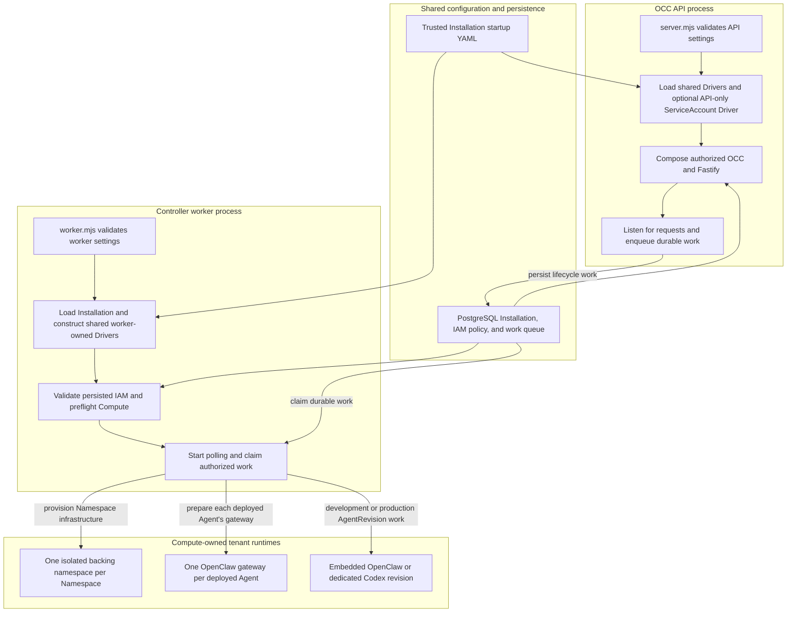

# Platform Startup Flow

## Overview

The OCC API and controller worker start as separate Node.js processes, resolve
the same singleton Installation and trusted Driver selections, and coordinate
through PostgreSQL. Each process constructs its own shared Driver instances;
when a ServiceAccount Driver is selected, only the API additionally initializes
its Backend client and Driver. PostgreSQL-backed development uses the
Docker Compute Driver by default, while the development filesystem
Configuration Driver is API-only. The singleton invariant is the selected Driver
identity, not JavaScript object identity. This trace ends when the API accepts
requests and the worker begins polling durable work.

## Entry Points

- Trigger: Start the API with `node apps/controller/src/server.mjs`; start the
  worker separately with `node apps/controller/src/worker.mjs`.
- Source: `apps/controller/src/server.mjs:start`,
  `apps/controller/src/worker.mjs:configuration`, and
  `apps/controller/src/composition/installation-config.ts:loadInstallationConfiguration`.
- Assumptions: PostgreSQL-backed startup requires the same migrated application
  database, one bootstrapped Installation, and persisted IAM policy. Production
  additionally requires the same absolute `OCC_CONFIG_PATH`, exact selected
  bundled or installed IAM, Compute, and Configuration Drivers, and the API's
  mounted Better Auth signing Secret. A selected ServiceAccount Driver additionally
  requires the provider admin Secret mounted only into the API. Compose
  development additionally mounts `occ_configuration_data` only into the API at
  `/app/.development/configurations`; manual host-process development must pass
  the same application-role PostgreSQL URL, configuration root, and Docker
  runtime-image inputs.

## Flow

## Execution Trace

### 1. Launch independent API and worker processes

`apps/controller/src/server.mjs:start`

Before launch, the operator runs the supported migration command using the
separate migrator role. Its
[history preflight](../../scripts/migration-history.mjs) accepts only reviewed
receipt and catalog prefixes, including the two published 31-receipt completed
lineages: the current Backend terminology history and the historical Provider
terminology history. The append-only compatibility migration converts the
Provider schema and owned persisted JSON to Backend terminology without
rewriting applied receipts or terminal provisioning fingerprints. It refuses
mixed receipt histories, manually edited catalogs, and the older divergent
credential history before migration DDL. The
[migration history reference](../reference/settings/operations.md#migration-history)
owns the exact supported shapes and recovery boundary. Neither API nor worker
startup rewrites migration receipts or converts an unsupported database.

The [API entrypoint](../../apps/controller/src/server.mjs) and
[worker entrypoint](../../apps/controller/src/worker.mjs) are separate commands;
the API never starts or embeds the worker. The API validates `NODE_ENV`, its
listener address and port, admission inputs, and optional PostgreSQL settings.
The worker validates its own `NODE_ENV`, required `OCC_DATABASE_URL`, poll
interval, lease duration, retry limit, and convergence timeout.

Production API binding requires one explicit Pod interface address.
Host-process development API binding permits only loopback. Compose binds the
API to `0.0.0.0` inside its private bridge, publishes only
`127.0.0.1:${OPENCLAW_DEV_PORT:-3000}` on the host, and requires the explicit
`OCC_DEVELOPMENT_TRUSTED_BRIDGE_CIDR`. The worker never opens the API listener
and does not receive API authentication configuration.

### 2. Resolve process-local Installation and Driver state

`apps/controller/src/composition/installation-config.ts:loadInstallationConfiguration`

When `OCC_CONFIG_PATH` is set, each process reads the same trusted file and
constructs its own Installation, Compute, Configuration, and mandatory
`createIAMDriver(state)` bundle. The shared loader parses Backend integration
metadata but never reads an admin credential or initializes a Backend client.
Production requires the startup file. Development may omit it: the API then
uses PostgreSQL plus the filesystem Configuration Driver rooted at
`OCC_DEVELOPMENT_CONFIGURATION_ROOT`, and the worker uses the Docker Compute
Driver. The
[Driver package loading flow](driver-plugin-loading.md) owns package
resolution, identity, validation, and trust boundaries. Installation identity
comes from server-owned singleton state, never startup YAML.

API and worker use matching logical Driver identities but separate instances.
Each IAM Driver loads current persisted policy for every identity lookup and
authorization decision. Only `server.mjs` reads the mounted ChatGPT admin key,
constructs `Backend<ChatGPTClient>`, and injects it into the optional
ServiceAccount Driver factory. The worker consumes only nonsecret Backend
metadata and never receives the client or admin credential. Startup validates
required member selections without scanning saved Backend references. Exact
ownership is checked when credentials or deployments are used, allowing the API
to start so stale references can be repaired. Lifecycle owners remain stable,
and controller Drivers are never exposed to tenant workloads.

### 3. Compose the API according to its persistence and execution mode

`apps/controller/src/composition/production.ts:composeProduction`

Production [API composition](../../apps/controller/src/composition/production.ts)
opens its own PostgreSQL pool, loads the already-bootstrapped Installation and
IAM policy, validates its user session configuration, constructs the
exact bundled or installed IAM Driver with platform state, and structurally
verifies the selected Compute and Configuration Drivers. It runs a selected
Compute preflight when present; bundled Kubernetes Compute must provide one.
Preflight warnings are emitted through the API logger and do not block
composition. The [production startup flow](production-startup.md#4-start-private-api-and-worker-deployments)
owns the Kubernetes version decision and warning details.
It registers IAM, Compute, Configuration, and any selected API-only
ServiceAccount Driver with OCC before
[`createFastifyApp`](../../apps/controller/src/index.ts) installs authenticated,
exact-resource-authorized API routes.

Development with `OCC_DATABASE_URL` instead calls
[`composePostgresDevelopment`](../../apps/controller/src/composition/development-postgres.ts)
and loads the initialized Installation and current IAM state. In both modes,
[`scripts/bootstrap-installation.mjs`](../../scripts/bootstrap-installation.mjs)
runs before composition; the API and worker fail if that state is absent.
Credential creation, private delivery, and failure handling belong to
the [bootstrap flow](local-password-authentication.md).

When `OCC_CONFIG_PATH` is absent, it registers the bundled Docker Compute Driver and filesystem
Configuration Driver, which writes native documents under
`OCC_DEVELOPMENT_CONFIGURATION_ROOT`. Compose always supplies PostgreSQL for
the supported development path.

### 4. Verify persisted ownership and start the independent worker

`apps/controller/src/worker.ts:ControllerWorker.start`

The [worker entrypoint](../../apps/controller/src/worker.mjs) creates a
separate PostgreSQL pool. With `OCC_CONFIG_PATH`, it passes independently
constructed Compute and Configuration Drivers into
[`ControllerWorker`](../../apps/controller/src/worker.ts). Without
`OCC_CONFIG_PATH` in development, it constructs only the Docker Compute Driver;
the filesystem Configuration Driver stays API-only. The constructor rejects
mismatched selected Compute, Configuration, or IAM identities and requires the
selected factory for packaged IAM. It never constructs a ServiceAccount Driver
or ChatGPT client. It claims Namespace lifecycle plus embedded OpenClaw and
dedicated Codex AgentRevision work using the exact selected Compute Driver.

`start()` loads the existing singleton Installation, validates current native
IAM policy from PostgreSQL, and uses its stable selected bundled or installed
IAM Driver. That Driver loads current policy for every identity lookup and
authorization decision. Production runs available Compute preflight and
requires it for bundled Kubernetes. The worker emits any preflight warnings
before `worker.started`; a warning does not block startup. Successful startup
emits `worker.started` with the selected `computeDriverId`; no AgentRevision
workload is admitted or started merely because the worker boots.

### 5. Hand off to request serving and durable queue processing

`apps/controller/src/worker.ts:ControllerWorker.run`

The API registers shutdown callbacks, binds its listener, and emits `listening`.
The worker registers its own shutdown callbacks, starts polling, recovers stale
claims, and emits `worker.health`. Authorized API mutations persist lifecycle
work in PostgreSQL; the worker independently claims that work and invokes its
own selected ComputeDriver under the claim's ownership and cancellation scope.

Compute prepares Namespace backing infrastructure and creates one gateway for
each deployed Agent. Default PostgreSQL-backed development uses Docker networks
and runtime containers; the bundled Kubernetes Driver prepares either an
embedded OpenClaw or dedicated Codex revision, activates its exact Agent-owned
gateway route, and retires any predecessor. Reviewed installed Compute Drivers
can also be selected in development and production. Docker containers and
Kubernetes Pods are downstream tenant
runtimes, not extra copies of the API or worker. Detailed lifecycle-hook
execution begins in the adjacent
[Compute Driver lifecycle flow](compute-driver-lifecycle-hooks.md).

## Debugging and Verification

- Verify matching selection and process-local instances with
  `node --test --test-name-pattern='independent API and worker startup construct the same selected runtime Drivers' tests/integration/configuration-startup.test.mjs`.
- Expect API `{"event":"listening",...}` and worker
  `{"event":"worker.started","computeDriverId":"..."}` events, followed by
  `worker.health`. Startup failures emit `startup-error` or
  `worker.startup-error`; stale claim failures emit `CLAIM_LOST`.
- Compare both processes' `OCC_DATABASE_URL`, production `OCC_CONFIG_PATH`, and
  selected Driver IDs/implementations. Missing singleton bootstrap, incomplete
  persisted IAM policy, mismatched Driver identity, unavailable cluster access,
  and invalid API admission configuration fail before normal operation.
- Production queue processing includes Namespace lifecycle plus embedded
  OpenClaw and dedicated Codex AgentRevision work. A real Kubernetes cluster is
  required to prove gateway or Agent workload execution; startup tests alone do
  not establish that outcome.
- With a selected ServiceAccount Driver, verify the admin key and ChatGPT client
  exist only in the API process; provider-issued access tokens require the
  genuine scenario in `tests/integration/service-account-driver-real.test.mjs`.

## Related docs

- [Backend-managed credential delivery](service-account-driver-credential-delivery.md)

- [Platform architecture](../ARCHITECTURE.md)
- [Controller worker operation](../reference/controller.md)
- [Controller and Installation configuration](../reference/settings.md)
- [ComputeDriver contract](../reference/drivers/compute.md)
- [Configuration Driver and Agent Revision flow](configuration-driver.md)
- [Installation Driver package loading flow](driver-plugin-loading.md)
- [Compute Driver lifecycle-hook flow](compute-driver-lifecycle-hooks.md)
- [Service Account Driver credential delivery flow](service-account-driver-credential-delivery.md)
- [Kubernetes ComputeDriver](../reference/drivers/kubernetes-compute.md)
- [Docker ComputeDriver](../reference/drivers/docker-compute.md)

## Manual Notes

[keep this for the user to add notes. do not change between edits]

## Changelog

- 2026-09-24 22:50: Document exact Provider and Backend migration lineage handling accompanying the compatibility migration. (authoring-run/e027d71c-4d0b-4289-bf0d-f590c14c92cb - 1985586676c42cd359b9ecc22e22ce8f0e30034d)

- 2026-09-22 04:19: Record the migration prerequisite and refusal boundary accompanying the main synchronization. (authoring-run/a9a43fbc-2e26-46d5-a17c-ea6636555547 - a7fbcdc39a1cfb1d093c2b4d1e238e39e89dae2a)

- 2026-09-17 12:56: Record generic Compute preflight warning handoff to API and worker logs. (authoring-run/a6571e7c-996e-4f11-9c4c-f61418a8d109 - 324fe2d17f3856cd1602a57e4d8aa99a34d6514c)

[Platform startup documentation history](platform-startup/history.md) preserves the original dated entries.
