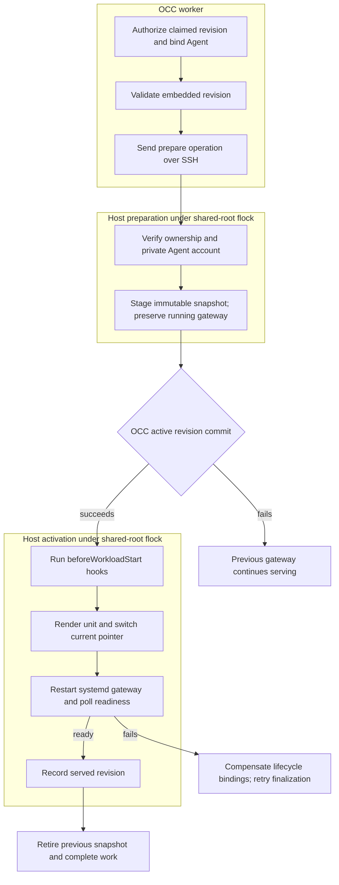

# SSH compute lifecycle

## Overview

The worker realizes an admitted embedded OpenClaw AgentRevision on a configured
Linux host. The SSH Compute Driver sends a controller-owned helper to the host,
which stages the revision and activates the Agent's systemd gateway after OCC
commits its active revision. This trace covers preparation, activation,
retirement, and Agent and Namespace deletion. It stops when
control returns to the worker; gateway request execution is outside this flow.
The [SSH reference](../reference/drivers/ssh-compute.md) owns configuration and
supported boundaries.

## Entry Points

- Trigger: Namespace or AgentRevision work claimed by the controller worker.
- Code pointer: `apps/controller/src/drivers/compute/ssh/index.ts:SshComputeDriver.prepareRevision`.
- Source: [installation-config.ts](../../apps/controller/src/composition/installation-config.ts)
  (`loadInstallationConfiguration`), [worker.ts](../../apps/controller/src/worker.ts)
  (`processRevision`), and [ssh/index.ts](../../apps/controller/src/drivers/compute/ssh/index.ts)
  (`SshComputeDriver`).
- Assumptions: Trusted Installation YAML selects packageless `compute-ssh`;
  the operator provisions Linux, systemd, flock, Node, OpenClaw, root SSH, and a
  account-management tools. Namespace names map to configured hosts. OCC supplies
  authorized, server-owned resource identities and immutable admitted revisions.

## Flow

## Execution Trace

### 1. Select the driver and bind resource ownership

`installation-config.ts:loadInstallationConfiguration`, `worker.ts:processRevision`,
`ssh/index.ts:preflight`, `bindAgent`, `ensureNamespace`

The exact packageless ID `compute-ssh` selects `occ/ssh`; other packageless
Compute IDs select Kubernetes. Schema and semantic validation reject invalid
host settings and Sandbox composition. Preflight checks the two local SSH
files and probes each host's required executables and account-management tools.

Namespace preparation creates or verifies its ownership marker before running
`afterNamespacePrepared` hooks. After revision authorization and provider
validation, the worker calls `bindAgent`; the driver copies the authoritative
Namespace, Agent, and ServicePrincipal binding into its in-memory maps. Revision
operations require matching bindings and the selected Compute identity.
Admission and dispatch require the explicit `runtime` binding. The snapshot
contains only the method: neither source authorization nor credential resolution
runs for it, while Agent/Configuration authorization and worker reauthorization
remain required. `SshComputeDriver.validateHarnessAuth` rejects managed credentials
and dedicated Harnesses; preparation also rejects OCC Secret delivery and Sandbox use.
SSH dispatches selected `beforeWorkloadStart` hooks during activation, before
starting the candidate workload.

### 2. Cross SSH and serialize host changes

`ssh/index.ts:execute`, `ssh/executor.ts:SystemSshCommandExecutor.execute`,
`ssh/remote-helper.cjs:run`, `acquireLock`

The driver sends its helper on stdin and one base64 JSON argument containing
the operation, resource data, configuration hash, and trusted runtime settings.
The system SSH client uses an explicit identity and known-hosts file, strict
host-key checks, batch mode, and a 180-second operation timeout. The helper
also enforces a 170-second deadline and detects closed output pipes with
heartbeat writes. Cancellation terminates the local client; a systemd job
already submitted can still complete.

Host mutations take `<root>/.compute-lock` through a child holding kernel flock,
with a 30-second acquisition timeout. The shared root defines the inventory and
serialization boundary. Namespace, Agent, revision, and unit markers are checked
before use; ownership failures are permanent. The lock releases when its
holder exits. Probe does not take the lock. Deletion of an already-missing
Namespace still holds it while retrying cleanup of remaining owned accounts.

### 3. Create the private account and stage the snapshot

`ssh/remote-helper.cjs:prepare`, `ensureRuntimeIdentity`, `snapshot`

Before host work, `sshGatewayConfigurationDocument` admits only the supported
authentication fields and modes. Omitted auth mode renders explicit password mode with a
managed environment SecretRef; explicit trusted proxy retains its configured trust.

The helper creates or verifies a deterministic per-Agent system user and
private group, then creates the Agent directory and reserves the lowest free
port across the shared root. Root-owned account markers bind the UID/GID to the
exact Driver, Namespace, Agent, and ServicePrincipal. Existing unowned accounts
or conflicting markers fail closed. Agent-owned `home/` and `state/` use mode
`0700` and persist across revisions.

The helper creates `gateway-password.env` only when needed and missing,
preserving its value across later revisions. It does not migrate historical
credential files.

Snapshots store the Driver-rendered configuration as root-owned,
private-group-readable `openclaw.json`. The helper validates existing bytes
against their hash and rejects a different revision ID with the same revision number. An older
candidate returns not-ready. Preparation leaves the running unit and `current`
pointer untouched, so failed OCC publication does not cut over the gateway.

### 4. Commit activation, start the gateway, and retire the prior revision

`worker.ts:observeRevision`, `finalizeRevision`,
`ssh/index.ts:activateRevision`, `retireRevision`,
`ssh/remote-helper.cjs:activate`, `renderUnit`, `waitReady`

SSH uses the default activation order. After successful preparation, OCC
compare-and-sets the Agent's active revision in its database. The worker then
calls `activateRevision`, which invokes selected Configuration and IAM
`beforeWorkloadStart` hooks before sending the activation operation. Accepted
opaque launch placeholders enter the systemd unit's environment. Hook failure
prevents launch; failure after hook preparation invokes bounded workload-stop
compensation. Incomplete finalization remains retryable.

The helper renders the unit for the Agent's private Unix account, replaces
`current`, restarts the gateway, and polls loopback `/readyz` for up to 120
seconds. It writes `served.json` only after readiness succeeds. A matching
current pointer alone never establishes successful activation. The unit loads
the per-Agent managed `gateway-password.env` for password access and optionally
loads the operator-owned `env` file. Explicit trusted proxy without a password
omits the managed file. The unit has no legacy credential or environment
migration path. The Driver never reads or writes the operator credential
file and never submits a model probe.
Readiness confirms gateway startup only; an invalid key can leave the gateway
ready while model requests fail. Host credential changes may affect an existing
revision after restart without a new immutable revision.

Retirement runs `beforeWorkloadStop` hooks and removes the specified snapshot.
If that snapshot is current, it first stops/disables the unit and removes
`current` and `served.json`. Persistent state, the private account, and other
snapshots remain. `deactivateRevision` only verifies ownership; the worker's
dedicated-only deactivation path is outside SSH's supported topology.

### 5. Delete the Namespace host state

`ssh/index.ts:deleteNamespace`, `ssh/remote-helper.cjs:removeNamespace`

Deletion runs `beforeNamespaceDelete` hooks, then validates every Agent, revision,
and unit in the deletion set before stopping gateways. The helper stops and
disables owned units, removes their unit files, reloads systemd, and removes the
Namespace tree, including persistent state, and its owned runtime accounts. The driver clears its in-memory
bindings only after the host operation succeeds.

Agent deletion (`ssh/index.ts:deleteAgentRuntimeCredentials`,
`remote-helper.cjs:removeAgent`) does the same for one Agent after its revisions
retire, which frees its gateway port.

## Debugging and Verification

- Run `node --test tests/conformance/ssh-compute.test.mjs tests/integration/ssh-compute-startup.test.mjs`.
  These exercise the real driver/helper with SSH and systemd fixtures, plus
  configuration loading and worker construction. Account-command fixtures do
  not prove OS isolation. These tests also do not prove live SSH, systemd,
  database reconciliation, or model execution.
- Follow the [disposable real-host procedure](../testing/ssh.md#ssh-raw-hosts) for
  real SSH, systemd, readiness, cutover, persistence, retirement, and deletion.
  Selecting `OCC_TEST_SSH_MODEL=1` adds real valid/invalid provider requests,
  counts zero model calls during deployment/readiness, and checks operator-file
  preservation after redeployment and stop. An unselected skip is not host proof.
- Inspect the exact unit with `systemctl status` and `journalctl -u`, and compare
  `current` with `served.json`. A pointer alone does not establish readiness.
  Keep operator credentials and gateway password files out of diagnostics.
- Ownership/configuration errors fail permanently; SSH, timeout, and unexpected
  helper errors are retryable. Host markers reserve ports only within the
  shared root; operators must reserve the configured range from other services.

## Related docs

- [PR 24](https://github.com/openclaw/openclaw-enterprise/pull/24)
- [SSH Compute reference](../reference/drivers/ssh-compute.md)
- [Driver loading](driver-plugin-loading.md)
- [Controller worker](controller-worker.md)
- [Compute lifecycle hooks](compute-driver-lifecycle-hooks.md)

## Manual Notes

[keep this for the user to add notes. do not change between edits]

## Changelog

- 2026-09-22 22:31: Describe supported auth admission and remove legacy environment migration behavior. (authoring-run/d7126920-6a2a-4126-ad7d-fafd57593855 - c387eef76420f05a060689d2fa04b57a3e416956)
- Removed legacy gateway credential compatibility handling. (NOT_IN_SPEC)

- 2026-09-22 22:02: Trace managed gateway password files and preserve operator credentials during legacy-auth removal. (authoring-run/b91ebd83-2105-4b1e-aad8-6747fe22c2f1 - 01b42feaf8321e231fbe23a80e00ba641bb9fbcb)
- Bundled Compute Drivers use managed passwords or trusted proxy for native gateway authentication. (NOT_IN_SPEC)

- 2026-09-17 19:14: Add explicit runtime credentials, unchanged readiness, and operator-file ownership semantics. (01a0acbf-4d5a-7413-9411-dce911f3ad23 - b8cabaf9a49e069a7668ccf88b9e71a7484227b7)

- 2026-09-08 07:49: Trace private Agent accounts, staging before OCC publication, activation hooks, and systemd cutover. (01a07d92-d866-7731-afe5-abab67d8966c - 4d83087229961f3665b923d2581c0b71b988cc9c)

- 2026-09-07 13:35: Trace the SSH host lifecycle and OCC activation handoff at PR 24's reviewed head. (01a07d92-d866-7731-afe5-abab67d8966c - 5db27746de761abea09f751408c0c28e7e26f654)
