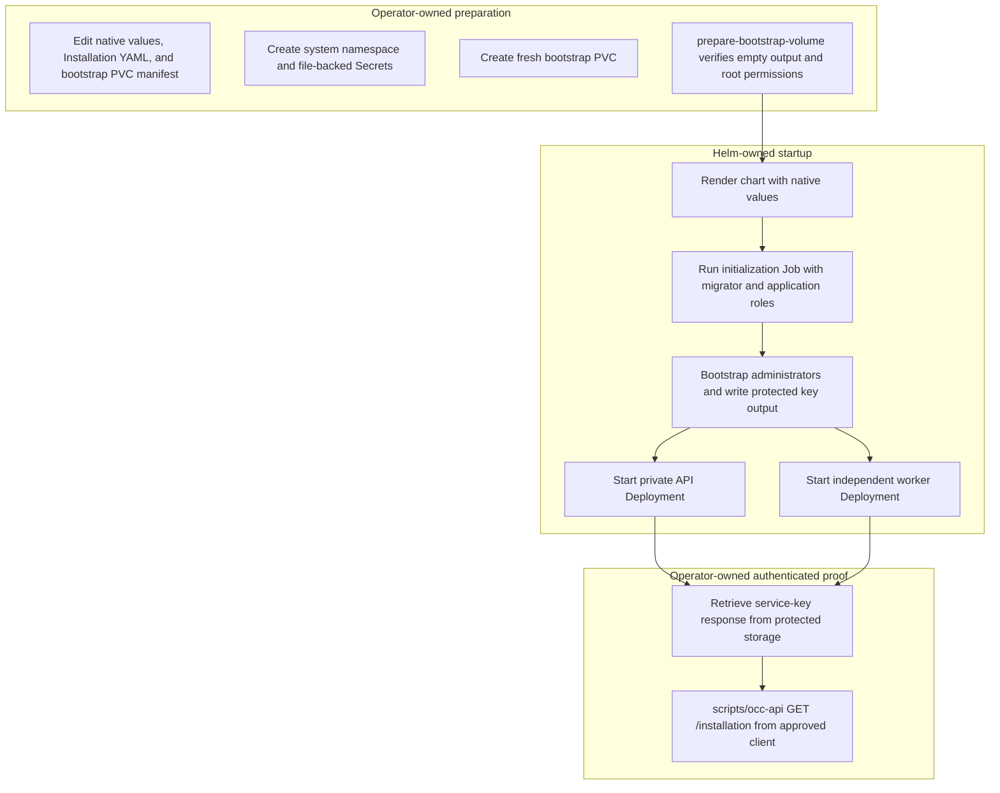

# Production Startup Flow

## Overview

Production startup begins after an operator supplies approved images,
PostgreSQL credentials, authentication material, trusted Installation startup
YAML, network policy inputs, and protected bootstrap storage. The supported path
prepares a fresh bootstrap PVC, installs the Helm chart, waits for the private
API and worker, then proves authenticated `/installation` access with the
retrieved bootstrap service key. This flow ends at control-plane access; tenant
Agent deployment and model-backed TUI proof are later flows.

For the operator commands, use the [deployment guide](../guides/deploy.md). The
chart owns migration/bootstrap ordering and controller readiness. It does not
provision cloud infrastructure, publish images, create TLS, retrieve keys, or
prepare application Secrets automatically.

## Entry Points

- Trigger: Run `scripts/prepare-bootstrap-volume`, then
  `helm upgrade --install oce deploy/helm/openclaw-enterprise`.
- Source: `scripts/prepare-bootstrap-volume:53`,
  `deploy/helm/openclaw-enterprise/templates/jobs.yaml:8`, and
  `apps/controller/src/composition/production.ts:28`.
- Assumptions: Explicit kubeconfig/context, enforcing NetworkPolicies, external
  PostgreSQL, approved immutable images, protected operator files, fresh
  bootstrap PVC, exact API/client selectors, and an approved private OCC URL.

## Flow

## Execution Trace

The migration, shared bootstrap, API, and worker entrypoints use
[`createPostgresPool`](../../packages/occ/src/state/postgres-pool.ts).
See [connection authentication settings](../reference/settings/operations.md#postgresql-connection-authentication)
for password and Azure workload-identity configuration.

### 1. Prepare native production inputs

`deploy/helm/openclaw-enterprise/values.yaml:1`

The operator copies and edits the production example values, Installation YAML,
and bootstrap PVC manifest outside the checkout. Helm values select the
controller image, API endpoint, Secret names, bootstrap claim, API-client
selectors, and egress destinations. The Installation YAML selects IAM,
Configuration, Compute, optional Provider, gateway/Agent images, projected
workload identity, and runtime networking/storage.

The operator creates file-backed Kubernetes Secrets for Installation startup,
database URLs, Better Auth signing material, and optional ChatGPT Provider
administrator credentials. These are prepared inputs, not recurring
synchronization targets. The chart does not infer gateway/Agent images from Helm
values or rewrite Driver configuration.

### 2. Prepare the fresh bootstrap volume

`scripts/prepare-bootstrap-volume:124`

Before the first install, the operator creates the bootstrap PVC named by
`bootstrap.password.claimName` and runs the helper with explicit kubeconfig,
context, namespace, claim, and approved Node-capable image. The helper launches a
bounded preparation Pod, verifies the mounted root is fresh except for
filesystem-owned `lost+found`, sets UID/GID `1000` with mode `0700`, and
refuses to continue on any other entry.

If cluster policy forbids the helper Pod, storage administration owns the same
state transition through an approved storage workflow. A preprepared claim goes
directly to Helm. The helper does not create the PVC, repair a used claim,
retrieve generated credentials, or change controller configuration.

### 3. Run Helm initialization

`deploy/helm/openclaw-enterprise/templates/jobs.yaml:8`

`helm upgrade --install --wait --timeout 5m` renders the chart with native
values. The initialization hook first runs migrations with the dedicated
migrator credential, then runs bootstrap with the lower-privilege application
credential, Better Auth settings, first administrator email, Installation name,
and protected output paths.

`scripts/bootstrap-installation.mjs` creates or verifies the singleton
Installation, human administrator, service administrator, IAM seed, audit
evidence, and initial service key. On fresh bootstrap, it creates the initial
`default` Namespace through `OpenClawController.createNamespace`, authorized
as the bootstrap Principal. The Namespace and its queued reconciliation commit
with Installation/IAM state and bootstrap audit; existing Installations receive
no new Namespace. The worker later provisions normal Driver-owned infrastructure;
operators still provide the tenant RoleBindings described in the deployment
guide. The platform name does not select Kubernetes' `default` namespace.
It writes password and service-key files only
from the bootstrap container to the protected PVC. Existing output, unsafe
storage permissions, inconsistent accounts, or mismatched IAM identity fail the
Job; Helm failure does not imply the database hook was rolled back.

### 4. Start private API and worker Deployments

`apps/controller/src/server.mjs:138`, `apps/controller/src/worker.ts:312`

After successful initialization, Kubernetes starts separate API and worker
Deployments. The API validates production listener settings, Better Auth,
database access, trusted Installation YAML, selected Drivers, Provider
membership, and Kubernetes Compute preflight before readiness. It serves private
controller routes, `/healthz`, and database-backed `/readyz` behind the
operator-managed endpoint.

The worker independently validates production settings, opens the same
application-role database, loads the selected Driver bundle, validates IAM, runs
Compute preflight, emits `worker.started`, and polls durable Namespace and
AgentRevision work. Worker readiness depends on fresh queue-health observations.
Neither process mounts the bootstrap PVC.

### 5. Retrieve the key and prove authenticated access

`scripts/occ-api:34`

After Helm readiness, the operator retrieves
`initial-admin-service-key.json` from protected bootstrap storage through an
approved reader path and stores it in an owner-readable file. A completed Job is
not an exec endpoint, and the API and worker cannot retrieve this file for the
operator.

From an approved client environment, `scripts/occ-api GET /installation` reads
the key file, sends `data.key` as `x-api-key`, and validates the response. The
production startup proof succeeds only when HTTP `200` returns an Installation
whose `data.id` matches the key response's `meta.installationId`. Agent runtime,
gateway WebSocket authentication, and model calls remain unproven until the
tenant deployment and TUI procedures run.

## Debugging and Verification

- `scripts/prepare-bootstrap-volume` should exit `0` only for a fresh claim with
  no bootstrap output files and UID/GID `1000`, mode `0700` root state.
- `kubectl -n openclaw-system wait --for=condition=complete job/oce-initialization`
  should succeed before API and worker rollout checks.
- The API should emit `listening`; the worker should emit `worker.started`
  followed by `worker.health`.
- `kubectl -n openclaw-system logs job/oce-initialization -c bootstrap` is the
  first check for unsafe output storage, existing output files, database-role
  failures, auth origin errors, and administrator/IAM mismatch.
- `scripts/occ-api GET /installation` must return HTTP `200` with
  `data.id == meta.installationId` from the retrieved key file.
- Changing an external startup Secret alone does not restart the API or worker;
  run an explicit rollout and repeat readiness plus authenticated proof.
- Packaging checks such as
  `node --test tests/integration/production-kubernetes-packaging.test.mjs`
  render chart behavior but do not prove a live Helm install, protected storage
  retrieval, tenant runtime, or model turn.

## Related docs

- [Deployment guide: production](../guides/deploy.md#production)
- [Settings reference](../reference/settings.md)
- [Kubernetes Compute Driver](../reference/drivers/kubernetes-compute.md)
- [Provider-managed credential delivery](service-account-driver-credential-delivery.md)
- [Controller worker execution flow](controller-worker.md)
- [Production TUI flow](production-tui.md)
- [Local password authentication flow](local-password-authentication.md)
- [Authoritative platform design](../design.md)

## Manual Notes

[keep this for the user to add notes. do not change between edits]

## Changelog

- 2026-09-01 19:09: Document initial default Namespace creation and unchanged repeat-bootstrap behavior. (codex/01a05ef1-ee29-7941-80f2-448bb0789969 - 872fa544c98bb7ad11b2d92d777e49229ececbf5) (01a05f95-dd80-7011-990f-d1c46b5bb3cc - aa366c49c44834d59f74994c5fd37fb8096f169f)
- 2026-09-01 12:58: Trace production bootstrap-volume preparation, Helm startup, and authenticated Installation proof. (codex/01a05e87-6c64-7960-b9c2-f444d4a3d737 - bdb846c38d5dae6085a8841f720c93068ba8ad15)
- 2026-09-01 10:19: Validate Provider configuration at startup and exact saved ownership at use, preserving API repair access. (01a05d6b-e21d-7fc0-b1bd-b5cb15b365c6 - 1c7eae4d11e6c474cc7f1bbbb05d2c2e7052a158)
- 2026-09-01 08:47: Trace Provider membership, API-only client injection, and persisted ownership checks. (01a05d97-f2b0-71d0-bfc3-01ee7d6d58f9 - b079c4b755ef336a9c65bb4eb737e3aedbfdaa7d)
- 2026-08-31 22:29: Remove automatic bootstrap recovery; preserve artifacts after any error and require manual repair. (01a05a3d-526f-7553-8cd8-070bd1847acb - 94a5440898bf331987148d7733f0075506af64a6)
- 2026-08-31 20:33: Trace the shared installation initializer, startup ordering, and initializer-owned credential delivery. (01a05a3d-526f-7553-8cd8-070bd1847acb - b6f213cbcee11ba3dd69886c936c7e5abe233eb3)
- 2026-08-31 17:43: Document fresh human/service administrator bootstrap, private key delivery, and operator recovery. (codex/01a05a69-3fbe-7441-9e6d-20394758cf94 - 0797098646028ac00cb26cd4afcbc9b2cf8bcb24)
- 2026-08-28 17:54: Separated Helm execution from the deployment walkthrough and included optional Sandbox Driver startup ownership. (01a036f4-cf1d-7cc1-bbc1-000879038ac8 - 4270aa29b7015562049f46c6027962fd85b584a9)
- 2026-08-25 03:43: Added the production Helm initialization, protected administrator bootstrap, private OCC API, independent worker, and readiness startup flow. (01a036f4-cf1d-7cc1-bbc1-000879038ac8 - 2e9769c751d7)
