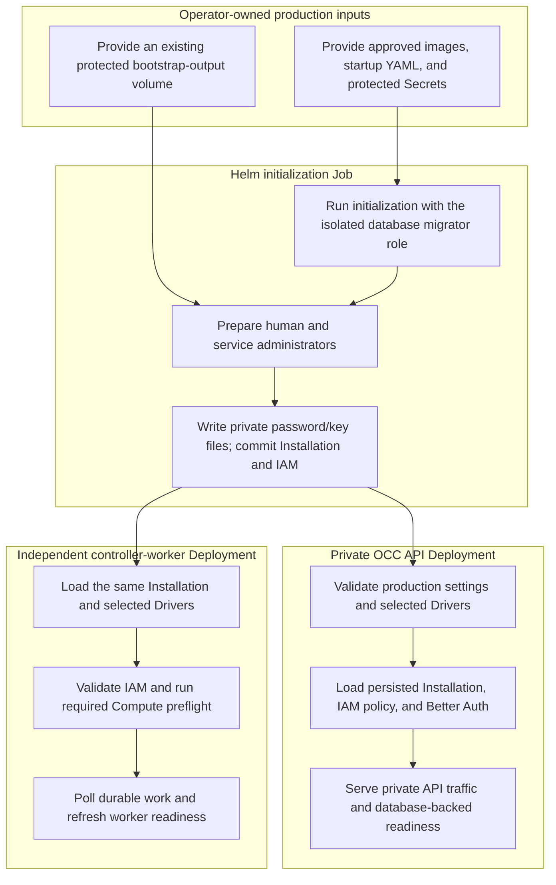

# Production Startup Flow

## Overview

Start the production OpenClaw Control Center (OCC) through its reviewed
Kubernetes Helm chart. Operators first supply approved images, trusted Driver
configuration, separate database credentials, a Better Auth signing secret,
and protected storage for the first password and service key. Helm then runs the
Installation initialization Job and starts separate internal-only API and
controller-worker Deployments. An optional ChatGPT ServiceAccount Driver keeps
its provider-admin credential and provider client in the API only. This flow
ends when both Deployments become ready and an authorized client can establish
a controller session.

The [deployment guide](../guides/deploy.md) owns the prerequisites, protected
inputs and setup command. The [setup flow](setup.md) generates the chart inputs
and provisions the first Agent. This document traces what the chart and
controller processes execute after those inputs are supplied.

## Entry Points

- Trigger: Run `helm upgrade --install oce deploy/helm/openclaw-enterprise`
  against an explicitly approved Kubernetes cluster.
- Source: `deploy/helm/openclaw-enterprise/templates/jobs.yaml:8`,
  `apps/controller/src/server.mjs:start`, and
  `apps/controller/src/worker.ts:ControllerWorker.start`.
- Assumptions: An enforcing Kubernetes cluster, external PostgreSQL, approved
  digest-pinned images, operator-managed startup/database/authentication
  Secrets, an existing protected bootstrap-output PersistentVolumeClaim, and
  exact approved network destinations and client selectors.

## Flow



## Execution Trace

### 1. Helm renders the reviewed production boundary

`deploy/helm/openclaw-enterprise/values.yaml:1`,
`deploy/helm/openclaw-enterprise/templates/deployments.yaml:1`

The [canonical Helm chart](../../deploy/helm/openclaw-enterprise) consumes
operator-supplied immutable images, trusted Installation YAML, separate
application/migrator database credentials, authentication settings, and an
existing protected bootstrap-output volume. Exact API-client selectors
and database/Kubernetes API destinations become NetworkPolicy rules.

The Installation YAML selects reviewed IAM, Compute, and Configuration
Drivers. Optional `drivers.sandbox` selects the Sandbox Driver loaded by the
shared composition; optional `integrations.chatgpt` plus
`drivers.service_account` enables the API-owned provider integration. The
ChatGPT provider-admin Secret and provider egress must be separately supplied
when selected; the worker receives neither.

The bundled Kubernetes Compute Driver also consumes approved runtime images,
projected workload identity, and exact runtime Secret references. These inputs
are validated before either controller process becomes ready. The production
API remains behind an internal `ClusterIP` Service and a default-deny
NetworkPolicy; the chart does not create a public entrypoint.

### 2. Run isolated initialization and bootstrap both administrators

`deploy/helm/openclaw-enterprise/templates/jobs.yaml:8`

Helm first runs its `pre-install,pre-upgrade` initialization Job. Its init
container receives only the dedicated database-migrator credential; the
following bootstrap container receives the lower-privilege application
credential, Better Auth configuration, first administrator email, singleton
Installation name, and protected password/service-key output paths.

[`scripts/bootstrap-installation.mjs`](../../scripts/bootstrap-installation.mjs)
runs with `NODE_ENV=production`, using the same initializer as development. It
creates the human Better Auth account and native IAM seed with a non-Agent
service administrator bound to the same Role. It issues the initial service key
through Better Auth, writes and syncs both private files on the existing PVC,
then commits the Installation/IAM/audit transaction. Better Auth persistence is
independent of that transaction. An existing output file, unsafe directory,
inconsistent account, or incorrect IAM identity fails closed.

`bootstrap.serviceKey.fileName` selects the key basename beside the password;
only this bootstrap container mounts their PVC. The Job uses
`fsGroupChangePolicy: OnRootMismatch` so later mounts preserve existing `0600`
files instead of recursively adding group permissions. `backoffLimit: 0` prevents
automatic Job retries. Any initializer error preserves created accounts, keys,
and files, emits `installation.bootstrap-failed`, and exits unsuccessfully.
Follow the [bootstrap flow](local-password-authentication.md) for manual repair
and the credential boundaries. Neither secret appears in logs,
bootstrap responses, audit, or chart-created Kubernetes Secrets.

Repeated initialization accepts the existing Installation only when the exact
configured administrator account and IAM Principal still match, without issuing
keys or changing output. The API and worker are not production-ready until
initialization succeeds.

### 3. Launch separate production API and worker Deployments

`deploy/helm/openclaw-enterprise/templates/deployments.yaml:1`

The chart creates `openclaw-enterprise-api` and
`openclaw-enterprise-worker` from the same approved immutable controller image.
Both receive `NODE_ENV=production`, the same application-role
`OCC_DATABASE_URL`, and the same absolute `OCC_CONFIG_PATH` pointing to the
mounted trusted Installation YAML.

Only the API receives `OCC_HOST` from its exact Pod IP, `OCC_PORT`, the mounted
`OCC_AUTH_SECRET`, and `OCC_AUTH_BASE_URL`. When the optional ChatGPT
ServiceAccount Driver is selected, only the API also mounts the dedicated
provider-admin Secret and receives restricted provider egress. The worker never
receives that Secret or an initialized provider client.

Only the worker receives its bounded readiness-marker path and queue timing
settings. Each Deployment uses its own Kubernetes ServiceAccount and constructs
separate process-local IAM, Compute, Configuration, and optional Sandbox
Driver instances representing the same selected capability identities.

The containers execute `apps/controller/src/server.mjs` and
`apps/controller/src/worker.mjs` independently. Running the API never starts a
worker. The Helm chart injects each process's distinct inputs; direct-process
setup belongs in the [deployment guide](../guides/deploy.md).

### 4. Compose the private API from persisted production state

`apps/controller/src/composition/production.ts:composeProduction`

The [API entrypoint](../../apps/controller/src/server.mjs) rejects missing
production settings, wildcard/loopback listener addresses, invalid PostgreSQL
URLs, and missing Better Auth configuration. It loads the trusted Installation
YAML, validates the exact selected Driver configuration, and enters
[`composeProduction`](../../apps/controller/src/composition/production.ts).

Production composition opens its own application-role PostgreSQL pool and
requires an already bootstrapped singleton Installation. It initializes Better
Auth with the persisted Installation, reloads native IAM state, requires a
resolvable existing Principal, constructs the selected IAM Driver, and validates
the selected Compute and Configuration Drivers. The bundled Kubernetes Compute
Driver must complete its cluster-access preflight before the API can serve.

When trusted Installation configuration selects the ChatGPT ServiceAccount
Driver, the API additionally loads its exact mounted administrator credential,
constructs an Installation-scoped provider client, and registers the selected
service-account capability. A missing credential, mismatched Driver selection,
or Compute Driver without exact credential-storage support fails startup. The
worker neither constructs this provider client nor receives provider-admin
authority.

The resulting Fastify application exposes the internal controller routes,
`/healthz`, and database-backed `/readyz`. Better Auth sessions authenticate
callers; the selected IAM Driver separately authorizes each exact resource
operation. API readiness proves controller/database availability, not tenant
gateway execution.

### 5. Start independent durable reconciliation and declare readiness

`apps/controller/src/worker.ts:ControllerWorker.start`

The [worker entrypoint](../../apps/controller/src/worker.mjs) independently
validates production mode, the shared application-role database URL, trusted
Installation YAML, and queue timing settings. It opens its own database pool,
constructs the selected Driver bundle, and creates `ControllerWorker`.

`ControllerWorker.start()` reloads the existing singleton Installation,
validates persisted IAM policy, attaches lifecycle ownership to its selected
Drivers, including selected Configuration, Sandbox, and IAM lifecycle hooks,
and runs the required bundled Compute preflight. The Sandbox Driver is supplied
to Kubernetes Compute by shared startup composition; the worker still dispatches
infrastructure work through Compute. It then emits
`worker.started` and begins polling durable Namespace and AgentRevision work.
Successful queue-health observations emit `worker.health` and refresh the
private readiness marker used by the Deployment's exec-based probe.

The API liveness probe calls `/healthz`, and its readiness probe calls
`/readyz`; the worker has no HTTP listener. Agent-owned gateways, workload
Pods, and model turns belong to later tenant deployment flows and do not run
merely because the control plane starts. The
[controller worker flow](controller-worker.md) continues from the durable queue
through reauthorization, infrastructure effects, and result persistence.

## Debugging and Verification

- Wait for both controller Deployments:

  ```bash
  kubectl -n openclaw-system rollout status deployment/openclaw-enterprise-api
  kubectl -n openclaw-system rollout status deployment/openclaw-enterprise-worker
  kubectl -n openclaw-system get deployments,services,jobs,networkpolicies
  ```

- Expect one completed `oce-initialization` Job, one private controller
  Service, and separate ready API and worker Deployments. The API emits
  `listening`; the worker emits `worker.started` followed by `worker.health`.
- Inspect initialization and process failures without printing credentials:

  ```bash
  kubectl -n openclaw-system logs job/oce-initialization -c bootstrap
  kubectl -n openclaw-system logs deployment/openclaw-enterprise-api
  kubectl -n openclaw-system logs deployment/openclaw-enterprise-worker
  ```

- Sign in from an approved internal client with the generated administrator
  password and retain the Better Auth session cookie. Missing or invalid
  sessions return `401`; authenticated callers without exact IAM permissions
  return `403`.
- A failing initialization Job commonly indicates missing or unsafe protected
  storage, existing password/key output, incorrect database role, invalid
  authentication origin, or administrator/IAM mismatch. API or worker startup
  can also reject missing trusted Driver configuration or unavailable
  Kubernetes access.
- Focused packaging and startup checks are
  `node --test tests/integration/production-kubernetes-packaging.test.mjs` and
  `node --test tests/integration/configuration-startup.test.mjs`. These checks
  do not establish a live Helm installation, enforced NetworkPolicies, tenant
  workload execution, or a real model turn.

## Related docs

- [Deployment guide: development and production](../guides/deploy.md)
- [Controller worker execution flow](controller-worker.md)
- [Controller and Installation configuration](../reference/settings.md)
- [Controller worker operation](../reference/controller.md)
- [Kubernetes security controls](../reference/security.md)
- [Service accounts and ChatGPT integration](../reference/service-accounts.md)
- [Service Account Driver credential delivery](service-account-driver-credential-delivery.md)
- [Shared platform startup flow](platform-startup.md)
- [Development startup flow](development-startup.md)
- [Harness execution topology](harness-execution-topology.md)
- [Authoritative platform design](../design.md)

## Manual Notes

[keep this for the user to add notes. do not change between edits]

## Changelog

- 2026-08-31 22:29: Remove automatic bootstrap recovery; preserve artifacts after any error and require manual repair. (01a05a3d-526f-7553-8cd8-070bd1847acb - 94a5440898bf331987148d7733f0075506af64a6)

- 2026-08-31 20:33: Trace the shared installation initializer, startup ordering, and initializer-owned credential delivery. (01a05a3d-526f-7553-8cd8-070bd1847acb - b6f213cbcee11ba3dd69886c936c7e5abe233eb3)

- 2026-08-31 17:43: Document fresh human/service administrator bootstrap, private key delivery, and operator recovery. (codex/01a05a69-3fbe-7441-9e6d-20394758cf94 - 0797098646028ac00cb26cd4afcbc9b2cf8bcb24)

- 2026-08-28 17:54: Separated Helm execution from the deployment walkthrough and included optional Sandbox Driver startup ownership. (01a036f4-cf1d-7cc1-bbc1-000879038ac8 - 4270aa29b7015562049f46c6027962fd85b584a9)
- 2026-08-26 23:13: Documented optional ChatGPT ServiceAccount integration, dedicated provider-admin credentials, API-only initialization, and restricted provider egress. (01a036f4-cf1d-7cc1-bbc1-000879038ac8 - 02638f10ed52b413d41378ae0f6b45ca19b8b149)
- 2026-08-25 03:43: Added the production Helm initialization, protected administrator bootstrap, private OCC API, independent worker, and readiness startup flow. (01a036f4-cf1d-7cc1-bbc1-000879038ac8 - 2e9769c751d7)
