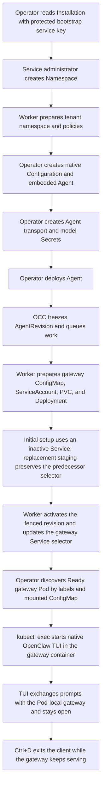

# Production TUI Flow

## Overview

An operator provisions a production Namespace and embedded OpenClaw Agent
through the authenticated OCC API, waits for the worker to activate an immutable
AgentRevision, then attaches to the Agent-owned gateway Pod with
`node /app/openclaw.mjs tui`. This flow starts at the first protected API
request after production startup and ends when the operator exits the TUI
client. It does not cover Helm installation internals, remote shared-cluster
operations, dedicated Codex Agents, Slack channels, or a host-installed TUI.

## Entry Points

- Trigger: authenticated production API calls followed by
  `kubectl exec -it <gateway-pod> -c gateway -- node /app/openclaw.mjs tui`.
- Source: `apps/controller/src/index.ts:createFastifyApp`,
  `packages/occ/src/index.ts:OpenClawController.deployAgent`,
  and `apps/controller/src/drivers/compute/kubernetes/index.ts:KubernetesComputeDriver.prepareRevision`.
- Assumptions: the production API and worker are ready, the caller has an OCC
  bootstrap service administrator key with current Namespace/Agent authority, the selected
  Kubernetes context points to the intended cluster, tenant RoleBindings and
  Agent-owned Secrets exist, gateway memory is sized for the gateway plus an
  interactive client, and the runtime image contains `/app/openclaw.mjs`.

## Flow



## Execution Trace

### 1. The API creates the production Namespace and records exact ownership

`apps/controller/src/auth/index.ts:ControllerAdmissionVerifier.verify`,
`apps/controller/src/index.ts:createFastifyApp`

After the initialization Job completes successfully, the operator retrieves
`initial-admin-service-key.json` from its protected output PVC. Neither the API
nor worker mounts that PVC. The checked-in
[`scripts/occ-api` helper](../../scripts/occ-api) reads
`data.key` into a private temporary header file, sends `x-api-key`, and first
verifies `GET /installation`. The API validates the key, resolves the
Installation-scoped service principal, and applies its current IAM grants; an
invalid, expired, or revoked key returns `401` without cookie fallback.

The production API receives `POST /namespaces` from an authenticated internal
client. Its request handler admits the request, resolves the caller identity,
then calls `OpenClawController.createNamespace`. Responses use the `{data,
meta}` envelope, and the returned `data.id` becomes the OCC `NAMESPACE_ID`. For
driver-managed placement, Kubernetes Compute derives the tenant Kubernetes
namespace name from that ID. For existing placement, the operator supplies
`existingNamespace` and the worker later verifies the pre-existing Kubernetes
namespace before binding tenant ownership.

The worker processes the Namespace claim in `ControllerWorker.process`. It
requires the Namespace to still target `ready`, reauthorizes the original
operation, calls the selected Compute Driver, and only transitions the
Namespace from `provisioning` to `ready` after the driver reports the observed
tenant boundary ready.

### 2. The API freezes the AgentRevision

`packages/occ/src/index.ts:OpenClawController.deployAgent`

After the Namespace is ready, the operator creates a Namespace-owned
`kind: "agent"` Configuration and an Agent with `executionMode: "embedded"`.
For the disposable connectivity demo, the Configuration sets
`agents.defaults.skipBootstrap` to `true` before Agent creation. That avoids
fresh-workspace `BOOTSTRAP.md` onboarding replacing the requested nonce reply;
existing workspaces with bootstrap files are unaffected. The bodyless deploy request to
`POST /namespaces/:namespaceId/agents/:agentId/deploy` locks the exact Agent,
requires the Namespace to be `ready`, reauthorizes `deploy` on the Agent,
reauthorizes `read` on the selected Configuration, validates any Secret
bindings, resolves the approved `openclaw` embedded Harness, and stores an
immutable AgentRevision.

The API response returns the frozen revision as `data`. The operator keeps both
`data.id` and the Agent's later `data.activeRevisionId`; the deployment request
does not by itself prove that Kubernetes is serving the new revision.

### 3. The worker prepares and activates the gateway workload

`apps/controller/src/worker.ts:ControllerWorker.processRevision`,
`apps/controller/src/drivers/compute/kubernetes/index.ts:KubernetesComputeDriver.prepareRevision`

The worker claims the durable AgentRevision work, reloads the Namespace, Agent,
revision, and previous active revision, reauthorizes the deployment actor, and
resolves the Secret delivery context. Kubernetes Compute verifies tenant
ownership and NetworkPolicies, writes an immutable ConfigMap named
`gateway-<agent-hash>-rev-<revision-hash>` containing `openclaw.json`, creates
the Agent-owned ServiceAccount, creates or reuses the gateway private-state
PersistentVolumeClaim, and starts one gateway Deployment with `Recreate`
strategy.

For embedded OpenClaw, the gateway Deployment is also the Harness workload. Its
container receives `OPENCLAW_CONFIG_PATH=/etc/openclaw/openclaw.json`,
`OPENCLAW_GATEWAY_PORT`, `OPENCLAW_GATEWAY_TOKEN`, `OPENCLAW_STATE_DIR`, and
the exact Agent model credential by Secret projection unless the revision uses
an OCC Secret binding for `OPENAI_API_KEY`. The API and worker do not receive
the model credential. For the first embedded revision, the Service selects the
inactive gateway name until the Deployment is ready. When preparing a newer
revision while a predecessor exists, the driver stages the replacement and keeps
the predecessor selector in place until fenced activation.

`KubernetesComputeDriver.activateRevision` rechecks the exact gateway revision,
applies the Agent runtime NetworkPolicy, and updates the gateway Service
selector. The worker then records the active revision through a guarded
compare-and-set, retires the predecessor, and emits completion evidence. At
this point `GET /namespaces/:namespaceId/agents/:agentId` can return
`data.activeRevisionId` equal to the admitted revision ID.

### 4. The operator discovers the active gateway Pod

`apps/controller/src/drivers/compute/kubernetes/index.ts:KubernetesComputeDriver.gatewayConfiguration`

Gateway Pods keep stable labels for the Agent, including
`app.kubernetes.io/managed-by=openclaw-enterprise`,
`openclaw.dev/workload-role=gateway`, `openclaw.dev/namespace`, and
`openclaw.dev/agent`. Those labels are not enough to prove the active immutable
revision after a cutover. The attach procedure calculates the expected
ConfigMap name from `AGENT_ID` and `REVISION_ID`, then selects exactly one
Running, Ready gateway Pod whose volumes mount that ConfigMap.

If discovery returns zero Pods, Kubernetes has not made the active gateway
ready. If it returns more than one, the operator stops and resolves the
ambiguous runtime state before attaching.

### 5. `kubectl exec` starts the native TUI inside the gateway

`deploy/runtime/README.md`,
`apps/controller/src/drivers/compute/kubernetes/index.ts:KubernetesComputeDriver.deployment`

The runtime image supplies `/app/openclaw.mjs`. The gateway container already
has the configuration file, port, token, and persistent runtime state mounted.
The operator starts a separate client state directory so TUI device-pairing and
client metadata do not reuse the serving gateway state:

```bash
kubectl --kubeconfig "$KUBECONFIG_FILE" --context "$CONTEXT" \
  -n "$TENANT_NAMESPACE" exec -it "$GATEWAY_POD" -c gateway -- \
  env -u OPENAI_API_KEY OPENCLAW_STATE_DIR=/tmp/occ-tui-client \
  node /app/openclaw.mjs tui \
    --session "$E2E_SESSION" \
    --message "Reply exactly: $NONCE"
```

The command intentionally does not pass `--url` or a token. The OCC service key
stays in the operator environment and never enters the Pod or TUI. Gateway
authentication uses the separate Agent gateway token. The TUI inherits the
Pod-local gateway connection details from the running container environment and
configuration, authenticates with the injected gateway token, and opens the
normal interactive UI. `--message` submits the first prompt to the TUI-native
agent named `main`; that name is separate from the OCC Namespace, Agent, and
AgentRevision IDs. The client process unsets `OPENAI_API_KEY`; model access
stays in the serving gateway path. The same process remains attached so the
operator can type a second prompt into the same session.

### 6. The operator exits the client without stopping the gateway

`tests/integration/production-tui-k3d-real.test.mjs`, `tests/helpers/tui-pty.py:run_conversation`

Ctrl+D exits the TUI process launched by `kubectl exec`; the production TUI test
drives that exit through `tests/helpers/tui-pty.py`, then checks the gateway
`/readyz` endpoint from inside the same Pod. After a new
immutable AgentRevision becomes active, the operator uses the service key to
read the Agent again and repeats discovery because
the matching ConfigMap and possibly the gateway Pod UID have changed. Removing
a temporary local service-key copy does not revoke the credential, and exiting
the TUI does not rotate or revoke it. Deliberate rotation and revocation follow
the [service-key procedure](../reference/authentication.md#revoke-or-rotate-a-service-key).

Automated coverage for this exact lifecycle is
`tests/integration/production-tui-k3d-real.test.mjs`. It uses
`tests/helpers/tui-pty.py` to keep the native TUI process open across two
prompts, verify nonce-only assistant responses, prove fresh invalid-token
denial, repeat the attach path after immutable revision cutover, and confirm
Ctrl+D exits only the client. Its native Configuration sets
`agents.defaults.skipBootstrap` to `true` for the disposable demo Agent so
first-run bootstrap guidance does not consume the nonce prompt.

The test separates production installation, service-key-authenticated provisioning, and
revision conversations into named stages. Shared scoped Kubernetes commands,
resource lookups, and polling come from
`tests/helpers/kubernetes-real.mjs:createKubernetesClient`; the production test
retains its credential-redacting process runner. One `nativeTuiArgv` builder
supplies the valid and denied TUI checks and the generated interactive attach
script, keeping client authentication and environment handling consistent.

## Debugging and Verification

- Confirm OCC activation before selecting a Pod:

  ```bash
  scripts/occ-api GET "/namespaces/$NAMESPACE_ID/agents/$AGENT_ID"
  ```

  Run from the repository root with `OCC_URL` and `OCC_SERVICE_KEY_FILE` set in
  the operator shell. Expect `data.activeRevisionId` to equal the intended revision ID.

- Confirm the selected gateway mounts the active immutable ConfigMap:

  ```bash
  kubectl --kubeconfig "$KUBECONFIG_FILE" --context "$CONTEXT" \
    -n "$TENANT_NAMESPACE" get pod "$GATEWAY_POD" -o json
  ```

  The Pod must be Running and Ready, carry the exact Namespace and Agent labels,
  carry `app.kubernetes.io/managed-by=openclaw-enterprise`, and include a
  volume whose `configMap.name` is `gateway-<agent-hash>-rev-<revision-hash>`.

- Check gateway startup without printing credentials:

  ```bash
  kubectl --kubeconfig "$KUBECONFIG_FILE" --context "$CONTEXT" \
    -n "$TENANT_NAMESPACE" logs "$GATEWAY_POD" -c gateway --tail=100
  ```

  Expected failure signatures include missing transport Secret keys,
  `CreateContainerConfigError` for a missing Agent model Secret, image pull
  failures for unimported digest references, pending gateway PVCs, and resource
  limits too small for an interactive TUI process.

- The native production TUI proof is
  `OCC_TEST_PRODUCTION_TUI_REAL=1 node --test --test-concurrency=1 tests/integration/production-tui-k3d-real.test.mjs`.
  It requires the actual Helm chart, imported immutable controller, runtime,
  PostgreSQL, and Node image references, an explicit disposable k3d
  kubeconfig/context, and `OPENAI_API_KEY`.
- Adjacent source-backed checks remain
  `node --test tests/integration/harness-topology-k3d-real.test.mjs` and
  `node --test tests/integration/kubernetes-compute-real.test.mjs`.

## Related docs

- [Deployment guide](../guides/deploy.md)
- [Production startup flow](production-startup.md)
- [Harness execution topology flow](harness-execution-topology.md)
- [Kubernetes Compute Driver](../reference/drivers/kubernetes-compute.md)
- [Agent placement and deployment](../reference/agents.md#execution-mode)
- [Production interactive TUI specification](../../specs/16-production-tui-end-to-end.md)
- [Production TUI integration test](../../tests/integration/production-tui-k3d-real.test.mjs)

## Manual Notes

[keep this for the user to add notes. do not change between edits]

## Changelog

- 2026-08-31 20:34: Use the checked-in operator API helper for service-key requests. (01a05a3d-526f-7553-8cd8-070bd1847acb - b6f213cbcee11ba3dd69886c936c7e5abe233eb3)

- 2026-08-31 19:14: Document bootstrap service-key API access and operator credential cleanup for the TUI path. (codex/01a05a3d-526f-7553-8cd8-070bd1847acb - 06c4bccb95543d3d545d011e72074f805f339aa8)

- 2026-08-31 17:12: Recorded shared Kubernetes helpers and the common TUI command used by the refactored production proof. (01a059fc-1a4d-7fa2-8375-3999ef6aeff8 - 86441b7)

- 2026-08-31 16:05: Updated production TUI verification to point at the implemented Helm-backed PTY integration. (01a059fc-1a4d-7fa2-8375-3999ef6aeff8 - b43cc49)
- 2026-08-31 15:50: Documented the production embedded Agent to native TUI attachment flow. (01a059fc-1a4d-7fa2-8375-3999ef6aeff8 - b43cc49)
