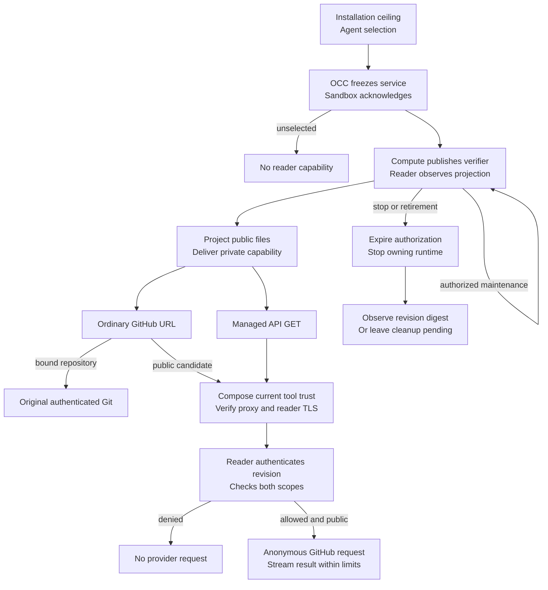

# Public GitHub read flow

## Overview

A dedicated Codex Agent can clone and fetch public repositories with ordinary
GitHub HTTPS URLs alongside its protected repository bindings. The Installation
ceiling intersects the Agent revision's selected public-read policy. Compute
publishes revision authorization to a private reader, which sends anonymous
requests to fixed GitHub origins. This flow ends at the Git/API response or
completed authorization withdrawal; installed-runtime qualification is separate.

## Entry Points

- `scripts/render-installation-profile.mjs:buildRendered` pairs Helm and Compute inputs.
- `packages/occ/src/index.ts` freezes selected Compute services during authorized Agent deployment.
- `apps/controller/src/drivers/compute/kubernetes/index.ts:prepareRevision` prepares the selected runtime and reader authorization.

## Flow

```mermaid
graph TD
  Selection["Installation ceiling<br/>Agent selection"] --> Admission["OCC freezes service<br/>Sandbox acknowledges"]
  Admission -->|unselected| Deny["No reader capability"]
  Admission --> Lease["Compute publishes verifier<br/>Reader observes projection"]
  Lease --> Runtime["Project public files<br/>Deliver private capability"]
  Runtime --> Git["Ordinary GitHub URL"]
  Git -->|bound repository| Protected["Original authenticated Git"]
  Git -->|public candidate| Trust["Compose current tool trust<br/>Verify proxy and reader TLS"]
  Runtime --> API["Managed API GET"]
  API --> Trust
  Trust --> Reader["Reader authenticates revision<br/>Checks both scopes"]
  Reader -->|denied| Failure["No provider request"]
  Reader -->|allowed and public| Github["Anonymous GitHub request<br/>Stream result within limits"]
  Lease -->|authorized maintenance| Lease
  Lease -->|stop or retirement| Withdraw["Expire authorization<br/>Stop owning runtime"]
  Withdraw --> Ack["Observe revision digest<br/>Or leave cleanup pending"]
```

## Execution Trace

### 1. Compose a private Service and an eligible Agent revision

`apps/controller/src/drivers/compute/kubernetes/index.ts:admitServiceAccess` reads the original Driver-owned
Configuration before Sandbox normalization.
`packages/occ/src/index.ts:checkedComputeServiceAccess` supplies the authoritative
runtime Installation ID alongside Configuration and Harness; Compute freezes it
in the descriptor. The profile renderer keeps the operator ID only in Helm
values for registry ownership, never in startup YAML. The recursive startup
guard continues to reject reserved identity keys. Omitted or empty selection grants
nothing; a covering authored deny also withholds the service. OCC saves the
nonsecret descriptor under `AgentRevision.compute.serviceAccess`. A selected
Sandbox must acknowledge the exact descriptor in `SandboxPolicySnapshot`.
`packages/occ/src/state/postgres-state.ts:revisionFromRow` reloads both saved
objects unchanged. The PostgreSQL snapshot constraint validates the generic
service shape, unique IDs and Compute owner, and requires any Sandbox service
acknowledgement to equal the saved Compute services. Old revisions without
services remain ungranted.
Protected execution uses `admitProtectedNetworkPolicy`; both paired OpenShell
compilers consume the frozen facts, rather than importing new Installation rules.

`publicGithubReadService` requires a valid frozen Installation identity and checks
the endpoint, peer, registry and public CA against current configuration. The
authorization store checks its owner label and rows against the frozen identity.
The `public-github-read:v2`
admission digest selects a distinct launcher; rebuilding an older revision does
not implicitly enable it. Existing `v1` ordinary API-reader revisions retain
their earlier admission and ownership checks.

The chart mounts operator-created TLS and authorization resources into a
reader without a service-account token. Helm owns public policy and trust files;
it never renders mutable authorization data. Compute needs network reachability
to the reader's verified HTTPS Service for readiness and withdrawal observation.

### 2. Publish authorization and project runtime material

`apps/controller/src/drivers/compute/kubernetes/public-github-read-authorizations.ts`
creates or verifies an immutable revision Secret containing a random capability.
It updates the verifier-only registry with Kubernetes `resourceVersion` checks.
The row identifies the Installation, Namespace, Agent, revision and frozen scope,
with a ten-minute lease. Preparation and activation wait for the reader's
`/healthz?revision=...` digest to match the projected row. Unrelated Agent renewals
do not change this acknowledgement.

`apps/controller/src/drivers/compute/plugin-runtime.ts:pluginRuntimeConfigMapData`
projects only endpoint, public CA, authenticated repository names and the managed
skill. An ordinary Harness mounts its capability Secret. OpenShell delivers the
capability through its existing endpointless runtime provider; the workload sees
an identity-bound placeholder. Only the selected reader endpoint binds that
provider. The supervisor needs the reader CA in its own native TLS trust store. Stock
Kubernetes OpenShell needs a qualified trust-image layer or operator admission
injection for a private issuer; Harness trust alone does not configure it.
Compute's NetworkPolicy grants reader egress to the selected ordinary Harness or
the exact trusted supervisor peer; a protected workload receives no direct grant.

The admitted launcher places helper source, combined public CA, transport config
and Git wrappers below `$HOME/.oce-public-git`, in private generated children.
It rejects symlinked, foreign-owned or nonprivate material parents. The Gateway's
runtime translator grants read-only access to that exact parent in ordinary
Codex's limited filesystem profile; startup dependencies do not rely on temporary
files outside that grant. OpenShell keeps its existing outer boundary and uses its
relocated HOME. No capability value is written under this parent.

`transport.mjs:installMaterial` preserves inherited public trust and exposes the
reader CA through `CODEX_CA_CERTIFICATE` before Codex starts. This configures the
selected process's upstream TLS roots, not system trust or a per-origin CA store.
Codex later supplies its interception CA to tools through standard CA variables.
Exact destination policy and hostname verification remain required on both legs.

### 3. Route ordinary Git URLs and enforce public scope

`apps/controller/src/drivers/repo/github/public-read/transport.mjs` installs a
private `git-remote-https` helper from the new launcher. It preserves stored
remotes and the image's other Git helpers. Exact authenticated repository names
retain the original URL, helper and credentials. Other canonical GitHub HTTPS
repositories use the reader's `/git/OWNER/REPOSITORY.git` route. A reader denial
never falls back to GitHub.

For public requests, the child clears inherited command-line Git configuration
and applies settings for the exact rewritten URL. It resets headers, cookies,
credential helpers and Git-configured proxies; verifies TLS with combined reader
and current tool trust; disables redirects and interactive credentials; and preserves
the environment proxy route used by OpenShell. An inherited client TLS identity
causes refusal before contact. Configuration and public material files contain
no capability value.

The public Git branch sets an empty `GIT_ASKPASS` as well as disabling terminal
prompts. Older Git checks askpass before the terminal flag and does not honor
`credential.interactive`; the explicit empty value also blocks config/SSH fallback.
Authenticated delegation retains its caller's askpass and credential settings.

`transport.mjs:composeTrust` composes public certificates at each operation,
including a fresh tool interception CA. Selected CA files are regular files of
at most 1 MiB each; total input is at most 4 MiB and the deduplicated bundle at
most 1 MiB. Missing, malformed or oversized trust fails closed. Standard hash
comments and underlined certificate labels are accepted; keys are rejected.
For Git and standalone non-Linux API reads, `operationTrust` selects the existing
absolute `OPENCLAW_WORKSPACE_DIR`, supplied by
Compute and used by the Harness as its workspace, including OpenShell relocation.
A workspace-write native profile admits this root but need not expose `/tmp`. A missing or unwritable selected workspace fails without fallback. Only
standalone callers without that runtime variable use `os.tmpdir()`; the helper
never selects its cwd, which Git may move into protected `.git` metadata.
Each operation creates a unique mode-0700 directory and exclusive mode-0400
public-CA file in that root. Completion, failure and handled cancellation remove
only that directory. Concurrent operations remain independent. Uncatchable
termination can leave public certificates in the workspace; no scavenger removes
other operations' state. Capabilities never enter these files.

For Linux API reads, `apiGet` passes the validated bundle to `runChild` on an extra
pipe. The constant `apiTrustCarrier` runs with Python `-I -S -B`, ignores ambient
Python startup/import settings, and creates a bounded mode-0400 sealed memfd.
It closes its input, rewinds the CA, and execs fixed `/usr/bin/curl` with the
inherited descriptor path. Authorization stays on stdin. No directory is created,
no network executable is added, and no filesystem permission is expanded. Linux
carrier failure stops the operation without retrying scratch storage. The native
read-only API path and Git's workspace-write path remain distinct.
`runChild` bounds API preparation and transfer with one 24-second parent deadline,
handles early pipe closure, and forwards cancellation. Closing the process's
anonymous descriptor releases the CA even after uncatchable termination.

`transport.mjs:apiGet` accepts only reader-relative `/repos/` GET routes. The
managed skill invokes it without supplying an origin, proxy, credentials or curl
options. The helper uses configured authorization, ignores curl configuration,
refuses redirects and buffers responses within the reader's 12 MiB/24-second
limits. Its capability header goes through child stdin, never a temporary file.
The fixed `--api-get-metadata` mode returns `{status, link, body}` only after a
successful response. `responseMetadata` discards informational/proxy headers and
exposes only the final status and bounded relative Link alongside parsed JSON.
Headers are limited to 16 KiB and Link to 8 KiB; malformed, duplicate or
cross-resource continuation fails without output. The Agent follows relative
next links through the same helper and reports interrupted listings as incomplete.
Body-only `--api-get` remains unchanged.

`transport.mjs:refusalReceipt` appends only an allowlisted phase/code to the
existing synchronous refusal. Configuration, authorization, trust input/composition,
private trust-file creation and child setup/dispatch remain distinct. Unknown
exceptions remain unknown; messages, stacks, paths and credentials are not emitted.
The model fixture validates these fields before logging them, without retrying.

An authored native limited-method proxy permits API GET but blocks Git's
upload-pack POST. Full HTTP methods require the same restricted filesystem/exec
profile, explicit reader-host allow and local-binding denial; the reader still
rejects writes. Full-mode HTTPS tunnels do not exercise limited-mode interception.
Protected OpenShell keeps its existing profile and exact service/port/L7 policy.

`apps/controller/src/drivers/repo/github/public-read/server.ts:createPublicGithubReadServer`
authenticates before quota admission, deduplication or provider requests. API and
Git reads apply the current ceiling and revision scope. The reader checks current
public visibility and uses only fixed `api.github.com` and `github.com` HTTPS
origins, without caller credentials, cookies or redirects. `git.ts` permits only
Git upload-pack discovery and requests. It streams with backpressure and cancels
upstream work on failure or disconnect; size and deadline limits fail explicitly.
Quota and in-flight state remain process-local. Address-based limits do not prove
per-Agent fairness when Agents share a supervisor address.

### 4. Maintain or withdraw the revision's access

Kubernetes Compute renews only the frozen policy. After repository Git expires,
`apps/controller/src/worker.ts:withdrawExpiredRepositoryAccess` verifies independent IAM, model, Secret/admission
and Backend obligations before calling `ComputeDriver.maintainServiceAccess`
under the claim heartbeat. This does not prepare or activate a runtime or issue
another Git session. Loss of independent authority prevents renewal.

`beginPublicGithubReadWithdrawal` expires authorization before runtime shutdown,
then observes the reader's revision digest. A registry write or reader failure
cannot prevent the shutdown attempt; cleanup reports failure and retries rather
than claiming withdrawal complete. User stop can suspend and later resume the
same immutable capability. Retirement and an observed peer change permanently
withdraw the saved authorization; it cannot be restored by preparing that revision.
An expired or unreadable row denies future reads even if maintenance is unavailable.

For legacy `v1` reader revisions, `revokeUnavailablePublicGithubRead` removes the
revision policy, foreground-deletes the owned Compute Deployment and waits for
its Pods before reporting withdrawal. Policy deletion alone does not close
existing connections. The owning active claim's `rejectedExecutionWithdrawal`
also fences those revisions when an Installation switches to protected execution.
Current Sandbox failure can leave ancillary cleanup pending; it is not evidence
that the owning runtime has stopped.

## Debugging and Verification

- Compare the saved service descriptor, reader policy, public trust and exact peer before checking runtime files. Never print capability Secrets or provider values.
- `/healthz` proves readable input; the revision digest proves the mounted authorization row. Neither proves GitHub reachability or a successful Agent clone.
- Controlled Git/TLS tests prove clone, fetch, scope denial, withdrawal and operation-time trust composition, including consecutive TLS roots and cleanup. They do not prove Codex interception; the stock Linux image and installed Agent gates remain separate. Kubernetes store tests prove Secret ownership, restart and permanent withdrawal.
- PostgreSQL worker tests prove independent maintenance after Git expiry and refusal after IAM loss. Installed Podman/k3d/OpenShell Agent proof remains required before deployment qualification.

## Related docs

- [Supported public reads, operator setup and retirement](../reference/public-github-reads.md)
- [Managed Agent repository credentials](agent-repository-credentials.md)

## Manual Notes

[keep this for the user to add notes. do not change between edits]

## Changelog

- 2026-11-04 18:32: Deliver Linux API trust through a sealed memory file under read-only profiles (accompanying correction; authoring-run/93407fe4-b349-48fd-b3c0-c2d9b3534e5b - 95b6c02bb86f72841f30ee9da14bc9d4ebbc26ff)

- 2026-11-04 15:52: Select admitted runtime workspace for private operation trust files (accompanying correction; authoring-run/cd9c1598-6e1e-48d1-8f87-5e3a2118ce9d - 69e6005ea0f4b05c284b568867e91a455b64929c)

- 2026-11-04 13:22: Retain fixed managed-refusal phases and distinguish native method-policy qualification (accompanying correction; authoring-run/77414b6b-7f99-44c9-a206-b3778ec3010f - e4e54f5b80e82c4258de30572e21cfe123e2444b)

- 2026-11-04 10:45: Preserve bounded pagination metadata in managed API reads (review correction; authoring-run/91dbe88d-f8ca-4112-959d-27f83555e7bb - f1f0005b41eef72c206f96ea7ebff9a3aa763352)

- 2026-11-04 10:18: Compose startup and current tool trust for both TLS legs and shared Git/API callers (accompanying correction; authoring-run/91dbe88d-f8ca-4112-959d-27f83555e7bb - 2370e9e3ea36dc1ff5930c0f3538693c6c1aa0ad)

- 2026-11-04 08:23: Preserve generic service snapshots through PostgreSQL admission and reload (authoring-run/8b8f9ff8-9b16-4565-95de-0868a92b35d5 - 8207d68072a390cf615fc2170fe89c8b90c3758e)

- 2026-11-04 07:13: Preserve public-service launch facts inside shared model-provider admission (accompanying merge; authoring-run/c6923421-fc77-433e-b0ce-8fb4632fded1 - 35de595e06a0acfe556772fa3eb898f606dc8051)

- 2026-11-04 06:24: Project generated public Git material through the ordinary native read-only profile (accompanying correction; authoring-run/bfe7275c-8f39-483b-98a4-680042d905b7 - f3bcd113bd01ca1c510228b4acb1caaf7d1b70e4)

- 2026-11-03 23:48: Pass runtime Installation identity through generic admission context; omit it from startup YAML (accompanying correction; authoring-run/7e419797-9505-47d1-836b-b0af838ed449 - f6928cf0ee5cfec351f78dedcba02f0c1a9ecfa2)

- 2026-11-03 18:09: Describe scoped API and Git reads, transport isolation, leased authorization and withdrawal (accompanying implementation; authoring-run/36a8f335-4206-49ad-bc39-1ec044ec81d9 - 83a17289139a58b8adcb605e8b484c47b257dcdb)

- 2026-10-15 11:05: Project the managed reader skill to Gateway and Harness (authoring-run/ea23f0cb-8736-4898-b5fc-92737486fb72 - 87e12a1169a997a99fec7de261b43a0ea2255f54)

- 2026-10-15 10:35: Use admitted Harness ownership during reader withdrawal (authoring-run/87f54df9-4b7e-43b3-a627-60e6b6678225 - 52b6a608fa3d1ad6a6f9d7170f3dd5c4d624c1a6)

- 2026-10-15 09:55: Stop the selected Harness before withdrawing its reader grant (authoring-run/47f5b717-62d4-4f46-8310-770057b70134 - 97044717385c2af34c6a611e74203f3a2734f4c5)

- 2026-10-15 09:27: Preserve bounded issue pagination cursors (authoring-run/6399ddc9-8441-4407-8b0f-9ee9755a1cc0 - c620c8372898c4720998445f7f7df89b2799336e)

- 2026-10-15 09:03: Freeze reader selection at admission and revoke changed peers (authoring-run/acd06c56-509b-44d8-9dd3-0858ab106ad0 - 07d2178e530c07883a24c17efc950378c52e2b86)
- 2026-10-15 05:37: Bind reader access and retirement to the selected revision (authoring-run/0da590a9-3bb3-4aa3-a005-25ff485692db - 00bbc7cd976ab7be317ce1e0a9d36ad72ce10567)
- 2026-10-15 05:04: Document public reader revision, proxy and provider boundaries (authoring-run/20c735e1-24ca-4e55-9f8c-8c362173c58a - 00bbc7cd976ab7be317ce1e0a9d36ad72ce10567)
