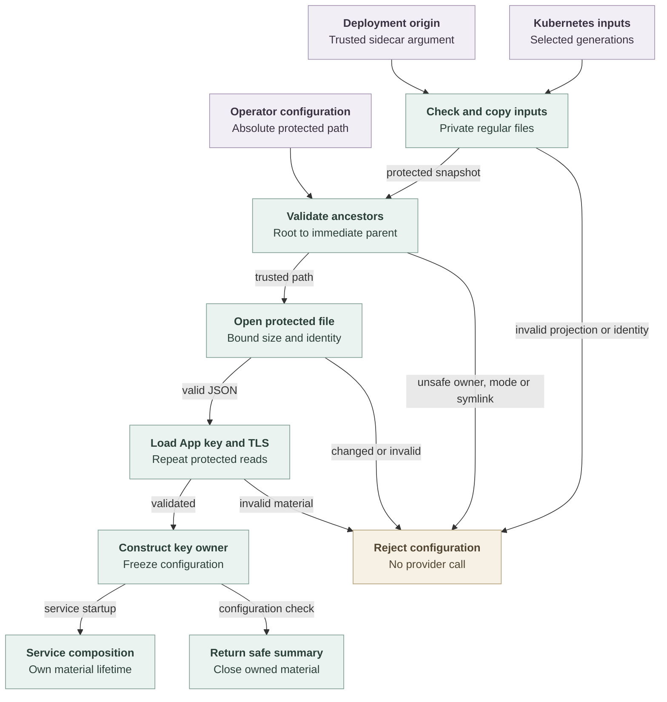

# Repository credential configuration flow

## Overview

The repository credential composition loader validates operator-selected
configuration, GitHub App key material, and TLS files before returning a frozen
configuration owner. In Kubernetes projection mode, the sidecar derives the
broker origin from its trusted deployment argument before protected loading. The
standalone `--check-config` entry point still requires an explicit origin,
reports a nonsecret summary, and closes that owner. This flow stops before
provider requests or listener startup.

## Entry Points

- Trigger: `node scripts/render-repository-credentials-origin.mjs --release NAME --namespace NAME --values FILE`
  before issuing the Kubernetes broker certificate.
- Trigger: `pnpm credentials:check-config /absolute/path/service.json`.
- Source: `scripts/render-repository-credentials-origin.mjs`,
  `apps/controller/src/composition/repository-credentials/projected-inputs.ts:prepareProjectedInputs`,
  `apps/controller/src/composition/repository-credentials/check-config.ts:checkConfiguration`,
  and `apps/controller/src/composition/repository-credentials/config.ts:loadConfiguration`.
- Assumptions: Node 24, prepared build output, operator-selected absolute paths,
  and the ownership and permission policy in the [reference](../reference/repository-credentials.md#configuration).

## Flow

## Execution Trace

### 1. Render the Kubernetes broker origin before preparing TLS

`scripts/render-repository-credentials-origin.mjs:renderedBroker`

The operator renders the Helm chart after selecting `repositoryCredentials`
values and before issuing the broker certificate. The helper reads the rendered
worker sidecar's `--public-origin` argument and returns that origin, hostname,
Service name, release, namespace, and Backend ID. Certificate issuance uses that
hostname as its DNS SAN, so the chart-rendered origin remains the input for TLS
material, startup, and later Agent session material. The helper does not derive
a second hostname policy; Helm validation owns the supported Service settings.

Helm always renders an explicit worker Deployment strategy. Disabled installs use
the Kubernetes default RollingUpdate values, `maxSurge: "25%"` and
`maxUnavailable: "25%"`. Broker-enabled installs render `strategy.type:
Recreate` and omit `rollingUpdate`, allowing server-side apply to remove the
previous RollingUpdate fields before Kubernetes validates the Recreate strategy.
Older disabled releases that did not explicitly own the RollingUpdate fields
must first refresh with the current disabled chart and no active Agent sessions,
then opt in to repository credentials. Existing broker-enabled installs already
use Recreate.

### 2. Snapshot Kubernetes inputs when selected

`apps/controller/src/composition/repository-credentials/projected-inputs.ts:prepareProjectedInputs`
and `apps/controller/src/composition/repository-credentials/protected-file.ts:readProtectedFile`

Kubernetes startup reads `config.json`, App key, TLS files and registry from the
currently selected projected-volume generation. The projection layer fills an
absent `gateway.publicOrigin` from the trusted `--public-origin` deployment
argument. If operators provide `gateway.publicOrigin`, it must match that
argument exactly. The same projection check verifies that the serving certificate
covers the derived full Service FQDN before copying any projected input into the
private runtime directory.

The protected loader requires a normalized absolute path and validates its directory
ancestors in root-to-leaf order. Each accepted prefix therefore protects the
next path component against replacement by another local user. Ancestors must
be directories owned by root or the service user. Group/other writes fail except
for a root-owned sticky ancestor above the immediate parent. The immediate
parent remains unwritable by those users.

The loader opens the final basename without following symlinks. It checks the
file owner, mode, link count, type, and size, performs a bounded read, and compares
the open file with the named inode and its original metadata. Invalid or replaced
files fail before their contents become configuration. The reader retains ownership
of its candidate buffer until descriptor closure and transfer succeed. It clears
scratch bytes and any candidate that cannot be transferred, including on a close
failure. Success transfers an independent buffer to its caller; failure returns
no filesystem details. Configuration maps
that failure to `invalid-configuration` and clears successfully returned bytes.

### 3. Validate configuration and construct material owners

`apps/controller/src/composition/repository-credentials/config.ts:loadConfiguration`

Composition validates the service policy and selects either one GitHub repository
or the canonical registry, together with its App identity and key path.
`composition/repository-credentials/registry.ts` owns registry file I/O;
`drivers/repo/github/credentials/registry.ts` owns pure GitHub policy validation.
Public projected registry reads retain their own generation/symlink rules;
they do not weaken protected-secret descriptor validation. That
validated selection determines the factory after protected reads load the App
key, certificate and TLS key. Registry policy remains bounded to its installation,
repository and Namespace/profile grants. The GitHub key owner accepts the
configured RSA signing key; TLS context creation validates
the certificate and private-key pair. A `github-token` backend instead requires
the `developmentAuthority` option (the `--development-authority` process flag)
and an eight-hour session cap; it reads the token file with the same protected
reader, strips one trailing newline, and constructs a
`GitHubStaticTokenOwner` without reading any App key. The frozen result owns the
selected factory and TLS buffers and names its `authority`
(`github-token-development` with a `tokenClass` for the token kind). Failure closes any constructed owner and clears loaded
buffers before returning `invalid-configuration`.

### 4. Close validation material or hand it to service startup

`apps/controller/src/composition/repository-credentials/check-config.ts:checkConfiguration`

The check returns the gateway origin, configured profiles, maximum session
duration, authority and, for the token kind, its token class. Its `finally` block closes the material owner, and the CLI prints only
the safe summary. It creates no session, listener, or provider request.
The Kubernetes check similarly closes the loaded owner before reporting success;
it also rejects a shutdown grace beyond the Pod's allowed service cleanup window.
Normal startup instead passes the owner to
`apps/controller/src/composition/repository-credentials/service.ts:runService`,
which retains it until startup failure or process shutdown. The
[service flow](repository-credentials.md) owns that lifetime.

## Debugging and Verification

Follow the build and configuration commands in the
[operator guide](../guides/repository-credentials.md). Success prints JSON with
`valid: true`; failure prints `invalid-configuration`. Inspect every ancestor
when safe-looking files still fail validation. A shared writable deployment
directory can permit substitution of an otherwise private configuration tree.

Run the configuration and emitted-package cases in the [testing guide](../testing/repository-credentials.md).
They exercise real generated RSA/TLS files and the actual loader. They establish
startup validation, not live GitHub behavior or platform integration.

## Related docs

- [Repository credential reference](../reference/repository-credentials.md)
- [Repository credential operator guide](../guides/repository-credentials.md)
- [Repository credential tests](../testing/repository-credentials.md)
- [Credential service startup and shutdown](repository-credentials.md)
- [Platform architecture](../design.md)

## Manual Notes

[keep this for the user to add notes. do not change between edits]

## Changelog

- 2026-10-04 08:00: Add the development-only GitHub token authority branch, its process flag, and the authority summary. (gh-token-impl - github-token-authority)

- 2026-09-27 12:14: Record the server-side apply strategy ownership path for broker-enabled worker Recreate upgrades. (cody/01a0e42f-3192-76d1-89b6-4bec0cb00e64 - 181b0472f9a5)

- 2026-09-27 11:53: Document the Helm-rendered broker origin helper before Kubernetes projection snapshotting. (cody/01a0e42f-3192-76d1-89b6-4bec0cb00e64 - 181b0472f9a5a9d422035edf5121d3a15c200cb5)

- 2026-09-25 23:47: Derive the Kubernetes broker origin from the sidecar deployment argument and validate the projected TLS host. (public authoring-run/656293f4-5523-4894-8d65-6c69b3bc5dee - 7e310b74)

- 2026-09-19 23:54: Reconcile RepoDriver ownership, private status projection, and separate emitted service/client paths. (public authoring-run/73c80a5e-4d0c-4e72-b989-0cf9963c6593 - e5b5a5489f078d08272523476bdbcd0b9162c946)

- 2026-09-19 21:29: Move configuration ownership to composition and document return-buffer ownership through descriptor close. Verify composed source. (public authoring-run/a55f804b-53b3-40df-a5d5-b6a2f425544b - 5d8329753f4e17402f619d392acc8fc3d112f620)

- 2026-09-18 18:51: Separate protected-file reading from configuration assembly while preserving validation and disposal. (source `d29fac7d363eb1cfb3dab6306a81cc3b8daf395d`)

- 2026-09-18 03:32: Document protected ancestor validation and configuration ownership with the accompanying security correction (source `2d4877aaf438c919a2240109cb2e7067e4d75b4d`)
