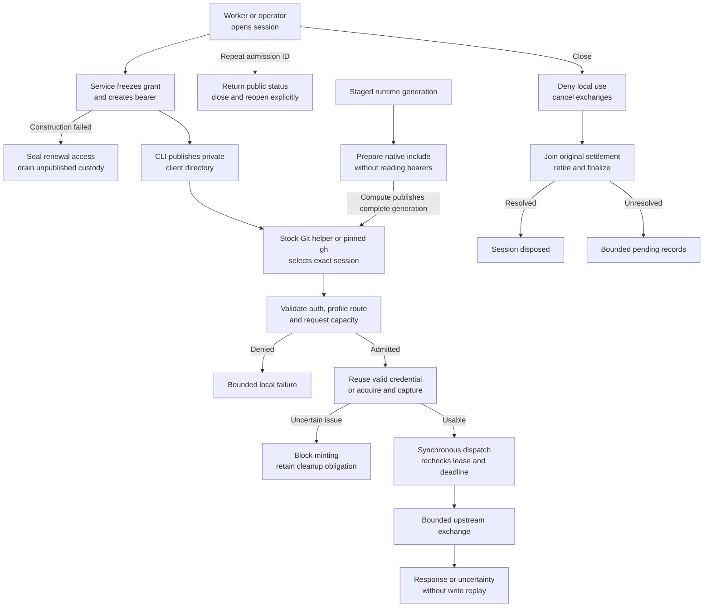

# Repository credential service flow

## Overview

Operators or workers admit bounded sessions over private Unix control; clients
send Git or selected API requests over HTTPS with a gateway bearer. This trace
covers forwarding, closure and cleanup in the separate credential process. The
[Agent flow](agent-repository-credentials.md) owns admission and material delivery.

## Entry Points

- `apps/controller/src/repository-credentials.ts:main` delegates protected-path startup to `startCredentialService` in controller composition.
- `apps/controller/src/drivers/repo/github/credentials/client/operator.ts:callControl` carries operator admission/status/close requests over the private Unix socket.
- `apps/controller/src/drivers/repo/credentials/server.ts:startListeners` accepts HTTPS client traffic after protected startup succeeds.

Standalone configuration selects one repository; the registry supports several
under one App installation. Sessions bind exactly one repository. Operators own
protected files and control; clients receive session files and public connection/trust settings.

## Flow

## Execution Trace

### 1. Load protected startup inputs

`apps/controller/src/composition/repository-credentials/check-config.ts:checkConfiguration` and
`apps/controller/src/composition/repository-credentials/service.ts:startCredentialService` load protected configuration through
`apps/controller/src/composition/repository-credentials/protected-file.ts:readProtectedFile`.
The [configuration flow](repository-credential-configuration.md) traces its
root-to-leaf protected-path validation and Kubernetes projection snapshots.
`apps/controller/src/drivers/repo/credentials/configuration.ts:validateServiceConfig`
validates gateway, session and capacity settings. The standalone check emits a
safe summary without session/listener imports. Startup selects the system clock
and GitHub factory; `apps/controller/src/composition/repository-credentials/service.ts:runService`
composes service and listeners without the controller API or worker.
`apps/controller/src/drivers/repo/github/credentials/factory.ts:createGitHubDriverFactory`
composes session-bound backends. It delegates grant resolution to
`apps/controller/src/drivers/repo/github/credentials/grants.ts:createGrantResolver`
and client authentication to
`apps/controller/src/drivers/repo/github/credentials/gateway-authentication.ts:createGatewayAuthentication`.
A registry-selected factory retains the frozen repository identity and access profile.
The process owns the App signing key separately from session installation tokens.
`packages/contracts/src/repo.ts` owns public `RepoDriver`, grant identity and
four-field status. Private contracts under
`apps/controller/src/drivers/repo/credentials/` separate full status/admission/bearer
results (`service-contracts.ts`), the dependency-free six-field client DTO
(`client-contracts.ts`), and backend protocol/custody handles (`backend-contracts.ts`).
Type-only imports keep service initialization out of Compute and the Git/gh bundle.
The frozen runtime facade exposes `open`, `status`, `close` and `shutdown`;
listeners own exchanges. The [Agent flow](agent-repository-credentials.md) owns
platform session-control and local policy.

Registry startup selects
`apps/controller/src/drivers/repo/github/credentials/registry-factory.ts:createGitHubRegistryDriverFactory`
from the same canonical authority loaded by API and worker. App and TLS private
keys remain service-only. `startListeners` can reclaim only an owned,
private, refused stale Unix socket after checking that its identity is unchanged;
a live or ambiguously owned socket fails startup.

### 2. Admit and publish a client session

`apps/controller/src/drivers/repo/credentials/control.ts:handleControl` validates the local
request method, target, content type and bounded body before invoking the common
service. `apps/controller/src/drivers/repo/credentials/service.ts:createCredentialService`
checks duration, allowed profile and capacity, then freezes the resolved binding.
Profiles are opaque to the common service. GitHub resolves `git-read`, `git-write`
and `git-full` to the [permission maps](../reference/repository-credentials.md#configuration)
and includes the profile in grant identity. Startup rejects unknown names,
including `read-write`; the example defaults to `git-write`. Bearer lookup stores
a digest; only the original admission response contains the bearer.

`apps/controller/src/drivers/repo/credentials/server.ts:startListeners` owns the
bounded correlation registry from
`apps/controller/src/drivers/repo/credentials/control.ts:createControlAdmission`.
Admission IDs bind the complete request: platform Namespace, repository reference,
normalized profile, expected grant and absolute deadline. Registry mode requires
this binding and independently resolves its fingerprint. A worker-owned private
journal reserves the exact attempt before bearer delivery; recovery durably fences
a missing admission. The broker opens the session before reserving, so a capacity
or shutdown refusal leaves no receipt and the same admission can retry or be
fenced. When the broker refuses a reserved admission as invalid, or cannot record
its session, it fences its own reservation. Known nondelivery closes the session.
Reconciliation cannot recover a bearer, change its binding or replay provider work.

Factory failure or an invalid binding closes construction admission before
`apps/controller/src/drivers/repo/credentials/custody.ts:disposeAllRenewal`.
All handles are sealed before awaiting callbacks. Unpublished custody occupies
bounded session capacity until callbacks settle and bytes are disposed.

`apps/controller/src/drivers/repo/github/credentials/client/config.ts:writeClientConfiguration`
stages private files, synchronizes writes and renames the directory into place.
CLI output reports status and location. After a write failure, the CLI attempts
closure and reports the admitted session ID for operator follow-up.

### 3. Authenticate the selected client

`apps/controller/src/drivers/repo/github/credentials/client/native-git.ts:prepareNativeGitConfiguration`
prepares staged material through
`apps/controller/src/drivers/repo/github/credentials/client/manifest.ts:readRuntimeRepositoryManifest`
which validates complete-generation public identities, final paths and metadata.
The renderer requires same-origin CA agreement and one gateway origin per
canonical host, then emits deterministic rewrites and origin-scoped credential/TLS
defaults. Exclusive no-follow creation writes staged `gitconfig`; the receiver
rechecks deadlines and publishes atomically. Source does not qualify installed images or receivers.

Stock Git reads the resulting include and owns its normal command/configuration
semantics. On authentication,
`apps/controller/src/drivers/repo/github/credentials/client/git-helper.ts`
parses the bounded credential protocol and verifies the embedded generation.
`apps/controller/src/drivers/repo/github/credentials/client/targets.ts:selectGitCredential`
matches effective HTTPS origin and case-insensitive owner/repository with optional
`.git`. Explicit reference/session pins must match. Ambiguity, stale pins and
expired selections release no bearer. The helper reads only the selected bearer,
clears its buffer after use, and leaves material unchanged for store/erase.

`apps/controller/src/drivers/repo/github/credentials/client/router.ts:routeRepositoryClient`
handles only gh. It validates the supported API/explicit-head PR invocation,
selects a binding from its explicit target, inherited pin or native Git remotes,
and propagates the exact generation/reference/session pin to children.
Before launching gh, the router and single-session launcher compare the private
bearer and generated host configuration and check the deadline again after
reading them. A mismatch or unsafe file refuses the launch. This preflight
detects inconsistent material; it is not an atomic snapshot or authorization.
`apps/controller/src/drivers/repo/github/credentials/client/environment.ts:createClientEnvironment`
keeps gh token/config isolation while preserving normal HOME and system Git
configuration. `apps/controller/src/drivers/repo/github/credentials/client/commands.ts:prepareGhCommand`
checks gh 2.100.0 and the canonical host/port profile.
`apps/controller/src/drivers/repo/github/credentials/client/launch.ts:launchClient`
provides single-session stock Git execution, signal forwarding and original child
exit status, without Git command parsing or temporary-HOME cleanup. The
[reference](../reference/repository-credentials.md#client-routing-and-limits)
owns configuration overrides and generation limits.

### 4. Reserve, acquire and dispatch

`apps/controller/src/drivers/repo/credentials/server.ts:startListeners` bounds
sockets per listener, preserving control admission under public saturation.
HTTPS separately bounds handshakes and starts `headerMs` on the `TLSSocket` at
`secureConnection`; Unix control retains its raw-socket timer.
`apps/controller/src/drivers/repo/credentials/transport/agent.ts:createAgentHandler`
clears the TLS timer after authenticated capacity reservation, before acquisition;
the exchange deadline remains enforced.

`createAgentHandler` checks framing and delegates authentication to the bound
factory. Unauthenticated valid Git routes receive a Basic challenge; authenticated
requests reserve capacity before forwarding bodies. GitHub plans routes through
`apps/controller/src/drivers/repo/github/credentials/routes.ts:createRoutePolicy`, using
`apps/controller/src/drivers/repo/github/credentials/routes/classification.ts:classifyRoute`
to classify target, method, profile and query. All profiles admit upload-pack discovery and execution;
`git-read` rejects receive-pack, including discovery. Git paths match admitted
owner/repository case-insensitively with one optional `.git` suffix, then use the
canonical identity upstream. A literal `.git` repository keeps its suffix.
Raw-target, endpoint, method, media, query and profile checks remain. All profiles
admit selected repository, README, PR, issue and comment reads, `GET /meta` and
`POST /graphql`. REST writes require the matching profile permission; Reader
rejects them before dispatch. The shared PR/issue comment routes also rely on
GitHub's resource authorization. Raw README and diff/patch replies remain bounded
and bypass JSON rewriting. GraphQL uses the exact installation-token grant without
field-level or branch-only authorization. GitHub may return permitted public
information; every GraphQL POST is a possible write. The GraphQL plan carries
`apps/controller/src/drivers/repo/github/credentials/graphql-input.ts:allowsGraphqlInput`:
`apps/controller/src/drivers/repo/credentials/transport/agent.ts:createAgentHandler`
buffers the body within the input bounds before credential use and refuses
invalid JSON or any decoded string naming `tempCloneToken` with 400.

`apps/controller/src/drivers/repo/credentials/service.ts:createCredentialService`
reserves the exchange. Its
`apps/controller/src/drivers/repo/credentials/lifecycle/exchange.ts:executeExchange`
reuses sufficient credential validity or acquires replacement under common custody.
Concurrent misses share acquisition in
`apps/controller/src/drivers/repo/credentials/lifecycle.ts:createLifecycle`.
The last departing waiter cancels it. Until settlement, acquisition-dependent
requests return `not-dispatched` without new waiters or acquisitions. The original
owner retains capture, settlement and cleanup obligations.
Custody records the original monotonic timestamp and declared cleanup lifetime.
After settlement, the use lifetime starts at that timestamp, capped by cleanup's
deadline. Acceptance, reuse, dispatch and authentication honor the earlier deadline;
cleanup retains separate expiry and callback drainage. Wall-clock changes cannot
shorten custody or restart use lifetime.

`apps/controller/src/drivers/repo/github/credentials/driver.ts:createGitHubDriver`
composes acquisition and capture through
`apps/controller/src/drivers/repo/github/credentials/driver/acquisition.ts:createCredentialAcquisition`,
authentication through
`apps/controller/src/drivers/repo/github/credentials/driver/access.ts:createCredentialAuthentication`,
retirement through
`apps/controller/src/drivers/repo/github/credentials/driver/retirement.ts:createCredentialRetirement`,
and session-bound plans, credentials and original outcomes through
`apps/controller/src/drivers/repo/github/credentials/driver/state.ts:createGitHubDriverState`.
Acquisition observes and captures material inside the transport response callback
through `apps/controller/src/drivers/repo/github/credentials/driver/acquisition-response.ts:observeAcquisitionResponse`.
Its pure `classifyAcquisitionResponse` checks status, scope and usable lifetime;
acquisition then rechecks admission synchronously before accepting the original
credential. Rejected material retains its cleanup owner.
Its bounded credential transport,
`apps/controller/src/drivers/repo/github/credentials/provider-transport.ts:createProviderTransport`,
uses `apps/controller/src/drivers/repo/github/credentials/provider-transport/request.ts:sendProviderRequest`
to dispatch and join the actual request close event. It latches dispatch, after
rechecking admission, only when TCP connects, so DNS and connection-refused
failures are definite and only later failures are uncertain. Opaque scope freezes
installation, repository and profile. The adapter can issue that scope or revoke
a token, never supply arbitrary targets, bodies or headers. After authentication
preparation, a synchronous gate rechecks admission, registers cancellation and
opens the exchange without an intervening await.
The handler and sender independently capture their allowed upstream origins.
`apps/controller/src/drivers/repo/credentials/transport/request-headers.ts:createUpstreamHeaders`
validates adapter fields, rejects case-insensitive duplicates and reconstructs
bounded transport headers before dispatch. Credential bytes stay
inside private adapter/sender callbacks. The sender's final-response-header wait
starts after the bounded input pipeline finishes, unless headers have already
arrived. Connection, upload, stall and total deadlines remain active in their
respective phases.

### 5. Deliver an outcome and release ownership

`apps/controller/src/drivers/repo/credentials/transport/response-headers.ts:responseHeaders`
checks upstream header bounds and framing. The GitHub route plan carries the
policy from `apps/controller/src/drivers/repo/github/credentials/response.ts:createResponsePolicy`
for response headers, pagination and followed resource fields, composing
`apps/controller/src/drivers/repo/github/credentials/response-urls.ts:createUrlRewriter`
and `rewritePaginationLinks` with
`apps/controller/src/drivers/repo/github/credentials/response-resources.ts:createResourceRewriter`.
Before releasing bounded JSON, it removes `temp_clone_token` from repository
objects, their `parent`/`source` relationships and PR `head.repo`/`base.repo`
objects. GraphQL cannot select the equivalent `tempCloneToken` (see above).
This is not a generic credential-string scanner.
The URL owner maps the configured repository ID to admitted
`/repos/owner/repository` before checking route and resource purpose; other IDs
are refused. Issue pagination accepts bounded `after`/`before` cursors. Rewritten
gateway links require subsequent session/profile checks.
Informational nested labels, milestones, repository metadata and human content
remain unchanged. Transport applies
`apps/controller/src/drivers/repo/credentials/transport/response-headers.ts:safeResponseHeaders`
before writing response headers to the client.

After successful input, upstream failure before response headers stops upstream
I/O, then sends fixed `502 exchange-uncertain` after settlement. Cancellation,
deadlines, input failure and post-header failure destroy the incoming connection,
including later cancellation while error delivery remains owned.

`apps/controller/src/drivers/repo/credentials/lifecycle/exchange.ts:executeExchange` joins
tracked I/O before releasing credential use and returning exchange capacity to
the service owner. Transport returns completed, not-dispatched or
possibly-dispatched outcomes. The handler ignores response `close` after
`writableFinished`; premature close cancels the exchange. Possibly dispatched
mutations have no automatic replay. Original provider settlement and cleanup
ownership outlive outward requests.

### 6. Close locally and finish cleanup

`apps/controller/src/drivers/repo/credentials/service.ts:createCredentialService` closes the
session before cancelling its exchanges and advancing lifecycle cleanup. A
session becomes disposed only after exchanges, original actions, captures,
renewal state and auxiliary finalization are resolved. If the provider queue is
full before cleanup dispatch, `apps/controller/src/drivers/repo/credentials/lifecycle.ts`
keeps retirement/finalization unattempted and registers one capacity waiter per
session through `apps/controller/src/drivers/repo/credentials/provider-queue.ts`. Available
capacity wakes cleanup; queue rejection alone does not mark an action uncertain.

`apps/controller/src/composition/repository-credentials/service.ts:runService`
stops admission, closes sessions and bounds cleanup with an independent timer.
Grace expiry reports unresolved obligations without proving disposal. The original
broker writes `DISPOSED` to the worker's receipt journal before reporting it,
and gives pending terminal writes a separate bounded window before graceful exit. The Helm worker is a
restartable init container so its receipt listener outlives broker shutdown.
Only a committed observation survives restart. Uncommitted or uncertain
provider inventory remains unknown. The process closes the shared App key after
shutdown disposition.

Failed construction custody also participates in shutdown drainage. Its
pending obligation contributes to `pendingAuxiliary` without inventing a
published or disposed session; disposal wakes the shutdown waiters.

## Emitted packaging

`scripts/build-repository-credentials.mjs` follows the credential entrypoints in
the controller's emitted tree into separate service/client artifacts.

| Artifact context                        | Runtime entrypoints beneath `dist/`                                                        |
| --------------------------------------- | ------------------------------------------------------------------------------------------ |
| `.build/repository-credentials/service` | `repository-credentials.js`, `composition/repository-credentials/check-config.js`          |
| `.build/repository-credentials/client`  | `drivers/repo/github/credentials/client/{launch,operator,git-helper,native-git,router}.js` |

The Dockerfiles under `deploy/runtime/repository-credentials/` consume these
contexts. `deploy/examples/repository-credentials/compose.yaml` separates service
inputs/control from client session/workspace mounts. The
[operator guide](../guides/repository-credentials/standalone-service.md#container-images) covers image
builds and entrypoints. The
[test guide](../testing/repository-credentials.md#record-each-evidence-boundary)
distinguishes packaging, container, live-provider and platform proof.

## Debugging and Verification

Run `pnpm credentials:build` and `pnpm credentials:check-config CONFIG_FILE` for
the separate emitted startup path. Run the client configuration and package
integration tests for private files, actual Git helper behavior and detached
runtime loading. Inspect session status after close: a closed session can still
have pending or uncertain cleanup.

A helper failure reports a fixed category without credentials. Diagnose the
configured HTTPS host/path and private file ownership first. API failures also
require checking that the session uses `git-full`, then the pinned CLI, canonical
host, gateway DNS/SAN and port 443.
For a local gh launch refusal, inspect the selected private session files and
their ownership without exposing credential contents.
The [test guide](../testing/repository-credentials.md) covers controlled upstream,
client and alternate-adapter checks; live-provider behavior requires separate qualification.

## Related docs

- [Ordinary Agent admission and runtime delivery](agent-repository-credentials.md)
- [Supported behavior and configuration](../reference/repository-credentials.md)
- [Operator procedures](../guides/repository-credentials.md)
- [Qualification and test setup](../testing/repository-credentials.md)

## Manual Notes

[keep this for the user to add notes. do not change between edits]

## Changelog

- 2026-10-03: Refuse GraphQL bodies that select the provider clone credential before dispatch.

- 2026-09-28 08:12: Trace durable admission fencing and original-broker disposal acknowledgments. (authoring-run/41ba3c72-c44a-4a26-8285-7d4724f24352 - e06ff9625e72ff5ab3483a504a2f02a69a370cbb)

- 2026-09-28 04:48: Receive the gh material consistency preflight and its limits. (authoring-run/6e1aa273-a96b-4b17-9514-d6d7064decea - ae31581574744bea2745066f189eea6e826fe823)

- 2026-09-23 06:18: Trace accompanying profile-aligned REST permissions, token-bounded GraphQL and bounded raw replies. (authoring-run/0dffba8f-d16f-4f90-8fe2-893368f6926a - a2e94cf8ac2d94306f0701cee5457d1a9797e50a)

[Repository credential service documentation history](repository-credentials/history.md) preserves the older dated entries.
