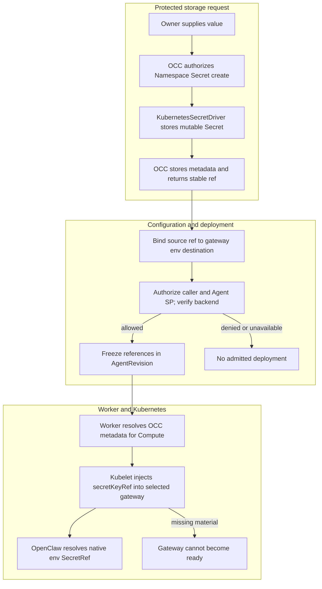

# Secret Storage and Gateway Delivery Flow

## Overview

An authorized owner stores a Namespace-owned Secret before any Agent exists,
binds its stable reference in Configuration, then assigns and deploys a
consuming Agent. OCC admits references; Kubernetes supplies values only to each
selected gateway environment. This trace ends when native OpenClaw secret
resolution hands the configured credential to its consumer. Credential issuance,
provider internals, and future broker substitution are outside this flow.

## Entry Points

`apps/controller/src/index.ts:createFastifyApp`

- `POST /namespaces/:namespaceId/secrets`: a ready Namespace and caller
  authorization to create the Secret in that Namespace.
- Configuration create/update, Agent create/update assignment, and the existing
  Agent deployment action: authorized exact Secret references, same-Namespace
  bindings, exact Agent assignment authority, and an approved Harness/Compute
  selection.
- Source: [HTTP handlers](../../apps/controller/src/index.ts),
  [OpenClawController](../../packages/occ/src/index.ts), and
  [KubernetesSecretDriver](../../apps/controller/src/drivers/secret/kubernetes/index.ts).

## Flow

## Execution Trace

### 1. Authorize storage without requiring a gateway

`packages/occ/src/index.ts:OpenClawController.createSecret`

[OpenClawController.createSecret](../../packages/occ/src/index.ts) validates
bounded, nonempty UTF-8 input and locks the Namespace. The caller needs `create`
on the Namespace's Secret collection. The Namespace must already be ready; an
Agent record does not need to exist. OCC selects the
Installation SecretDriver, generates the Secret identity, and prevents the
caller from choosing Kubernetes backend identity. The value stays in protected
request/driver memory, never in the reconciliation queue or resource metadata.

### 2. Store material and commit safe identity

`apps/controller/src/drivers/secret/kubernetes/index.ts:KubernetesSecretDriver.create`

[KubernetesSecretDriver.create](../../apps/controller/src/drivers/secret/kubernetes/index.ts)
uses Compute-owned Namespace placement. It creates a mutable Opaque Secret with
a Namespace-derived name, exact Namespace ownership metadata, and a fixed
`value` key. Its result contains only backend identity, including UID. [OCC state](../../packages/occ/src/state/postgres-state.ts)
persists immutable Namespace, driver, and backend metadata while public metadata
omits the backend locator and returns `{ kind: "secret", namespaceId, id }`.

Known OCC transaction failure can compensate the exact created object. An
unknown commit outcome must not trigger destructive compensation. There is no
value journal or automatic replay; ambiguous creation can require operator
recovery.

### 3. Bind a source, then admit references

`packages/occ/src/index.ts:OpenClawController.deployAgent`

[createConfiguration and updateConfiguration](../../packages/occ/src/index.ts)
keep `secretBindings` in OCC metadata, separate from native `values`. Each binding
has a Secret source and an env delivery destination; omitted delivery normalizes
to `env`. Unsupported sources, substitution modes, and reserved environment
variables fail closed. All sources must belong to the same Namespace as the
Configuration. A Configuration create/update whose resulting document contains
bindings requires `operate` on every selected Secret, including retained bindings
when PATCH omits `secretBindings`.

[createAgent and updateAgent](../../packages/occ/src/index.ts) require the normal
Agent mutation permission plus `operate` on each exact Secret when selecting a
Configuration with bindings.

[deployAgent](../../packages/occ/src/index.ts) separately authorizes the deploying
caller and consuming Agent service principal to `operate` every Secret, then
checks live backend identity through the API-side driver. Namespace locking
serializes binding/admission changes against deletion. Admission freezes
normalized refs and the selected SecretDriver identity, not backend locators or
values, in the revision.

An explicit `OPENAI_API_KEY` binding is allowed only for embedded execution without
a competing ServiceAccount source. Dedicated Codex keeps its independent model
credential; the separate gateway cannot receive it through this binding.

### 4. Render only the exact gateway's projection

`apps/controller/src/worker.ts:ControllerWorker.resolveRevisionSecretContext`

[ControllerWorker](../../apps/controller/src/worker.ts) rechecks
consumption authority and resolves revision refs from OCC metadata before each
preparation and activation. It passes an ephemeral `ComputeRevisionContext`; it
does not call the Kubernetes Secret API or add backend metadata to the revision.

[KubernetesComputeDriver.prepareRevision](../../apps/controller/src/drivers/compute/kubernetes/index.ts)
checks the revision, projection identities, and verified backing Namespace. It
renders `env[].valueFrom.secretKeyRef` with `optional: false` only in each
selected consuming gateway. The explicit embedded model binding replaces the old
operator projection. ConfigMaps retain native references only. A missing
Secret/key prevents startup; normal readiness and cutover rules still control
activation.

For an embedded replacement, preparation stages its immutable ConfigMap without
requiring the old gateway to be healthy. The worker commits the selected revision
before activation replaces the gateway Deployment and checks readiness. This lets
an explicit corrected deployment recover from a native SecretRef startup failure;
preparation alone is not proof that the replacement runtime is ready.

Kubelet obtains the bytes and creates the process environment. OpenClaw resolves
its existing `{ source: "env", provider, id }` reference. This is the handoff to
the native consumer, not a new OpenClaw provider or OCC text-substitution engine.
The worker/workload have no Secret API verbs, but a trusted workload writer can
indirectly project namespace Secrets; Kubernetes RBAC alone does not remove that
trust boundary.

### 5. Update, restart, or remove

`packages/occ/src/index.ts:OpenClawController.updateSecret`

[updateSecret](../../packages/occ/src/index.ts) serializes the write and uses
Kubernetes concurrency/ownership checks. It changes only the stored value; the
response retains the same ref. No revision, binding, or running environment is
updated, and no controller automatically restarts the gateway. A successful update
means stored, not delivered.

An explicit deployment for each consuming Agent creates a new revision and
restarts that gateway with the current value. An infrastructure restart of an
older admitted revision also reads the current value; failed cutover does not
restore old secret bytes. Revoking `operate` blocks new OCC admission, not
kubelet process starts or already delivered bytes.

[deleteSecret](../../packages/occ/src/index.ts) rejects current Configuration,
active revision, and pending-work dependencies under the same serialization
boundary. Once unreferenced, it deletes only the exact Namespace-owned backend and metadata.
A partial delete can be retried; missing or foreign objects never become an
adoption or recreation path. Gateway replacement does not garbage-collect
Secrets, so immediate revocation requires stopping workloads or revoking the
credential at its issuer.

## Debugging and Verification

- Read public Secret metadata without requesting or dumping values. Inspect safe
  ownership/UID metadata separately as an authorized operator; do not print
  `Secret.data`, complete process environments, or credential-bearing requests.
- A stored Secret with no ready gateway is valid. Update success does not imply
  delivery. Compare revision/Pod identities and use noncredential sentinel values
  for restart assertions.
- Source selection, exact Namespace ownership, consumption authorization, missing
  material, and concurrent backend mutations fail closed. Do not retry a denial
  against another driver or model-key source.
- [Real Agent acceptance](../../tests/integration/harness-topology-k3d-real.test.mjs)
  requires explicitly selected PostgreSQL/Kubernetes, digest-pinned real runtime
  images, and an authorized model key. It must prove the native-ref negative control,
  genuine turn, and env restart behavior; mocked rendering is not that proof.
- Run focused conformance, API, startup, Helm, PostgreSQL Secret-state, real
  Compute, and real Agent suites when changing this flow's implementation. State
  skipped credentials, infrastructure, or runtime hooks as verification gaps
  rather than replacing them with mocked rendering.

## Related docs

- [SecretDriver implementation specification](../../specs/.archive/14-secret-driver.md)
- [Secret access architecture](../design/safeguards.md#secret-access)
- [Kubernetes deployment](../guides/deploy.md)
- [Configuration](../reference/configuration.md)
- [Kubernetes Secret Driver](../reference/drivers/kubernetes-secret.md)

## Manual Notes

[keep this for the user to add notes. do not change between edits]

## Changelog

- 2026-09-01 19:09: Moved historical pass counts, run timing, and stale environment blockers out of active Debugging while keeping current runnable checks and proof requirements. (01a05f95-dd80-7011-990f-d1c46b5bb3cc - aa366c49c44834d59f74994c5fd37fb8096f169f)
- 2026-08-28: Historical verification retained from prior Debugging: focused conformance reported 134 cases with 1 optional skip; the real Kubernetes Secret API scenario after rebasing onto main `84e773f` reported 1 passed, 0 failed, 0 skipped, exit 0, in 386.4s with OpenClaw 2026.8.1; additional static, API, startup, Helm, PostgreSQL Secret-state, and real Compute checks were reported. Broader host and dedicated file-edit suites were not established because the host OpenClaw build had stale generated assets and the native hook relay was unavailable.

- 2026-08-28 16:33: Updated verification to the passing post-rebase Agent and Compute proofs against main 84e773f and conformance 134. (01a043fa-27fd-7651-b75a-4d46538a2809 - f7c33d5)

- 2026-08-28 15:56: Recorded current Namespace-owned Secret verification from the parent-inspected live proof and focused suites. (01a043fa-27fd-7651-b75a-4d46538a2809 - 9214fbb56f0437b7529f4a9aaa325ae73a489453)

- 2026-08-28 14:48: Updated the flow for Namespace-owned Secrets, retained-binding authorization, selected gateway delivery, and superseded exact-Agent proof. (01a043fa-27fd-7651-b75a-4d46538a2809 - 9214fbb56f0437b7529f4a9aaa325ae73a489453)

- 2026-08-28 13:56: Consolidated duplicate CRUD guidance while preserving runtime ownership and failure transitions. (01a04995-4a11-7c61-ab52-0b43f49524dc - 64e19bb)

- 2026-08-28 13:12: Recorded independent real SecretDriver acceptance and bounded broader-runtime verification gaps. (01a043fa-27fd-7651-b75a-4d46538a2809 - 07d8eb57a05cf4b439f1cb04816da723e4a36209)

- 2026-08-28 10:47: Documented the implemented storage, binding, admission, and gateway delivery path; runtime verification pending. (01a043fa-27fd-7651-b75a-4d46538a2809 - 7b23ec07cef352abc97917eab7c9fa1a331f08a7)
