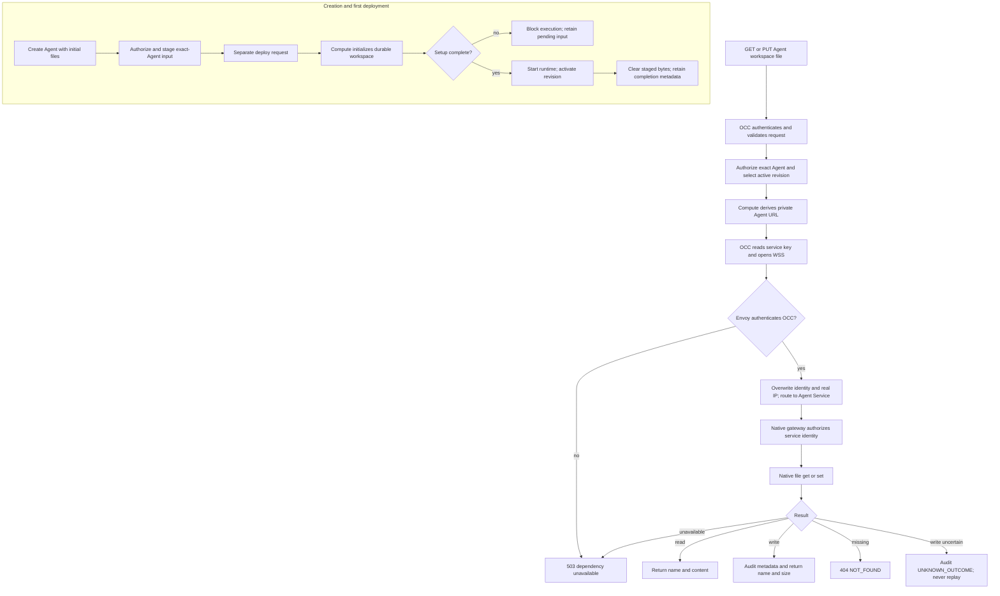

# Agent Workspace Files Flow

## Overview

At Agent creation, an authenticated caller supplies `AGENTS.md`, `SOUL.md`,
`IDENTITY.md`, and `USER.md`. OCC stages these privately; Compute initializes
the Agent's durable workspace before execution. Activation replaces staged
contents with completion metadata.

Later reads and edits authorize the exact active Agent, resolve its private
endpoint through Compute, and send one native file RPC through Envoy Gateway.
This flow ends at setup completion or the bounded file response.

Dedicated execution uses Kubernetes Codex; see
[workspace and launcher boundaries](../reference/drivers/kubernetes-compute/storage-and-credentials.md#shared-contracts-and-the-codex-implementation).
Dedicated OpenClaw worker execution remains pending.

## Entry Points

- `apps/controller/src/index.ts:createFastifyApp` accepts initial contents through
  `POST /namespaces/:namespaceId/agents` and handles live `GET` and
  `PUT /namespaces/:namespaceId/agents/:agentId/workspace/files/:name`.
- `packages/occ/src/index.ts:createAgent` authorizes creation and persists private
  setup state; `apps/controller/src/worker.ts` passes it to Compute on deployment.

Live access requires the Agent's private HTTPRoute and native gateway.
Operators configure Envoy Gateway, native trust, and network restrictions through
[deployment](../guides/deploy/workspace-routing.md#agent-workspace-files); see the
[routing contract](../reference/gateway-routing.md) for transport and credentials.
By default, the chart requests a private CA and listener certificate from
cert-manager and uses a derived Service DNS hostname. Operators can provide
an existing issuer and explicit hostname instead.

## Flow

## Execution Trace

### 1. Creation validates and privately stages the inputs

`apps/controller/src/console/agents/create.mjs` fills four textareas from
`workspace-defaults.mjs` and submits their values with `WORKSPACE_DEFAULTS_ID`.
`apps/controller/src/index.ts:createFastifyApp` rejects a stale defaults identity;
`packages/contracts/src/workspace-setup.ts:normalizeInitialWorkspaceFiles`
rejects unknown names, invalid Unicode, NUL, and values above 16 KiB UTF-8.
An absent or empty map creates no setup state. The HTTP create route has a
448 KiB default body limit; a configured controller limit takes precedence.

`packages/occ/src/index.ts:createAgent` checks Namespace-scoped Agent creation,
exact Configuration read, and the existing binding permissions. Its transaction
creates a stopped Agent and, when keys were supplied, a private `workspaceSetups`
record keyed by exact Namespace/Agent. No AgentRevision is created. Inputs do
not enter the Agent, Configuration, revision snapshot, public response, or
metadata-only create audit. The original API strings are preserved; Console
textarea values use LF newlines.

### 2. Deployment initializes storage before execution

`apps/controller/src/worker.ts` reads private setup state while resolving
`ComputeRevisionContext`. A selected Driver without `supportsWorkspaceSetup`
returns `WORKSPACE_SETUP_UNSUPPORTED`. The existing deployment worker owns the
Agent's serialized startup and passes `workspaceSetup` to Compute.

The bundled Drivers deliver inputs to the shared
`apps/controller/src/drivers/compute/workspace-setup-runtime.ts:WORKSPACE_SETUP_RUNTIME`:
Kubernetes uses an owned Secret and an init container on the workspace owner
(Gateway for embedded execution; Harness for dedicated execution); Docker uses a
separate setup container and Agent-owned durable volumes; SSH uses the protected
exact-Agent directory and remote helper. Delivery does not put document strings
in container arguments or environment values. Dedicated Harness startup must
also verify completion before execution. Unsupported workspace placement fails
instead of writing outside the Agent's managed storage. Provider-owned Sandbox
startup cannot carry this init container and rejects workspace setup rather than
dropping initialization.

The runner validates identity, paths, OpenClaw `2026.9.5`, and the rendered
template digest against Console defaults before initialization. Submitted
defaults identities must match; links and conflicts fail. Without a completion
marker, native `setup` initializes the workspace and Git without starting the Gateway.
It atomically replaces supplied files, including empty strings, only if the
existing value is absent, stock, or already submitted. It runs native setup
again so native `BOOTSTRAP.md` lifecycle sees the submitted profile, verifies
the results, then atomically writes `.oce-workspace-setup.json`.

Matching markers skip application after lost acknowledgement.
Incomplete writes retry with the same safety checks. A divergent
file or missing/mismatched marker after recorded completion blocks startup;
it never authorizes replay over later user edits. Native setup output and
failure details are suppressed at the delivery boundary to avoid disclosing
contents.

### 3. Activation clears staged contents and keeps completion metadata

`apps/controller/src/worker.ts` completes setup in the activation-completion
transaction only after checking the exact active revision and work claim.
`workspaceSetups.complete` removes document bytes and retains identity and
completion metadata. Drivers remove or replace private delivery bytes with
metadata; subsequent startup verifies the durable workspace marker.

Failed or never-deployed Agents retain pending inputs. Agent deletion removes
the private setup record through `packages/occ/src/index.ts:deleteAgent` and
Driver cleanup owns the Agent's runtime storage. There is no public setup read
or update endpoint. Creation without supplied keys follows ordinary startup.
Once an Agent is active, live edits follow the independent path below and do
not update the original setup record.

### 4. Composition configures private access

`apps/controller/src/server.mjs:start` validates the optional absolute
`OCC_GATEWAY_API_KEY_PATH` before opening the database. Production and
PostgreSQL development composition bind the selected Compute Driver to
`createWorkspaceFilesAccess`. The worker uses the same mounted service key
for native node enrollment. Node loads any `NODE_EXTRA_CA_CERTS` trust
bundle at startup.

For the chart's automatic CA, API and worker Pods wait for cert-manager's generated
root Secret and receive only its public certificate. They do not receive the
CA signing key. An explicit external issuer uses the configured public CA
bundle, or Node's existing trust store when no bundle is configured.

Kubernetes derives endpoints from admitted Namespace/Agent IDs and Installation
routing settings. Drivers without endpoint support cannot serve workspace files.

### 5. OCC admits one exact-Agent file operation

`apps/controller/src/index.ts:createFastifyApp` requires a valid user
session or scoped service API key. Native Agent credentials cannot invoke this
administration surface. `GET` needs Agent `read`; `PUT` needs Agent `operate`
and, for session callers, passes the browser CSRF boundary. OCC resolves the
active AgentRevision before invoking Compute endpoint resolution.

Only the four names are accepted. `PUT` accepts only `{ "content": "..." }`,
rejects NUL and unpaired UTF-16 surrogates, enforces 16 KiB of UTF-8 content,
and uses a 48 KiB request-body limit. The deadline and disconnect signal cover
admission and native access.

### 6. Compute resolves a route and OCC loads the current key

`apps/controller/src/composition/workspace-files.ts:createWorkspaceFilesAccess`
uses `ComputeDriver.getGatewayEndpoint(revision)` to resolve
`wss://<hostname>/namespaces/<namespaceId>/agents/<agentId>`. The default hostname
matches Helm's Service DNS. Resolution does not prove readiness.

`kubernetes/index.ts:reconcileGatewayRoute` provisions operator routing and a
separate exact `/node` HTTPRoute and SecurityPolicy for dedicated runtimes.
Only operator routing allows native admin UI subpaths. Both strip authorization
and cookies; node routing also strips administrative identity headers, relying
on native device authentication instead of OCC's key.
Preparation creates or repairs the node route under the serving revision;
activation transfers ownership after replacing Gateway. This allows enrollment
before candidate activation. Stop and retirement remove the exact revision's
endpoint before its policy, checking ownership and UID. See the
[node endpoint contract](../reference/gateway-routing.md#native-node-endpoint).

Dedicated runtimes require routing and enrollment wiring before Kubernetes access.
`prepareWorkspaceNode` uses
`gateway/node-enrollment-client.ts:createGatewayNodeEnrollment` after Gateway
readiness. A revision-owned Secret holds the setup code, then the device ID.
The next reconciliation attaches the node to the Harness; its Deployment uses
`Recreate` throughout enrollment.

- Readiness requires `file.fetch`, `file.stat`, `file.write`, `file.create`,
  `dir.list`, `workspace.memory`, and `workspace.skills`. Gateway admits these
  commands before pairing, preserving explicit denies.
- The Harness PVC stores revision-specific identity at `/home/node/.openclaw-node`.
  The nonroot private-state initializer creates it at `0700`; Pod replacement
  reuses it. Retirement deletes the enrollment Secret; PVC deletion removes identity.
- `AGENT_WITH_NODE_ENTRYPOINT` runs native `setup --baseline` before supervising
  Codex and the node under `tini`. It passes admitted bootstrap options, preserves
  existing edits, and stops on setup failure. Only the node receives its setup
  code; neither process receives OCC's key. Codex preserves the managed PATH.
- Activation reads the exact revision's device ID and sets
  `file-transfer.config.workspaces.main` in runtime configuration before Gateway
  starts. Candidate preparation preserves the serving binding; losing it fails
  rather than restoring local reads. The revision ConfigMap remains immutable.
- Default grants read the four owner documents, `BOOTSTRAP.md`, and `MEMORY.md`;
  owner writes remain limited to four documents. Enabled `bootstrap-extra-files`
  adds literal read grants. Explicit policies survive; glob traversal and contained
  symlinks remain unsupported by defaults.
- Input grants cover `media/inbound/openclaw-staged-*` and its contents; `file.create`
  preserves Harness edits. Outputs under `media/outbound/**` are read-only.
  Binary fetches above 16 MiB remain bounded by caller and node policy. Command
  admission never substitutes for path authorization.

The chart supplies worker credentials/public trust and Compute installs node
access to Envoy. Memory uses node duplex with existing native file workers;
index and embedding configuration stay on Gateway. Skills uses remote discovery,
reads and policy-checked dependency installation. Each host initializes its own
image assets; Gateway-provided Skills stay local. See the
[ownership table](../../specs/30-storage-split-integration.md#where-data-lives).
Remote channel menus remain deferred to [#241](https://github.com/openclaw/openclaw-enterprise/issues/241).

Only Harness mounts dedicated workspace/generated-image storage. Gateway sessions
use its private PVC; Codex's existing remote-media reader transfers reply artifacts
before cleanup. Embedded storage is unchanged. The Harness PVC remains RWX because
revision preparation precedes predecessor retirement; removing that backend
requirement needs a separate rollout decision. These contracts require matching
runtime images; local checks alone do not prove deployed Enterprise acceptance.

The API reads the mounted key for each operation, so new connections pick up
Secret rotation without an API restart. Missing routing, missing or invalid
key material, expired deadlines, and unavailable targets fail closed. No URL
or credential comes from caller JSON or headers.

### 7. Envoy authenticates and routes the native connection

`apps/controller/src/gateway/workspace-files-client.ts:requestNativeWorkspaceFile` opens WSS with only the
service key in `x-api-key`. The client verifies the server hostname and CA;
there is no leaf pin, device enrollment, native token, or client-certificate
option. It connects as a backend operator with `deviceIdentity: null` and no
self-asserted scopes.

The Gateway-level Envoy SecurityPolicy verifies and strips the key. The exact
Agent HTTPRoute overwrites `x-occ-identity`, removes forwarded and native-scope
headers, and sets `X-Real-IP` to Envoy's direct downstream socket address. It
rewrites the upgrade path to `/` and selects the existing same-namespace Agent
gateway Service. Namespace attachment labels, route ownership checks, and
restricted Kubernetes RBAC protect this mapping.

Kubernetes Compute renders native trust from Installation
`network.gatewayTrustedProxyCidrs`, fixing `occ-workspace-files` with
`operator.admin`. Conflicting tenant trust settings fail deployment. `allowRealIpFallback` accepts its genuine nonloopback OCC
connection address even within a shared Pod CIDR. NetworkPolicy admits only
Envoy to the native gateway; the CIDR is not an independent authentication
boundary. Native
hello grants `operator.admin`; reads also accept `operator.read`.

### 8. Native file access returns a bounded result

`apps/controller/src/gateway/workspace-files-client.ts:requestNativeWorkspaceFile`

The client invokes only `agents.files.get` or `agents.files.set` for the native
primary Agent `main`. Reads re-check the response content limit and return
`{ name, content }`; writes return `{ name, size }`. There is no list, delete,
compare-and-swap, generic RPC, chat bridge, or PostgreSQL file copy.

The Harness PVC retains the dedicated workspace across Pod replacement.
Certificate renewal under the same trusted CA affects new WSS connections
without restarting OCC. Root-CA replacement follows the
[trust rotation requirements](../reference/gateway-routing.md#tls-and-certificate-lifecycle).

Writes audit only the Agent resource, authorization action, outcome, reason
when present, and file name. If a dispatched write has an unknown outcome,
OCC returns `503 UNKNOWN_OUTCOME`, attempts the corresponding audit, and never
replays it. The native client closes in the operation's cleanup path.

## Debugging and Verification

- For initial setup failure, check revision/work status and the selected Driver's
  support, native release, defaults identity, and durable workspace placement.
  `WORKSPACE_SETUP_FAILED` intentionally omits document bytes. Do not delete a
  completion marker to force a replay; missing initialized storage needs operator
  recovery, not reuse of the creation payload.
- A stale `workspaceDefaultsId` rejects creation with `409 RESOURCE_CONFLICT`;
  reload the Console create form before submitting again. A create response alone
  does not prove runtime initialization; verify active revision and live content.
- The implementation gates initialization before execution. Structural checks,
  Driver fixtures, and runtime setup checks each prove different boundaries;
  the required first-use, retry, and redeploy scenarios need the real workflow
  integration evidence described in the [feature spec](../../specs/34-agent-workspace-files-setup.md#verification).
- For `503 DEPENDENCY_UNAVAILABLE`, check the Compute routing settings and key
  mount, then the Gateway, Certificate, SecurityPolicy, and HTTPRoute status.
  Check DNS/CA trust and exact NetworkPolicy peers before changing native auth.
- `400 INVALID_REQUEST` indicates a file-name or content-contract violation.
- `403 FORBIDDEN` can indicate missing exact-Agent IAM or session PUT CSRF
  rejection. Granting a native service scope does not change human IAM.
- An authenticated native upgrade failure can indicate missing trusted-proxy
  configuration, a simultaneous token, a loopback real IP, or absent native
  identity scopes. Do not fix it by inventing a forwarded address.
- [Testing](../testing/README.md) separates API conformance, Helm rendering, and the
  real Envoy/cert-manager/native-runtime proof. A calculated URL, ready proxy,
  or rendered chart does not establish file writes or model consumption.

## Related docs

- [Agents](../reference/agents.md#workspace-files)
- [Kubernetes Compute Driver](../reference/drivers/kubernetes-compute.md)
- [Settings reference](../reference/settings/production.md#required-production-controller-environment)
- [Production deployment](../guides/deploy/workspace-routing.md#agent-workspace-files)
- [HTTP API](../reference/api.md)

## Manual Notes

[keep this for the user to add notes. do not change between edits]

## Changelog

- 2026-09-23 19:22: Condense setup prose within the documentation length budget. (01a0cf27-71c6-7042-8357-74d1811a2ef8 - 6c6c3e4308946e7e66d656fb553da4dd5177f2c4)

- 2026-09-23 17:23: Check installed template identity independently of the OpenClaw package release; retain native setup and replay guards. (authoring-run/94dba260-c3e1-421a-876a-1159e514db05 - 63ceabdbba3528553a9c5f04d7c57831bb8cb6eb)

- 2026-09-23 21:30: Align setup, Console defaults, and runtime template integrity. (public-pr/295 - 7f019dee)

- 2026-09-22 21:24: Render Kubernetes operator proxy trust and retain optional loopback passwords. (authoring-run/ffffed03-0b85-4984-990e-aa0705a91645 - cbf1851308a2db398820ae9e1000f57837703ace)
- Kubernetes Compute uses trusted proxy for native gateway authentication. (NOT_IN_SPEC)

- 2026-09-22 04:18: Added creation-time workspace setup and completion boundaries. (01a0c755-0518-7502-a533-64cd7465de15 - f3dbdd41c8f3b49573d1353a4b06ce510ee43a56)

- 2026-09-21 14:26: Documented node admission and nonroot startup. (01a082d6-50c7-7953-808f-7e609f6fc7cb - a34328eb09ad9374d856a178af8cb03f5b0dfa57)

- 2026-09-20 19:37: Combined admin and node routing. (01a082d6-50c7-7953-808f-7e609f6fc7cb - afe3861dfec5d288fd5a4651a9e052e935e6493d)

- 2026-09-19 15:37: Required dedicated routing and plugin readiness. (01a082d6-50c7-7953-808f-7e609f6fc7cb - 30878c9b0f830126e8433b76d1c7174227d311b6)

- 2026-09-18 14:15: Clarified Skill ownership and menu deferral. (01a082d6-50c7-7953-808f-7e609f6fc7cb - 56e4fa74eacb0c411f51353f4f726444fc572336)

- 2026-09-18 13:22: Reused revision-specific Harness identity storage. (01a082d6-50c7-7953-808f-7e609f6fc7cb - e257c4d96934895de7d3e06980dddce05ae19725)

- 2026-09-18 00:02: Used in-cluster endpoint verification. (authoring-run/245cc03e-4bd3-48b3-ba17-8d5e2768262d - 782017d5405e156116bd31e78fa744ef20c540cc)
- 2026-09-17 20:24: Separated Gateway sessions and Harness storage. (authoring-run/81318408-6a1f-4628-b3f2-04ab723554c8 - 14ad14c04deeeaa79f325b14d492ab13730adc7f)

- 2026-09-17 20:10: Initialized assets from each host image. (authoring-run/81318408-6a1f-4628-b3f2-04ab723554c8 - 14ad14c04deeeaa79f325b14d492ab13730adc7f)

- 2026-09-17 20:00: Added remote Skills commands and grants. (authoring-run/81318408-6a1f-4628-b3f2-04ab723554c8 - 14ad14c04deeeaa79f325b14d492ab13730adc7f)

- 2026-09-17 19:43: Added remote Memory commands and grants. (authoring-run/81318408-6a1f-4628-b3f2-04ab723554c8 - 14ad14c04deeeaa79f325b14d492ab13730adc7f)

- 2026-09-17 19:09: Clarified ordinary-flow completion gates. (authoring-run/aaa352ba-dcbd-49b1-b031-0580d511f561 - 14ad14c04deeeaa79f325b14d492ab13730adc7f)

- 2026-09-17 13:18: Connected Codex reply-artifact reads. (authoring-run/d81f8dbd-ab58-4115-bad4-7d4d50382e04 - 14ad14c04deeeaa79f325b14d492ab13730adc7f)

- 2026-09-17 13:13: Granted literal extra bootstrap reads. (authoring-run/2a92b4f3-ac86-4352-a64a-3a0126288787 - 14ad14c04deeeaa79f325b14d492ab13730adc7f)

- 2026-09-17 13:08: Connected attachment readiness and enrollment. (authoring-run/545cf8dc-f67c-4e84-aa23-e80359fea1d3 - 14ad14c04deeeaa79f325b14d492ab13730adc7f)

- 2026-09-17 06:09: Updated binary output-read dependency. (authoring-run/7783310f-9f59-4cd0-9109-ca74877c066f - 14ad14c04deeeaa79f325b14d492ab13730adc7f)

- 2026-09-17 05:35: Added output-folder read grant. (authoring-run/999ece5a-22b2-40a7-80fa-7d0d1f35bda2 - 14ad14c04deeeaa79f325b14d492ab13730adc7f)

- 2026-09-17 05:13: Added attachment staging-directory read grant. (authoring-run/e4b0b1f2-63ce-4291-8214-aa218ba984aa - 14ad14c04deeeaa79f325b14d492ab13730adc7f)

- 2026-09-17 05:01: Connected restricted attachment commands. (authoring-run/87bd4d73-3f20-4949-8db1-54a3691ca4fe - 14ad14c04deeeaa79f325b14d492ab13730adc7f)

- 2026-09-17 03:44: Enabled bounded directory listing. (authoring-run/e253e9b6-4a46-4c3c-84e6-f2f8ab34cc91 - 14ad14c04deeeaa79f325b14d492ab13730adc7f)

- 2026-09-17 03:35: Initialized Harness before node startup. (authoring-run/b75fab11-a672-432b-a966-61bb491af2b4 - 14ad14c04deeeaa79f325b14d492ab13730adc7f)

- 2026-09-17 03:24: Traced revision-owned workspace binding. (authoring-run/7804ba57-dbe8-4a75-8a04-b02ff9f03b38 - 14ad14c04deeeaa79f325b14d492ab13730adc7f)

- 2026-09-17 03:13: Added worker trust and node egress. (authoring-run/be0c5601-ea50-414b-a5f7-fdbc2aa6ef0d - 14ad14c04deeeaa79f325b14d492ab13730adc7f)

- 2026-09-17 02:54: Traced Compute enrollment and route repair. (authoring-run/9238ab38-287b-43d6-818f-132a2aeab7df - 14ad14c04deeeaa79f325b14d492ab13730adc7f)

- 2026-09-17 01:36: Added exact-owned native node routes. (authoring-run/e63c5d56-929f-40cb-9b31-e80f856690ca - 14ad14c04deeeaa79f325b14d492ab13730adc7f)

- 2026-09-01 17:26: Adopted Compute-owned Envoy routes. (01a04ae1-7ba7-7372-88a4-488e01f690ae - 3e26931d31ba03a7fa187c12009867c636a86041)

- 2026-09-01 12:03: Documented endpoint-map configuration. (NOT_IN_SPEC)
- 2026-09-01 12:03: Clarified trusted-proxy authentication. (NOT_IN_SPEC)
- 2026-09-01 12:03: Clarified workspace persistence boundaries. (NOT_IN_SPEC)
- 2026-09-01 13:24: Replaced generic administration flow. (NOT_IN_SPEC)
- 2026-09-01 08:38: Documented bounded Kubernetes execution. (cody/01a05d9c-4cb5-7602-8df5-56d7f8309f44 - 7b4a819f02d6950e8cc2a2e08eb29c2f668493ad)
- 2026-08-31 16:49: Documented private-key storage. (cody/01a04ae1-7ba7-7372-88a4-488e01f690ae - f2e164c)
- 2026-08-31 12:52: Updated SDK and pairing behavior. (cody/01a04ae1-7ba7-7372-88a4-488e01f690ae - 61542d0)
- 2026-08-31 12:41: Documented enrollment and uncertain outcomes. (cody/01a04ae1-7ba7-7372-88a4-488e01f690ae - 61542d0)
