# Understand the Agent detail page

Open **Agents**, then select an Agent to inspect its configuration, deployment
record, credentials, and workspace. This walkthrough explains the page from top
to bottom, including controls revealed by **Saved draft**. For initial setup, use
[Create and deploy Agents](../../reference/console/create-and-deploy.md).

Screenshots show a local demonstration Agent, `ocedemo-1`, captured on September
22, 2026, using a development preview of the console with read-only access to
the existing API. Names, IDs, timestamps, and available actions depend on your
Installation and permissions. The screenshots show stored settings; they are not
proof that the Agent or its Slack connection is currently healthy.

## Navigation and Agent identity

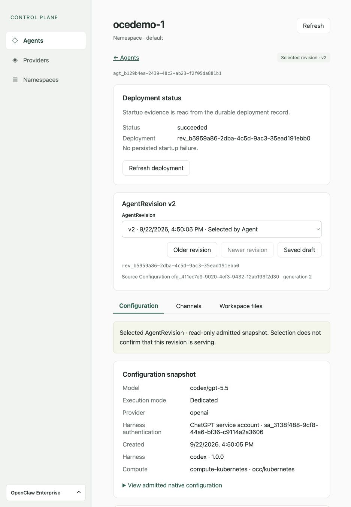

| Component                  | What it does                                                                                     |
| -------------------------- | ------------------------------------------------------------------------------------------------ |
| **Control Plane**          | Identifies the OpenClaw Control Plane (OCC) console.                                             |
| **Agents** / **← Agents**  | Opens the Agents list in the selected Namespace.                                                 |
| **Providers**              | Lists configured Providers across the Installation; requires Installation administration access. |
| **Namespaces**             | Lists the Namespaces you can read.                                                               |
| Agent name                 | Human-readable name of this Agent.                                                               |
| **Namespace · default**    | Namespace containing the Agent; `default` is this example's name.                                |
| **Refresh**                | Reloads the current page's data. It does not restart the Agent.                                  |
| **Selected revision · v2** | Revision selected by the Agent, which may differ from the snapshot you are viewing.              |
| `agt_…`                    | Stable Agent identifier for API calls and support.                                               |

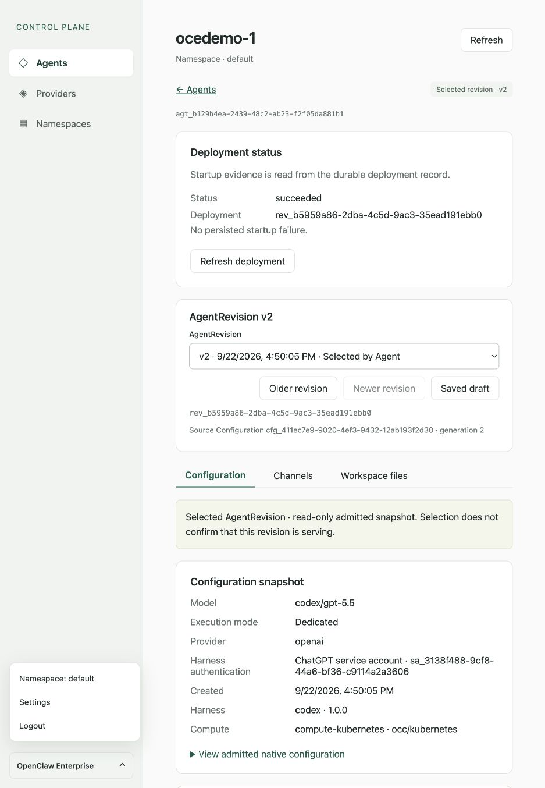

The bottom **OpenClaw Enterprise** menu contains **Namespace**, **Settings**,
and **Logout**. Namespace selection changes your scope; from Agent detail it
returns to the new Namespace's Agents list. Settings displays your account;
it does not offer configurable settings. Logout ends your console session.

## Deployment status

**Deployment status** appears when viewing a revision and reads its persisted
startup record:

| Component                        | Meaning                                                                                    |
| -------------------------------- | ------------------------------------------------------------------------------------------ |
| **Status**                       | Recorded deployment outcome. `succeeded` describes that deployment, not continuous health. |
| **Deployment**                   | Identifier of the deployment record, matching the revision ID.                             |
| **No persisted startup failure** | No startup failure is stored in that record; this is not a live probe.                     |
| Failure details, when present    | Identify the runtime component, failed check, error code, and check time.                  |
| **Refresh deployment**           | Rereads that record; it does not retry deployment.                                         |

The console has no live serving-health indicator. To establish health, verify
the installed runtime and a real model or
channel response using [Agent troubleshooting](../topics/agent-troubleshoot.md).

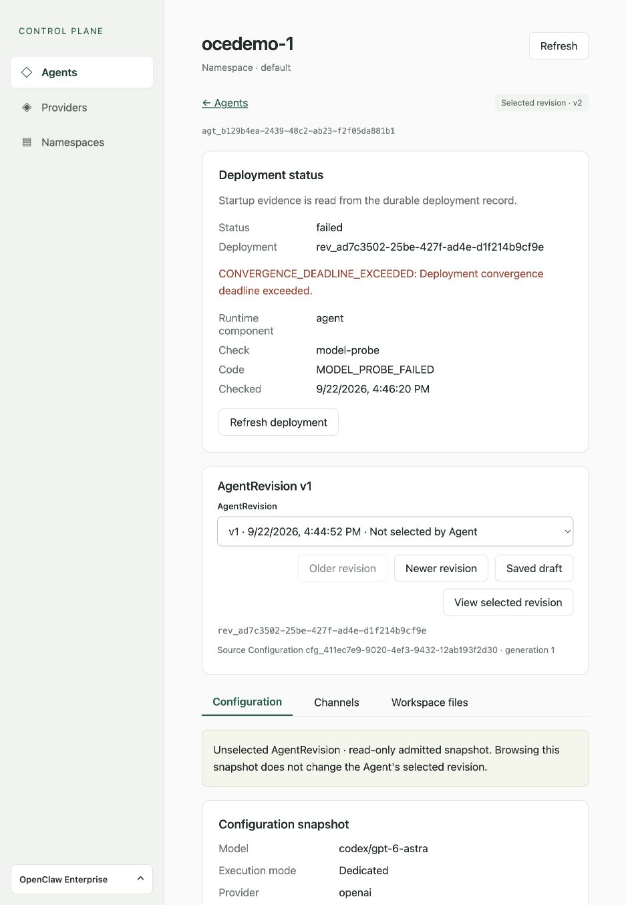

The older v1 snapshot retains its failed deployment and model-probe details while
the Agent selects v2. Browsing that failure does not change the selected revision.

## Browse revisions or open the saved draft

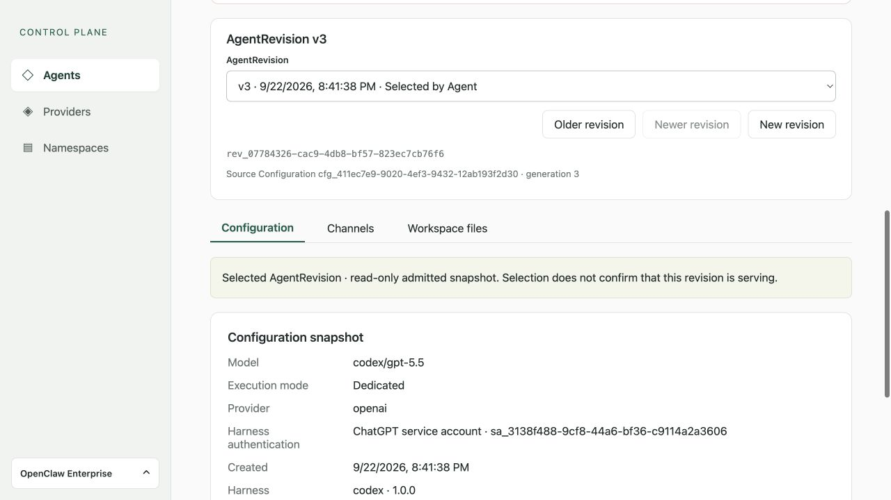

An **AgentRevision** is an immutable deployment snapshot. A **Configuration** is
the reusable, mutable input from which a new revision is created.

| Component                                 | What it does                                                                                                                                      |
| ----------------------------------------- | ------------------------------------------------------------------------------------------------------------------------------------------------- |
| **AgentRevision** dropdown                | Selects the saved draft or a historical snapshot to inspect. Revision entries include version, creation time, and whether the Agent selects them. |
| **Older revision** / **Newer revision**   | Browses history; disabled at the corresponding end. Browsing does not activate a revision.                                                        |
| **Saved draft**                           | Opens the current Configuration and supported editing controls.                                                                                   |
| **View selected revision**                | Returns to the snapshot currently selected by the Agent.                                                                                          |
| `rev_…`                                   | Identifies the viewed immutable revision.                                                                                                         |
| **Source Configuration … · generation N** | Identifies the Configuration and generation captured for that revision. The draft instead shows its current generation.                           |
| Read-only snapshot notice                 | Explains whether the viewed revision is selected and that its admitted settings cannot be edited.                                                 |

There is no rollback or redeploy-old-revision button. See
[Agent Revisions](../topics/agent-revisions.md) for the lifecycle.

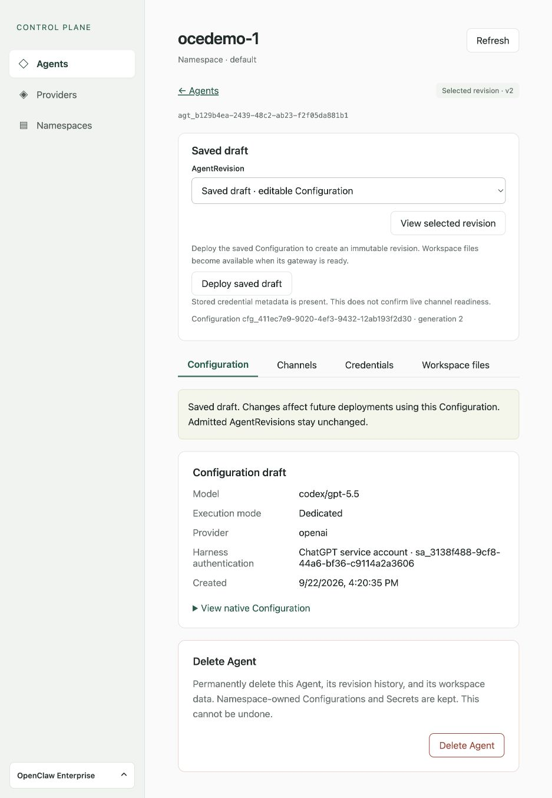

**Deploy saved draft** submits the saved Configuration for a new revision. It
checks freshness and required credential metadata; missing prerequisites or a
changed draft require correction or refresh. A successful request opens the new
revision's Workspace files view. The credential notice below the button reports
stored metadata, not successful authentication or a working channel.

The **Configuration**, **Channels**, **Credentials**, and **Workspace files** tabs
change the panel below. Credentials is available only on the saved draft.
Browser Back and Forward restore the selected tab. Leaving a tab clears entered token values. The workspace remains live regardless of the selected revision.

## Configuration tab

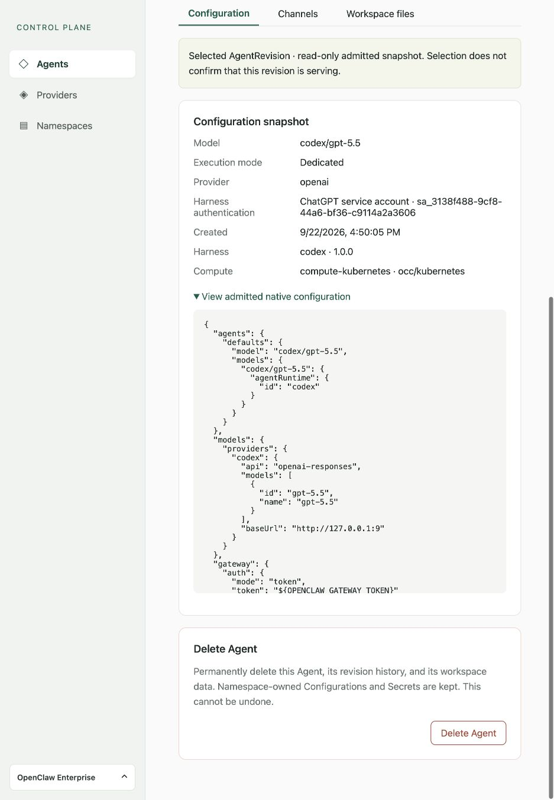

| Field                                  | Meaning                                                                                                          |
| -------------------------------------- | ---------------------------------------------------------------------------------------------------------------- |
| **Model**                              | Primary model configured for the Agent; here, `codex/gpt-5.5`.                                                   |
| **Execution mode**                     | Embedded runs the harness within the gateway; Dedicated runs it separately.                                      |
| **Provider**                           | Installation-configured Provider associated with this Agent; model credentials come from Harness authentication. |
| **Harness authentication**             | Saved authentication binding, such as a ChatGPT service account ID. It is not a credential value or login check. |
| **Created**                            | Creation time of the displayed Configuration or revision.                                                        |
| **Harness**                            | Revision's harness identifier and integration version. This is not the installed Codex CLI version.              |
| **Compute**                            | Revision's Compute Driver identifier and implementation.                                                         |
| **View admitted native configuration** | Expands the revision's formatted native JSON. The draft uses **View native Configuration**.                      |

**Configuration draft** summarizes the saved values; it is not a general JSON,
model, Provider, or execution-mode editor. Supported edits are exposed through
Channels and Credentials. Use the API or operator workflow for other changes.
See the [Configuration reference](../../reference/configuration.md).

## Channels tab

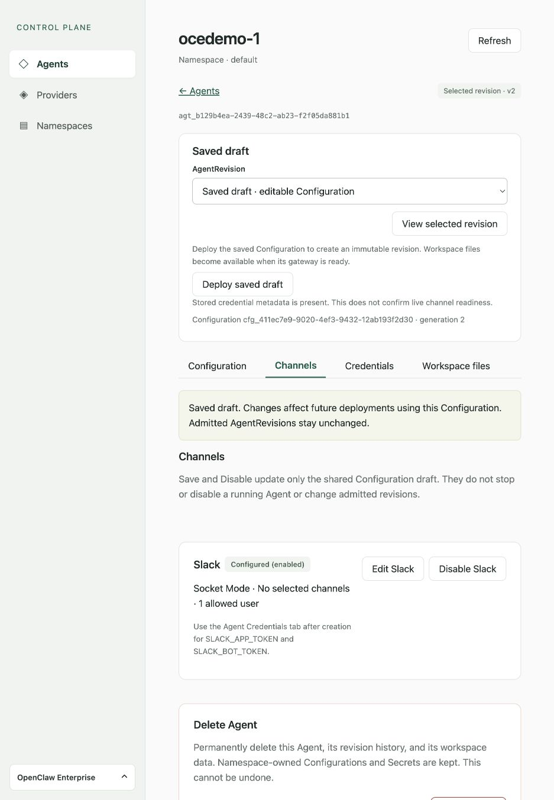

The Slack card shows **Not configured**, **Disabled**, or
**Configured (enabled)** based on saved settings: Socket Mode, selected channels, and allowed users. This is not a
live connection indicator.

Revision cards are read-only. On the saved draft, **Configure** or **Edit** opens
a drawer; **Disable** saves a disabled channel setting. These changes affect
future deployments, including other Agents sharing that Configuration. They do
not stop a running channel or modify an existing revision. Channels require
Dedicated execution; unsupported native settings can make the simple editor
unavailable.

### Slack editor

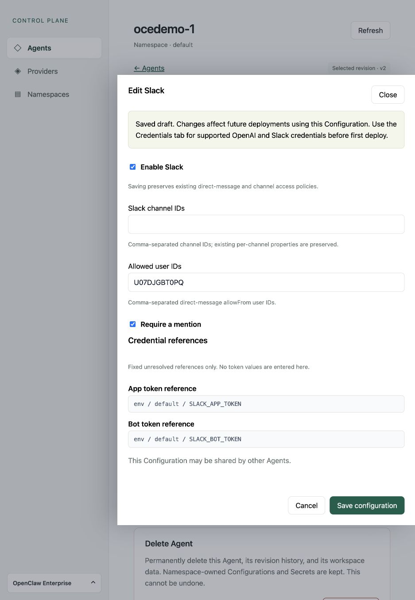

| Control                                           | Purpose                                                                                                    |
| ------------------------------------------------- | ---------------------------------------------------------------------------------------------------------- |
| **Enable Slack**                                  | Enables Slack in the draft when saved.                                                                     |
| **Slack channel IDs**                             | Comma-separated channel IDs, not channel names. Existing properties of retained channels are preserved.    |
| **Allowed user IDs**                              | Comma-separated direct-message `allowFrom` user IDs.                                                       |
| **Require a mention**                             | Applies the mention requirement to the listed channels.                                                    |
| **App token reference** / **Bot token reference** | Fixed unresolved references to `SLACK_APP_TOKEN` and `SLACK_BOT_TOKEN`. Enter token values in Credentials. |
| **Save configuration**                            | Saves supported channel changes to the shared draft. Scroll to the drawer bottom if needed.                |
| **Cancel** / **Close**                            | Discards the drawer's unsaved inputs.                                                                      |

Saving preserves existing direct-message and group policies. Adding an allowed
user does not override a disabled policy. **No selected channels** describes the
saved channel list; it does not by itself determine whether DMs work.
See [Slack setup](../integrations/slack.md) for credentials and policy details.

Microsoft Teams has no console editor. Existing Teams settings remain visible
in native Configuration JSON, but a Teams-enabled draft cannot deploy through
the console. Use the operator workflow for those Agents.

## Credentials tab

### Harness authentication

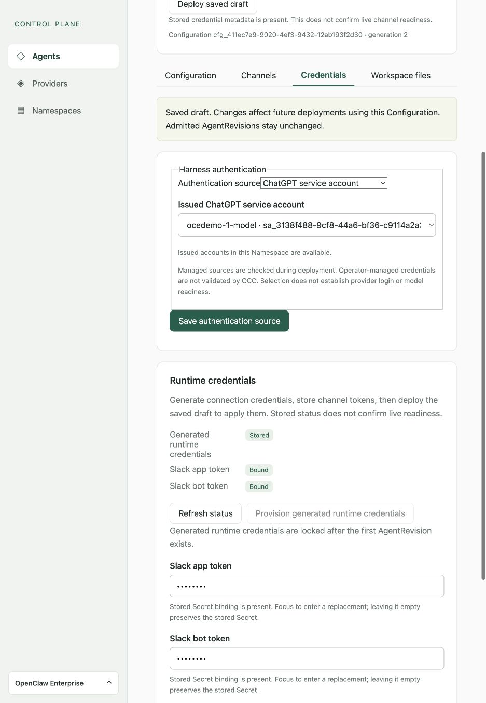

**Authentication source** determines how the harness gets model credentials:

| Choice                           | Required input and effect                                                                     |
| -------------------------------- | --------------------------------------------------------------------------------------------- |
| **None**                         | No binding; deployment remains blocked.                                                       |
| **OpenAI API key**               | Existing Namespace Secret ID, not the API key value.                                          |
| **Operator-managed credentials** | Credentials configured on the runtime host; OCC does not validate them.                       |
| **ChatGPT service account**      | Select an already issued account in this Namespace. This selector does not create an account. |

**Save authentication source** saves the Agent binding for a future deployment.
The account availability message describes discovery, not model readiness.
See [harness authentication](../../reference/harness-execution.md#harness-authentication).

### Runtime and Slack credentials

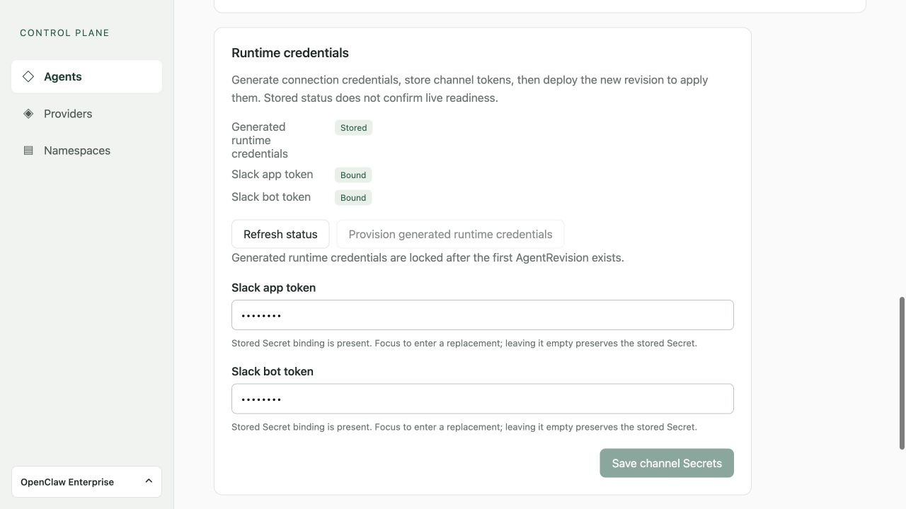

| Component                                         | Purpose                                                                                                                 |
| ------------------------------------------------- | ----------------------------------------------------------------------------------------------------------------------- |
| **Generated runtime credentials: Stored/Missing** | Reports stored connection-credential metadata.                                                                          |
| **Slack app token / bot token: Bound/Missing**    | Reports saved Secret references, not whether Slack accepts the tokens.                                                  |
| **Refresh status**                                | Reloads credential metadata.                                                                                            |
| **Provision generated runtime credentials**       | Provisions initial connection credentials. Locked after the first revision; not a rotation action.                      |
| **Slack app token** / **Slack bot token** inputs  | Bound tokens show a synthetic mask. Focus to replace; leave empty to keep a bound token. Missing tokens need a value.   |
| **Save channel Secrets**                          | Stores Namespace Secrets, grants the Agent access, and updates Configuration bindings. Deploy explicitly to apply them. |

Runtime controls apply to managed authentication. Provisioning requires Agent
`read` and `operate`; saving channel Secrets additionally requires Secret,
Configuration, and Namespace IAM permissions. These are multiple writes, so a
failure can leave partial progress. **Outcome unknown** means refresh and inspect
saved state before retrying. Save requires at least one replacement and a bound
or entered value for each token. Only entered replacements are written; an
unchanged bound token stays intact. Existing values are never fetched or
displayed, and the mask is never submitted. Entered values clear after a save
attempt; bound fields return to their mask.

## Workspace files tab

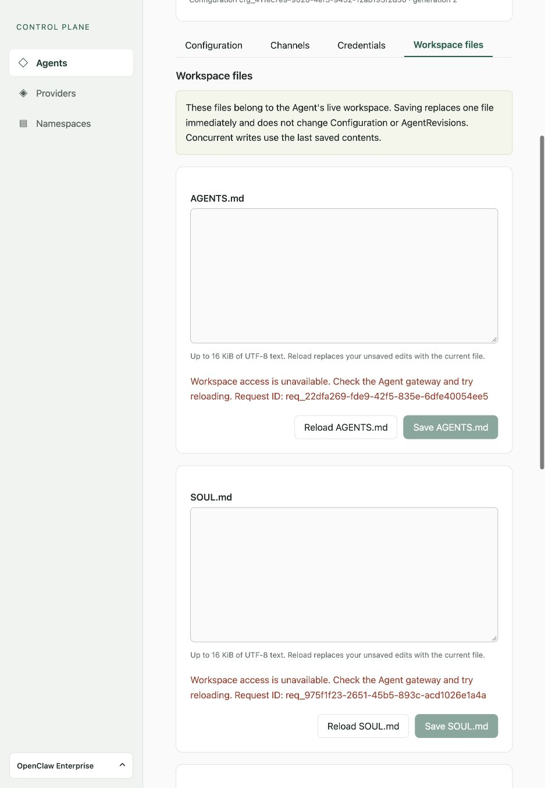

The captured workspace read failed: **Workspace access is unavailable** leaves
the editor and Save disabled. The empty box does not mean the file is empty.
Check gateway access, then use Reload.

These are live files belonging to the Agent, even when you browse an older
revision. They are not historical copies or Configuration fields.

| File          | Typical role                                      |
| ------------- | ------------------------------------------------- |
| `AGENTS.md`   | Workspace instructions and operating conventions. |
| `SOUL.md`     | Behavior, tone, and boundaries.                   |
| `IDENTITY.md` | Agent identity and presentation.                  |
| `USER.md`     | Context about the person the Agent assists.       |

Each editor loads independently. Its status reports loading, success, or failure.
**Reload** replaces unsaved edits with current contents. **Save** immediately
creates or replaces that one file; it does not deploy a revision. Save is disabled
until appropriate loaded, changed state is available.

Each file allows up to 16 KiB of valid UTF-8 text. Concurrent saves use the last
writer's contents. Reading requires Agent `read`, saving requires `operate`, and
access needs an active revision with a reachable gateway. An uncertain save
requires a successful Reload before retrying. See
[Workspace Files](../topics/workspace-files.md).

## Conditional native admin panel

When enabled by the Installation and permitted for your account, **Native admin
UI** provides **Refresh access** and **Open native admin UI**. The latter opens
the active gateway in a new tab, even while you view a draft or older revision.
This panel is absent from the pictured installation.

The native UI can change the gateway outside OCE's revision tracking. Use OCE for
durable configuration. See [native admin access](../../reference/agent-native-admin.md)
for permissions and stopped, unavailable, or unsupported states.

## Stop and resume

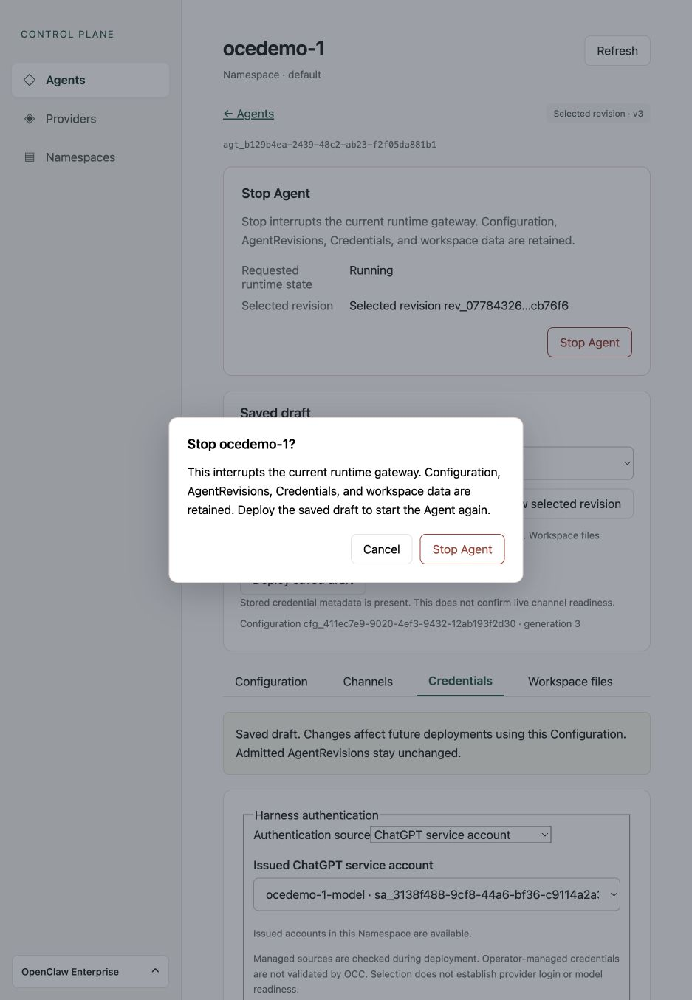

**Stop Agent** opens a confirmation explaining that shutdown interrupts running
work but preserves revision history, credentials, gateway state, and workspace
files. **Cancel** closes it without a write. Confirming requires `operate`
permission on this Agent, regardless of the revision or tab you are viewing.

An accepted stop requests shutdown; it does not prove that the runtime has
finished. **Refresh stop status** reads the desired state and selected revision.
An uncertain result blocks another stop until a successful refresh. To resume,
open **Saved draft** and select **Deploy saved draft**, which creates a new
revision. See [Stop and resume](../../reference/agents/deployment.md#stop-and-resume).

## Delete Agent and error recovery

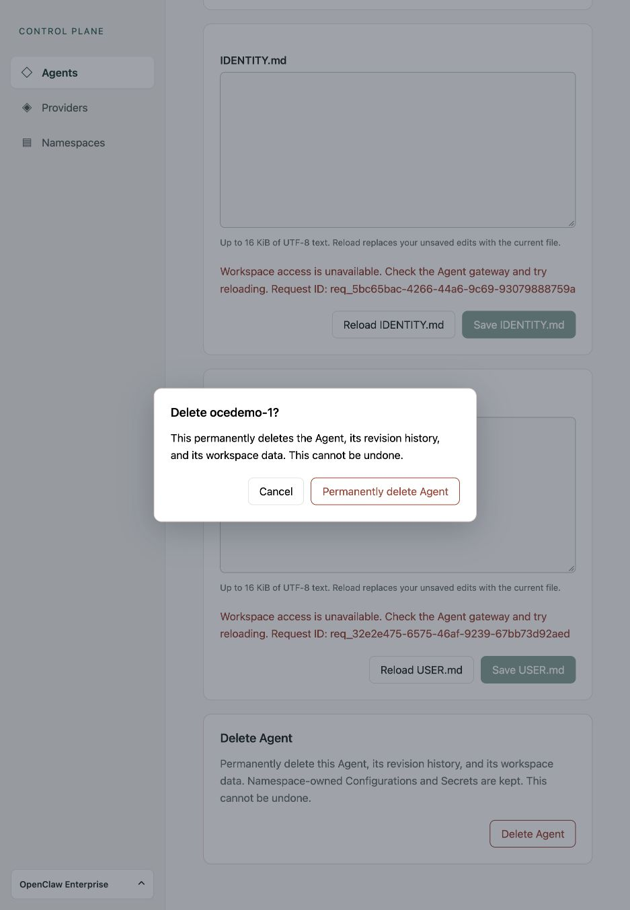

**Delete Agent** opens this confirmation. **Cancel** closes it without changes.
**Permanently delete Agent** irreversibly removes the Agent, revision history,
and workspace data; Namespace Configurations and Secrets remain. Exact Agent
`delete` permission is required. Accepted deletion starts asynchronous cleanup;
**Refresh deletion status** checks it, and confirmed removal returns to Agents.

An API error may show a request ID for support. **Outcome unknown** does not
prove failure: refresh before retrying any write. An expired session clears
private content and requests login. See the [Console reference](../../reference/console.md)
for access, concurrency, and recovery details.
