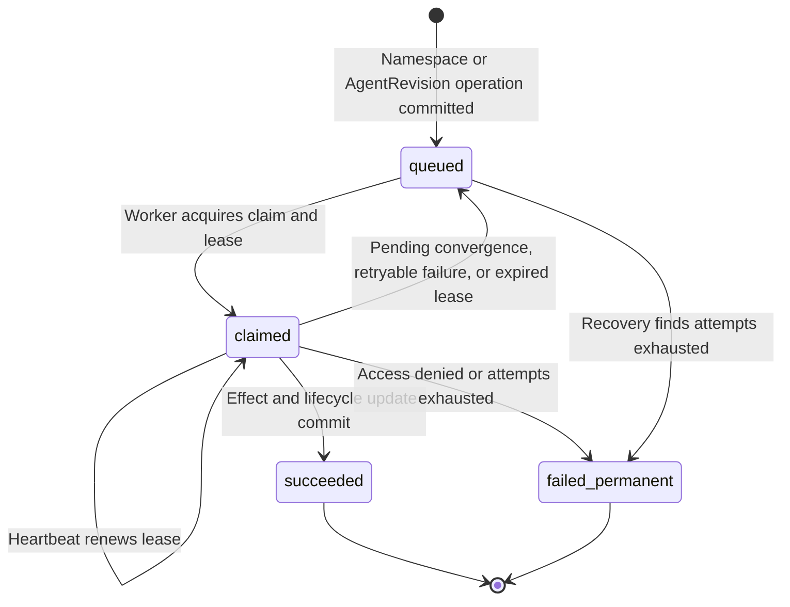

# Namespace and Agent reconciliation

The [controller worker](../controller.md) reconciles durable Namespace and AgentRevision operations. This reference defines lifecycle transitions, queue ownership, retries, and recovery.

## Namespace lifecycle

Creating a Namespace saves `provisioning` and queues its provisioning operation
in the same transaction. An Installation administrator can also specify
`existingNamespace` to persist the exact existing Kubernetes namespace before
provisioning starts. Before acting, the worker reloads current IAM policy,
reauthorizes the original actor, and confirms the operation still belongs to
its exact Namespace. External selection additionally requires Installation
`administer` authorization at admission and immediately before adoption. The
worker asks the Compute Driver to ensure backing infrastructure and sets `ready`
once it is ready; selecting an existing namespace never requires stopping the
shared worker.

Deleting an empty Namespace saves `deleting` and queues a distinct teardown
operation. The worker rechecks the original actor's permission, asks the same
Compute Driver to delete the Namespace and its owned Agent gateways, and records
a tombstone after Namespace deletion. Tombstoned Namespaces disappear from public reads.

Selected non-Compute Drivers may run hooks after Namespace infrastructure
readiness, before workload start, before workload retirement, and before
Namespace removal. Compute owns every transition; revocation failures block
teardown, launch values are restricted to `opaque-` placeholders, and production
workers process Namespace operations plus embedded OpenClaw and dedicated Codex
Agent revisions. See
[ComputeDriver lifecycle hooks](../drivers/compute.md#optional-selected-driver-hooks).

Backing infrastructure behavior is defined by the selected
[Docker](../drivers/docker-compute.md) or [Kubernetes](../drivers/kubernetes-compute.md)
Compute implementation. A successful
queue transition does not itself establish enforcement of cluster admission,
NetworkPolicy, or a SandboxDriver facet; those guarantees require the selected
implementation and its documented infrastructure.

## AgentRevision lifecycle

An authorized bodyless Agent deployment reads its exact Namespace-owned native
Configuration and permits the selected SandboxDriver to transform a copy before
validation. It snapshots the admitted document, including unresolved inline
SecretRefs, alongside the native-selected Harness identity,
server-approved version, explicit Agent execution mode, and Compute
implementation. If the Agent has an associated native
[service account](../service-accounts.md), the revision also snapshots its
identity and opaque credential reference. OCC separately
authorizes the referenced Configuration and any exact associated account,
then queues one revision operation in the same transaction. The source Configuration identity and generation remain pinned even when the
admitted copy differs. Later Configuration, account, or Agent placement changes
never mutate an admitted revision; see [Agent references and deployment](../agents/deployment.md#revisions-and-deployment).
PostgreSQL enforces the exact admitted snapshot shape, so the worker trusts
persisted structure instead of revalidating it.

Before processing that operation, the worker reloads current IAM policy,
reauthorizes the original actor for the exact Agent and `read` on any exact
account captured in the immutable revision, and checks its owning ready
Namespace, stable Agent-owned service principal, and whether the pinned Harness
identity, version, execution mode, and Compute implementation are approved.
Account authorization uses the revision snapshot, not a later mutable Agent
association. Revoked account access fails the operation permanently with
`AUTHORIZATION_DENIED`, records an attributable deployment-denial audit, and
never calls Compute or activates the revision. Production accepts both dedicated
Codex and embedded OpenClaw. It prepares the candidate
and its Agent-owned gateway, records the exact active revision, activates the
existing concrete Kubernetes route when applicable, and retires the prior
revision. The live claim remains unfinished until the worker atomically records
one attributable activation audit and completes the durable operation.
Already-active recovery repeats safe route activation and predecessor retirement
before that same audit/finalization; idle dedicated app-servers can overlap,
but normal reconciliation routes requests only to the active revision. This does
not provide independent process fencing during Kubernetes node partitions or
manual replacement; see the [gateway rollout limitation](../drivers/kubernetes-compute.md#execution-modes).
See the
[Harness execution topology flow](../../flows/harness-execution-topology.md) for the
full placement, runtime, and recovery sequence.

A recovered older operation never replaces a newer active revision: the worker
marks it superseded without calling Compute. Sibling Agents have independent
queue lanes, while revisions for the same Agent serialize. The default
PostgreSQL-backed development Compute Driver provisions Docker resources; manual
host-process debugging also needs PostgreSQL for a durable worker path. The explicitly selected
Kubernetes driver creates a hardened Deployment and dedicated Kubernetes
ServiceAccount for the revision's existing Agent ServicePrincipal. Its
audience-scoped projected token is required in production but does not
implement ServicePrincipal token verification or exchange. The Agent Service
remains nonserving until its exact
revision is active. Production then selects that Agent's ready workload;
selected SandboxDriver facets are pinned at admission and enforced by the
selected Driver. See the [SandboxDriver contract](../drivers/sandbox.md) for
provider-specific preparation and failure boundaries.

## Controller queue states

Every controller operation persists in PostgreSQL and moves through the
following states:

- **`queued`:** The operation is durable and awaiting an eligible worker. New
  work becomes available immediately; retries wait until their persisted
  backoff expires. Both development and production workers process Namespace
  operations and admitted AgentRevisions through the selected bundled or
  installed Compute Driver. The bundled Kubernetes Driver supports embedded
  OpenClaw and dedicated Codex in both modes.
- **`claimed`:** One worker owns a time-limited claim and increments the attempt
  count. It checks current authorization, calls the appropriate Compute Driver
  method, renews its lease before each effect, and keeps renewing while it runs.
  Consecutive short effects must not starve renewal. Only the current claim
  token can publish lifecycle state, audit evidence, or completion.
- **`succeeded`:** The exact Namespace or AgentRevision operation completed
  successfully. Namespace transitions finalize with their audit; an Agent
  revision first becomes active and publishes its route, then commits its
  activation audit and queue completion together. This terminal record remains
  available for idempotency.
- **`failed_permanent`:** Processing stopped because authorization failed, an
  unrecoverable error occurred, or the retry limit was exhausted. The failure
  is audited, and the terminal operation is never retried automatically.

### Deferred Namespace and Agent convergence

The worker defers a Namespace or AgentRevision operation when its Compute Driver
successfully observes infrastructure that is not ready yet and reports no
operational failure. Examples include waiting for an operator-provisioned
tenant RoleBinding, Agent image startup, a ready gateway Pod or EndpointSlice,
or completion of Kubernetes Namespace deletion.

`defer()` is a transition, not an additional queue state. It returns the work
to `queued`, releases its claim, schedules bounded backoff, records audit
evidence, and restores the attempt consumed when the work was claimed. The
worker can observe ordinary convergence repeatedly without exhausting its
failure budget.

Actual dependency failures instead use `retry()`, which also returns work to
`queued` but retains the consumed attempt. Once `OCC_WORKER_MAX_ATTEMPTS` is
exhausted, the operation becomes `failed_permanent`. Pending convergence has
its own limit: `OCC_WORKER_CONVERGENCE_TIMEOUT_MS`, measured from the original
operation creation time. Exceeding it fails the operation with
`CONVERGENCE_DEADLINE_EXCEEDED`. See the
[worker configuration reference](../settings/operations.md#controller-worker-environment) for
defaults and supported overrides.

For Agent replacement, the existing route remains live while its nonserving
replacement starts. The worker preserves the predecessor's Service selector
until fenced activation succeeds, then publishes only the verified replacement
and retires the previous workload. Failed activation leaves the predecessor
and its route intact.

If a worker exits or stops renewing its lease, stale-claim recovery either
requeues the operation or marks it `failed_permanent` after its final attempt.
Recovery can also terminalize an already queued operation whose attempts are
exhausted.

## Authorization, retries, and scope

- Namespace provisioning and deletion remain the only Namespace infrastructure
  operations; AgentRevision preparation and retirement use the same Compute
  Driver while preserving each Agent's stable gateway identity.
- PostgreSQL accepts only Namespace lifecycle work or fully owned
  AgentRevision work and rejects malformed queue shapes.
- Creating or updating Agent metadata does not enqueue infrastructure work.
- Every admitted AgentRevision is created through the canonical deployment
  path with pinned Harness and Compute metadata, then processed asynchronously.
- Work is isolated by `namespaceId`. Namespace lifecycle operations serialize
  per Namespace, while the underlying queue preserves independent Agent lanes.
- Current IAM policy is reloaded before each effect. Revoked access fails
  permanently without calling Compute; temporary dependency failures retry.
- Expiring claim leases recover interrupted work. A stale worker cannot commit
  Namespace changes, revision activation, audit evidence, or completion after
  losing its claim.
