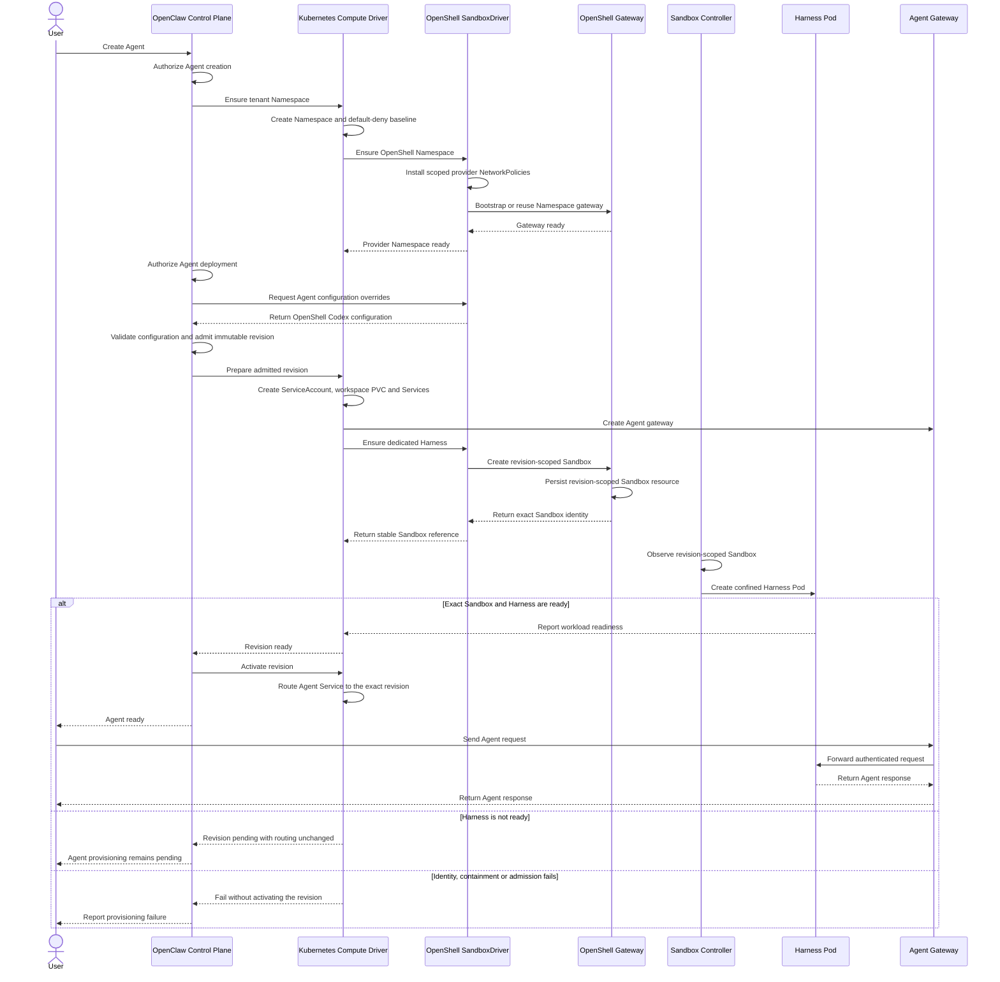

# Proposal: SandboxDriver Provisioning and Lifecycle: contract and compute lifecycle

[Spec overview](../13-sandbox-driver-provisioning.md). Original record; decisions and status are preserved.

## SandboxDriver contract

```ts
type SandboxFacet = "networking" | "filesystem" | "process";

interface SandboxDriver extends Driver {
  readonly capability: "sandbox";
  readonly facets: readonly SandboxFacet[];
  configureAgent?(
    configuration: Readonly<OpenClawConfigurationDocument>,
  ): OpenClawConfigurationDocument;
  ensureNamespace?(context: SandboxNamespaceContext): Promise<void>;
  provisionHarness?(context: SandboxHarnessContext): Promise<SandboxResourceRef>;
  cleanup(context: SandboxNamespaceContext & { revision?: Readonly<AgentRevision> }): Promise<void>;
}

interface SandboxNamespaceContext {
  readonly namespace: Readonly<Namespace>;
  // Compute's authenticated native KubernetesObjectApi client.
  readonly kubernetes: unknown;
  // Needed to propagate cancellation through Kubernetes and provider operations.
  readonly signal: AbortSignal;
}

interface SandboxHarnessContext extends SandboxNamespaceContext {
  readonly revision: Readonly<AgentRevision>;
  readonly requirements: HarnessWorkloadRequirements;
}

interface HarnessWorkloadRequirements {
  readonly image: string;
  readonly command: readonly string[];
  readonly serviceAccountName: string;
  readonly serviceAccountToken: {
    readonly audience: string;
    readonly expirationSeconds: number;
    readonly mountPath: string;
    readonly path: string;
    readonly readOnly: true;
  };
  readonly workspaceMounts: readonly SandboxWorkspaceMount[];
  readonly environment: readonly SandboxEnvironmentVariable[];
  readonly labels: Readonly<Record<string, string>>;
}

interface SandboxWorkspaceMount {
  readonly claimName: string;
  readonly subPath: string;
  readonly mountPath: string;
  readonly readOnly: boolean;
}

type SandboxEnvironmentVariable =
  | { readonly name: string; readonly value: string }
  | {
      readonly name: string;
      readonly valueFrom: {
        readonly secretKeyRef: { readonly name: string; readonly key: string };
      };
    };

type SandboxHarnessResult =
  // Compute creates and owns the Harness workload; the provider adds containment.
  | { readonly ownership: "compute" }
  // The provider owns the Harness workload and returns its stable Sandbox identity.
  | { readonly ownership: "provider"; readonly sandbox: SandboxResourceRef };

interface SandboxResourceRef {
  readonly namespaceName: string;
  readonly resourceName: string;
  readonly agentId: string;
  readonly revisionId: string;
}
```

OCC calls `configureAgent` before admitting the immutable AgentRevision. The
driver can contribute provider-specific gateway configuration, while OCC
validates and owns the final admitted configuration.

`ensureNamespace` is optional for providers that need no Namespace-local
infrastructure. When `provisionHarness` is absent, Compute creates and owns the
ordinary Harness Deployment. When present, the provider creates the Harness
workload and immediately returns its stable, exact Sandbox reference; the
controller may create or replace its Pod asynchronously. Providers make
provisioning idempotent; Compute observes only the revision-labeled Pod for
readiness. Cleanup receives the immutable revision, allowing the provider to
derive and delete its stable Sandbox even when no Pod remains. Compute does not
inspect provider-specific Sandbox resources or require Sandbox API permissions.

The Sandbox controller may create or replace the Harness Pod asynchronously.
Compute checks readiness and cleans up provider resources using the stable
Sandbox identity, not the temporary Pod identity.

The admitted revision records only `sandboxDriverId`; supported facets are
validated during admission without duplicating them in revision metadata.
Environment entries allow nonsecret literals and exact Agent-scoped
`secretKeyRef` values, including `APP_SERVER_TOKEN`. Raw secrets never enter
revision metadata, logs, or provider configuration. Provider-owned Harnesses
must preserve Compute's projected ServiceAccount token without substituting a
gateway token or weakening its audience or expiration.

## Compute lifecycle

```ts
interface ComputeDriver extends Driver {
  ensureNamespace(namespace: Namespace): Promise<NamespaceEnsureResult>;
  prepareRevision(revision: AgentRevision): Promise<ComputeReadiness>;
  activateRevision?(revision: AgentRevision): Promise<void>;
  deactivateRevision?(revision: AgentRevision): Promise<void>;
  retireRevision(revision: AgentRevision): Promise<void>;
  deleteNamespace(namespace: Namespace): Promise<NamespaceDeleteResult>;
}
```

1. `ensureNamespace` creates the Kubernetes namespace and applies the
   default-deny NetworkPolicy.
2. `SandboxDriver.ensureNamespace` provisions one OpenShell gateway per
   Namespace, applies provider NetworkPolicies, and checks gateway readiness.
   Retries and concurrent workers converge on the same gateway.
3. OCC calls `SandboxDriver.configureAgent`, validates the returned
   configuration, and admits the immutable AgentRevision.
4. `prepareRevision` creates the Agent gateway, ServiceAccount, per-Agent PVC,
   Services, and workload requirements. Optional `SandboxDriver.provisionHarness`
   creates a provider-owned Sandbox and returns its stable reference; otherwise,
   Compute creates the Harness workload.
5. The Sandbox controller creates the Harness Pod. Once the Pod is ready,
   Compute routes the Agent Service to that revision.
6. `deactivateRevision` removes routing only if the Agent Service still points
   to that revision. Retiring the revision deletes its Sandbox without
   interrupting an active replacement. Namespace cleanup waits for all Agent
   Sandboxes to drain.

Missing prerequisites, invalid identities, unsupported facets, rejected
admission, and unavailable workloads must not activate an Agent.

## Agent provisioning sequence

The following sequence shows the intended provisioning flow for a dedicated
OpenShell Harness:



