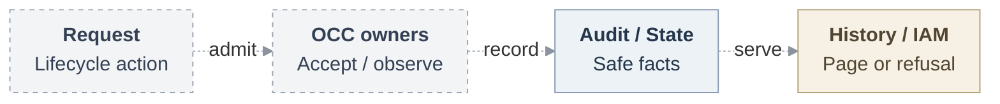

# RFC: Basic Agent observability

**Date:** 2026-09-18

**Status:** Proposed. Implementation and qualification remain pending.

## Problem and decision

Operators need to know who requested an Agent action, what the system accepted and observed. The audit ledger's unbounded list does not supply protected History. We propose **Agent History**, a bounded exact-Agent API and console view of safe facts. It distinguishes acceptance from observation, reports unknown outcomes and excludes prompts and credentials.

Lifecycle History is the first milestone. The cross-person repository-read History demonstration is stretch. Actual GitHub access, model access and non-incognito session capture and backfill remain in the connected MVP. Both journeys retain their security requirements.

## Scope and journey

After State, authentication, IAM, audit recovery and retention controls are installed and qualified, an Installation administrator grants `audit_reader` to an existing identity or group. Local accounts suffice. A separately authenticated reader opens a personal or team Agent's History after create, update, deploy or stop. The proposed API returns bounded accepted, observed or unknown facts only after acknowledged disclosure COMMIT. A deployer without the audit grant, a revoked reader or an unsupported Driver receives no protected page. The separate retention administrator can only manage audit retention and cannot read History through that role. This journey is unexecuted.

The first milestone includes durable facts, retained-Agent authorization after deletion, exact mutation recovery, retention and restore protection, an API and a console view. Mutation, evidence and accepted work share the original State transaction. Unknown COMMIT is not rollback and cannot authorize replay. A returned recovery reference lets the original caller check local acceptance. Missing or erased evidence stays unknown. These controls must work before serving. The [contract](31-basic-observability/contract.md) defines transaction and refusal rules. The [repository-read stretch](31-basic-observability/repository-read.md) follows deployer A, requester B and reader C through an authentic Agent GitHub read. Existing components do not prove that join. The stretch must withdraw new work and last protected bytes within 30 seconds of the authority event, including renewal loss. This bound remains unqualified.

[Platform audit RFC #376](https://github.com/openclaw/openclaw-enterprise/pull/376) proposes a separate bounded Installation view and grant. Selected historical Namespace create/delete denials include API and worker producers. Preserve recorded actor, outcome and target, with unknown origin where evidence cannot establish it. Unknown actor and unknown producer are distinct. Malformed or contradictory rows fail closed.

API create denial targets the Installation collection without a Namespace. Worker create denial records the existing Namespace as scope and target. Both sources say `occ`, and the worker records its claimed actor. The [earlier projector](https://github.com/openclaw/openclaw-enterprise/blob/e4648c1752f6dc000bc316a307fb049d30a6346a/packages/audit/src/platform-audit.ts#L255-L287) would refuse a worker-shaped row. The proposed extension includes it with unknown origin. Adding origin breaks V1. The Platform owner must check both envelopes against persisted rows. Source findings do not prove a stored row or supported reader.

Protected audit and eligible non-incognito transcripts each have a configurable 90-day default, with separate authority and storage. Native session-sharing restrictions apply by default. The visibility alternative and retention configuration details await owner decisions; audit retention includes an explicitly authorized indefinite mode. Expired audit facts are hidden, deleted from the live ledger within 24 further hours and cannot be resurrected by restore. [Session content](31-basic-observability/contract.md#session-content-boundary) needs its own capture and disclosure contract. Installation-wide search, general policy editing, remote export, legal holds and independent witnessing remain outside this scope.

## Design

Proposed lifecycle. Dashed edges are pending composition. The [detailed lifecycle](31-basic-observability/contract.md#history-query-and-disclosure) shows authorization, disclosure and uncertain outcome. History records facts from their owners and does not perform their work.

Read the [contract](31-basic-observability/contract.md) for facts, access, recovery and diagnostics, [retention](31-basic-observability/retention.md) for expiry and restore, and [repository read](31-basic-observability/repository-read.md) for runtime and credential handoffs.

## Implementation and verification

Build and review safe facts and indexed State queries first, then integrate policy, account/session guards, recovery, retention and restore. Source cuts may be non-serving. Serving requires accepted State transactions and raw-SQL migration, retained parentage and bounded query, common IAM and current account/session guards, recovery keys, receipt continuity, and retention/purge/restore. Unsupported dependencies fail explicitly. Entire RBAC, OIDC, SPIRE, gVisor or egress programs are not blanket gates. The chosen profile still needs its receiving, isolation and transport controls. The [delivery contract](31-basic-observability/contract.md#verification-and-delivery) states the required evidence.

Pinned main exposes audit append and unbounded list, not a qualified History reader. Existing [deployment status](https://github.com/openclaw/openclaw-enterprise/blob/e4a807e785e1a242e27200c8e8396f58136cbbc6/docs/reference/agents.md#deployment-status) reads the original revision under its own permission. A 202 is admission and saved success is historical activation, not live health, an invocation or a History grant. It can include [safely disabled plugin warnings](https://github.com/openclaw/openclaw-enterprise/blob/12fddc4805a1b090331af363ad10bf3b58ea5897/docs/reference/agent-plugins.md#L49-L77), which are auxiliary rather than lifecycle failures. [Activation audit](https://github.com/openclaw/openclaw-enterprise/blob/12fddc4805a1b090331af363ad10bf3b58ea5897/apps/controller/src/worker.ts#L1849-L1875) does not copy them. Component source, proposed joins, installed behavior, live-provider proof and release acceptance are distinct. A historical optional diagnostics checkpoint reported authenticated Compose Namespace traffic, sanitized host-file output, sink interruption and file-handling checks. Its implementation commit, evidence and acceptance remain unresolved. Future acceptance must use authenticated real Compose OCC and supported Namespace lifecycle traffic to verify sanitized host-file output and file handling. Interrupt the sink while observing that actual API and mandatory audit outcomes remain intact. It cannot prove History or Agent execution. Docker/Podman control-plane traffic does not prove an Agent or model turn, which needs the supported Kubernetes path.

## Open decisions

IAM must choose the operator-facing grant entrypoint. State, Audit and API must settle expiry crossing during disclosure. State, IAM, SQL and operators must close purge authority, policy transitions and restore custody. API and key custodians must choose the recovery reference envelope, validity and rotation. Session, runtime, IAM and authentication owners must define capture, content authority and the optional visibility alternative. Audit and original producers must freeze event membership against actual exports. These choices do not waive serving gates.

## References

- [Platform design](https://github.com/openclaw/openclaw-enterprise/blob/e4a807e785e1a242e27200c8e8396f58136cbbc6/docs/design.md) and [State audit interface](https://github.com/openclaw/openclaw-enterprise/blob/e4a807e785e1a242e27200c8e8396f58136cbbc6/packages/occ/src/state/platform-state.ts#L483-L486).
- [Common IAM policy proposal](https://github.com/openclaw/openclaw-enterprise/pull/245) and [account authority proposal](https://github.com/openclaw/openclaw-enterprise/pull/246).
- [Platform audit proposal](https://github.com/openclaw/openclaw-enterprise/pull/376) and its [non-serving projection draft](https://github.com/openclaw/openclaw-enterprise/pull/424).
