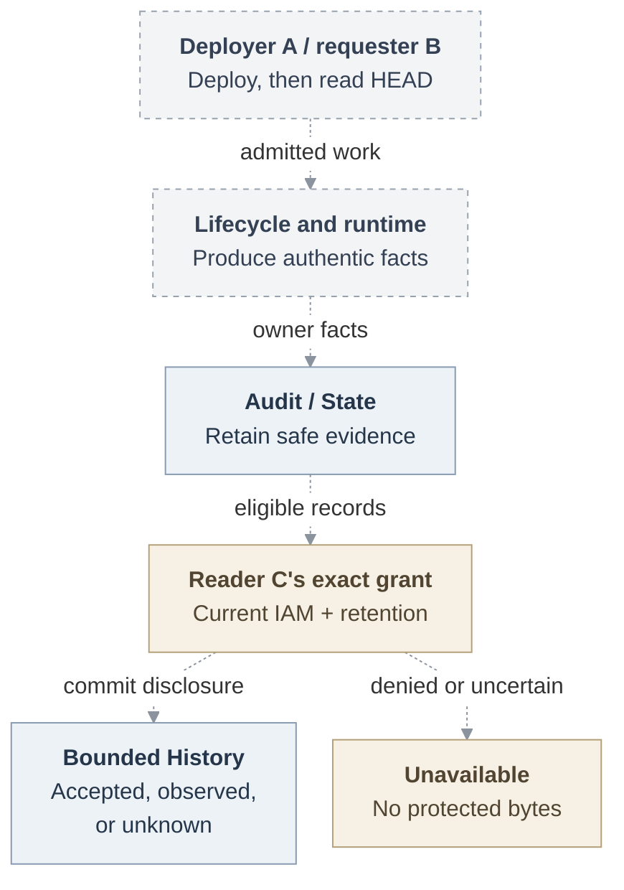

# RFC: Basic Agent observability

**Date:** 2026-09-18

**Status:** Proposed. Selected scope, implementation and qualification pending.

## Problem and proposal

Operators need to know who requested an Agent action, what the system accepted and what it observed afterward. We propose **Agent History**: a bounded API and console backed by the audit ledger. It separates acceptance from observation, shows **unknown** when the outcome cannot be confirmed, and excludes prompts and credentials.

History is proposed, not implemented. [State on current main](https://github.com/openclaw/openclaw-enterprise/blob/5ebd7305b0876db33276a249934bc82073b63424/packages/occ/src/state/platform-state.ts#L483) exposes audit append/list, not the protected History, recovery and retention described here.

## What to build

The first usable release covers personal and team Agents and their create, update, deploy and stop operations. It needs:

1. **Lifecycle facts.** Record the requester, authorization, accepted action and observed outcome, including retries and supersession. Show missing attribution as unresolved.
2. **Access and a view.** Provide an exact-Agent API and console. Administrators grant `audit_reader`; check current `read_audit` on every page, including after deletion. Deployment rights grant no access.
3. **Safe evidence.** Store bounded facts. Commit required evidence with the mutation and disclosure evidence before returning a page.
4. **Recovery.** Let the original authorized caller check an unknown mutation outcome without retrying it, using the returned recovery reference. Missing or erased evidence stays unknown.
5. **Retention.** Expire evidence after 30 days and delete it within 24 more hours. An administrator can select indefinite retention; previously expired records must still be deleted. Prevent expired evidence from returning after restore.

These items must work together before History serves a page. See the [MVP checklist and delivery cuts](31-basic-observability/mvp-scope.md) for acceptance criteria and dependencies. Local accounts suffice; federation is not required.

## Release decision

The **current selected MVP** also requires a [repository-read journey](31-basic-observability/repository-read.md): A deploys an Agent, B asks it to read an approved GitHub repository's HEAD, and separately authorized C sees B's request and its result. Authentic attribution requires runtime and credential handoffs beyond the lifecycle facts.

A [review suggestion](https://github.com/openclaw/openclaw-enterprise/pull/250#issuecomment-5754821713) would make lifecycle History the complete first MVP and track the read separately. **The release boundary remains open.** Until decided, lifecycle History is the first usable milestone and the read remains part of the full MVP.

The [open decisions](31-basic-observability/mvp-scope.md#decisions-still-required) include expiry during disclosure, recovery keys, purge authority and restore custody. [Platform audit RFC #376](https://github.com/openclaw/openclaw-enterprise/pull/376) proposes a separate, narrower view and Installation query with its own gates.

Dashed arrows show the proposed complete journey, including the repository read whose MVP status is open. History records each producer's facts; it does not execute the read. See the [request lifecycle](31-basic-observability/architecture.md#request-lifecycle).

## Supporting design

- [Architecture](31-basic-observability/architecture.md) defines responsibilities, diagnostics and delivery gates.
- [Interfaces](31-basic-observability/interfaces.md) defines facts, authorization, queries, disclosure and exact recovery.
- [Retention](31-basic-observability/retention.md) defines expiry, erasure and restore.
- [Security](31-basic-observability/security.md) defines privacy, audit-failure behavior and local integrity limits.

Transcripts, Installation-wide search, general policy editing, replay, richer retention and remote audit export are [deferred](31-basic-observability/security.md#accepted-limits-and-closure).

## References

The [source baseline](https://github.com/openclaw/openclaw-enterprise/blob/e9766f35a25afa240ee109b41a6ef821fb68687e/packages/occ/src/state/platform-state.ts#L410) provides transactional lifecycle audit and State append/list. Serving History and the repository connection remain proposed. The [platform design](https://github.com/openclaw/openclaw-enterprise/blob/e9766f35a25afa240ee109b41a6ef821fb68687e/docs/design.md) remains authoritative. Historical source baseline: `046e12b007bb1b4928bd3f7497a2353714be11a8`; later pins describe separate evidence.
