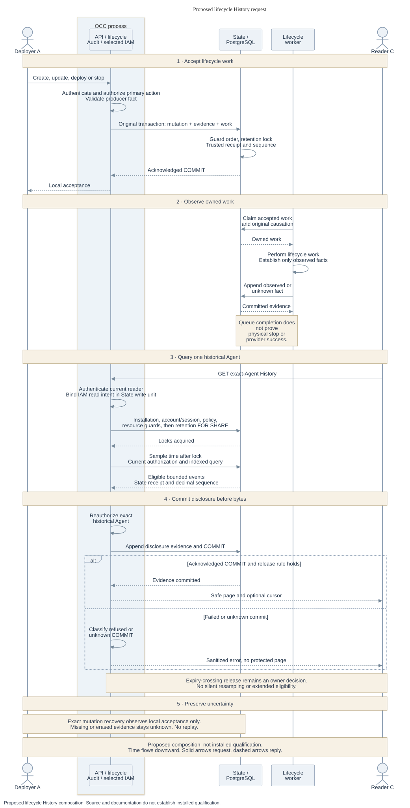

# Basic observability: architecture

[Overview](../31-basic-observability.md) · [Interfaces](interfaces.md) · [Security](security.md)

**Status:** Proposed connected design. Existing audit source does not establish serving History.

## Components and dependencies

History extends the `AuditEvent` ledger in the OpenClaw Control Plane (OCC). Lifecycle and work owners carry the original cause of each action. Audit validates their facts; State stores and queries them. Authentication checks the account and session, the selected IAM Driver authorizes the read, and HTTP and the console present the result.

These are existing ownership boundaries, not new services. Repository behavior stays with its credential Driver/Provider. Observability adds no execution store, invocation queue, authority lease or substitute Gateway client. The [repository journey](repository-read.md#connect-authentic-handoffs) depends on evidence from the actual owners.

At [pinned main](https://github.com/openclaw/openclaw-enterprise/blob/e9766f35a25afa240ee109b41a6ef821fb68687e/packages/occ/src/state/platform-state.ts#L410), State exposes `append` and unbounded `list`. Controller records do not establish who initiated a later Agent invocation. The proposed [lifecycle facts](interfaces.md#facts-and-events) still need the full serving integration.

At newer main `12fddc4`, [deployment status](https://github.com/openclaw/openclaw-enterprise/blob/12fddc4805a1b090331af363ad10bf3b58ea5897/docs/reference/agents.md#L50-L77) reads the original revision's reconcile result under AgentRevision `read`. A `202` records admission; a saved success records activation or an already-active revision. Neither proves live health, a later human invocation, physical termination or recovery from an unknown commit. Later deployments do not rewrite that result. This read does not grant `read_audit` or implement History.

## Request lifecycle

Proposed lifecycle. Time flows downward and bottom actors mirror the top actors. Solid arrows are requests and dashed arrows are replies. The diagram shows intended composition, not installed qualification. [Editable Mermaid source](request-lifecycle.mmd).

1. Lifecycle accepts a real create, update, deploy or stop operation. Local mutation, mandatory evidence and accepted controller work commit together in the existing State transaction. The [existing transactional append](https://github.com/openclaw/openclaw-enterprise/blob/724dcb5cb80b5e76a62e8267a21185a2e91a85c2/apps/controller/src/index.ts#L1765) supplies this foundation.
2. Work carries the original causation through claims, retries, supersession, completion and failure. Each later fact states only what its producer observed. Queue completion cannot certify physical workload stop or provider success.
3. Reader C authenticates and requests one historical Agent's History. The API binds a short State write transaction with IAM read-bound authorization. It acquires the [shared guard order](interfaces.md#disclosure-transaction) before locking retention.
4. State samples trusted database time after the retention lock, applies exact current authorization and executes the indexed bounded query. It constructs events from retained producer facts plus trusted receipt and sequence metadata.
5. Immediately before appending disclosure evidence, the API reauthorizes. Only acknowledged COMMIT allows response bytes. A denial, dependency failure or refused/unknown commit yields a sanitized error without a page.

Exact mutation observation uses the same disclosure and restore gates. A prepared recovery reference proves no commit. [Interfaces](interfaces.md#mutation-outcomes) defines accepted versus unknown and keeps observation separate from execution.

## Availability and delivery

The [MVP checklist](mvp-scope.md) defines non-serving source cuts, the lifecycle serving gate and the repository-read acceptance required by the currently selected full MVP. A [review suggestion](../31-basic-observability.md#release-decision) would move that read to a follow-up.

Optional diagnostics have a separate acceptance: use authenticated Compose OCC and supported Namespace lifecycle traffic to verify sanitized host-file output. Interrupt the sink and confirm API and mandatory audit outcomes remain intact; verify file handling. Docker/Podman admission does not prove Agent or model turns, which require supported Kubernetes. Preserve the historical diagnostic checkpoint and its test evidence.

Keep successor cuts buildable and preserve supplier ancestry and final-tree equality. Complete contract, documentation, SQL, security and independent integrated reviews after writers stop; repeat affected reviews after repairs. Update current references, generated API, guides and flows when implementation lands.

Record exact revisions, dependencies, fixtures, cleanup and missing proof separately for source/database, composed, installed, live-provider and release evidence. These are acceptance requirements, not reported passes. A green source check cannot stand in for the next evidence level.

## Optional diagnostics

The [existing export procedure](https://github.com/openclaw/openclaw-enterprise/blob/e9766f35a25afa240ee109b41a6ef821fb68687e/docs/guides/observability.md) supports an operator-owned OpenTelemetry Protocol (OTLP) receiver behind the filtered Collector. This RFC proposes a local diagnostic-file overlay with a pinned image, read-only native configuration and mounted output directory. It reuses the existing endpoint setting and adds the [diagnostic settings](interfaces.md#diagnostic-configuration).

Ordinary development needs no Collector. Authentication, exact selected-IAM authorization, secret filtering and mandatory PostgreSQL audit remain enforced. Add no application log API, global logging mode or Agent file mount. Trusted Drivers can retain `runtimeLogging: "driver"` pipelines.

The diagnostics sink is best effort. Operators own file access, rotation, disk bounds, copies and cleanup. Sink failure must preserve API/audit outcomes. These files establish no protected History, receipt, complete attribution, verified execution, retention guarantee or independent integrity. Later History cannot promote old logs into evidence.

## Dependencies and tradeoffs

Exact historical-Agent authorization does not require a live Agent row. Authentic retained parentage enables the narrowly scoped [audit-role policy operations](interfaces.md#authorization-and-policy-consumption) after deletion. This preserves investigative access without granting configuration or conversation content access.

Protected History remains unavailable until actual State/IAM, recovery and [retention/restore](retention.md) dependencies are installed and validated. Dependency loss cannot select a weaker implementation. Diagnostic availability does not waive this gate.

Local accounts suffice. Federation and every neighboring runtime/channel milestone are not prerequisites for lifecycle History. The later repository scenario needs one qualified ordinary admission/runtime/channel path, not every provider, Harness or retained-workspace delivery. This keeps the selected journey bounded while preserving its genuine execution requirement.
