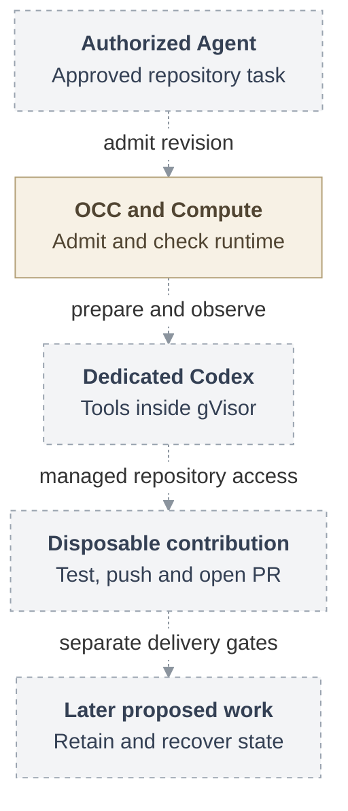

# RFC: gVisor container support

**Date:** 2026-09-18

**Status:** Accepted direction. Implementation and qualification pending.

**Owner:** Kubernetes Compute and its runtime consumers.

## Current disposition — 2026-09-24 amendment

This RFC is **proposed 1.x work for discussion, not a commitment to ship in 1.x**.
The recorded accepted direction above does not establish release scope or
implementation acceptance. The [release-scope decision](https://github.com/openclaw/openclaw-enterprise/pull/248#issuecomment-5754812543)
selects Kubernetes with the OpenShell sandbox and credential gateway for 0.x.
None of this RFC's runtime, contribution, retained-state or recovery increments
is a 0.x blocker or qualification gate. The four increments below preserve the
proposal's technical scope; selecting delivery work requires a separate decision.

The design and pinned interfaces below record the original proposal. Apply these
current integration constraints before implementing it:

- Dedicated Gateway and Harness now use distinct runtime namespaces and storage.
  Gateway file access uses the paired Harness file node; Gateway does not mount
  the Harness workspace. The earlier shared-mount topology in this RFC is
  superseded by [Kubernetes storage and credentials](../docs/reference/drivers/kubernetes-compute/storage-and-credentials.md).
  Extend that topology and its existing owners. Do not restore the old shared
  mount. Writer exclusion must cover Gateway-initiated file operations and every
  actual Harness-side writer before a retained successor can write.
- The [Repo Driver contract](../docs/reference/repository-credentials.md#repo-driver-contract)
  and [repository credential flow](../docs/flows/agent-repository-credentials.md)
  now include dedicated Codex without a Sandbox Driver. Reuse their admission,
  material generation, cleanup and uncertainty rules. The embedded-only supplier
  described below is historical; dedicated source support does not qualify the
  proposed gVisor contribution path or OpenShell composition.
- The copied option and lifecycle declarations are snapshots at their linked
  commits, not current complete interfaces. Use the living
  [Compute contract](../docs/reference/drivers/compute.md),
  [Kubernetes configuration](../docs/reference/drivers/kubernetes-compute.md) and
  [shared source](../packages/contracts/src/index.ts) for implementation.
  Current source support establishes no installed runsc, retained-writer fencing,
  native restore or live model/provider proof for this proposal.

This amendment takes precedence over historical “current” and “selected” wording
on the detail pages. Their invariants and unresolved owner decisions remain part
of the proposal; none becomes a release commitment through this refresh.

## Problem and proposal

Agent tools run repository code, dependencies and build scripts that must not gain
access to the host, other Agents or the gateway's private state. Add an opt-in
gVisor profile to the existing Kubernetes Compute Driver in OpenClaw Enterprise
(OCE). Dedicated Codex and its tools run under `runsc` with `systrap`; the trusted
OpenClaw gateway remains in a separate Pod on the ordinary runtime. The existing
Compute lifecycle owns preparation, readiness, activation, stop and retirement.

Trusted Installation configuration selects the profile for OCE-owned tenant
namespaces. OpenClaw Control Plane (OCC) admits each revision with a fixed runtime
requirement. Omitting the
profile preserves ordinary Kubernetes; a failed stronger selection never
silently downgrades. [Configuration and admission](31-gvisor-container-support/interfaces.md#configuration-and-admission)
defines the selector and supported combinations.

Dashed arrows show the proposed contribution and recovery path. The
[full lifecycle](31-gvisor-container-support/architecture.md#request-lifecycle)
includes the separate gateway, authorization, failure handling and closure.

## Scope and delivery

The proposal has four [delivery increments](31-gvisor-container-support/delivery.md#increments-and-qualification):

1. **Runtime checkpoint.** An authorized Agent uses genuine Codex, models and tools
   on one operator-managed gVisor installation. Existing supported storage
   suffices for this checkpoint.
2. **Disposable contribution.** Complete temporary storage admission, creation
   and disposal, plus managed Git/`gh` in real tool children
   to clone, edit, test, commit, push and open an approved same-repository PR.
3. **Retained current state.** Preserve files, local commits and completed context
   through same-build, same-cluster replacement. Exclude every predecessor writer
   before any successor writes, then resume under fresh authority.
4. **Continuing recovery.** Capture visible writes, verify and export recovery
   artifacts, and restore to fresh stores without blindly repeating uncertain
   model or repository effects.

All four are the proposed gVisor MVP sequence for 1.x discussion, not approved
release scope. The runtime checkpoint alone does not complete contribution or
recovery. [Storage and recovery](31-gvisor-container-support/storage-and-recovery.md)
defines disposal, writer exclusion and completed-context restore; the exact
disposal transition and native import interface remain
[open decisions](31-gvisor-container-support/interfaces.md#owner-decisions).

## Security and limits

Compute must observe the complete candidate Pod set and the required RuntimeClass
before activation. Missing evidence blocks readiness; a positive isolation
violation triggers [guarded containment](31-gvisor-container-support/architecture.md#containment-and-availability).
Selecting a RuntimeClass alone does not prove the installed sandbox.

Runtime selection grants no personal, team or repository authority. The first
profile may expose model credentials to tools and leave destinations unconfined;
repository provider credentials stay service-private. The stronger
[protected composition](31-gvisor-container-support/architecture.md#protected-composition)
adds verified receiving identity, network confinement and external credential
custody. It has separate requirements, and every deployment must satisfy its
selected profile. [Security](31-gvisor-container-support/security.md) defines
these boundaries and traffic-withdrawal limits.

Embedded execution, SandboxDriver composition and existing-namespace adoption
are excluded initially. Broader installation automation, other backends,
exact-container origin, outage termination and host-loss or changed-build recovery
remain [follow-ups](31-gvisor-container-support/delivery.md#decisions-and-follow-ups).
