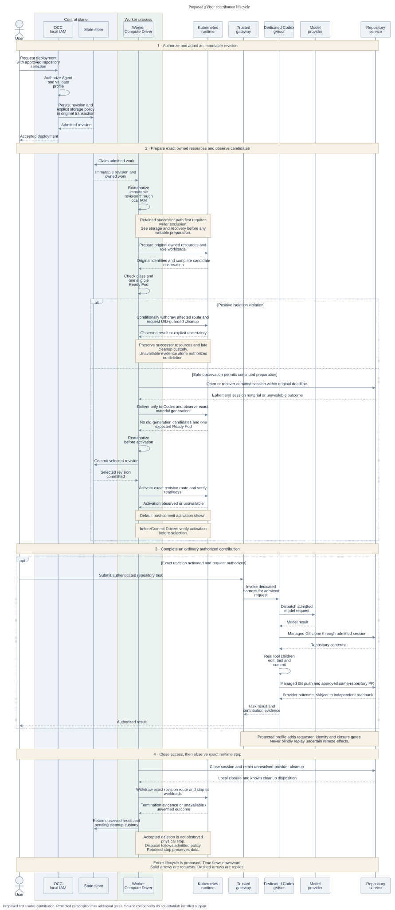

# gVisor architecture

[Overview](../31-gvisor-container-support.md)

See the [2026-09-24 amendment](../31-gvisor-container-support.md#current-disposition--2026-09-24-amendment)
for release scope and changes to the historical source and storage baseline.

The proposal extends one existing lifecycle owner. OCC admits an immutable
revision, Compute prepares and observes its workloads, and an ordinary Agent
uses dedicated Codex to complete an authorized repository task. Runtime placement
is one part of that path. Storage lifetime, operation authority and credentials
retain their own owners.

## Components and dependencies

The existing `ComputeDriver` owns preparation, readiness, activation, stop and
retirement. Kubernetes rendering, observation and containment remain internal
to that Driver. This proposal introduces no additional supervisor, generic
command API, credential store or invocation authority. Driver calls are internal
interfaces, not additional network services.

The trusted gateway uses the ordinary runtime in a separate Pod. Dedicated
Codex and its tool children run in the selected gVisor sandbox. Both roles use
a real shared workspace, but only the gateway receives its private state store.
The [storage lifecycle](storage-and-recovery.md) determines when those stores
may be reused or disposed of. A mount alone proves neither property.

OCC and IAM own authorization. State records admitted revisions and current
serving selection. The worker reauthorizes before runtime effects. Node and
storage operators own the installed runtime and backing storage. The Container
Network Interface (CNI) implementation must enforce the selected network policy.
Credential services own provider material and session settlement. The
[interfaces](interfaces.md) distinguish current calls from proposed consumers.

For enabled selected plugins, the current [startup-status channel](https://github.com/openclaw/openclaw-enterprise/blob/12fddc4805a1b090331af363ad10bf3b58ea5897/docs/reference/drivers/kubernetes-compute.md#plugin-startup-status)
reads the exact owned Pod through the authenticated Kubernetes Pod proxy. Preserve
private TCP/18791, precise `network.pluginStatusProxySourceCidrs` for actual
API-proxy sources, and tenant-worker `get` on `pods/proxy`. The dedicated gateway
also reads its current Agent's status and refreshes effective configuration after
restart. The [networking contract](https://github.com/openclaw/openclaw-enterprise/blob/12fddc4805a1b090331af363ad10bf3b58ea5897/docs/reference/drivers/kubernetes-compute/networking-and-isolation.md#networking)
requires installed verification of actual CNI/overlay source addresses. Omission
adds no API-proxy ingress rule. Unavailable or untrusted required status withholds
readiness. This gives workloads no Kubernetes API access and exposes no public
gateway endpoint. Plugin-free paths gain no unconditional status dependency.
Startup correlation supplies neither verified workload identity nor current-serving
authority. Qualify this inherited channel within the selected gVisor runtime.

## Placement and observation

The dedicated Agent Deployment requests the fixed `oce-gvisor-systrap`
RuntimeClass. The gateway stays on its ordinary runtime. A RuntimeClass selects
a configured Kubernetes runtime handler. Requesting that name does not prove
which executable actually ran.

Startup and every dedicated readiness check, including preparation and
activation, must read the RuntimeClass again. It must be non-deleting, and both
its name and handler must equal `oce-gvisor-systrap`. A missing, deleting or
mismatched class refuses activation. Positive isolation evidence also invokes
[containment](#containment-and-availability).

Observe the owned Deployment and its complete candidate Pod set, including
deleting Pods that are not terminal. Accept readiness only when exactly one
eligible Pod is Running and Ready with the correct ownership and RuntimeClass.
An unsafe candidate blocks acceptance even if another Pod is Ready.

Malformed or incomplete observations fail closed. Observe independent facts so
that one failed observation cannot erase positive evidence of an isolation
violation from another. A readiness result proves only its observed boundary.
The [installed receipt](delivery.md#acceptance-evidence) must independently
connect the Pod to the node, container runtime sandbox and actual executable.

## Request lifecycle

Proposed lifecycle. Time flows downward. Solid sequence arrows are requests and
dashed arrows are replies. The existing Compute lifecycle supplies the owner,
but the gVisor and dedicated repository joins still require implementation and
qualification. [Editable Mermaid source](request-lifecycle.mmd).

1. **Admit the revision.** OCC authenticates and authorizes the exact operation,
   validates the selected Harness and trusted configuration, then persists its
   immutable revision in the original State transaction. The proposed storage
   selection is side-effect-free. An unknown transaction acknowledgment needs
   original-operation readback before effects can safely continue.
2. **Prepare and observe.** The worker rechecks authority. Compute prepares
   exact owned resources and preserves original create identities. It keeps
   the predecessor route until permitted activation, observes the complete
   candidate set, and refuses activation on incomplete evidence. Retained
   successors first follow the separate
   [writer-exclusion path](storage-and-recovery.md#retained-writer-exclusion),
   before any writable preparation.
3. **Deliver material and select serving.** The repository owner admits the
   session. Compute delivers only its ephemeral material to the correct Harness
   role and checks its generation before publication. State selection, readiness
   and runtime observation remain distinct. The protected profile adds the
   [ordered binding path](#protected-composition) below.
4. **Complete the ordinary task.** The trusted gateway routes the authenticated
   request to dedicated Codex. Model execution and real tool children perform
   clone, edit, test, commit, push and approved same-repository PR creation.
   The contribution needs provider readback. A lost reply does not authorize
   replay of an uncertain remote effect.
5. **Close and observe.** Owners withdraw access, close sessions and perform
   exact-revision cleanup. Compute must observe termination before claiming
   exact runtime stop. Disposal follows its separately admitted policy and
   [guarded storage cleanup](storage-and-recovery.md#disposal-and-unknown-creates).
   Retained stop preserves data.

## Containment and availability

A positive isolation violation starts ordered, revision-scoped containment:

1. Conditionally withdraw the route only if its Service still selects the
   affected revision.
2. Run the lifecycle cleanup owned by that revision.
3. Request foreground deletion of the exact Deployment with UID preconditions.

A Kubernetes UID identifies one resource incarnation, unlike a reusable name.
The guards must preserve successors and unrelated resources during selector
changes or replacement races. Keep the original violation and cleanup failures.
Each phase must settle within its bound even when a callback ignores
cancellation. Retain timeouts, late outcomes and cleanup custody before further
guarded cleanup. The proposal does not choose numeric phase deadlines here.

Ordinary pending readiness and unavailable APIs alone authorize no destructive
deletion. Unavailable evidence leaves activation unavailable and cleanup
truthfully pending. Requested placement, accepted deletion and expired waits
prove neither the actual runtime binary nor physical termination.

## Protected composition

Isolation, network confinement and credential custody are independent assurance
choices. The design offers only explicitly supported combinations, not every
combination of axes. A failed stronger selection never falls back to a weaker
one. Retained-state work has its actual dependencies and is not automatically
blocked on the entire protected composition. Each admitted profile still has
to satisfy all of its own requirements.

The selected protected composition uses one trusted egress service per execution
assignment, independently enforced private ingress, verified receiving identity
and owner-admitted operations. Model and provider credentials remain outside
Harness execution. Ordinary off-Pod replay denial is required. Proof of exact
container origin is a separately deferred assurance with its own evidence.

[Identity](https://github.com/openclaw/openclaw-enterprise/pull/247) owns assignment
interpretation, verified registration and currentness.
[Egress](https://github.com/openclaw/openclaw-enterprise/pull/249) owns the actual
receiving transport, private ingress and closure. [RBAC](https://github.com/openclaw/openclaw-enterprise/pull/245)
owns operation and audience authorization. Locally, Compute must supply
authentic observation and preserve the observed incarnation during delivery:

1. Keep protected traffic disabled while observing the actual incarnation.
2. Bind that observation to the admitted assignment.
3. Persist the immutable session attempt, then open it and read back its result.
4. Deliver material without replacing the observed incarnation.
5. Revalidate the binding and current authority, then enable the protected path.

A changed execution or relay invalidates the corresponding proof and requires
fresh admission. Certificate rotation preserves the original assignment
deadline. Owners must settle usable preparation, material-delivery and
bootstrap-probe contracts without circular readiness dependencies.

Protect actual model probes, tools and repository routes. Receivers must bind
the actual connection and request to the original requester through waits,
concurrent turns, dispatch and result delivery. Recheck current authorization
and audience. Runtime selection and bearer possession cannot replace those
checks. The [closure contract](security.md#accepted-limits-and-closure) applies
to both refusal of new work and the final protected bytes.

The published strengthening to contain execution before any untrusted init,
startup or replacement code remains a **proposal pending security, Compute and
CNI owner decision**. Egress owns that clarification. The current pre-readiness
containment requirement remains mandatory. Policy readback or a fixed delay
alone does not prove enforcement, and unsupported combinations refuse
restricted activation.
