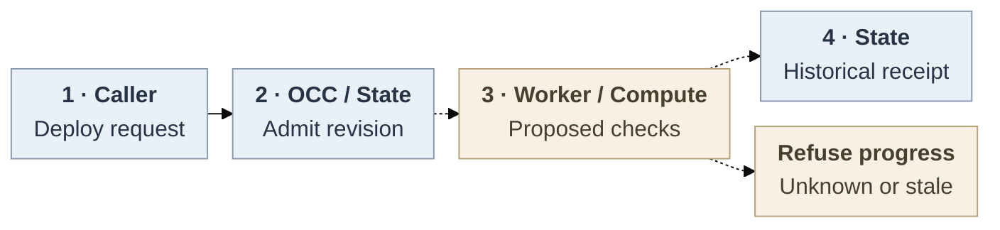

# Kubernetes runtime activation

**Status:** Proposal for discussion, not selected or implemented. Full activation remains blocked on the contracts and owner decisions below.

## Problem and proposed decision

An authorized deployment should identify the revision that became ready, or explain why activation cannot safely finish. Existing [stop](29-agent-stop.md) and [deletion](28-agent-deletion.md) contracts own lifecycle intent and work, but cannot fence Kubernetes requests already sent. A modeled transport schedule against an unmerged correction produced Gateway r3 and Agent Service r2 while r2 reported success. This is source/fixture evidence, not a demonstrated cluster outage.

Propose extending OCC State/Work and Kubernetes Compute around one active shared Gateway, allowing safe downtime. The complete scope includes activation, policy migration, stop, retirement, deletion and recovery. Dedicated replacement already stops predecessors before preparation and suppresses their later reconciliation. `activeRevisionId` is published before `afterCommit` activation, so it is not serving evidence. Queue or lease exclusivity cannot reject delayed requests. Parallel Gateways require an additional SQLite/session handoff and still leave route/policy consistency unresolved.

## Caller and owners

Operators supply a ready Namespace, PostgreSQL-backed API/worker, selected Kubernetes Compute, scoped RBAC, approved images, routing, enforcing networking and storage. Illustrative, unexecuted journey: send bodyless `POST /namespaces/:namespaceId/agents/:agentId/deploy`. Exact-Agent `deploy`, Configuration `read`, applicable actor/Agent credential-source `operate` and managed-account `read` admit an immutable revision with `202`. A deleting Agent or unauthorized caller is refused. Poll `GET /namespaces/:namespaceId/agents/:agentId/deployments/:deploymentId` using that revision ID and exact-revision `read`. Existing results are `queued`, `running`, `succeeded` or `failed`. Completion records history, not current health.

OCC API and worker are separate processes. Compute is a library inside the worker. State/Work would persist the proposed authority in PostgreSQL. Kubernetes stores effects. The dedicated Gateway occupies the managed control-plane namespace, with private SQLite/session storage. The Harness occupies the data plane or selected Sandbox, with separate workspace storage. Gateway/admin credentials must not enter the Harness. Dedicated model credentials remain Harness-owned.

The worker reauthorizes current revision work before dispatch. This does not establish per-mutation authorization or instant revocation. Proposed receipt-time authorization and revocation behavior require implementation and proof. Generations would govern concurrency, not IAM. Restrictive RBAC and trusted Drivers remain necessary against compromised writers or cluster administrators.

## Cutover contract

Proposed flow. Solid admission exists in source today. Dashed handoffs require decisions, implementation and proof. [SVG](42-kubernetes-runtime-activation/request-lifecycle.svg) · [editable source](42-kubernetes-runtime-activation/request-lifecycle.mmd).

The following are proposed requirements, not implemented guarantees. The owners must choose and prove a mechanism that satisfies them.

1. **Allocate and close.** State must durably allocate Installation, both Namespace incarnations, Agent incarnation, operation, revision and monotonic generation. A replacement execution advances generation within the same operation. Enablement first requires proven legacy-writer quiescence, including issued requests. Each participating successor must establish authority and a proven closed serving barrier before changing coupled objects. The mechanism and its ordering remain open; no atomic coordination across Kubernetes objects is assumed. A conditional Gateway Service selector update is only a candidate gate: it does not fence operator/node routes, established connections, Gateway execution or CNI effects. Until all bypasses are controlled, refuse activation.
2. **Bind every mutation.** Inventory preparation, activation, maintenance, enrollment, API credential/bootstrap writes, stop, retirement, Sandbox cleanup and Namespace teardown. Targets include Deployments/Pods, both Services, operator/node HTTPRoutes and SecurityPolicy, revision/legacy/channel/auth NetworkPolicies, ConfigMaps, Secrets, ServiceAccounts, claims and both physical namespaces. Namespace-wide resources retain separate Namespace authority. Kubernetes workload, route, storage and garbage-collection consequences also require observation. Under current authority and authorization, journal each request's identity, payload digest, target incarnation, expected owner and generation before dispatch. For existing-object mutations, also persist the observed UID and resourceVersion and enforce applicable preconditions. For initial create, journal the operation, authority, incarnation-specific target name and expected absence before create-only POST; bind the server-assigned UID and resourceVersion only after an authoritative result or proven settlement. An intent is not settlement evidence.
3. **Condition and settle.** A proposed per-object condition uses non-upserting PUT with resourceVersion, or one JSON Patch testing UID, resourceVersion and the stored generation before mutation. Owners must prove the chosen checks and authority enforcement cover every writer. Reject missing targets for existing-object mutations and reject foreign or newer objects. Stale writers must not refresh successor versions. Conflicts require exact inspection, never label-only adoption. Refuse progress on an unknown create outcome; observing absence cannot settle an already-issued request or provide a cross-object atomic fence. Delete preconditions require UID **and** resourceVersion. Fence every target and settle all issued effects before exposure. These are object-local operations, not a transaction across resources. An admission webhook reading another object does not change that boundary.
4. **Release and prepare.** Stop/drain the exact predecessor Gateway first and prove process termination and storage release before another SQLite writer. `Recreate`, one replica and [ReadWriteOnce](https://kubernetes.io/docs/concepts/storage/persistent-volumes/#access-modes) do not exclude a partitioned writer or two same-node Pods. Preserve node, workspace and session identity. Prepare revision-specific policy without user serving. Authenticated node bootstrap still needs a reachable Gateway and paired route/SecurityPolicy. That closed-operator/open-node sequence remains unproved. [NetworkPolicies are additive](https://kubernetes.io/docs/concepts/services-networking/network-policies/) and do not establish draining existing connections. The proposal refuses partial cutover until that barrier is proved.
5. **Publish exact evidence.** Freeze new mutations and require authoritative outcomes for every intent and asynchronous consequence. After settlement, under unchanged authority, verify revision/generation, Deployment UID/observed generation, ready Gateway/Pod/endpoints, Agent Service target, authenticated node/workspace and route/policy identities. Conditionally reopen only a proved gate. The worker then commits a receipt only while claim, authorized actor, intended revision and desired runtime state still match. PostgreSQL linearizes historical completion, not ongoing runtime health or a distributed transaction. Receipts contain identities, safe outcomes and timestamps, never secrets, prompts, provider content or raw native errors.

## Recovery and deletion

The proposed design must preserve admitted revisions, durable authority, intents and committed receipts across restart. Request outcomes and local continuations may be lost. An authorized worker may inspect the same operation, but unknown effects forbid blind replay, compensation, stale-authority refresh or dependent takeover. Timeout, abort and failure are not rollback. Refusal cannot undo an already-issued effect.

An accepted delete may continue through finalizers and dependants. A later fence cannot cancel it. Require terminal deletion and exact process release before replacement. An absent name with an unresolved create/delete cannot be reused. Kubernetes creation has no cross-object Namespace-UID precondition. Both physical namespace identities therefore need new names or proven settlement before reuse. Keep necessary slots inert only while closure is pending. Namespace teardown must join child closure under its own authority.

Stop requires `operate`, retains state and resumes through a higher revision. Stop/retirement retain both durable claims. Final deletion requires `delete`, destroys Agent-owned credentials/claims, removes the Agent row and frees its logical name for a new incarnation. Namespace-owned sources survive. A separate nonsecret State control record must not pin the Agent row. Its disposal rule remains open, with no indefinite post-success placeholder selected. Unknown closure blocks deletion completion, not this contract's eventual offboarding requirement. Secret deletion does not revoke loaded/provider-accepted bytes. Transport rotation, finite TTL and immediate revocation remain open work.

## Delivery and proof

Four implementation blockers remain: **Compute and Namespace owners** must choose and prove issued-effect settlement and a complete writer/mutation inventory. **Gateway, routing and storage owners** must choose and prove the serving barrier and bootstrap/release sequence. **State, Work and Compute owners** must select authority/receipt types and safe non-success status projection. Current `activateRevision` returns `Promise<void>` and stop/retire/deactivate lack authority context. No new endpoint, public enum, tuning default or automatic recovery policy is selected. **State/audit/deletion owners** must separately resolve control-record disposal without changing retention promises silently. Embedded compatibility does not acquire dedicated protection.

No cleanup/bootstrap cut is demonstrated independently landable against main. Such a cut requires proof of its whole cross-resource impact and would not complete activation. SDK cleanup confined to unmerged code is not a standalone main fix.

Acceptance must traverse real POST, PostgreSQL Work and Compute. Exercise both activation orders, claim loss after dispatch, same-revision retry, crash, revoked actors, delayed create/update/delete, open deletion and Agent/Namespace recreation. Supported API-server/SDK/CRD tests must prove preconditions. Enforcing CNI/Envoy and installed Gateway/Harness/storage must prove isolation, route/auth pairing, termination, reconnect, single-writer continuity and safe retirement. Selected-provider model turns, CI, independent exact-source/security review and outgoing publication review remain separate gates. This proposal supplies no implementation, architecture or release approval.

## References

Current behavior at [main 7caf533](https://github.com/openclaw/openclaw-enterprise/tree/7caf53332219db12fed62180c3c6d270baa8ea63): [Compute](../docs/reference/drivers/compute.md), [worker](../docs/flows/controller-worker.md), [API routes](../packages/contracts/src/api/routes.ts), [contracts](../packages/contracts/src/index.ts). Historical [Provider specification](17-provider-driver-abstraction.md) supplies structure only. Kubernetes [conditional updates](https://kubernetes.io/docs/reference/using-api/api-concepts/#updates-to-existing-resources) define the object-local boundary.
