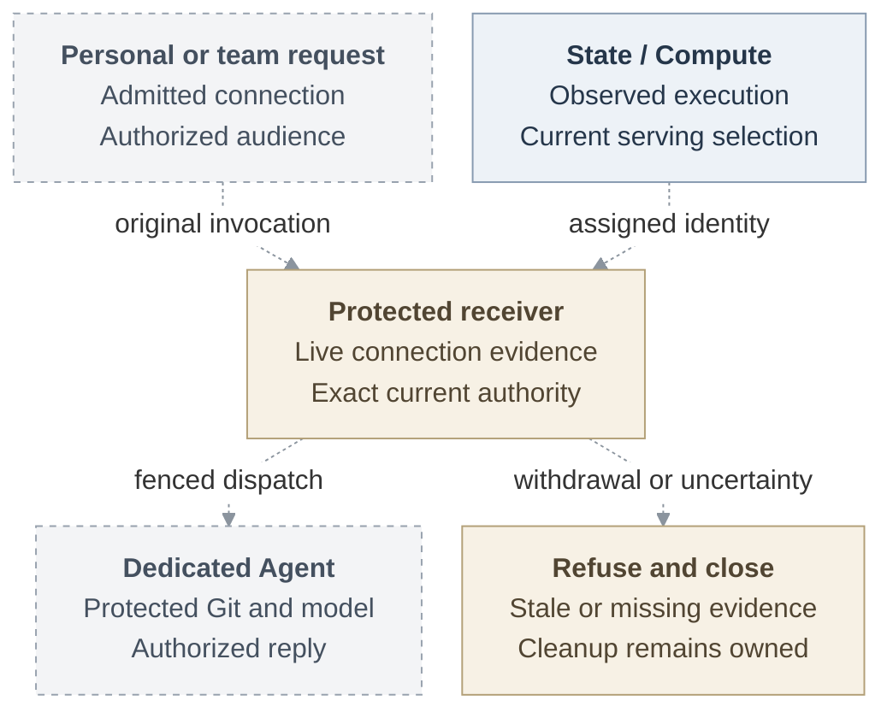

# RFC: Basic Agent identity MVP

**Status:** Proposed. Connected implementation and qualification remain pending.
**Baseline:** [Public main at `724dcb5`](https://github.com/openclaw/openclaw-enterprise/tree/724dcb5cb80b5e76a62e8267a21185a2e91a85c2).

## Problem and proposal

An Agent principal or repository session cannot establish whether a request came
from the current execution. Protected services must also check the requester's
operation permission and response audience.

Use operator-managed [SPIRE](https://spiffe.io/docs/latest/deploying/registering/)
and rotating [X.509-SVIDs](https://spiffe.io/docs/latest/spiffe-specs/spiffe_workload_api/)
(workload certificates), retaining the existing Agent ServicePrincipal. Verify the
actual receiving connection against the current execution before credential
acquisition or protected work. Execution identity and requester authority remain
separate checks.

A personal Agent uses one explicitly connected human's admitted integration, within
its existing permissions. A team Agent uses its admitted team service integration.
The requester remains distinct from the deployer; Git author metadata supplies
attribution only. Missing personal authorization must deny access, never select
team credentials.

Dashed connections show the proposal. The [full lifecycle](basic-agent-identity-mvp/architecture.md#request-lifecycle)
follows preparation, serving selection, requests, and withdrawal.

## First usable milestone and complete scope

The first usable milestone is a real team Agent's approved repository read through
its actual Harness with explicit `git-read`. An embedded OpenClaw checkpoint is
optional.

The complete MVP must also let personal and team Agents clone, edit, test, commit,
push, open a same-repository PR, and reply to an authorized audience. It requires
dedicated Codex, a separate trusted Agent Gateway, qualified gVisor, managed Git/`gh`,
and protected model access. The [six delivery checkpoints](basic-agent-identity-mvp/delivery.md#deliverable-cuts)
run from compatibility through execution assignment, registration, the first Git
read, complete contribution, and installed failure qualification.

## Minimum release requirements

All seven requirements apply to one qualified deployment profile:

1. **Stable Agent, replaceable execution.** Bind each execution to its exact Agent,
   immutable revision, component, and independently observed incarnation. Replacement
   gets a fresh generation; [retirement is irreversible](basic-agent-identity-mvp/architecture.md#assignment-and-serving).
2. **Verified workload identity.** Constrain SPIRE registration to the assigned
   workload. Check its actual connection and current execution before OCC admission,
   credential acquisition, or dispatch; retain [exact-resource IAM checks](basic-agent-identity-mvp/interfaces.md#execution-and-registration).
3. **Protected Git and model consumers.** Keep workload keys and long-lived
   provider credentials outside tools. Independently enforced private ingress must
   [deny external and sibling off-Pod replay](basic-agent-identity-mvp/security.md#receiving-and-custody-controls)
   on every protected route.
4. **Explicit personal and team authority.** Bind operations to one admitted human
   connection or team authority, preserving requester and audience. Workload identity
   grants no provider consent or additional permissions. Qualify
   [both authority contexts](basic-agent-identity-mvp/delivery.md#authority-acceptance-cases).
5. **Bounded withdrawal and recovery.** Deny stale, retired, expired, or unavailable
   authority without extending its original lifetime. Measure new-work refusal and
   active-traffic closure within 30 seconds, including renewal loss and applicable
   [stricter five-second limits](basic-agent-identity-mvp/interfaces.md#currentness-and-expiry).
   Retain authorized cleanup; local closure does not prove physical stop or provider revocation.
6. **Explicit compatibility.** Omitted configuration preserves existing checks
   without execution assurance. Pin the operator's enforcement selection in each
   admitted revision/session. Requests and dependency failures cannot
   [downgrade it](basic-agent-identity-mvp/architecture.md#availability-and-tradeoffs).
7. **Installed acceptance.** Demonstrate ordinary-Agent success and consequential
   denial, lifecycle, and outage cases; complete independent security review and
   fixes. The [acceptance plan](basic-agent-identity-mvp/delivery.md#acceptance-evidence)
   requires more than source or fixture checks.

## Design and deferred work

[Architecture](basic-agent-identity-mvp/architecture.md),
[interfaces](basic-agent-identity-mvp/interfaces.md), and
[security](basic-agent-identity-mvp/security.md) define the lifecycle and receiving
contracts. [Delivery](basic-agent-identity-mvp/delivery.md) covers personal consent
and trusted token custody; the first real human connection remains to be selected.

OCE-managed SPIRE, exact-container or stronger-host proof, independent outage-time
physical termination, additional services/connectors, and mixed or narrower
delegation are [follow-ups](basic-agent-identity-mvp/delivery.md#decisions-and-follow-ups).
