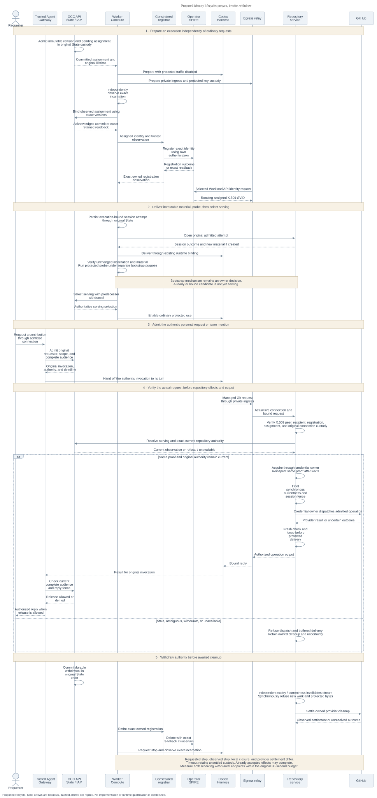

# Agent identity architecture

[Overview](../basic-agent-identity-mvp.md) · [Interfaces](interfaces.md) · [Delivery](delivery.md)

The proposed architecture connects an admitted execution to each protected
request. Preparing that execution is a deployment lifecycle. Authorizing an
ordinary invocation is a separate lifecycle, repeated for each human request.
Both meet at the receiver before a credential or upstream operation is created.

## Components and dependencies

OpenClaw Control Plane (OCC) and State retain the Agent and its immutable revision.
The existing Namespace-scoped Agent ServicePrincipal identifies the Agent across
revisions. Selected IAM resolves that identity and decides exact resource
permissions. This proposal extends actual admission and identity lookup rather
than adding another principal kind.

State and Compute own execution assignment and observation. An assignment names
the execution expected to serve one Agent component. An incarnation identifies
the actual workload instance Compute observed. Readiness reports whether a
prepared workload is ready. Current-serving selection is the separate
authoritative choice permitting ordinary protected use.

The initial issuer is operator-managed SPIRE. A constrained, separately
authenticated registrar registers only the assigned identity. SPIRE delivers
rotating X.509-SVIDs through the selected Workload API profile. Those identities
authenticate workloads but do not grant repository or model permissions.

Compute prepares one egress-owned trusted Go service per execution assignment.
Egress owns private ingress, the accepting listener, and its authenticated bridge
to the existing verifier and operation owners. Identity owns verification and
currentness. The credential owner retains acquisition, exchange, injection,
renewal, and settlement. These responsibilities do not imply a new service for
every interface.

The [main owner contracts](interfaces.md#execution-and-registration),
[verification supplier](interfaces.md#verified-workload-evidence), and
[repository supplier](interfaces.md#repository-session-binding) are separate
source inputs. Genuine registration, current-serving resolution, Agent admission,
and receiving producers still have to connect them. An unconditional unavailable
resolver is safe refusal, but cannot complete the selected consumer.

## Assignment and serving

At most one execution generation may serve each Agent component. Preparation
must follow this order:

1. Allocate a pending execution from the admitted immutable revision through the
   existing State lifecycle. Compute prepares and independently observes the actual
   Harness and relay while protected traffic is disabled. State binds that observed
   incarnation. Pod UID, container incarnation, restart discrimination, and runtime
   selectors remain Compute-adapter facts.
2. The registrar creates the exact assigned identity using the operator's trust
   domain and parent, with selectors derived from trusted observation. Preserve the
   original create identity and exact registration cleanup ownership. Resolve an
   uncertain create by readback before proceeding.
3. Persist an immutable execution-bound repository attempt before opening and
   recording its session. Recover or read back that same attempt when necessary.
   Deliver material through `RepositoryCredentialRuntimeBinding` to the actual
   Harness. Open, status, and recovery must retain identical execution expectations.
4. Verify that delivery left the observed incarnation and material unchanged.
   Exercise the actual managed Git/`gh` shim and PATH route. Material changes can
   restart workloads, so reversing worker calls alone cannot establish this order.
   An open session cannot be rebound, and temporary compatibility is forbidden.
5. Run the real protected authentication probe under a separately admitted
   bootstrap purpose. The purpose and material-before-serving mechanism remain
   [owner decisions](interfaces.md#observations-and-owner-decisions). Probe success
   and readiness do not select the serving execution.
6. State and Compute serialize authoritative current-serving selection with
   predecessor withdrawal before enabling ordinary protected use. Resolve from
   current State selection, the bound incarnation, fresh Compute and registration
   evidence, the admitted profile, the original deadline, and current IAM.

A relevant restart or replacement requires fresh execution evidence. Replacement
closes the previous attempt and admits a new one. Retirement is terminal for that
generation, even if its certificate has not expired. Dedicated delivery must join
actual Harness readiness, generation replacement, and retirement before the full
composition can qualify.

## Request lifecycle

This proposed repository-operation example excludes the separately required
[protected model and probe qualification](delivery.md#complete-contribution).
Time flows downward, solid arrows are requests, and dashed arrows are replies.
Mirrored actors mark the same boundaries at the bottom.
[Editable Mermaid source](request-lifecycle.mmd).

An authenticated personal request or authorized team mention supplies an admitted
connection and complete response audience through the [RBAC proposal](https://github.com/openclaw/openclaw-enterprise/pull/245).
Its `AgentAuthorityContext` and `AgentInvocation` retain the original grant,
connection, exact scope, audience, authority generation, and absolute deadline.
The actual Harness turn must remain authentically associated with that invocation.
Shared execution, session bearers, and caller-provided invocation IDs cannot
identify its requester.

The Harness uses the relay's independently enforced private ingress. The receiver
must consume [verified workload evidence](interfaces.md#verified-workload-evidence)
from that exact request and live connection. Before repository acquisition or
dispatch, it independently checks current identity and
[exact operation authority](interfaces.md#currentness-and-expiry).

The receiver must apply the [post-wait and final synchronous fences](interfaces.md#currentness-and-expiry)
before effects or authority-sensitive delivery.
Results may leave only for the currently authorized complete audience. Ambiguous
request association denies dispatch and delivery. Durable dispatch and reply
fences survive audit erasure, and an unknown start or send never authorizes replay.
Per-invocation cancellation, or the existing exact-revision containment fallback,
must preserve those boundaries.

## Availability and tradeoffs

The [repository supplier](https://github.com/openclaw/openclaw-enterprise/blob/eb52cc4cfe68f08017e7ece6585fe7e937e0747a/docs/reference/repository-credentials.md#L1-L24)
is a separate unmerged dependency. Its bundled path supports embedded OpenClaw
with bearer sessions. It does not establish the proposed dedicated execution
binding or installed protected identity.

| Selection                                                                     | Required behavior                                                                                                              |
| ----------------------------------------------------------------------------- | ------------------------------------------------------------------------------------------------------------------------------ |
| Omitted Installation configuration                                            | Retain compatibility, existing tool authentication, IAM, and repository-session checks. Claim no verified-execution assurance. |
| Operator-selected enforcement                                                 | Pin the selection in the admitted revision and operation/session. Require supported binding and genuine evidence producers.    |
| Missing or stale evidence, unsupported enforcement, or unavailable dependency | Deny protected use. Request inputs and outages cannot downgrade the selection.                                                 |

Profile changes require fresh revision admission. **Proposed transition policy,
owner decision pending:** separate prospective default changes from explicit,
audited withdrawal when a minimum strengthens. Installation/product and admission
owners must select finite supported combinations, affected revisions and sessions,
renewal eligibility, the effective event, and the unavailable result. No grace
period or automatic continuation is accepted. Stronger claims require fresh
admission.

Operator-managed SPIRE narrows initial packaging work while preserving the same
consumer contract for later OCE management. An optional embedded repository
checkpoint can establish a useful real consumer earlier. It cannot waive the
dedicated Codex, separate Gateway, qualified gVisor, or protected model outcome.

## Withdrawal and recovery

Admission and renewal participate in the original READ COMMITTED State
transaction. Acquire locks in this order: Installation, sorted account/session
guards, the complete IAM policy barrier and head, assignment/resource/withdrawal
rows, then audit. Preserve policy-writer and account-currentness ordering. Never
upgrade policy locks after resource locks. The [RBAC transaction owner](https://github.com/openclaw/openclaw-enterprise/pull/245)
defines the common protocol.

Register protected admission and durable withdrawal intent before COMMIT. Release
committed authority only after acknowledged COMMIT or exact authorized retained
receipt/readback. External SPIRE and provider effects remain outside that database
transaction. Extend the existing owners without a parallel IAM, account,
invocation, authority-lease, credential, or audit store.

Retain original create-effect and operation identities and exact version checks
across retries. Uncertain assignment COMMIT requires exact readback. Uncertain
registration create or delete also requires exact readback, never a duplicate
create or deletion of an unrelated registration. Recovery does not invent a new
deadline or revive retired authority.

Invalidate receiving authority synchronously before awaited cleanup. Idempotent
close joins owned I/O and provider settlement, including completion after a
bounded response has timed out. The owner retains unsettled custody and capacity
until actual settlement. Registrar, Gateway, and cleanup authenticate using their
own enrolled identities. Separately authorized preparation and exact cleanup need
no live SVID from the target Agent.

Requested stop, observed stop, registration retirement, connection closure,
session closure, provider cleanup, and uncertain upstream effects are different
outcomes. Delete acknowledgment, a missing Pod, timeout, or unreachable node cannot
prove physical termination. Report unavailable or termination-unverified until
the exact bound incarnation is observed stopped. Already accepted upstream work
may complete after local closure. [Security limits](security.md#accepted-limits-and-closure)
and [delivery evidence](delivery.md#acceptance-evidence) retain the resulting gaps.
