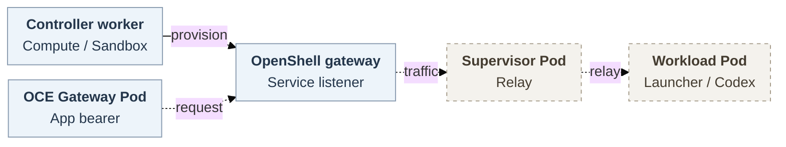

# OpenShell Kubernetes identity and transport

## Problem and proposal

An operator needs a dedicated Codex Agent with approved credentials, workload identity and mounts, private access through the OpenClaw Enterprise (OCE) Gateway, and useful model/GitHub work. Today, OCE rejects the app-server Secret reference and OpenShell clears the child environment. Pod projection alone cannot supply Codex.

Select **exposed-service bearer passthrough** from [OpenShell PR #3796](https://github.com/NVIDIA/OpenShell/pull/3796). The service listener forwards the application credential; Codex authenticates it. Extend approved projection and child delivery, then connect the returned endpoint to OCE's Gateway. This supersedes the earlier direct-route-first recommendation. **The RFC remains a team proposal:** implementation, architecture, access, Kubernetes and security holds remain; transport selection accepts no risk.

Dashed joins are proposed; solid provisioning describes source, not installed support.

## Scope and deliverables

A WebSocket exchange is only a checkpoint toward [issue #78](https://github.com/openclaw/openclaw-enterprise/issues/78). Planned [issue #118](https://github.com/openclaw/openclaw-enterprise/issues/118) first requires a model operation, known-ref fetch and `gh repo view`, with independent object/repository verification. The selected journey also includes clone, edit, commit and push, preferably a PR. A write profile must push a test ref and independently verify its commit. Read-only proof completes neither this journey nor the later protected target for both dedicated OpenClaw and Codex Harnesses.

Initial registration permits plaintext in trusted components; the Agent receives a model placeholder and scoped repository bearer, never provider keys. This weaker boundary does not meet the later protected target's no-plaintext, per-request authority and active-traffic closure requirements. [Supporting duties and open decisions](openshell-kubernetes-identity-and-transport/contract.md#material-owner-decisions) retain their owners.

## Projection contract

The OpenClaw Control Plane admits immutable revisions. Compute and Sandbox are libraries in its controller worker. Compute owns lifecycle, transport Secrets and Gateway configuration; the Backend supplies authenticated OpenShell control. OpenShell's Kubernetes Driver provisions separate supervisor and workload Pods. Kubelet resolves approved references; the launcher delivers values to named children. OCE's Gateway runs in another Pod. Its requests cross the trusted listener and supervisor relay to Codex. These relays receive the application bearer, which does not establish original-request authority.

### Identity, mounts and integrity

The [implementer reference](openshell-kubernetes-identity-and-transport/contract.md#identity-mounts-and-integrity) specifies resource authorization, identity expiry, mount modes and currentness checks.

### Child delivery and node bootstrap

The [child-delivery contract](openshell-kubernetes-identity-and-transport/contract.md#child-delivery-and-node-bootstrap) preserves startup/later-exec recipients and conditional initialization.

## Transport options

**C — passthrough is selected.** Local preparation may use the unmerged pin; dependent integration landing requires upstream merge, accepted-version readback and qualification. Explicitly request and verify effective mode: omission strips Authorization. Control-plane login, listener TLS/client certificates and Codex authentication remain distinct. [A and B](openshell-kubernetes-identity-and-transport/contract.md#unselected-alternatives) remain qualified alternatives, with no fallback or borrowed defaults.

## Lifecycle

The [lifecycle diagram](openshell-kubernetes-identity-and-transport/request-lifecycle.svg) ([editable source](openshell-kubernetes-identity-and-transport/request-lifecycle.mmd)) expands this proposed sequence:

1. The operator configures paired Kubernetes Compute/OpenShell Backend/Sandbox, workspace, authorized resources, immutable images/configuration, credential suppliers and listener/network trust. With exact-Agent deployment and required Configuration/source permissions, the actor calls [`deployAgent`](https://github.com/openclaw/openclaw-enterprise/blob/0c1e0e4324309cb1903175f718b97c8e34dddb1b/packages/contracts/src/api/routes.ts#L1187-L1200), `POST /namespaces/:namespaceId/agents/:agentId/deploy`, on the saved draft. Its `202` admits a revision, not a running Agent.
2. Worker dispatch rechecks original actor/Agent authority through State, Work and IAM. It calls `Compute.prepareRevision` and `SandboxDriver.provisionHarness`, binding Namespace, workspace, Sandbox, Agent and revision. Unsupported projection prevents activation. Approved resources and named recipients must precede startup.
3. Sandbox/Compute verify mode, authorized endpoint and applicable authenticated revision/Pod/startup status before Gateway activation. Check host, port, scheme and TLS identity before releasing the matching startup-derived bearer. Codex must refuse missing/wrong credentials before initialization.
4. Read `getAgentDeployment`; supported `getAgentDeploymentRuntime` diagnostics need separate operate permission. Observe genuine WebSocket upgrade, two-way frames and mediated results separately from status. On stop/replacement, lifecycle owners withdraw access and verify established-stream closure. Reconnect requires current exact-revision authority.

### Loss and recovery

Lost create replies can leave a remote Sandbox without an endpoint receipt; lost application replies leave unknown effects. Correlations/PVC data may survive while endpoint, startup/socket knowledge and results are lost. Restart with authoritative records differs from replacement without them. The original operation/effect owner reconciles the same attempt from authoritative identity and currentness evidence. Correlations, URL readback or surviving files authorize no automatic replay, compensation or delete/recreate. State atomicity covers resource/audit/work persistence, not external effects. Withdrawal records do not prove stream closure; owners must choose finite renewal/cancellation/closure bounds.

## Implementation and verification

### Implementation

OpenShell isolation/launcher and OCE identity owners must approve the workload-capability exception, projection and recipients. Contracts/Sandbox/Compute/Gateway owners then extend protocol mapping and endpoint/status consumption. Bootstrap owners close required initialization; the user and repository/runtime owners choose typed projection versus authenticated post-start material transfer. Genuine image/configuration and credential suppliers remain prerequisites. No substitute issuer or service is proposed. [Implementation duties](openshell-kubernetes-identity-and-transport/contract.md#implementation-and-qualification) retain excluded shortcuts and required reference updates.

### Verification

Use ordinary deployment to prove useful work and meaningful refusal. Installed Kubernetes/OpenShell/Codex must prove intended recipients, identity rotation, mounts, TLS, sibling isolation, additive network-policy bypass denial, closure and unknown-result recovery. Real model/GitHub results need independent verification. The [acceptance detail](openshell-kubernetes-identity-and-transport/contract.md#required-observations) distinguishes contract, composed, installed and provider evidence.

### Evidence and status

Pinned main has credential attachment/status handling and peer-change Gateway respawn; projection and endpoint composition remain incomplete. September 30 upstream Docker and v1alpha1 E2E failed; v1beta1 smoke passed. [Exact pins and historical observations](openshell-kubernetes-identity-and-transport/contract.md#evidence-and-status) establish no installed OCE or release proof. Upstream Codex WebSocket remains experimental and unsupported in production.

## References

The [implementer contract](openshell-kubernetes-identity-and-transport/contract.md) owns complete interfaces, bounds, recovery qualifications and historical source links; this overview owns the decision and essential flow.
