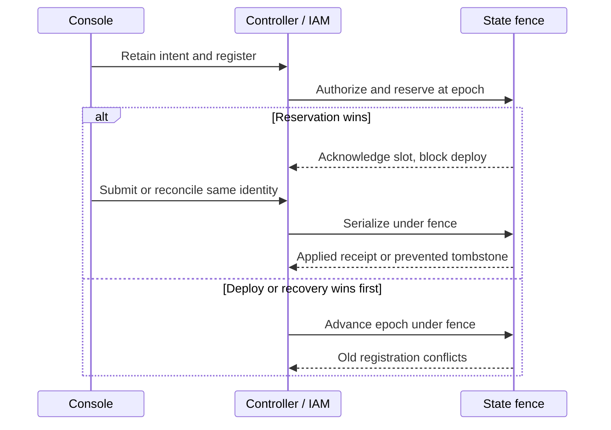

# Proposed Console mutation settlement

## Problem and Decision

A lost response to a plugin save or access change leaves the operator unable to tell whether the change happened. Reading the current object cannot rule out a request still delayed before admission or database commit. Repeating the action can create another effect. Deployment can also admit a draft different from the one the operator reviewed.

This RFC proposes durable registration and settlement for the selected Console mutations, plus a separate reviewed-draft check at deploy. It is a proposal for review, not an accepted or installed protocol. An authorized operator can resolve uncertainty before continuing and deploy the reviewed draft.

_Proposed lifecycle. All paths require implementation and qualification._ [Editable diagram](proposed-console-mutation-settlement/request-lifecycle.mmd) · [Rendered diagram](proposed-console-mutation-settlement/request-lifecycle.svg)

## Scope

The selected journey covers plugin-only Agent saves in [PR 434](https://github.com/openclaw/openclaw-enterprise/pull/434), and sharing and Secret-access Role and binding changes in [PR 384](https://github.com/openclaw/openclaw-enterprise/pull/384). A Role, binding, Agent, Configuration, authentication change or discovery grant may already have succeeded when a later step fails. The Console must retain each outcome separately. Removing one binding does not prove that all access has gone.

General Console mutations and external Configuration, Slack Secret and provider effects are outside this State receipt. An uncertain external step remains visible and blocked under its own owner. A plugin-first cut is a checkpoint, not completion of the selected sharing journey.

## How It Works

With a supported controller, State and IAM composition and current resource permissions, the operator opens Plugins or Sharing. Before sending, Console stores a nonsecret operation identity and exact intent under the current account. It registers that intent against the target's server epoch. Only an acknowledged reservation permits the selected mutation to be sent. State commits the effect, audit and terminal receipt together. If the reply is lost, Console reconciles the same identity and keeps conflicting actions blocked until a terminal result is known.

The browser holds recovery material, not authority. Existing controller HTTP handlers call OpenClaw Control Plane (OCC) and IAM libraries in the same process. IAM checks current authority and State owns the transaction and durable fence. External Drivers keep their own effects. No new service is proposed.

A reservation that wins first blocks same-target deployment. A deploy or authorized recovery that wins first advances the epoch, so an older delayed registration cannot enter. A timeout, empty lookup, denial or uncertain commit is not a terminal result. After storage loss, authorized recovery discovers unacknowledged outcomes and pending operations. Epoch advancement fences unseen delayed registration. The server blocks equivalent successors until terminal acknowledgment. Without current authority or retained knowledge, the affected action remains unavailable.

The [contract](proposed-console-mutation-settlement/contract.md) defines operation identity, both race orders, authorization, partial results, retention and the independent deploy comparison.

## Delivery and Decisions

State and IAM owners first provide the shared transaction and authority fences, including supported adapters and a safe cutover for old in-flight writers. Controller and Console owners then adopt plugin save and guarded deploy, followed by every selected sharing and Secret-access caller. The implementation must preserve current routes and their documented behavior where supported.

Session validity at physical PostgreSQL COMMIT is required. Its enforcement and feasibility remain unresolved, so the feature stays unavailable until the guarantee is demonstrably enforceable. A proposed relaxation requires explicit human product authority. Recovery after permanent loss of the initiating principal's authority and the exact managed-grant equivalence also require owner decisions.

## Verification

Acceptance requires real controller and PostgreSQL races, limited-role privileges, negative controls and browser recovery across tabs, reload and storage loss. Guarded deploy must reject changes to reviewed fields, including repository bindings, before credential admission and snapshot. The [acceptance matrix](proposed-console-mutation-settlement/contract.md#acceptance) specifies the required evidence.

Existing component fixtures and unmerged source are narrower than composed PostgreSQL or live-provider proof. Independent review, CI, installed behavior, human acceptance and publication are separate gates. This document claims none of them.

## References

[Console plugin proposal](27-console-agent-plugins.md) is planning history. [Harness auth binding](30-harness-auth-binding.md) retains its proposed header alongside later delivery and activation records, so status must be read per capability. [Provider Driver abstraction](17-provider-driver-abstraction.md) describes Driver boundaries and qualification. The current State and IAM interfaces and the unmerged supplier changes inform this proposal without accepting a Console settlement API. [PR 374](https://github.com/openclaw/openclaw-enterprise/pull/374) is an analogy, not an accepted Console contract.
