# Egress Proxy and credential lifecycle

- **ID:** RFC-0019
- **Created:** 2026-10-06
- **Updated:** 2026-10-08
- **RFC PR:** [#1530](https://github.com/openclaw/openclaw-enterprise/pull/1530)

## Problem and proposal

Agents need to use providers such as GitHub and inference services without
managing their credentials. GitHub App tokens need preparation and renewal;
static inference credentials need to follow Secret changes. Trusted discovery
and repository setup may also need provider access before an Agent runs.

Today, the [static credential source workflow](../../../docs/reference/credential-sources.md#update-a-source)
copies a value into the gateway. Replacing it requires a source update and
redeployment for running Agents to use the replacement.

This RFC proposes a trusted sender that mediates Agent egress, checks current
authority and injects provider material outside the Agent. A shared resolver
selects static material or a warm dynamic token. A lifecycle owner prepares
dynamic tokens in the background. Admission of a static Secret reference
authorizes continuing reads, so a later value change needs no source update or
Agent redeployment. The design supports multiple backends and deployment
profiles; it is proposed, not implemented or qualified.

## Architecture

An owner configures a source and grants an Agent permission to use it. The
OpenClaw Control Plane (OCC) admits the configuration. A trusted sender mediates
each operation, including egress that needs no credential.

_Proposed request; dashed arrows are interactions. OCC checks before resolution
and again before send. The proxy is the trusted sender and protects responses.
[Editable diagram](assets/overview.mmd); [lifecycle](lifecycle.md);
[security model](security.md)._

| Logical role                    | Responsibility                                                                    |
| ------------------------------- | --------------------------------------------------------------------------------- |
| OCC                             | Admit sources, bindings, routes and grants; decide current authority.             |
| Egress Proxy / trusted sender   | Capture, authorize and forward operations; inject material and protect responses. |
| Credential Resolver             | Select static material or a scoped warm token for an admitted use.                |
| Secret Driver                   | Read referenced static values and lifecycle inputs.                               |
| Token Service / lifecycle owner | Prepare, renew and recover each dynamic credential family.                        |
| Provider issuer                 | Obtain provider-specific material and validate its scope and expiry.              |

These are logical responsibilities, not required processes. One OpenShell
adapter could implement several roles. Each credential family has one lifecycle
owner; an issuer hook must not create a second refresh loop. Custody can be
OCE-managed or delegated, subject to source policy and qualified implementation
capabilities. The Egress Proxy Driver configures and observes enforcement; the
Credential Gateway Driver registers sources and attaches revisions. The Agent's
OpenClaw Gateway is separate.

_Dashed interactions connect logical roles, which may share one OpenShell adapter.
OpenShell may own the background loop with an OCE issuer hook. Bootstrap and
discovery are separate authenticated trusted callers outside the Agent proxy.
[Editable diagram](assets/credential-architecture.mmd)._

## GitHub and inference

An Agent works on a repository and calls an inference provider. Its owner grants
access through two sources:

|           | GitHub App                                                                                                   | Static inference                                                                 |
| --------- | ------------------------------------------------------------------------------------------------------------ | -------------------------------------------------------------------------------- |
| Configure | OCC admits the repository, source and repository-scoped grant.                                               | OCC admits a source referencing the provider Secret and grants its use.          |
| Prepare   | The issuer exchanges an App JWT for a scoped installation token in the background.                           | The Secret Driver reads the admitted reference and can adopt later values.       |
| Use       | Trusted bootstrap clones the optional repository; the running Agent later makes GitHub requests.             | The running Agent makes inference requests; the sender injects the credential.   |
| Result    | A successful clone gates startup by default. A cold token returns `NotReady`; the request does not mint one. | The provider receives the credential; the Agent receives the permitted response. |

A required credential has a bounded warm wait. An optional clone-gate opt-out
does not waive authorization. Compute and bootstrap own partial-workspace
cleanup. [Repository preparation](lifecycle.md#2-prepare-the-optional-repository)
and [Secret cutover](lifecycle.md#live-secret-cutover) describe the details.

## One request

The same proposed path applies to a GitHub request, an inference request or
other supported egress:

1. **Capture.** The sender authenticates the caller and selects the admitted
   route and grant for the operation.
2. **Authorize.** OCC checks current authority before material access.
3. **Resolve.** If needed, the resolver selects material for this use. A handle
   is not permission to send.
4. **Check again.** After preparation, OCC checks the actual immutable operation
   and selected material identity and version, or the absence of material.
5. **Send.** The sender rechecks usability, injects any material, sends once and
   applies provider-specific response policy.

A redirect, retry or new operation repeats the checks and any needed resolution.
Unavailable authority or resolution refuses use. The [security model](security.md#authorize-each-operation)
specifies the check inputs, response rules and accepted check-to-send race.

## Interfaces

### Configuration and authorization

A binding associates an Agent with a source and an approved grant. A source
references a backend and provider; a route governs the operation's destination.
OCC admits their identities and generations. A provider adapter classifies the
operation against the normalized grant; a request cannot choose a different
source or backend or widen that grant. A shared source still requires each
Agent's permission. Static inference uses `credentialSources` and `harnessAuth`
in the existing configuration.

Trusted composition uses the admitted binding and source to select the
Backend/provider implementation that reads static material or serves a warm
dynamic token. For example, two GitHub bindings can share a source but have
different repository grants; each resolves material eligible for its own
normalized grant. The authenticated operation and admitted grant supply the
request context; the request does not choose a Driver to load. This relationship
is conceptual, not a proposed configuration schema.

An Agent's stable Namespace-scoped ServicePrincipal is distinct from the bearer
for a particular execution. Bootstrap and discovery have separate, limited
authority. See [callers and trust boundaries](security.md#callers-and-trust-boundaries).

**Open:** execution identity issuance and lifetime, bootstrap delegation,
discovery identity and transport, and the relationship between external
authorization and native IAM.

### Egress Proxy

The conceptual trusted operation `egress.forRequest(request).forward(bindingRef)`
owns capture through response handling. It is an example, not a wire API or an
Agent credential-reading interface. Credential-free forwarding uses an admitted
route and grant. The [security model](security.md#authorize-each-operation) defines
what each check binds and [response handling](security.md#protect-responses)
defines when to pass, redact or refuse.

### Credential Resolver

For an admitted binding and authenticated operation, the resolver returns a
use-bound, single-use handle to trusted code, or `Denied`, `NotReady` or
`Unavailable`. It serves static and dynamic material through one contract.
Warm-token reuse is scoped; each credentialed operation resolves again. The
proxy has no reusable dynamic-token cache or fallback. [Resolution and custody](security.md#resolution-and-custody)
defines the boundaries.

**Open:** the wire schema and how material identity, version and expiry evidence
are represented and verified.

### Secret Driver and token lifecycle

The Secret Driver reads admitted references and inputs; it does not thereby own
refresh. Static values follow the [live Secret cutover](lifecycle.md#live-secret-cutover)
freshness and failure rules. Dynamic credentials are prepared in the background;
cold or expired reads return `NotReady` without issuing or scheduling work.
[Lifecycle](lifecycle.md#1-configure-and-warm)
defines freshness, failure and recovery.

OpenShell should schedule rotation it supports. An
[OAuth-shaped issuer bridge](lifecycle.md#github-issuer-bridge) is the preferred
GitHub investigation; an OCE-owned warm lifecycle is another option. The GitHub
owner and hook protocol remain **open**; the bridge is not claimed to exist.

## Delivery scope

The **Egress Proxy MVP** may precede rotating OAuth but must qualify its declared
provider slice. **OCE 1.0** requires static inference, GitHub repository
preparation, Codex OAuth and custom dynamic paths, including safe rotating-input
concurrency, restart and recovery. Earlier slices supporting rotating inputs must
meet those same safety requirements.

Minimal CI and local fast mode may use fixtures and no-op egress; they do not
prove enforcement or injection. Compose can exercise a production-style adapter
and must report its actual capabilities. Hardened deployments require qualified
enforcement, identity, protocol support and custody, without silent no-op
fallback. Profile capabilities must be checked at startup and Agent admission.
Owners need provisioning and credential-failure status; operators need refresh
and expiry visibility. Alert channels and thresholds remain open.

[#1691](https://github.com/openclaw/openclaw-enterprise/pull/1691) proposes a
complementary refresh composition, not this whole request path. This RFC
retains requirements from [PR #924](https://github.com/openclaw/openclaw-enterprise/pull/924)
with a different lifecycle model. [Implementation and qualification](lifecycle.md#implementation-discovery-and-qualification)
identifies remaining work, including DNS and the pinned Codex HTTP/SSE path.
Source, fixture, installed-runtime and live-provider evidence support different
claims; none alone proves the proposed composition.

## Appendix: essential guarantees

- **Authority:** Check every operation online before material access and again
  before send. Fail closed without current authority; cached material and
  handles confer no permission. [Authorization](security.md#authorize-each-operation).
- **Custody:** Keep provider material outside Agent workloads and prevent
  bypass, unsafe protocol use and response leaks. [Security model](security.md).
- **Lifecycle:** Fence rotating inputs before use, persist replacements before
  readiness, and reconcile uncertain effects without blind replay. [Recovery](lifecycle.md#4-withdraw-and-recover).
- **Withdrawal:** A final check may race a committed reduction; finite deadlines
  bound the accepted exposure. Confirmed last-owner loss causes a hold and
  parking. [Limits and owner loss](security.md#withdrawal-and-owner-loss).
- **Proof:** Qualify the actual enforcement and provider paths; no-op egress and
  deployment acceptance do not establish readiness. [Required validation](security.md#required-validation).
