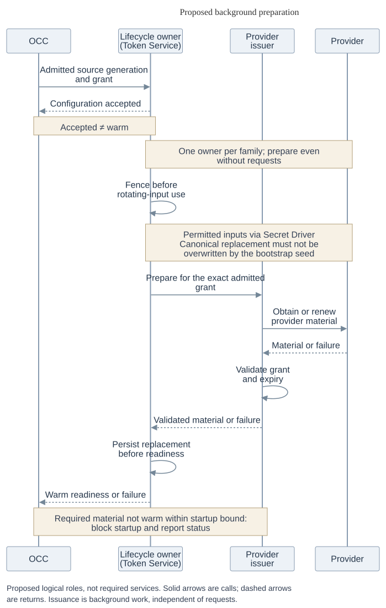
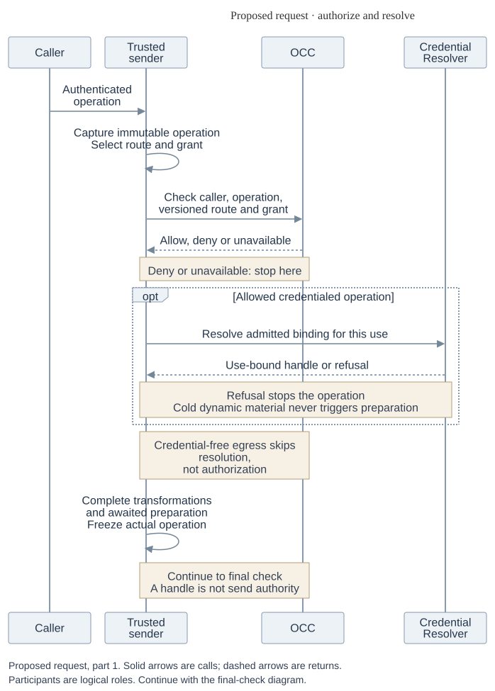
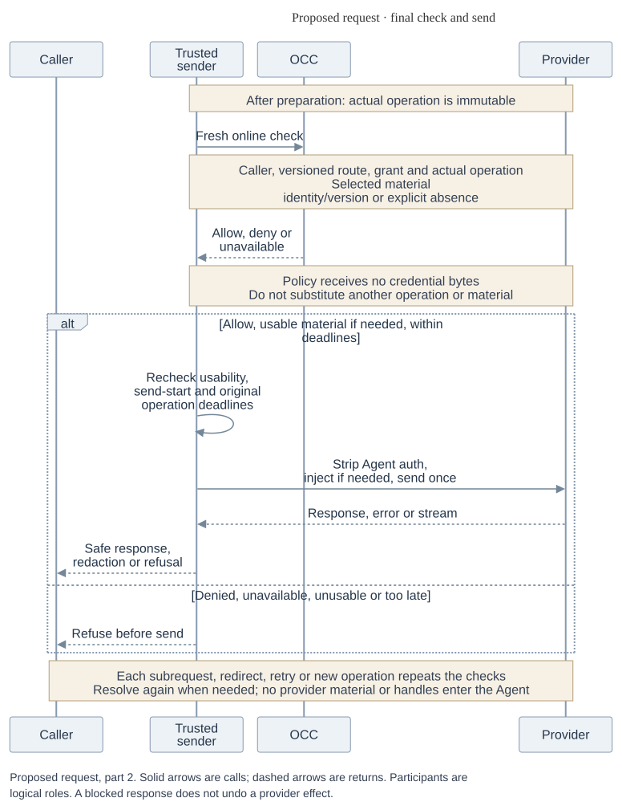
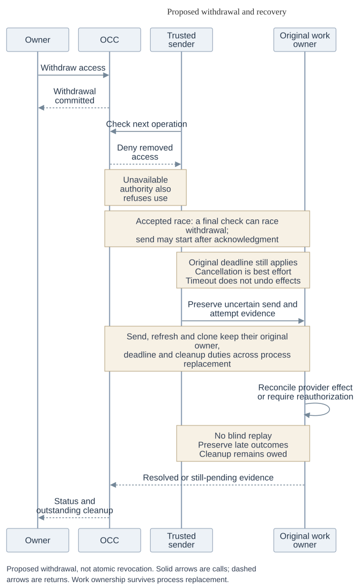

# Proposed credential lifecycle

These phases expand the [RFC](index.md). They describe proposed responsibilities, not selected wire APIs, required physical processes or qualified runtime behavior.

## 1. Configure and warm

_Proposed background preparation. Participants are logical roles; solid arrows
are calls and dashed arrows are returns. [Editable source](assets/configuration-warmup.mmd)._

An authorized owner configures sources and bindings. OCC admits routes and normalized grants, then supplies the dynamic configuration to its lifecycle owner. The owner prepares credentials in the background, even without requests, and reports readiness or failure. Accepted configuration is not warm readiness. A required credential that does not become warm within the configured bound blocks startup and reports status.

The Secret Driver can read a static value or an issuer's signing or refresh input; this does not make the reader a second lifecycle owner. A rotating family has one fenced refresher before input consumption and durable replacement state before readiness. Once replacement input is canonical, rereading a bootstrap Secret must not overwrite it. Renewal preserves admitted authority; the issuer validates returned scope and expiry against the exact grant.

### Live Secret cutover

Static live adoption is selected. Today the [credential-source workflow](../../../docs/reference/credential-sources.md#update-a-source) copies a value on source update; running Agents need redeployment to use its replacement. Proposed admission authorizes continuing reads of the chosen reference. Its writer can change material used by admitted consumers without another source update; each operation still needs current authority. Value changes preserve configuration generation. A reference or configuration change needs admission, and a failed change preserves the previous configuration.

The proposed freshness default is 10 minutes per source. Eligible temporary store errors permit stale use only up to four hours **total** since the last trustworthy authoritative observation. Both limits are configurable per source. For a value observed at 09:00, freshness ends at 09:10 and eligible fallback by 13:00. Failed reads and lower-cache hits do not reset age. Typed eligible errors and trustworthy age are required across every serving layer; generic unavailability is insufficient. Cold reads have no stale fallback. Denial, known revocation, missing material, unknown errors or unavailable authority fail closed. Zero cache period disables reusable retention and stale fallback everywhere. Recheck usability at dispatch.

Implementation must map existing attachments and gateway copies to admitted references, define running-revision cutover, expose adoption, and validate replacement attachments before stopping a working Agent. Removal of source-use permission must not prevent accepted cleanup. Cutover mechanics and version/age evidence remain open; existing Agents do not yet use live reads.

## 2. Prepare the optional repository

_Proposed default clone gate; dashed edges show proposed interactions. Bootstrap
uses its own authorized sender. [Editable source](assets/clone-startup.mmd)._

1. The owner and OCC admit the configured repository and grant, including repository IDs and permissions. Repositories remain optional and first-class.
2. The lifecycle owner and provider issuer prepare a GitHub installation token in the background. The issuer signs an App JWT and exchanges it for the token; it validates returned authority against the exact normalized grant, including provider-required baseline permissions, and checks expiry. The private key, App JWT and installation token have distinct roles. Required material must warm within the startup bound.
3. Trusted bootstrap receives authenticated delegation limited to the execution and configured repository. Every clone operation uses authorized egress. This caller need not traverse the Agent's own proxy.
4. Compute starts the Agent after observed successful preparation. Failed or uncertain clone blocks startup by default; a custom opt-out changes the gate, not authorization. Compute/bootstrap owns partial-workspace cleanup and must not blindly replay an uncertain clone.

Delegation and proof of completion remain open interfaces. Repo Driver duties for discovery, profiles, grants, sessions, deadlines and cleanup remain with their current owners until explicitly reassigned. Revision selection and setup are later work. Agent owners need provisioning and credential failure status and notice when use is threatened; platform operators need refresh-failure and approaching-expiry visibility. Alert channels and thresholds remain open.

### GitHub issuer bridge

The preferred investigation keeps OpenShell as the background scheduler and
uses an OCE endpoint as the GitHub issuer. OpenShell's client-credentials path
can call a configured token endpoint. The proposed endpoint would authenticate
that caller, map it to the admitted source generation and GitHub grant, sign an
App JWT with the private key, and exchange it for an installation token. It
would validate the returned scope and expiry against the grant and return an
OAuth-shaped result. The hook supplies issuance; it is not another refresh loop.

Authenticated grant mapping and material identity, version and expiry evidence
need integration work. The inspected OpenShell OAuth response handling uses a
token and relative expiry; it does not preserve returned scope, material version
or absolute expiry. The bridge must return a conservative positive lifetime
within provider validity; a configured expiry fallback is not provider-expiry
evidence. Configuring an endpoint alone therefore does not establish a
conforming warm-only resolver. The bridge and its protocol are not implemented
by this proposal; an OCE-owned warm lifecycle remains an alternative. The final
lifecycle owner remains open.

## 3. Resolve and forward

_Proposed request path, including credential-free egress. Participants are logical
roles; solid arrows are calls and dashed arrows are returns.
[Editable source](assets/request-caching.mmd)._

_Continuation of the same proposed request: check the prepared operation before
send, then protect the response. [Editable source](assets/request-forwarding.mmd)._

_Proposed resolution detail; dashed edges show proposed interactions. Static
freshness and failure limits remain in [live Secret cutover](#live-secret-cutover).
[Editable source](assets/credential-selection.mmd)._

The resolver selects static or warm dynamic material for each credentialed
operation. A cold or expired dynamic read returns `NotReady` without issuing,
refreshing or scheduling. An issuer outage can coexist with an eligible warm
token; resolver failure denies use. [Authorization and custody](security.md#authorize-each-operation)
define the checks, scoped reuse, discovery and response handling.

## 4. Withdraw and recover

_Proposed withdrawal with the accepted check-to-send race. Solid arrows are calls
and dashed arrows are returns; work ownership survives process replacement.
[Editable source](assets/revocation-recovery.mmd)._

A check observing a committed withdrawal denies removed access, subject to
the [accepted race and deadlines](security.md#withdrawal-and-owner-loss).

On a warm-token rejection, return failure without automatic retry. Authenticated feedback identifies source configuration, grant and token version; provider-specific classification distinguishes credential rejection from other failures. The lifecycle owner refreshes or marks the source unhealthy in the background. A late rejection of version N cannot invalidate N+1.

Fence competing refreshers **before** consuming rotating input, and persist replacement input before reporting readiness. A timeout, process exit or generic family status does not settle an uncertain provider effect. Reconcile it with the provider or require reauthorization; do not blindly replay a send, refresh or clone. Preserve the original owner, deadline, nonsecret attempt evidence and cleanup duties after process replacement, including late outcomes; cleanup may remain owed after use ends. Restored configuration is not warm readiness.

Ordinary renewal must not require a proxy or Agent restart or periodically interrupt use. Exceptional reauthorization may visibly interrupt the affected credential while retaining fail-closed behavior. Establish replacement visibility and adoption by every serving proxy and settle old-key in-flight use before ordinary retirement; emergency revocation may come first. Planned hot cutover is separate work.

## Parking and forks

The security model defines the [hold and parking requirements](security.md#withdrawal-and-owner-loss)
and the [authorized deep fork](security.md#authorized-forks). External
identity-provider synchronization, copy-on-write and stronger stream revocation
remain separate work.

## Earlier Token Service proposal

[PR #924](https://github.com/openclaw/openclaw-enterprise/pull/924) supplied issuer metadata, normalized grants and scope/expiry validation; distinct issuer and consumer duties; and discovery, uncertainty and cleanup requirements. This RFC retains those requirements with one lifecycle owner; [#1691](https://github.com/openclaw/openclaw-enterprise/pull/1691) describes narrower refresh composition.

Background preparation and warm-only reads replace demand-driven issuance. Central or delegated custody replaces a fixed OCC topology; rotating refresh inputs need durable replacement, not the earlier memory-only restriction. The MVP uses a separate execution bearer, while its issuance, binding, delivery and lifetime remain open; it does not adopt an indefinite Agent bearer. Required readiness and the default clone gate remain in force.

Standalone operation, packaging, specific recovery exceptions, and Git-hook or `pushRefAllowlist` removal remain historical or separate work, not automatically implemented or adopted. The [original design](https://github.com/openclaw/openclaw-enterprise/tree/55e261623e6ba879eab1e2d27daa309d571a994a/specs/rfcs/0056-token-service) remains available for its rationale. Neither proposal is thereby accepted or runtime-qualified.

## Implementation discovery and qualification

These choices guide implementation; they do not weaken the selected contracts or require every wire detail to be decided before bounded work starts.

| Area                       | Open work or required evidence                                                                                                                                                                                                           |
| -------------------------- | ---------------------------------------------------------------------------------------------------------------------------------------------------------------------------------------------------------------------------------------- |
| OpenShell composition      | Place the logical roles and integrate final OCC checks and warm-only resolution. [#1691](https://github.com/openclaw/openclaw-enterprise/pull/1691) describes refresh composition; its same-Backend pairing is specific to that adapter. |
| Secret and dynamic custody | Prove live reads, typed errors and trustworthy nonsecret version/age evidence across serving caches; select durable storage and fencing for rotating families.                                                                           |
| Identity and bootstrap     | Specify execution identity issuance, binding, delivery and lifetime; limited bootstrap delegation; clone completion and cleanup evidence.                                                                                                |
| Provider integration       | Investigate the [GitHub issuer bridge](#github-issuer-bridge); native upstream support is optional. Determine Codex account metadata and reconnect without placing provider credentials in the workload.                                 |
| Operations                 | Select alert channels, expiry margins, deadline values, time protocol and transport enforcement. DNS needs its own design.                                                                                                               |

Inspected OpenShell [middleware](https://github.com/NVIDIA/OpenShell/blob/021400be8af471f8669369e679de3e18cf0bd672/crates/openshell-supervisor-network/src/l7/relay.rs#L1981-L2124) precedes credential preparation, and a [token-grant miss](https://github.com/NVIDIA/OpenShell/blob/021400be8af471f8669369e679de3e18cf0bd672/crates/openshell-supervisor-network/src/token_grant.rs#L247-L286) can issue a token. These source paths do not establish a final online OCC check or warm-only read. Its [refresh implementation](https://github.com/NVIDIA/OpenShell/blob/021400be8af471f8669369e679de3e18cf0bd672/crates/openshell-server/src/provider_refresh.rs#L914-L1018) performs issuance before its generation comparison; that comparison alone does not fence rotating input before consumption. Qualification must prove the proposed composition rather than infer it from these components.

[#1559](https://github.com/openclaw/openclaw-enterprise/pull/1559) proposes an optional warm-token discovery receiver; it is not a qualified supplier. Dedicated Codex normally uses a [Responses WebSocket](../../../docs/reference/harness-execution.md). The [pinned 0.160.0 source](https://github.com/openai/codex/blob/a956835d020762cb2b570053af06f643a11c0ecc/codex-rs/core/src/client.rs#L1918-L1925) supports HTTP/SSE fallback on an initial `426` handshake, but that source branch does not qualify the composed OCE/OpenShell path. Codex remains pinned; discovery, fallback and final checks require connected proof.

A hardened Egress Proxy MVP rollout must qualify its declared initial provider slice with actual enforcement, including isolation, revocation and partitions, protocol bypass, response handling, cache and renewal bounds, bounded startup and uncertain cleanup. OCE 1.0 must qualify the full static inference, GitHub preclone, Codex OAuth and custom dynamic paths, including safe rotating-input concurrency, restart and recovery. Any slice supporting rotating inputs must meet those safety requirements. Source inspection, fixture results, installed runtime and live-provider evidence establish different things; no-op adapters and deployment acceptance establish neither enforcement nor readiness.

Related architecture: [Credential Gateway Driver RFC](../0016-sandbox-credential-injection.md) and [Agent egress RFC](../0017-agent-egress-0x/index.md).
