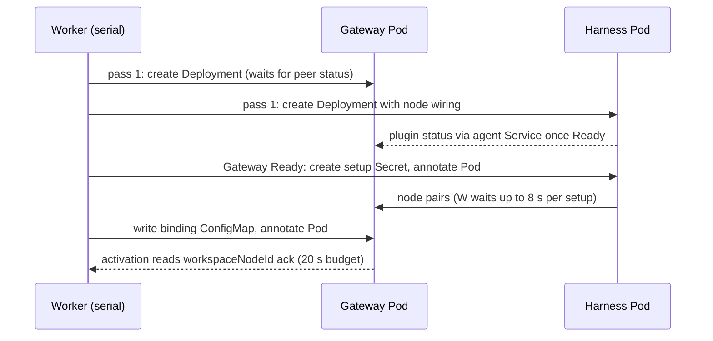

# Proposal: First-deploy activation for dedicated Agents on Kubernetes

- **ID:** RFC-0019
- **Created:** 2026-10-01
- **Last updated:** 2026-10-07
- **RFC PR:** [#855] (retroactive record, not an approval)
- **Related:** superseded plan [Workspace enrollment without a Harness restart](../plans/40-workspace-enrollment-without-harness-restart.md);
  [Harness RWO workspace plan](../plans/38-harness-rwo-workspace-plan.md); current contracts in
  [harness execution](../../docs/reference/harness-execution.md),
  [Kubernetes storage](../../docs/reference/drivers/kubernetes-compute/storage-and-credentials.md) and
  [networking](../../docs/reference/drivers/kubernetes-compute/networking-and-isolation.md);
  open, unlanded proposal on activation evidence: [#458](https://github.com/openclaw/openclaw-enterprise/pull/458).
- **Source baseline:** `main` at `bf67a4317` (first written against `04d01d02e`). Symbols are in
  the driver [`kubernetes/index.ts`][index] or the wrappers [`runtime-entrypoints.ts`][entry] unless named.

## Summary

A first deploy of a dedicated Codex Agent used to start five workloads in series: Harness,
Gateway, Harness again, a Gateway container restart, and the Gateway again. Each start repeated
scheduling, the RWO attach, a recursive chown, login, the model probe and plugin install. Now,
on an install that sets the status-proxy source CIDRs, each workload starts once. Both
Deployments are created in the first pass, the node setup code and node id reach the running
Pods through optional volumes, and the Gateway hot-applies the node instead of being replaced.
This record also covers related predecessor, fail-fast and resource changes. The decision
belongs to the Kubernetes Compute Driver and its runtime entrypoints; the Compute and security
owners review it.

## Motivation

The S1 ratchet test (#588, written against main `7676bc88`) pinned the old first deploy at 5
starts over 3 pending passes. The causes were structural:

1. `prepareWorkspaceNode` could mint a setup code only once the Gateway was ready, and
   `addWorkspaceNode` then changed the Harness template. Kubernetes replaced the Harness.
2. The new Harness had a new `startupId`. The Gateway wrapper's peer poll exited, so the kubelet
   restarted the container.
3. Activation added `OPENCLAW_WORKSPACE_NODE_ID` to the Gateway pod spec, replacing it again.
4. `deferInitialDedicatedGatewayForPluginStatus` created the Gateway only after the Harness
   reported plugin status. The agent Service selected the revision only after Harness readiness,
   and the Gateway's 60 s peer wait exited the process.

Dogfooding measured 99.6-123.7 s for a Codex first deploy that still replaced its Gateway
(D68), and 2.2-5.2 s of pass cadence after both workloads were Ready (D25).

## Non-goals

Embedded Agents keep their single-Pod path, apart from the predecessor repairs below. Native
OpenClaw workers keep the env-based setup code and replace-to-attach. Since [#1400] Compute
provisions a SandboxDriver Harness only after the Gateway is Ready and its setup Secret exists.
Redeploy serving continuity (D67) is not solved; see the open questions.

## Decision as landed

### Workload starts

- **S5, Harness node from the first start ([#616]).** The Codex Harness carries its node wiring
  (state volume, `AGENT_WITH_NODE_ENTRYPOINT` supervisor, CA env) from its first start. The setup
  code arrives as an optional Secret volume at `/run/openclaw-node-setup`, projecting only
  `setupCode` with mode `0440`. After creating the Secret, the controller patches the
  `openclaw.dev/workspace-node-setup` annotation on the running Harness **Pod**, so the kubelet
  refreshes the volume at once (1.3-1.7 s on k3d in #612, 58-84 s without). The supervisor starts
  Codex at once and the node only when the file holds a complete code.
- **S6, node id without a Gateway restart ([#640]).** The Gateway mounts an optional Agent-scoped
  ConfigMap `gateway-<agent>-workspace-node` holding only `{revisionId, deviceId}`. The wrapper
  polls it every second and hot-applies it, changing only `plugins.*` / `cloudWorkers.*`. It
  reports `workspaceNodeId` only after OpenClaw lists `file-transfer` as active in a newer plugin
  registry. Activation waits up to 20 s (`WORKSPACE_NODE_BINDING_ACK_TIMEOUT_MS`); a reported
  cause such as `RELOAD_NOT_CONFIRMED` fails the attempt at once, to be retried. Since [#1128]
  `GATEWAY_UNAUTHORIZED` fails the revision permanently as `AGENT_GATEWAY_UNAUTHORIZED`. Since
  [#877] the 20 s is a budget per revision and node across activation attempts
  (`workspaceNodeBindingAckSpentMs`); once spent, each attempt reads the status once. Since
  [#857] the wrapper asks the running Gateway for `plugins.list` over its Gateway SDK
  connection, not a CLI subprocess.
- **S4b, Gateway alongside the Harness ([#652]).** With no Gateway yet and a Deployment-backed
  Codex Harness (`initialDedicatedCodexGateway`), pass 1 reconciles the revision-scoped agent
  Service, the Agent network policies, the Harness route, the Gateway, then the Harness. The wrapper's
  first peer wait (`waitForPeerPluginRuntimeStatus`) has no deadline and keeps readiness false.
  Redeploys keep the Service on the serving revision until activation.
- **S4a, in-place respawn ([#668]).** On a Harness peer change the wrapper drops readiness and
  respawns OpenClaw (`configureGateway`, `gateway-respawn`) instead of exiting. The 6th respawn
  within 10 minutes falls back to a container restart (`GATEWAY_RESPAWN_LIMIT`). A first deploy
  no longer needs it.
- **Status-proxy CIDR ([#791], D68).** S6 applies only when `gatewayPrivateStatusReachable()`,
  which needs a non-empty `network.pluginStatusProxySourceCidrs`. The dev launcher
  (`internal/occdev/status_proxy_k3d.go`) now writes the k3d API server's `cni0` source as a
  `/32`. Without the list, `usesWorkspaceNodeBinding()` is false: the node id stays in the pod
  spec and activation replaces the Gateway once (Harness 1 + Gateway 2).

The S1 ratchet (listed under References) now pins one Harness and one Gateway template, both
in pass 1, one pending pass, and none after Ready.

### Controller cadence after Ready

[#816]: the pass that delivered the setup, with the Gateway Ready, waits for pairing on one
Gateway connection (`GatewayNodeEnrollment.observeSetup` with `{ waitMs }`, re-reading every
250 ms). When the node pairs, the same pass writes the binding and nudges the Gateway Pod.
Activation still re-checks readiness, the ack and the node connection.

[#821]: the 8 s (`WORKSPACE_NODE_PAIRING_WAIT_MS`) is a budget per setup ID across passes, held in
memory (`workspaceNodePairingSpentMs`, at most 1,024 entries). A node that never pairs costs one
8 s wait per setup, not 8 s on every pass of the single serial worker (D88).

[#892]: both waits also end after at least one read when another Agent's Work could be claimed
(`computeWorkWaiting`, backed by `PostgresWorkQueue.claimableWorkWaiting`). Preparation then ends
pending and activation is retried; unspent time stays in the budgets (D221).

_Implemented flow: first dedicated Codex deploy with status-proxy CIDRs set._

### Supporting changes

- **Volume ownership ([#580]).** Pods with private state set `fsGroupChangePolicy: OnRootMismatch`,
  ending the recursive chown of 10-40 Gi claims on every start.
- **Predecessors.** [#584]: the worker's in-memory `stoppedPredecessors` record stops each
  predecessor of an exclusive revision once, then again after 1, 2, 4… leases; a failed pass or a
  worker restart sweeps again. [#620]: while another revision's Gateway serves, Agent-scoped
  NetworkPolicies select every revision (`anyRevision`), so preparation no longer cuts the serving
  Gateway's ingress. [#698]: an embedded redeploy re-renders a never-served, unready predecessor
  Gateway (D20), and [#752] deletes that older revision's Secret and ConfigMap copies.
- **Fail fast.** [#583]: the worker resolves the revision permanently with
  `RUNTIME_AUTHENTICATION_FAILED` (`processRevision`, recorded by `finalizeRevision`) when
  runtime status reports `AUTHENTICATION_FAILED`, which the
  entrypoints publish only for provider 401/403 or invalid-key rejection, instead of waiting for
  the 900 s deadline. Starved CPU already failed at once; [#871] extends this to every code the
  entrypoints hold until restart (`HELD_RUNTIME_FAILURE_CODES` in `worker.ts`): a probe timeout or
  failure, a failed Codex login and a missing probe or invalid approver configuration each fail
  at once (the last two share `RUNTIME_STARTUP_FAILED`); since [#1070] a failed probe also
  reports a classified cause. Unknown codes still wait for the deadline. [#838]: the OpenClaw
  probe first sends one empty `POST` to the default OpenAI or Anthropic base URL, at the
  configured API's path since [#932] (`/responses`, `/chat/completions` or `/v1/messages`;
  `credentialRejectedUpfront`). Only a 401 fails; anything else runs the full probe. A non-default base URL or unsupported API,
  extra provider or request options, model headers, a model with its own API or base URL, other
  providers and Anthropic setup tokens skip it.
- **Resources.** [#683]: Gateway, Harness and namespace-default CPU limits are `"4"` in the profile
  renderer and production example, requests stay `100m`, and an unquoted quantity names its
  field. [#841]: Gateways request `1280Mi` in the renderer, production example and dev launcher,
  from measured use of 0.8-1.2 GiB (dedicated) and up to 1.64 GiB (embedded). [#866] raised the
  Gateway memory limit from `2Gi` to `3Gi` in all three. Since [#1168] Gateways request
  `1792Mi` and Harnesses `768Mi`, and [#1178] raised the Harness limit to `6Gi`.

## Measured effect

| Measurement                                | Before              | After (main revision)        |
| ------------------------------------------ | ------------------- | ---------------------------- |
| Starts per first Codex deploy (ratchet)    | 5, 3 pending passes | 2, 1 pending pass            |
| Codex first deploy, launcher install (D68) | 99.6-123.7 s        | 28.4 s (`81207521e`)         |
| Paired → binding written (D25)             | 2.2-5.2 s           | 0-1 s (`f22a584e6`)          |
| Pending passes after Ready (D25)           | 3-4                 | 0-1 (`f22a584e6`)            |
| Codex first deploy, round 5 (load 70-77)   | –                   | 30.8 s, 33.3 s (`cc06ec34b`) |
| Wrong model key reported (#838, D26)       | 29-53 s             | 489 ms (`cc06ec34b`)         |

#791 and #816 ran no live after-measurement: #791 left its first-deploy retest pending, and
#816 published projections (about 0.4 s and 0-1 pending passes). The after column comes from
later dogfood runs on the local k3d install at the `main` revision shown: a fresh launcher
install (load 12-42; Harness 1 + Gateway 1), an in-place controller upgrade with three Codex
first deploys (load 6-7; stage times at 1 s resolution), and a later controller upgrade (load
70-77). These runs are recorded in dogfood notes, not in a PR. D25 before-runs ran at
`769c8cd88` and host load 44-154, so only the cadence rows compare like for like; they match
#816's projection. #580, #652 and #668 were not measured separately. #821's never-pairs path is
tested on a fake clock only.

## Security and trust

- **Setup code file (#616).** Every uid-1000 process in the Harness, Codex included, can read it;
  under `fsGroup`, `0400` would act as `0440`. The code was already exposed similarly in the node
  child's argv and, earlier, the container env. Mitigations: one projected key;
  `workspaceNodeReady` removes `setupCode` once the `deviceId` is recorded and nudges the Pod;
  the code is one-shot and expires.
- **RBAC (#616, #640).** The tenant worker ClusterRoles in both charts (`openclaw-enterprise`,
  `openclaw-execution`) gain `patch` on `pods`. A label patch could retarget Service selectors;
  the worker could already patch Deployments there. Only a 404 on the nudge is ignored, so custom
  RBAC without the verb fails the pass.
- **Binding ConfigMap (#640).** Identifiers only, read through `getOwned` with the Gateway's Agent
  ownership (a foreign one is refused) and covered by the immutability check.
- **Status-proxy source (#791).** One `/32` on TCP 18791, never the default-route source.
- **Preflight (#838).** The key goes only to the endpoint and header OpenClaw itself would use.

## Alternatives considered

- **Setup code over the private status port.** Held in reserve in case kubelet refresh was slow;
  #612 measured 1.3-1.7 s, so it was not built.
- **Overlap model probes with process start (S2, #595).** Dropped (#595 closed unmerged): no
  Codex saving (0.1-0.3 s slower) and embedded probe timeouts at 500m.
- **Reuse probe results across restarts (S3).** Dropped: it would store a credential-derived
  digest on a PVC that Codex can read.
- **Release the worker between pairing and activation (#821).** Rejected: it re-adds a pending
  pass after Ready on every first deploy.
- **Trim auto-enabled plugins for memory (#841).** Saved about 50 MiB (3%); rejected.

## Known gaps and residual risk

- **Upgrade restarts.** #580 restarts every Gateway and Harness once; #616 re-renders every
  Codex Harness once; #640 replaces every dedicated Codex Gateway once where the status proxy is
  set. In-place upgrades keep the old Installation, so they get neither #791's CIDR (D81) nor
  #841's request (D97) or #866's limit without a manual edit.
- **Hot apply is not zero-disruption.** OpenClaw reloads the Codex plugin runtime with
  `file-transfer`, so the app-server session is re-established at activation.
- **Serial worker hold.** On an idle worker a first deploy's last pass still holds it 9-11 s
  (pairing plus the ack). Since #892 the waits end when other Agents' Work is claimable, so they
  no longer delay it, but that Work still runs one item at a time. A node that boots in more than
  8 s under load gets single reads after its budget.
- **Unbounded peer wait (#652).** A Gateway whose Harness never reports holds its PVC and
  scheduling slot until the 900 s deadline.
- **Remaining runtime time.** Node host boot (3.3-12 s) and the wrapper's `plugins.list` reads
  around the hot reload.
- **Stale comments.** Two driver comments still describe the old flow: "Enrolling the workspace
  node replaces the Harness and restarts its Gateway" and "Node enrollment updates the initial
  Harness after its Gateway starts".
- **Launcher CPU limits.** `internal/occdev` writes CPU limit `"2"`; the renderer and production
  example use `"4"`.

## Open questions for reviewers

1. **D67: redeploy serving gap.** `requiresStoppedPredecessors` is true for every dedicated
   revision, so the worker stops the serving Harness and Gateway before preparing the successor,
   and Gateways use `Recreate`. Dogfood measured about 75 s at first, then 19.8-34.9 s (Codex)
   and 26.2-32.4 s (embedded). A rejected credential makes it an outage (D95; #849 now shows the
   downed state). **Implemented default:** accept the gap; the
   [Kubernetes Compute reference](../../docs/reference/drivers/kubernetes-compute.md#execution-modes)
   says exclusive preparation "introduces deployment downtime". Options: keep the predecessor
   Gateway until the replacement is Ready (the RWO workspace constrains the Harness), or state
   it in release notes.
2. **Tie S6 to the status-proxy CIDR?** **Default:** without CIDRs, keep the pod-spec node id and
   one Gateway replacement. Alternative: a separate ack channel so installs without the list also
   start once.
3. **Setup-code exposure to Codex.** **Default:** `0440` file, removed after pairing. #616 asked
   for explicit security sign-off.
4. **Cluster-wide `patch` on `pods`.** **Default:** granted in both charts. Alternative: a
   namespaced Role per tenant namespace.
5. **Pairing wait on the serial worker.** **Default:** 8 s per setup and 20 s per binding, in
   memory, granted again after a controller restart, and ended early when other Work is
   claimable (#892). Remaining alternative: dispatch different Agents' Work concurrently.
6. **CPU overcommit.** **Default:** limit `"4"`, request `100m`. A `limits.cpu` quota counts the
   whole limit, and bursts can overcommit nodes.

## References

[index]: ../../apps/controller/src/drivers/compute/kubernetes/index.ts
[entry]: ../../apps/controller/src/drivers/compute/kubernetes/runtime-entrypoints.ts
[#580]: https://github.com/openclaw/openclaw-enterprise/pull/580
[#583]: https://github.com/openclaw/openclaw-enterprise/pull/583
[#584]: https://github.com/openclaw/openclaw-enterprise/pull/584
[#616]: https://github.com/openclaw/openclaw-enterprise/pull/616
[#620]: https://github.com/openclaw/openclaw-enterprise/pull/620
[#640]: https://github.com/openclaw/openclaw-enterprise/pull/640
[#652]: https://github.com/openclaw/openclaw-enterprise/pull/652
[#668]: https://github.com/openclaw/openclaw-enterprise/pull/668
[#683]: https://github.com/openclaw/openclaw-enterprise/pull/683
[#698]: https://github.com/openclaw/openclaw-enterprise/pull/698
[#752]: https://github.com/openclaw/openclaw-enterprise/pull/752
[#791]: https://github.com/openclaw/openclaw-enterprise/pull/791
[#816]: https://github.com/openclaw/openclaw-enterprise/pull/816
[#821]: https://github.com/openclaw/openclaw-enterprise/pull/821
[#838]: https://github.com/openclaw/openclaw-enterprise/pull/838
[#841]: https://github.com/openclaw/openclaw-enterprise/pull/841
[#855]: https://github.com/openclaw/openclaw-enterprise/pull/855
[#857]: https://github.com/openclaw/openclaw-enterprise/pull/857
[#866]: https://github.com/openclaw/openclaw-enterprise/pull/866
[#871]: https://github.com/openclaw/openclaw-enterprise/pull/871
[#877]: https://github.com/openclaw/openclaw-enterprise/pull/877
[#892]: https://github.com/openclaw/openclaw-enterprise/pull/892
[#932]: https://github.com/openclaw/openclaw-enterprise/pull/932
[#1070]: https://github.com/openclaw/openclaw-enterprise/pull/1070
[#1128]: https://github.com/openclaw/openclaw-enterprise/pull/1128
[#1168]: https://github.com/openclaw/openclaw-enterprise/pull/1168
[#1178]: https://github.com/openclaw/openclaw-enterprise/pull/1178
[#1400]: https://github.com/openclaw/openclaw-enterprise/pull/1400

- Volume refresh measurement: [#612](https://github.com/openclaw/openclaw-enterprise/pull/612).
- Enrollment client: [`node-enrollment-client.ts`](../../apps/controller/src/gateway/node-enrollment-client.ts);
  worker: [`worker.ts`](../../apps/controller/src/worker.ts).
- Ratchets in `tests/conformance/kubernetes-compute.test.mjs`: "a first dedicated deploy pins
  its workload starts through activation", "a first dedicated deploy pass waits a bounded time
  for its node to pair", "without a status proxy a dedicated Codex Gateway keeps its workspace
  node in the pod spec".
