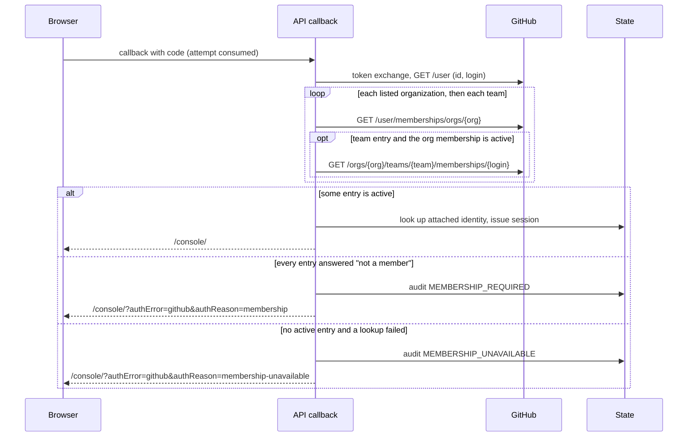

# Proposal: GitHub organization and team allowlist for sign-in

- **ID:** RFC-0019
- **Owner:** freeqaz (proposal); authentication maintainers for the sign-in callback.
- **Created:** 2026-10-04
- **Last updated:** 2026-10-04
- **RFC PR:** [#1229](https://github.com/openclaw/openclaw-enterprise/pull/1229)
- **Implementation plan:** none; delivery is one pull request,
  [#1231](https://github.com/openclaw/openclaw-enterprise/pull/1231), listed under Delivery.
- **Related:** [RFC-0007 GitHub sign-in](0007-human-federated-sign-in/index.md);
  [external sign-in reference](../../docs/reference/authentication/external-sign-in.md);
  [production settings](../../docs/reference/settings/production.md#github-sign-in-and-trusted-proxies);
  Google's hosted-domain allowlist (`OCC_AUTH_GOOGLE_ALLOWED_DOMAINS`), the nearest precedent.

## Summary

An operator can optionally list GitHub organizations, and `org/team` slugs, whose members may
use GitHub sign-in. With a list set, the sign-in callback asks GitHub, with the user access
token it already receives, whether the person is an active member of a listed organization or
team. Someone who is not is refused before OCE looks up their account. The refusal is audited
as `MEMBERSHIP_REQUIRED` and the Console tells them why. If GitHub cannot answer the
membership question, sign-in fails closed as `MEMBERSHIP_UNAVAILABLE`, with its own audit
code, operator log line and Console message. The list is off by default. Membership is checked
only at sign-in; what happens to live sessions when someone leaves the organization stays an
open question below.

## Motivation

GitHub sign-in admits any GitHub user ID an administrator attached to an OCE account, whatever
that person's GitHub organization or team membership (board finding 410, from the GitHub
sign-in bug hunt). Today the callback exchanges the code, calls only
[`GET /user`](https://docs.github.com/en/rest/users/users#get-the-authenticated-user), keys
the person by numeric user ID, and discards the token
([`exchangeGithubSubject`](../../apps/controller/src/auth/github.ts)). Sessions last a fixed
8 hours with no refresh.

So leaving the company's GitHub organization, being suspended by GitHub, or deleting the
GitHub account changes nothing in OCE. Offboarding is an OCE action (disable the account, or
detach its GitHub method). That is documented for OIDC
([oidc-sign-in.md](../../docs/guides/deploy/oidc-sign-in.md)) and is being added for GitHub
(PR #1225). Operators who already manage access through GitHub organizations and teams want
GitHub to be the gate too, so that removing someone from the team stops their next sign-in
without a second step in OCE.

## Goals

- **Off by default.** No setting means today's behaviour, byte for byte: no extra GitHub
  request, no new audit code.
- **Org or team gate at sign-in.** With a list, only an active member of a listed
  organization, or of a listed team (GitHub counts child-team members), gets a session.
  Pending invitations do not count.
- **Least privilege.** No OAuth scope is requested. The check uses the user token GitHub
  already issues and a read-only organization permission.
- **Clear refusals.** A refused person sees why in the Console, and the operator sees a
  distinct audit reason code. A refusal reveals nothing about which OCE accounts exist.
- **Fail closed.** A membership lookup that GitHub cannot answer refuses sign-in and is
  distinguishable from both "not a member" and a token or profile outage.

## Non-goals

- Ending live sessions when membership changes (see
  [Unresolved questions](#mid-session-membership)).
- Creating accounts from membership (signup), or mapping teams to OCE roles.
- Google or OIDC group allowlists. Google already has hosted domains; OIDC groups are a
  separate decision.
- Exempting the recovery account. It signs in with its password, which the allowlist does not
  affect.

## Proposal

### GitHub App, not OAuth App

OCE's GitHub sign-in is a GitHub App user-to-server flow. The deployment guide registers the
repository integration's GitHub App callback, the controller requests no scopes
(`disableDefaultScope`), and the token GitHub returns is a user access token (`ghu_…`) whose
authority is the App's permissions intersected with the user's. That decides how membership
can be read:

| Option                                                                                                           | What it needs                                                                                   | What else it grants                                                                                                                                | Verdict                                                                                                            |
| ---------------------------------------------------------------------------------------------------------------- | ----------------------------------------------------------------------------------------------- | -------------------------------------------------------------------------------------------------------------------------------------------------- | ------------------------------------------------------------------------------------------------------------------ |
| GitHub App user token, `GET /user/memberships/orgs/{org}` and `GET /orgs/{org}/teams/{team}/memberships/{login}` | Organization permission **Members: read** on the App, App installed on each listed organization | The App's installation token can also list that organization's members and teams                                                                   | **Chosen**                                                                                                         |
| OAuth App with `read:org` scope                                                                                  | A new scope on every sign-in                                                                    | Read access to every organization, team and project membership of the user, in every organization; subject to each organization's OAuth App policy | Rejected: broad, and OCE uses a GitHub App                                                                         |
| OAuth App, no scope, `GET /orgs/{org}/public_members/{login}`                                                    | Nothing                                                                                         | Nothing                                                                                                                                            | Rejected: every member must make membership public; no team check                                                  |
| App installation token, `GET /orgs/{org}/members/{login}`                                                        | Members: read and the App private key in the controller                                         | Same as chosen, plus the controller holds the private key                                                                                          | Rejected for sign-in: the key stays with the repository credential service. Kept as an option for periodic recheck |
| List endpoints (`/user/orgs`, `/user/teams`)                                                                     | Members: read, plus paging                                                                      | Reads every membership instead of the listed ones                                                                                                  | Rejected: more data, more requests                                                                                 |

GitHub documents `GET /user/memberships/orgs/{org}` as user-token only with Members: read,
and the team-membership endpoint as Members: read for user and installation tokens
([permissions for GitHub Apps](https://docs.github.com/en/rest/authentication/permissions-required-for-github-apps#organization-permissions-for-members)).
Members: read is read-only and covers membership lists, not code or settings. Adding it to an
existing App needs each organization owner to accept the new permission; until they do the
lookup returns 403, which fails closed (below).

An operator who wants a smaller blast radius can register a sign-in-only GitHub App with just
Members: read and no repository permissions, so the user token can do nothing else. That
changes the client ID, which is a new provider instance and needs every identity re-attached
(finding 52), so it is an operator choice, not part of this change.

### Configuration

| Variable                        | Helm value                                      | Meaning                                                      |
| ------------------------------- | ----------------------------------------------- | ------------------------------------------------------------ |
| `OCC_AUTH_GITHUB_ALLOWED_ORGS`  | `auth.github.allowedOrgs` (list, comma-joined)  | GitHub organization logins whose active members may sign in. |
| `OCC_AUTH_GITHUB_ALLOWED_TEAMS` | `auth.github.allowedTeams` (list, comma-joined) | `org/team-slug` entries whose active members may sign in.    |

- Both unset or empty: off. Either set: the check runs, and a person needs to match **any**
  entry in either list.
- Values are trimmed and lowercased. Organization logins are letters, digits and hyphens,
  starting with a letter or digit, up to 39 characters (looser than GitHub's current rule, so
  older names still fit); team slugs are lowercase letters, digits, `-` and `_`. At most 10 entries in total, so the number of GitHub requests per
  sign-in stays bounded. Anything else fails startup, Helm refuses to render it, and the
  installation profile renderer refuses it at preflight.
- Either variable without the GitHub client ID and secret fails startup.
- API process only, like the other GitHub sign-in settings.

### Check at sign-in

_Proposed flow. Unconfigured, the loop is skipped and the callback is unchanged._

- The check runs after `GET /user` and **before** the attached-identity lookup, so a refusal
  says nothing about whether an OCE account exists for that GitHub user. The person already
  knows their own memberships.
- Organization entry: `200` with `state: active` is a match. `404` (not affiliated) and
  `state: pending` are not.
- Team entry: the team's organization membership is read first (and reused when the same
  organization is also listed). Only an active organization member's team membership is read,
  so a non-member's answer from the team endpoint (which GitHub may give as 403 or 404) never
  has to be interpreted. `200` active is a match; `404` and pending are not.
- Entries are checked in order and the first match wins. A match admits even if an earlier
  lookup failed: the person proved one listed membership.
- The token exchange, profile and membership requests share the existing 10-second deadline
  and the 64 KiB response cap. Requests never follow redirects. The token is used only for
  these requests and then discarded, as today. The login used in the team URL comes from the
  same `GET /user` answer, is validated, and is URL-encoded.

### Refusal and audit

Following the reason-code precedent of #1164 and #1184, the two outcomes get their own
`authentication.login` denial codes beside `INVALID_ATTEMPT`, `EXTERNAL_IDENTITY_REJECTED`
and `PROVIDER_UNAVAILABLE`:

| Reason code              | When                                        | `details`                                              | Console message                                                                                                                                                                                          |
| ------------------------ | ------------------------------------------- | ------------------------------------------------------ | -------------------------------------------------------------------------------------------------------------------------------------------------------------------------------------------------------- |
| `MEMBERSHIP_REQUIRED`    | Every entry answered "not an active member" | `provider: github`, `subject` (numeric GitHub user ID) | "Your GitHub account is not a member of an organization or team allowed to sign in here. If you were invited, accept the invitation on GitHub and try again; otherwise ask an administrator for access." |
| `MEMBERSHIP_UNAVAILABLE` | No match, and at least one lookup failed    | `provider: github`, `subject`                          | "Could not check your GitHub organization membership. Try again later; if this keeps happening, ask an administrator."                                                                                   |

Recording the numeric subject is new for a denial. It is safe here because GitHub has already
authenticated the person, and it lets an administrator answer "why can't this person sign in"
from the audit log. Unauthenticated junk callbacks never reach this step, so the rows are
bounded by real GitHub sign-ins.

The Console reads `authReason` only from the fixed values above; anything else falls back to
the generic provider error. With password sign-in available, both messages add "or use your
password".

### GitHub outage

A membership lookup "fails" on a transport error, the deadline, a redirect, `429`, `5xx`, a
`401` or `403`, an oversized body or a malformed answer. Then:

- the denial is audited as `MEMBERSHIP_UNAVAILABLE` (not `MEMBERSHIP_REQUIRED`, not
  `PROVIDER_UNAVAILABLE`);
- the API logs the existing `authentication.provider-unavailable-warning` at WARN with
  `step: membership` and the bounded `cause`, `status` or transport `code`, never URLs,
  logins, organization names or tokens;
- no session is issued; password sign-in is unaffected.

A `403` at this step usually means configuration, not an outage: the organization blocked the
App, its owner has not accepted Members: read, or SAML SSO enforcement wants a session the user
lacks. GitHub may instead answer `404` for an organization without the App installed or a
misspelled slug, which refuses every member as `MEMBERSHIP_REQUIRED` with no warning log; the
operator guide gives the check for both. An outage in the earlier token or profile step stays
`PROVIDER_UNAVAILABLE`, as today.

## Delivery and verification

One implementation pull request, [#1231](https://github.com/openclaw/openclaw-enterprise/pull/1231)
`feat(auth): optional github org allowlist at sign-in`:

1. Parse and validate the two variables with the GitHub settings; render them from Helm and
   the installation profile with matching validation.
2. Add the membership step to the GitHub exchange, the two audit codes in State, the callback
   redirect reason, and the Console messages. The log collector exports `step: membership`.
3. Document the variables, the App permission, the refusal codes and the 403 checklist in the
   external sign-in reference, production settings, the environment cheatsheet, the
   deployment guide and the Helm values.

Required evidence, all against loopback fakes of `github.com` and `api.github.com` (never
real GitHub):

- Transport suite: off makes no membership request; an active org member and an active team
  member are admitted; pending, `404` and a non-member of the team's organization are refused
  as `MEMBERSHIP_REQUIRED` without an account lookup; `5xx`, `429`, `403`, a stall, a redirect
  and an oversized body are `MEMBERSHIP_UNAVAILABLE` with one `step: membership` log line; a
  later match admits after an earlier failure; requested URLs are exactly the expected ones.
- Configuration and chart parity: valid values parse, invalid ones and either list without the
  client fail startup and Helm rendering, and the API accepts exactly what the chart renders.
- PostgreSQL composition: a refused member gets no session, the redirect carries the reason,
  and the persisted audit rows carry the reason code and subject.
- Browser Console: both messages render, and an unknown `authReason` shows the generic one.

Migration: none. The settings are new and default off; there is no schema change. Turning the
list on applies to the next sign-in after the API restarts. Sessions issued before that keep
working until they expire (at most 8 hours); revoke them to apply the list at once.

## Rationale and alternatives

- **Document only** (finding 410 option a). Done separately in #1225; it tells operators to
  offboard in OCE but does not let GitHub be the gate.
- **OAuth App permissions** and the other lookups: see the table under
  [GitHub App, not OAuth App](#github-app-not-oauth-app).
- **Silent refusal as `EXTERNAL_IDENTITY_REJECTED`**, as Google's hosted-domain check does.
  Rejected: the operator could not tell a membership refusal from an unattached identity, and
  the person would get advice ("ask an administrator to attach your identity") that does not
  help.
- **Treat a lookup outage as "not a member".** Rejected: it would audit a GitHub incident as
  hundreds of membership refusals and give people the wrong advice.
- **Fail open on outage.** Rejected: the list is a security control.

## Unresolved questions

1. **Membership changes during a session.** Owner: freeqaz. Today someone removed from the
   team keeps a live session for up to 8 hours and the attached identity still exists. Options,
   none implemented here:
   - **Shorter GitHub sessions** (a separate session lifetime when the allowlist is on, for
     example 1 hour). Cheap; costs more sign-ins; still a window.
   - **Periodic recheck.** Either keep the user's expiring token and refresh token (stores a
     credential the controller does not hold today), or ask the repository credential service
     to check `GET /orgs/{org}/members/{login}` with its installation token (no new secret in
     the controller, but a new cross-service call and failure mode). Each recheck needs an
     outage policy.
   - **Webhook-driven revoke.** Subscribe the App to `organization` (`member_removed`) and
     `membership` (`removed`) events and revoke sessions for the matching subject. Closest to
     immediate; needs a public webhook endpoint with secret verification and a replay story.
     Invariant either way: OCE disable/detach remains the authoritative offboarding.
2. **What GitHub answers for misconfiguration and SAML.** Unverified against real GitHub (the
   tests use fakes): whether an organization without the App installed, or a SAML-enforced
   organization without an active SAML session, answers `403` (`MEMBERSHIP_UNAVAILABLE`, with a
   warning log) or `404` (`MEMBERSHIP_REQUIRED`, silently). Either way it fails closed. Needs
   one check against a real organization, and a SAML-enforced one, before we claim support or
   tune the operator advice.
3. **Dedicated sign-in App.** Should the guide recommend a sign-in-only App (Members: read,
   no repository permissions) instead of reusing the repository integration's App? Better
   least privilege; costs a client-ID change and re-attachment for existing installations.

## References

- [`apps/controller/src/auth/github.ts`](../../apps/controller/src/auth/github.ts) (exchange
  and callback), [`provider-transport.ts`](../../apps/controller/src/auth/provider-transport.ts)
  (bounded transport and failure causes).
- [GitHub: organization membership for the authenticated user](https://docs.github.com/en/rest/orgs/members#get-an-organization-membership-for-the-authenticated-user)
  and [team membership for a user](https://docs.github.com/en/rest/teams/members#get-team-membership-for-a-user).
- Board finding 410; PR #1225 (documents the current behaviour).
