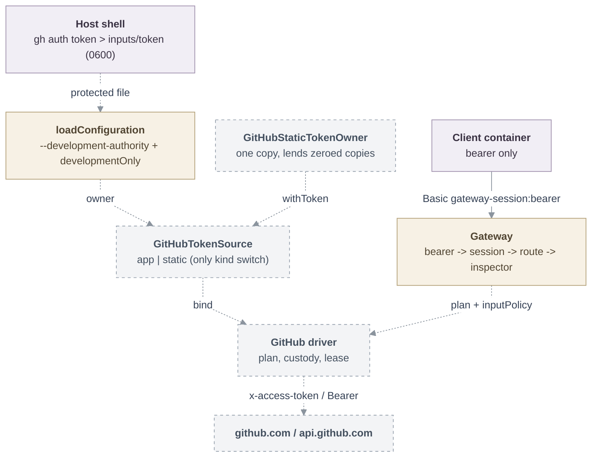

# Proposal: GitHub token authority for local development

- **ID:** RFC-0019
- **Owner:** freeqaz (proposal and credential-boundary review); repository-credentials
  maintainers for the common-owner change.
- **Created:** 2026-10-04
- **Last updated:** 2026-10-04
- **RFC PR:** [#1196](https://github.com/openclaw/openclaw-enterprise/pull/1196)
- **Implementation plan:** none; delivery is two pull requests, listed under Delivery.
- **Related:** [RFC-0008 repository credentials](0008-repository-credentials/index.md) and its
  [qualification](0008-repository-credentials/qualification.md);
  [repository credential reference](../../docs/reference/repository-credentials.md);
  [push-ref guardrail](../../docs/reference/repository-credentials/push-ref-guardrail.md);
  [local repository credentials guide](../../docs/guides/deploy/local-repository-credentials.md);
  [RFC-0015 credential recovery](0015-repository-credential-recovery.md).

<a id="problem-and-decision"></a>

## Summary

The repository credential service gains a second, development-only authority: a static
GitHub token (a fine-grained or classic personal access token, or the token the host `gh`
CLI already holds) that the service process owns and lends into the same custody, session,
route and transport machinery the GitHub App path uses today. A developer can clone, push and
call the GitHub API from the client container against a real repository without a GitHub App
installation, while the token never enters that container. Because a static token cannot be
narrowed per session, the gateway enforces the scope instead: GraphQL is refused unless the
token is fine-grained and the operator opts in, and mutations are refused even then; every
push is checked against a required ref allowlist before any byte reaches GitHub. Production
deployments cannot select the kind.

## Motivation

Local repository testing requires a GitHub App private key, an installation and the registry
flow ([guide](../../docs/guides/deploy/local-repository-credentials.md)). The developer's host
already holds working GitHub credentials (`gh auth status` succeeds; `ssh -T git@github.com`
succeeds) and wants to use them, with one condition: the credential stays out of the agent or
client container, exactly as the App key does.

The SSH key cannot be that credential: the broker is a smart-HTTP and REST/GraphQL gateway
end to end. The container's credential helper answers only `protocol=https` for the gateway
host; [route classification](../../apps/controller/src/drivers/repo/github/credentials/routes/classification.ts)
admits only `info/refs`, `git-upload-pack`, `git-receive-pack` and allowlisted REST paths; the
[upstream sender](../../apps/controller/src/drivers/repo/credentials/transport/upstream.ts)
speaks HTTPS to two fixed origins. An SSH key authenticates none of that and gives no API
access, so `gh` could never work. A token does, and the host has one.

<a id="scope"></a>

## Goals

- **One seam.** The GitHub backend's only authority-specific code sits behind a
  `GitHubTokenSource`; the driver, route policy, response rewriting, gateway authentication,
  custody, lifecycle and transport stay shared. A reviewer can read `createTokenSource` and
  find no other `kind` switch in the driver tree.
- **Same custody.** The token enters the service through the protected-file reader the App
  key uses, is held by one process-owned owner, and reaches requests only through custody
  slots. The container material is byte-identical to the App path.
- **Scope enforced, not described.** GraphQL off for `git-read`, off by default and read-only
  when enabled; a required `pushRefAllowlist` checked at the gateway; session duration capped
  at eight hours; grant identity disjoint from App grants.
- **Production cannot select it.** Kubernetes projection, Helm, the k3d launcher and the
  registry factory stay unaware of the kind; the standalone loader requires both a config
  literal and a process flag.
- **Proven live.** Clone, push to an allowed ref, refused push to a disallowed ref, `gh api`,
  refused GraphQL, close, and a host-side scan showing the token absent from the client
  container, its environment, logs and inspection output.

## Non-goals

- SSH as a credential or transport. Recorded as a possible phase 3 below; never by mounting
  `~/.ssh` or forwarding `SSH_AUTH_SOCK` into any runtime.
- The Kubernetes path (`occ dev up`, Helm, registry) learning the token kind. Designed as
  phase 2; built only if dogfood needs an agent in k3d to push with a host token.
- Per-session down-scoping of a static token, an acquire-time repository probe (extending the
  privileged transport needs its own review), or token revocation by the service. Operators
  revoke in GitHub.
- Changing the App path's push-ref behaviour (client-side convenience today). Turning the
  gateway inspector on for App grants is a recorded follow-up.

<a id="design"></a>

## Proposal

### Owners

Composition owns the authority: `loadConfiguration` reads either the App key into
`createGitHubKeyOwner` or the token file into a new `createGitHubStaticTokenOwner`, both
through `readProtectedFile` (owner, mode, no symlink, stable inode) and both zero-filled on
`close()`. The factory owns the seam: `createTokenSource(authority, …)` returns the App source
(wrapping today's acquisition, retirement and provider transport unchanged) or the static
source. The driver owns a session and is kind-agnostic: `source.bind(session)` returns
`acquire` and `retire`; `cleanup` is `revocable` for the App and `expiry-only` for the token.
Custody, lifecycle, sessions and transport remain the common owners they are in
[RFC-0008](0008-repository-credentials/index.md).

### Configuration

`backend.kind: "github-token"` with `tokenFile` (absolute), the literal `developmentOnly:
true`, a required `pushRefAllowlist` (same syntax as the registry guardrail), optional
`allowGraphql` (default false) and optional `leaseSeconds` (900..86400, default 3600). The
loader refuses the kind unless the process was started with `--development-authority`, refuses
`sessionPolicy.maximumDurationSeconds` above 28800, strips one trailing newline from the
token file and requires 1..16384 printable bytes. The owner records the token's class from its
prefix (`fine-grained`, `classic`, `oauth`, `app-user`, `app-installation`, `unknown`) as a
non-secret attribute; `allowGraphql: true` is refused unless the class is `fine-grained`.
`check-config` and one `started` stderr line report `authority:
"github-token-development"` and the class, never the value.

### Acquisition and custody

The static source's `acquire` performs every admission, abort, deadline and validity check
first, then borrows a copy from the owner and captures it into custody with a lease of
`leaseSeconds`, marking it accepted. It never dispatches, so the lifecycle can never record an
uncertain acquisition; `retire` answers `unsupported`. The lease floor is enforced in the
factory as `leaseMs >= limits.exchangeMs + 2 * limits.credentialMarginMs`, because the
[lifecycle](../../apps/controller/src/drivers/repo/credentials/lifecycle.ts) demands validity
covering an exchange deadline plus its margin.

One common-owner change accompanies the first `expiry-only` backend: in the lifecycle sweep, a
settled custody record that is not the admitted current credential and has no active use is
released at once when the backend declares `expiry-only`, instead of waiting for its lease
deadline. No provider call will ever end such a credential, so holding the bytes has no value.
The rule branches only on the declared discipline (a contract attribute), covers superseded,
refused and post-close copies alike, and leaves `revocable` behaviour untouched. For
`expiry-only` backends the `expired` counter therefore counts custody leases ended, not
upstream expiry.

### Scope at the gateway

- **GraphQL.** The route policy gains `graphql: "token-bounded" | "read-only" | "deny"` per
  profile. The static source answers `deny` for `git-read` always (GraphQL bypasses the
  per-profile REST write gate today and is bounded only by the App token's permissions) and
  for other profiles unless `allowGraphql` is set with a fine-grained token. Then it is
  `read-only`: bodies containing `mutation` are refused, since `createRef` or `updateRef`
  would write refs outside the push allowlist. No admitted REST route writes refs.
- **Pushes.** `RequestPlan.inputPolicy` already buffers and inspects a body before credential
  use (GraphQL uses it). The static source sets it on `git-push` plans with a pure
  receive-pack inspector: pkt-lines up to the first flush are parsed as `<old> <new> <ref>`
  commands (plus `shallow` lines; `push-cert` refused; over 256 commands get 413
  `push-ref-limit-exceeded`), and every ref must be strict UTF-8 (no normalization, no bidi
  or invisible characters), a well-formed branch name, and pass the client hook's
  `allowsPushRef` matcher. A disallowed ref is answered 400 before any byte goes upstream,
  so `git push --no-verify` and a replaced `core.hooksPath` change nothing. The client configuration still
  carries the allowlist so the hook gives the friendly first refusal. Receive-pack has no
  protocol-v2 form and Git does not gzip it. Pushes are buffered in memory, so the loader
  caps `gitPushInputBytes` at 64 MiB for this kind; larger pushes get a 413 before token use
  (#1236).
- **Identity.** A token grant hashes `authority: "github-token"`, a static capability policy
  (`static-token-route-bounded-rest-only-v1` or `…-read-only-graphql-v1`), the push
  allowlist and the profile's REST write-route map under the honest name `routePermissions`.
  App grant JSON is byte-identical to today and pinned by a recorded-value test, so an App binding never matches
  a token grant and vice versa.

### Architecture



Solid arrows are implemented paths; dashed arrows are proposed.

### Request lifecycle

```mermaid
sequenceDiagram
  participant Git as git (client container)
  participant GW as Gateway
  participant LC as Lifecycle
  participant TS as Static source
  participant GH as github.com
  Git->>GW: POST git-receive-pack, Basic gateway-session:bearer
  GW->>GW: route git-push; buffer body; inspect commands
  alt ref outside pushRefAllowlist
    GW-->>Git: 400 unsupported-request (nothing sent upstream)
  else refs allowed
    GW->>LC: acquire(deadline)
    LC->>TS: acquire(attempt, previous, minimumValidity)
    TS->>TS: checks, borrow copy, custody.capture (lease)
    TS-->>LC: acquired
    LC->>GH: body with Basic x-access-token:token
    GH-->>Git: receive-pack report (URLs rewritten to the gateway)
  end
  Git->>GW: POST /graphql (git-read, or allowGraphql unset)
  GW-->>Git: 400 unsupported-request
```

Proposed flow; the GraphQL refusal and the App-path exchange exist today.

### Trust boundary and failure

The token exists in the service process only: in the owner, in custody slots behind opaque
refs, and transiently in the `Authorization` header builder, which zero-fills its buffers. The
compose example bind-mounts the inputs directory read-only into the service container only.
Error strings are fixed (`invalid-token`, `invalid-backend`, `invalid-configuration`,
`invalid-arguments`). The new modules import no `node:` builtins, so the
[boundary script](../../scripts/verify-repository-credentials-boundary.mjs) needs no new
reviewed import or process member.

The weakening is scope, not custody, and is stated plainly: a leaked session bearer reaches
what the host token reaches, through the route allowlist, as the token owner's identity, for
up to the session duration. The token is read once per process; rotation is a service restart;
a revoked token presents as upstream 401 on the next exchange. Operators are told to prefer a
fine-grained token limited to a scratch repository, ideally on a scratch account, and to
revoke it when done.

### Production gating

Four independent layers. (1) Kubernetes composition is structurally closed: projected inputs
keep their fixed file list and `github-app-registry` requirement, Helm has no token value or
mount, the k3d launcher writes the registry kind, and the registry factory accepts only an App
authority. (2) The standalone loader needs the config literal and the process flag; either
missing is `invalid-configuration`. (3) `check-config` and the `started` line name the
authority; a lint in the configuration tests asserts the strings `github-token`,
`developmentOnly` and `development-authority` are absent from `deploy/helm/**`,
`deploy/examples/production/**` and the non-development standalone examples. (4) Grant identity
is disjoint across kinds. The
[qualification](0008-repository-credentials/qualification.md) treats the token authority as an
explicitly selected custody variant, never the login/PAT fallback T6 forbids.

### Later phases, recorded here

- **Phase 2, Kubernetes development path:** a registry `authority` discriminant, a `token`
  entry in the projected-input allowlist, a Helm Secret reference mutually exclusive with the
  App key, and the Go launcher capturing `gh auth token` into a 0600 file through its
  never-logging runner. Re-opens the path phase 1 keeps closed; needs its own gate review.
- **Phase 3, SSH transport:** a `RequestPlan` transport discriminant for `git-*` plans, a
  second exchange sender bridging smart-HTTP to `git-upload-pack`/`git-receive-pack` over SSH
  with the same limits and outcome vocabulary, and an agent-backed authority whose key never
  enters the service (host agent socket mounted into the service container only, filtered per
  exchange). API routes would still need a token authority. Separate RFC and security review.

## Delivery and verification

1. **PR A (this RFC).** `specs/rfcs/0019-github-token-authority.md` and its `specs/README.md`
   row. Human-gated; lands no code.
2. **PR B (implementation).** Types, config validation, static owner, token-source seam,
   static acquisition, receive-pack inspector, route options, grant identity, lifecycle sweep
   rule, loader and entrypoint flags, `check-config` summary, development compose and config
   examples, reference and guide updates, qualification addendum, spec status to Implementing.
   Written failing-first; landed after the live check below passes.

Required outcomes and evidence:

| Outcome | Evidence |
| --- | --- |
| Token never reaches the client | Live: the in-container probe streams its surfaces out (agent files, `/proc/*/environ`, `cmdline`), also during an in-flight `git-remote-https`; the host greps the token file against the snapshot, agent and service logs and `docker inspect` (count 0; the session bearer is the positive control). No step passes secret bytes into the client by stdin, argv, env or mount. |
| Clone, push, `gh api` work | Fixture end-to-end with `acceptStatic`; live clone, commit, push to `refs/heads/agent/*`, `gh api repos/...`. Installation-token issuances: 0. |
| Scope enforced | Push to `refs/heads/main` refused by the gateway even with `--no-verify`; GraphQL 400 by default and for `git-read` with `allowGraphql`; mutations refused with `allowGraphql`; `git-read` push denied before any acquire. |
| Lifecycle correct for `expiry-only` | Renewal without retire; superseded, refused and post-close slots released on the next sweep (first tests of this branch); DISPOSED with `cleanup.pending 0`. |
| Production closed | Projected inputs reject the kind; registry factory rejects a token authority; loader refuses without flag or literal or above 8 h; deploy lint passes; App grantId unchanged. |
| No new raw capability | Boundary script and source-boundary test pass without edits. |

Follow-ups: isolation harness token mode, done (#1239); streaming pushes past the command
section, open.

The live check with PR B (host `gh` token, private scratch repository) passed: clone, push to
`refs/heads/agent/*`, gateway 400 for `--no-verify` pushes outside the allowlist with the
default branch unchanged on GitHub, `gh api` 200, GraphQL 400, and no token bytes in the client
probe, logs or `docker inspect`. The allowed push also shows Git sends the receive-pack body
uncompressed, as the inspector requires. Measured since: a buffered push peaks near twice its
size (#1236).

<a id="alternatives-and-open-decisions"></a>

## Rationale and alternatives

- **SSH key as the credential (owner's first idea):** rejected; it authenticates nothing the
  broker speaks and gives no API access. Recorded as a transport, not an authority.
- **Side channel (env var or mounted token in the client, `GH_TOKEN`):** rejected; it is the
  boundary violation the request forbids and the isolation probe would fail.
- **A separate `github-pat` driver:** rejected; it would duplicate routing, response rewriting
  and lifecycle and invite drift. The seam keeps one driver.
- **Keep the push allowlist client-side only:** rejected after review; with an owner token,
  branch protection no longer backstops the hook, and `--no-verify` bypasses it.
- **Acquire-time `GET /repos/{repo}` probe for scope:** deferred; it extends the privileged
  transport, which the reference marks as a boundary change needing review.
- **Shorter default lease:** rejected; closed and superseded copies are now released on the
  next sweep, so the lease has no custody value and a short one only adds renewal churn.

## Unresolved questions

1. **Which local development path?** (Owner.) Phase 1 proves the standalone service and
   client images; an agent under `occ dev up` stays on the App. If the k3d agent must push
   with the host token, phase 2 is required before this meets the goal.
2. **Token for the live check.** (Owner.) Fine-grained PAT on the scratch repository, or the
   `gh` OAuth token. The former enables `allowGraphql`; the latter keeps GraphQL denied.
3. **Gateway push inspection for App grants.** (Repository-credentials maintainers.) The same
   inspector could enforce registry `pushRefAllowlist`s at the cost of buffering push bodies in
   production. Invariant either way: App grant identity stays byte-identical.

## References

- [`drivers/repo/github/credentials/factory.ts`](../../apps/controller/src/drivers/repo/github/credentials/factory.ts),
  [`driver.ts`](../../apps/controller/src/drivers/repo/github/credentials/driver.ts),
  [`material.ts`](../../apps/controller/src/drivers/repo/github/credentials/material.ts),
  [`grants.ts`](../../apps/controller/src/drivers/repo/github/credentials/grants.ts),
  [`routes.ts`](../../apps/controller/src/drivers/repo/github/credentials/routes.ts)
- [`drivers/repo/credentials/backend-contracts.ts`](../../apps/controller/src/drivers/repo/credentials/backend-contracts.ts)
  (`RepositoryBackend.cleanup`, `RequestPlan.inputPolicy`),
  [`lifecycle.ts`](../../apps/controller/src/drivers/repo/credentials/lifecycle.ts),
  [`custody.ts`](../../apps/controller/src/drivers/repo/credentials/custody.ts),
  [`transport/agent.ts`](../../apps/controller/src/drivers/repo/credentials/transport/agent.ts),
  [`client-contracts.ts`](../../apps/controller/src/drivers/repo/credentials/client-contracts.ts) (`allowsPushRef`)
- [`composition/repository-credentials/config.ts`](../../apps/controller/src/composition/repository-credentials/config.ts),
  [`protected-file.ts`](../../apps/controller/src/composition/repository-credentials/protected-file.ts),
  [`projected-inputs.ts`](../../apps/controller/src/composition/repository-credentials/projected-inputs.ts),
  [`repository-credentials.ts`](../../apps/controller/src/repository-credentials.ts)
- [Standalone compose example](../../deploy/examples/repository-credentials/compose.yaml);
  [isolation harness](../../tests/fixtures/repository-credentials-isolation/harness.mjs) and
  [probe](../../tests/fixtures/repository-credentials-isolation/probe.mjs)
- [Specification process](../../docs/contributing/specifications.md)
