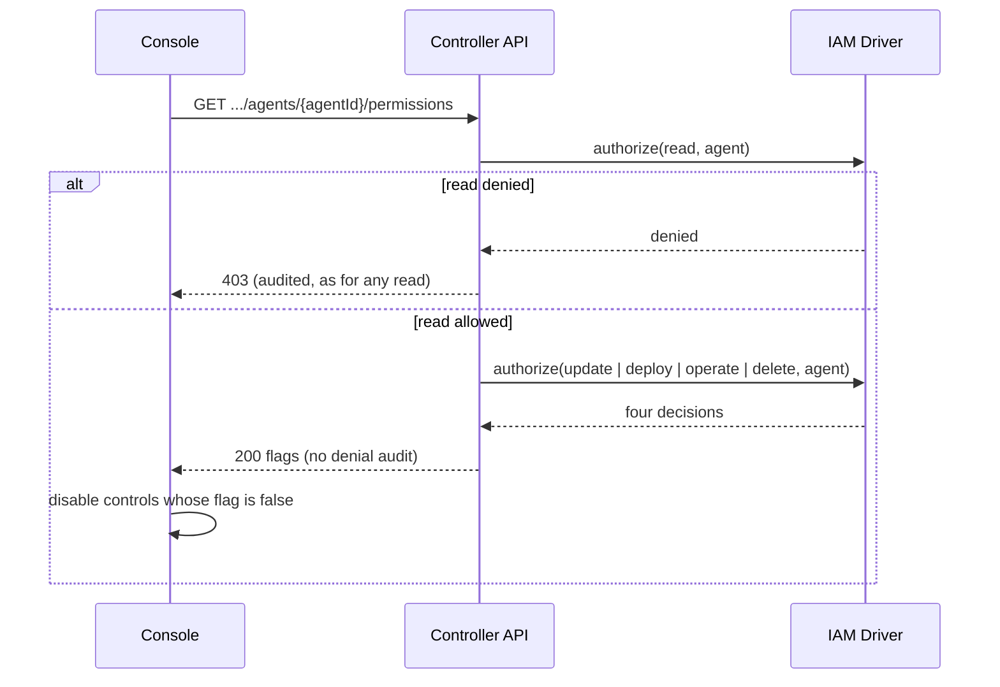

# Proposal: Caller permission summaries for Console control gating

- **ID:** RFC-0043
- **Owner:** Console and IAM maintainers (proposal; needs human review)
- **Created:** 2026-10-01
- **Last updated:** 2026-10-01
- **RFC PR:** this document's PR, which also carries a draft implementation
- **Related:** [Basic RBAC](31-basic-rbac/index.md), [Agent access](36-agent-access.md),
  [Agent deletion](../plans/28-agent-deletion.md), [Agent stop](../plans/29-agent-stop.md)

<a id="problem-and-decision"></a>

## Summary

Add two read-only API operations that report which mutating operations the caller may attempt:
`GET /namespaces/{namespaceId}/agents/{agentId}/permissions` returns `update`, `deploy`,
`operate` and `delete` flags for one Agent, and `GET /namespaces/{namespaceId}/permissions`
returns `agents.create` for the Namespace. The Console reads them and disables Create Agent,
Create new version, Deploy new version, Stop Agent and Delete Agent, with a short reason, when
the flag is `false`. The API keeps authorizing every request; the flags only gate controls.

## Motivation

A principal with read-only access to an Agent sees every mutation control enabled. Selecting
Delete Agent opens the confirmation and only then reports a 403; Stop and Deploy behave the
same way. Server enforcement is correct, and #725 already hides the sharing card for
non-administrators. The remaining gap is that the Console cannot learn the caller's effective
permissions before it renders controls:

- `GET /api/auth/session` returns only the user's ID, name and email.
- Namespace and Agent reads return the resource, not the caller's access to it.
- `x-openclaw-permissions` in the OpenAPI contract lists what each operation _requires_, not
  what the caller _holds_.
- `/namespaces/{namespaceId}/iam/access-bindings` and `/iam/roles` require Installation
  administration, so an ordinary user cannot read their own grants, and evaluating bindings,
  group membership and resource scoping in the browser would duplicate the IAM Driver.

Probing a mutating operation is not an option: it either performs the operation or records an
audited authorization denial.

<a id="scope"></a>

## Goals

- A read-only Agent viewer sees Create new version, Deploy new version, Stop Agent and Delete
  Agent disabled with a reason, before attempting any of them.
- A Namespace reader without Agent create sees Create Agent disabled with a reason.
- A principal holding the permission sees the same controls as today.
- The summaries add no authorization-denial audit records for a `false` answer.
- If a summary is unavailable (older controller, 503, network), controls stay enabled and the
  existing 403 feedback still applies.

## Non-goals

- Replacing server-side authorization. Every gated operation is still authorized in full.
- Reporting conditional permissions (Secret operate for bound Secrets, Configuration read,
  service-account read). A `true` flag means the primary action is held; the operation can
  still be denied on a condition, and the Console keeps its existing denial feedback.
- A general "check any permission on any resource" endpoint.
- Gating the Configuration, Credentials, Plugins and Workspace editors inside the draft view.

<a id="design"></a>

## Proposal

**Owner.** The controller HTTP layer owns both operations. Each is an ordinary route in
`packages/contracts/src/api/routes.ts` with `iamAction: "read"`, so route authorization,
audit of a denied read, and 404 for a missing resource work as for any read.

**Evaluation.** After route authorization, the handler reads the resource (proving it exists)
and asks the selected IAM Driver's `authorize()` once per reported action, using the same
target `operationTarget()` builds for the real operation (`agent/<id>` for update, deploy,
operate and delete; `agent/<namespaceId>` for create). A decision with an invalid shape, a
mismatched Driver ID or a Driver error returns 503, as `requireInstallationAdmin` does today.
A `false` decision is returned as data and is not appended to the audit log.

**Responses.**

```json
{ "data": { "update": false, "deploy": true, "operate": false, "delete": false } }
{ "data": { "agents": { "create": false } } }
```

**Console.** Agent detail starts the Agent summary read alongside its other reads. Stop and
deletion panels take a promise of their flag; on `false` they disable the button and show
"Your access does not include stopping/deleting this Agent." Deploy treats `deploy === false`
as a disabling reason with its own status text. On `update === false` the header Create new
version button is disabled with a note, and the version list's draft entry is relabelled
View draft, because a reader can still inspect the draft. The Agent list does the same for
Create Agent. Any failure of the summary read is ignored. The summary is read with the page,
so a grant or revocation applies after the next load; the API decides in the meantime.

**Trust and disclosure.** The Agent summary requires Agent read and the Namespace summary
requires Namespace read, so a caller learns only their own access to a resource they can
already see. No grant, role or binding ID is returned.

### Request lifecycle

The sequence shows the proposed, now drafted, Agent summary read.



## Delivery and verification

The draft implementation in the same PR covers all of the above:

1. Contracts and generated OpenAPI/API reference for both routes.
2. Controller handlers using a `callerMay()` helper beside `requireInstallationAdmin`.
3. Console gating in `agents/list.mjs`, `agents/detail.mjs`, `agents/stop.mjs` and
   `agents/deletion.mjs`.

Evidence in the PR:

- `tests/integration/console-api.test.mjs`: administrator gets every flag; a principal with
  Namespace read plus exact Agent read and deploy gets only `deploy`; no denial is audited for
  those answers; an unshared Agent returns an audited 403; a missing Agent returns 404.
- `tests/browser/console-agent-detail.test.mjs`: a read-only principal sees Create Agent,
  Create new version, Stop, Delete and Deploy disabled with reasons and a View draft entry,
  sends no write and records no denial for them; the existing Stop and Delete denial tests
  withhold the summary and still show the 403 feedback; the sharing test reloads after a new
  operate grant before stopping.

Not verified: behaviour against an external (non-native) IAM Driver.

<a id="alternatives-and-open-decisions"></a>

## Rationale and alternatives

- **Keep current behaviour.** Correct, but readers discover missing access only after confirming.
- **Embed flags in Agent and Namespace reads.** Saves a request but changes two widely used
  response shapes and makes every list read do four extra IAM evaluations per Agent.
- **Let users read their own access bindings.** Exposes policy structure and requires the
  browser to reimplement scope, group and restriction evaluation.
- **Learn from denials.** Remembering a 403 per control still shows the first denial after
  confirmation and records it in the audit log.
- **Generic check endpoint** (`POST /iam/check` with arbitrary action and resource). More
  flexible, but becomes a policy oracle across resource kinds; not needed for the Console.

## Unresolved questions

- Should the summaries carry conditional permissions (for example `deploy` with bound
  Secrets)? Deciding owner: IAM maintainers. Until then, `true` means primary action only.
- Should the draft editors also be gated on `update`? Deciding owner: Console maintainers.
- Should the action names stay as booleans keyed by IAM action, or by Console operation
  (`stop` instead of `operate`)? Deciding owner: API maintainers.

## References

- Route requirements: `x-openclaw-permissions` in `packages/contracts/openapi/occ-api.openapi.json`.
- Existing administrator probe: `requireInstallationAdmin` in `apps/controller/src/index.ts`.
- Sharing card gating: `apps/controller/src/console/agents/access.mjs`.
